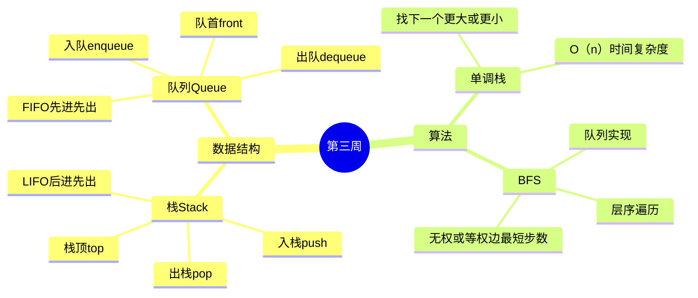
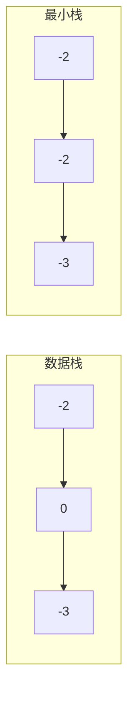

# Day 21：第三周复习

> **学习定位**：本日用模板默写和错因分类串联栈、队列、堆、Lambda 与 BFS。下一阶段的移动语义依赖你已经理解对象、引用和函数调用，因此不要带着生命周期疑问直接进入 Day 22。

## 📅 学习目标

- [ ] 复习栈和队列的核心知识点
- [ ] 巩固Lambda表达式的各种用法
- [ ] 回顾EMC++ Item 31-34要点
- [ ] 完成LeetCode 155、150
- [ ] 总结本周算法思想

---

## 📖 本周知识回顾

### 数据结构：栈和队列


```mermaid
mindmap
  root((第三周))
    数据结构
      栈Stack
        LIFO后进先出
        入栈push
        出栈pop
        栈顶top
      队列Queue
        FIFO先进先出
        入队enqueue
        出队dequeue
        队首front
    算法
      单调栈
        找下一个更大或更小
        O（n）时间复杂度
      BFS
        队列实现
        层序遍历
        无权或等权边最短步数
```

### 栈的应用场景

| 应用 | 说明 |
|------|------|
| 括号匹配 | LC 20 |
| 表达式求值 | 中缀转后缀 |
| 函数调用 | 调用栈 |
| 撤销操作 | 编辑器 |
| 单调栈 | LC 739, 496, 84, 42 |

### 队列的应用场景

| 应用 | 说明 |
|------|------|
| BFS遍历 | LC 102, 107 |
| 任务调度 | 打印队列 |
| 消息队列 | 异步处理 |
| 优先队列 | LC 215, 347 |

### C++11特性：Lambda表达式

```cpp
// 基本语法
[capture](params) -> return_type { body }

// 捕获方式
[x]      // 值捕获
[&x]     // 引用捕获
[=]      // 对Lambda体内实际使用且可捕获的自动变量隐式值捕获（不推荐）
[&]      // 对Lambda体内实际使用且可捕获的自动变量隐式引用捕获（不推荐）
[=, &x]  // 混合捕获

// C++14泛型Lambda
auto add = [](auto a, auto b) { return a + b; };

// C++14初始化捕获
auto f = [p = std::move(ptr)]() { };
```

默认捕获不会把作用域里所有实体都塞进闭包：未在 Lambda 体内使用的局部变量不会被捕获，全局和静态对象也不是捕获成员。C++17 中通过成员名访问对象状态通常意味着捕获 `this` 指针，因此 `[=]` 也不等于复制整个对象；长期保存闭包时仍应显式写出依赖并检查生命周期。

### EMC++ Item 31-34要点

| 条款 | 核心要点 |
|------|---------|
| Item 31 | 避免默认捕获，显式列出变量 |
| Item 32 | 使用初始化捕获实现移动语义 |
| Item 33 | 泛型Lambda使用auto&&和decltype |
| Item 34 | 优先Lambda而非std::bind |

### 复盘不是重读：三轮主动输出

第一轮是**模板默写**：合上前几天 README，只写出单调栈、容量 K 的堆、图 BFS 和树层序 BFS 的骨架，并在每个容器旁写一句不变量。第二轮是**错因分类**：不是记“这题又错了”，而是把失败归入接口契约、状态不变量、边界、复杂度、C++ 类型/生命周期或测试方法。第三轮是**迁移题**：改变题面但保留结构，检查自己识别的是算法条件还是题号。

建议默写时只保留下列问题，不先看答案：

```text
单调栈：栈中存值还是下标？单调方向是什么？何时结算？
Top K：堆中保留谁？堆顶代表候选中的最好还是最差？
图 BFS：何时标记 visited？队列元素表示节点还是完整状态？
层序 BFS：当前层边界如何冻结？下一层节点何时进入队列？
```

### 错因分类表

| 类别 | 典型症状 | 修正动作 |
|------|----------|----------|
| 接口契约 | 空输入崩溃、非法 `k` 调用 `top()` | 先写前置条件、返回值和异常 |
| 不变量 | 比较器方向反、左右边界多一格 | 在循环前写“容器中始终保存什么” |
| 边界 | `k=1`、空树、重复最小值失败 | 建立最小规模和极端规模测试 |
| 复杂度 | BFS 节点重复入队、Top K 全排序 | 统计每个元素入队/入堆次数 |
| C++ 语义 | 悬空捕获、隐式枚举转换 | 检查类型、所有权和生命周期 |
| 测试方法 | 只打印“期望”，Release 仍返回0 | 显式比较并让失败返回非零 |

---

## 🎯 LeetCode 刷题

### 讲解题：LC 155. 最小栈

#### 题目链接

[LeetCode 155](https://leetcode.cn/problems/min-stack/)

#### 题目描述

设计一个支持 push，pop，top 操作，并能在常数时间内检索到最小元素的栈。

#### 形象化理解

想象一个"智能书堆"，不仅能正常放书取书，还能随时告诉你当前最薄的书：

```
操作序列：
push(-2) → 栈:[-2], 最小:-2
push(0)  → 栈:[-2, 0], 最小:-2
push(-3) → 栈:[-2, 0, -3], 最小:-3
getMin() → -3
pop()    → 栈:[-2, 0], 最小:-2
top()    → 0
getMin() → -2
```

#### 解题思路

使用**辅助栈**同步记录每个状态下的最小值：


```mermaid
graph LR
    subgraph "数据栈"
    A1[-2] --> A2[0]
    A2 --> A3[-3]
    end
    
    subgraph "最小栈"
    B1[-2] --> B2[-2]
    B2 --> B3[-3]
    end
```

#### 代码实现

```cpp
class MinStack {
private:
    stack<int> dataStack;
    stack<int> minStack;
    
public:
    void push(int x) {
        dataStack.push(x);
        if (minStack.empty() || x <= minStack.top()) {
            minStack.push(x);
        } else {
            minStack.push(minStack.top());
        }
    }
    
    void pop() {
        dataStack.pop();
        minStack.pop();
    }
    
    int top() {
        return dataStack.top();
    }
    
    int getMin() {
        return minStack.top();
    }
};
```

数据结构接口只负责维护 `push/pop/top/getMin/empty` 的状态与复杂度，不应该在这些成员中读取命令、打印菜单或决定业务操作顺序。业务流程负责把“push -2、查询最小值、处理空栈错误”组织成用户场景。教程实现把空栈 `pop/top/getMin` 定义为抛出 `std::underflow_error`，并由调用者决定记录日志、重试还是终止；链表节点由析构函数统一释放，避免把资源管理责任泄漏给业务层。

一旦类手写析构函数释放裸指针链表，编译器生成的默认复制只会复制 `head` 指针，两个对象随后会重复释放同一串节点；这就是“拥有资源的类必须一起设计析构、复制和移动策略”的原因。本日暂不展开深拷贝和移动接管，选择最清楚的策略：复制构造、复制赋值、移动构造、移动赋值全部 `= delete`。测试用 `static_assert` 锁定这项类型契约，后续学习 Rule of Five 后再实现安全的值语义。

---

### 实战题：LC 150. 逆波兰表达式求值

#### 题目链接

[LeetCode 150](https://leetcode.cn/problems/evaluate-reverse-polish-notation/)

#### 提示

1. 使用栈存储操作数
2. 遇到运算符时弹出两个操作数计算
3. 结果压回栈中
4. 注意操作数的顺序（先弹出的是右操作数）

#### 题目描述

根据逆波兰表示法（后缀表达式），求表达式的值。

#### 形象化理解

逆波兰表达式就是"操作数在前，运算符在后"：

```
中缀表达式: (2 + 3) * 4
后缀表达式: 2 3 + 4 *

计算过程：
  读入2 → 栈:[2]
  读入3 → 栈:[2, 3]
  读入+ → 弹出3和2，计算2+3=5，栈:[5]
  读入4 → 栈:[5, 4]
  读入* → 弹出4和5，计算5*4=20，栈:[20]
  结果: 20
```

#### 解题思路

使用栈计算：
1. 遇到数字 → 入栈
2. 遇到运算符 → 弹出两个操作数计算，结果入栈

#### 代码实现

```cpp
int evalRPN(const vector<string>& tokens) {
    stack<int> stk;
    
    for (const string& token : tokens) {
        if (token == "+" || token == "-" || token == "*" || token == "/") {
            int b = stk.top(); stk.pop();
            int a = stk.top(); stk.pop();
            
            if (token == "+") stk.push(a + b);
            else if (token == "-") stk.push(a - b);
            else if (token == "*") stk.push(a * b);
            else stk.push(a / b);
        } else {
            stk.push(stoi(token));
        }
    }
    
    return stk.top();
}
```

同样地，RPN 求值器的接口接收 token 并返回结果，不负责命令行输入和展示。它应拒绝操作数不足、最终剩余多个值、非法数字 token 和除以 0；业务层捕获异常后再转换成面向用户的错误消息。这种分离让同一数据结构/算法既能服务命令行，也能被单元测试或其他模块复用。

还要单独处理**数值范围**：`std::stoi` 会拒绝超出 `int` 的输入 token，但如果直接用 `int` 做运算，加减乘溢出和 `INT_MIN / -1` 会产生未定义行为，不能把“机器上碰巧绕回去”当作结果。教程实现先把两个 `int` 操作数提升到 `std::int64_t` 完成计算，再检查结果能否放回 `int`；越界时抛出 `std::overflow_error`。这覆盖任意两个 `int` 的四则运算结果；若以后把输入也扩展到 64 位整数，则应使用更宽的受检运算或任意精度整数。上面的短代码只展示栈算法骨架，完整的语法与溢出检查以 `solution.cpp` 为准。

### 迁移题

1. 把“最小栈”改成“最大栈”，哪些接口和不变量不变，哪些状态需要替换？
2. 求数据流中第 K 大元素时，为什么仍可使用容量 K 的小顶堆，但生命周期从一次函数调用变成长期对象？
3. 网格最短路若每个格子还有钥匙集合，队列中为什么必须保存 `(位置, 钥匙状态)` 而不只是位置？
4. 若 RPN 增加一元负号，如何区分它与二元减法，并修改“运算符需要几个操作数”的契约？

---

## 🚀 运行代码

```bash
./build_and_run.sh
```

CTest 中 `Day21MinStack` 和 `Day21EvalRPN` 会比较真实结果并在失败时返回非零；`Day21SmokeRuns` 只验证总复习入口能够运行并正常退出，不能替代算法测试。

---

## 💡 本周总结

### 算法思想

1. **栈**：适合"最近的xxx"问题，如最近匹配、最近更大
2. **单调栈**：O(n)找下一个更大或更小元素
3. **队列**：适合"先来先服务"、层次遍历
4. **BFS**：无权/等权边最短步数、层级遍历的标准解法

### 编程技巧

1. **Lambda**：简洁的回调、自定义比较器
2. **显式捕获**：避免悬空引用和指针问题
3. **辅助栈/队列**：解决复杂问题

### 今日工程动作：从失败报告反推错因

在 Day 21 目录执行 `./build_and_run.sh /tmp/week3-day21-sanitize -DENABLE_SANITIZERS=ON`，同时运行 CTest 与 ASan+UBSan。故意删除 `MinStack` 析构函数，观察泄漏报告属于“生命周期”；再把 RPN 的 `a - b` 写成 `b - a`，观察哪条迁移测试失败并归类为“不变量/操作数顺序”；最后把一个测试改成只打印期望值但始终返回 0，体会“测试方法错误”为什么会掩盖算法错误，实验后恢复正确代码。

### 五句复盘

用恰好五句话回答：

1. 不看答案时，你能为单调栈、Top K 和 BFS 各写出哪条核心不变量？
2. 接口契约错误与循环不变量错误在失败现象上有什么区别？
3. `MinStack` 为什么要由自身析构节点，而不是让业务流程逐个清理？
4. RPN 求值器与命令行输入输出分离后，测试和复用获得了什么好处？
5. 从本周任选一个模板迁移到新题时，你首先检查哪些适用条件？

### 下周预告

第四周将学习：
- 哈希表数据结构
- 右值引用与移动语义
- 完美转发
- 字符串专题

---

## 📚 相关术语

| 术语 | 英文 | 定义 |
|------|------|------|
| 栈 | Stack | LIFO数据结构 |
| 队列 | Queue | FIFO数据结构 |
| 单调栈 | Monotonic Stack | 保持单调性的栈 |
| BFS | Breadth-First Search | 广度优先搜索 |
| Lambda | Lambda Expression | 匿名函数 |
| 闭包 | Closure | Lambda及其捕获的环境 |

---

## 🔗 参考资料

1. [Hello-Algo - 栈和队列](https://www.hello-algo.com/chapter_stack_and_queue/)
2. [cppreference - stack](https://en.cppreference.com/w/cpp/container/stack)
3. [cppreference - queue](https://en.cppreference.com/w/cpp/container/queue)
4. [Effective Modern C++ - Item 31-34](https://www.aristeia.com/EMC++.html)
