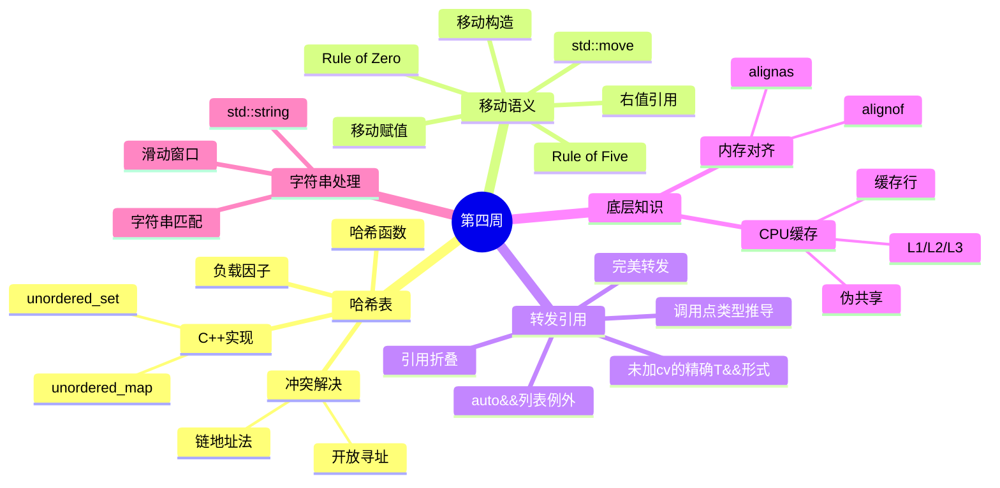

# 第四周：哈希表、移动语义与字符串（Day 22-28）

> 📚 本周重点：掌握哈希表数据结构、深入理解C++移动语义、学习转发引用（旧称通用引用）与完美转发

这一周是课程中语言机制最密集的部分。先修要求不是“记住 `std::move` 写法”，而是已经理解对象、引用、所有权、函数重载和模板函数的基本形式。若这些概念不稳，先复习 [第二周](../week_02/README.md) 和 [第三周](../week_03/README.md)。

建议分两遍学习：第一遍抓住“左值/右值、移动后对象仍有效但状态未指定、转发引用保持值类别”；第二遍再推导引用折叠和重载决议。

## 本周单一信息源

本周语言机制连续性强，但每天只主讲一层。后续文档需要前置概念时，以链接和“本日差异”为主，不再另起一套值类别定义。

| 主题 | 唯一主讲位置 | 后续文档的职责 |
|------|------------------|--------------------|
| 哈希、等价谓词、负载因子与 rehash | [Day 22](day_22/README.md#day22-unordered-contract) | Day 23-25 算法题只说键设计和本题的复杂度前提 |
| 值类别与右值引用入门 | [Day 22](day_22/README.md#day22-value-categories) | Day 23 从特殊成员和所有权继续，不重新用“能放赋值号左边”定义左值 |
| 移动特殊成员、moved-from 契约、Rule of Zero/Five | [Day 23](day_23/README.md#day23-rule-zero) | Day 24-25 把对象交给重载集，Day 28 只做主动回忆 |
| 转发引用识别与引用折叠 | [Day 24](day_24/README.md#day24-forwarding-reference) | Day 25 假定已能完成 T/形参类型推导表 |
| std::forward 的正常模式与失败边界 | [Day 25](day_25/README.md#day25-std-forward) | Day 28 只检查能否识别边界，不复制 Item 30 全部例子 |
| CPU 缓存的实现事实与测量边界 | [Day 26](day_26/README.md#day26-microbenchmark-checklist) | Day 28 只回忆“标准保证 / 平台事实 / 本机观察”三层 |

形象化专题指南只保留哈希、滑动窗口和缓存的手算图；LeetCode 76/567 单题 README 负责完整题解、窗口不变量和边界契约。

---

## 📅 本周学习概览

| Day | 主题 | 数据结构 | C++11特性 | EMC++条款 | LeetCode |
|-----|------|---------|-----------|----------|----------|
| 22 | 哈希表入门 | 哈希表数据结构 | 右值引用 | 9 | 242, 383 |
| 23 | 移动语义 | - | 移动语义 | [23](../tutorials/Effective_Modern_CPP教程.md#emcpp-item-23)、[24](../tutorials/Effective_Modern_CPP教程.md#emcpp-item-24)、[25](../tutorials/Effective_Modern_CPP教程.md#emcpp-item-25) | 1, 454 |
| 24 | 通用引用 | - | 通用引用 | [26](../tutorials/Effective_Modern_CPP教程.md#emcpp-item-26)、[27](../tutorials/Effective_Modern_CPP教程.md#emcpp-item-27)、[28](../tutorials/Effective_Modern_CPP教程.md#emcpp-item-28) | 49, 128 |
| 25 | 完美转发 | - | 完美转发 | [29](../tutorials/Effective_Modern_CPP教程.md#emcpp-item-29)、[30](../tutorials/Effective_Modern_CPP教程.md#emcpp-item-30) | 3, 438 |
| 26 | CPU缓存 | CPU缓存/对齐 | - | - | 5, 647 |
| 27 | 字符串专题 | 字符串处理 | - | - | 76, 567 |
| 28 | 周复习 | 哈希表综合 | 移动语义综合 | 9,23-30复习 | 146, 460 |

---

## 📖 本周知识图谱



---

## 🎯 本周学习目标

### 数据结构目标
- [ ] 掌握哈希表的基本原理和实现方式
- [ ] 理解哈希冲突的解决策略（链地址法、开放寻址法）
- [ ] 了解CPU缓存结构及其对程序性能的影响
- [ ] 掌握内存对齐的概念和优化方法
- [ ] 掌握字符串处理的常用算法

### C++11特性目标
- [ ] 深入理解右值引用和左值引用的区别
- [ ] 掌握移动语义和std::move的使用
- [ ] 理解转发引用（旧称通用引用/万能引用）的严格成立条件
- [ ] 掌握引用折叠规则
- [ ] 能够正确使用std::forward实现完美转发

### EMC++条款目标
- [ ] Item 9：理解 `using` 和 `typedef` 的区别
- [ ] [Item 23](../tutorials/Effective_Modern_CPP教程.md#emcpp-item-23)：理解 `std::move` 和 `std::forward` 都是类型转换，本身不移动对象
- [ ] [Item 24](../tutorials/Effective_Modern_CPP教程.md#emcpp-item-24)：只把“被推导、未加 cv 的模板参数 `T` 的精确 `T&&` 形参”识别为转发引用
- [ ] [Item 25](../tutorials/Effective_Modern_CPP教程.md#emcpp-item-25)：对右值引用使用 `std::move`，对转发引用使用 `std::forward`
- [ ] [Item 26](../tutorials/Effective_Modern_CPP教程.md#emcpp-item-26)：解释转发引用重载为什么会劫持本来合理的重载
- [ ] [Item 27](../tutorials/Effective_Modern_CPP教程.md#emcpp-item-27)：能在按值传递、分离函数名、标签分派和约束模板之间作选择
- [ ] [Item 28](../tutorials/Effective_Modern_CPP教程.md#emcpp-item-28)：掌握“有 `&` 就折叠为 `&`，全是 `&&` 才得到 `&&`”
- [ ] [Item 29](../tutorials/Effective_Modern_CPP教程.md#emcpp-item-29)：理解移动操作可能不存在、不便宜，或者实际没有被调用
- [ ] [Item 30](../tutorials/Effective_Modern_CPP教程.md#emcpp-item-30)：识别并修复大括号初始化器、空指针、重载函数名/函数模板名、位域和仅声明静态常量等完美转发失败情形

### LeetCode刷题目标
- [ ] 完成14道题目（每天2道）
- [ ] 掌握哈希表在算法中的应用
- [ ] 掌握滑动窗口算法模板
- [ ] 实现LRU/LFU缓存设计

---

## 📂 目录结构

```
week_04/
├── README.md                   # 本文件
├── day_22/                     # 哈希表入门
│   ├── README.md
│   ├── CMakeLists.txt
│   ├── build_and_run.sh
│   └── code/
│       ├── main.cpp
│       ├── data_structure/     # 哈希表演示
│       ├── cpp11_features/     # 右值引用
│       ├── emcpp/              # Item 9
│       └── leetcode/           # LC 242, 383
│
├── day_23/                     # 移动语义
│   ├── README.md
│   ├── CMakeLists.txt
│   ├── build_and_run.sh
│   └── code/
│       ├── main.cpp
│       ├── cpp11_features/     # 移动语义演示
│       ├── emcpp/              # Item 23-25
│       └── leetcode/           # LC 1, 454
│
├── day_24/                     # 通用引用
│   ├── README.md
│   ├── CMakeLists.txt
│   ├── build_and_run.sh
│   └── code/
│       ├── main.cpp
│       ├── cpp11_features/     # 通用引用、引用折叠
│       ├── emcpp/              # Item 26-28
│       └── leetcode/           # LC 49, 128
│
├── day_25/                     # 完美转发
│   ├── README.md
│   ├── CMakeLists.txt
│   ├── build_and_run.sh
│   └── code/
│       ├── main.cpp
│       ├── cpp11_features/     # 完美转发、std::forward
│       ├── emcpp/              # Item 29-30
│       └── leetcode/           # LC 3, 438
│
├── day_26/                     # CPU缓存
│   ├── README.md
│   ├── CMakeLists.txt
│   ├── build_and_run.sh
│   └── code/
│       ├── main.cpp
│       ├── data_structure/     # CPU缓存、内存对齐
│       └── leetcode/           # LC 5, 647
│
├── day_27/                     # 字符串专题
│   ├── README.md
│   ├── CMakeLists.txt
│   ├── build_and_run.sh
│   └── code/
│       ├── main.cpp
│       ├── data_structure/     # 字符串、滑动窗口
│       └── leetcode/           # LC 76, 567
│
└── day_28/                     # 周复习
    ├── README.md
    ├── CMakeLists.txt
    ├── build_and_run.sh
    └── code/
        ├── main.cpp
        ├── data_structure/     # 哈希表复习
        ├── cpp11_features/     # 移动语义复习
        ├── emcpp/              # Item 9,23-30复习
        └── leetcode/           # LC 146, 460
```

---

## 🔑 核心知识点速查

### 哈希表

| 概念 | 说明 |
|------|------|
| 哈希函数 | 将任意大小数据映射到固定范围值的函数 |
| 哈希/等价一致性 | 若 `key_equal(a, b)` 为真，则必须有 `hash(a) == hash(b)` |
| 哈希冲突 | 不同键映射到相同位置的现象 |
| 链地址法 | 每个桶维护一个链表存储冲突元素 |
| 开放寻址法 | 冲突时寻找下一个空位 |
| 负载因子 | 元素数量/桶数量，影响性能 |
| rehash | 改变桶数并重新分布元素；会使迭代器失效 |

### 移动语义

| 概念 | 说明 |
|------|------|
| 值类别 | 表达式的属性，不是对象或变量永久携带的标签 |
| 左值 | 表示有身份对象的表达式；命名变量表达式通常是左值，包括名字为 `T&&` 的变量 |
| 将亡值 | 表示可被复用资源的有身份表达式，例如 `std::move(x)` 的结果 |
| 纯右值 | 用来初始化对象或计算值的表达式，例如字面量和多数临时量 |
| 右值引用 | 非转发语境中的 `U&&`（如 `std::string&&`），可绑定 prvalue 或 xvalue |
| `std::move` | 无条件转换为将亡值；是否发生移动由后续重载和类型能力决定 |
| 移动构造 | 可以转移资源，但成本、异常保证和移动后状态由类型契约决定 |

### 通用引用与完美转发

| 概念 | 说明 |
|------|------|
| 转发引用 | 函数模板中，被推导、未加 cv 的模板参数 `T` 的精确 `T&&` 形参；它可绑定左值或右值，`auto&&` 从非列表初始化式推导时也是转发引用 |
| 引用折叠 | 两个引用合并规则，左值引用优先 |
| std::forward | 条件性类型转换，保持值类别 |
| 完美转发 | 参数传递时保持原有值类别 |

---

## 🚀 快速开始

### 编译运行单天内容

```bash
# 进入某天目录
cd week_04/day_22

# 编译并运行
./build_and_run.sh
```

### 编译运行整个周

```bash
# 在 week_04 目录下
for day in day_22 day_23 day_24 day_25 day_26 day_27 day_28; do
    echo "=== Building $day ==="
    cd $day && ./build_and_run.sh && cd ..
done
```

教材中标为完整程序且含 `int main` 的 C++ 代码块，可在 `week_04` 目录下用 `./verify_readme_programs.sh` 严格编译并运行；需要真实模块的契约程序会链接对应 `solution.cpp`，而不是复制实现。

Week 4 的 CMake 最低版本统一为 3.14：配置实际使用 `add_link_options`，因此不能再宣称 3.10。`ENABLE_ASAN=ON` 与 `ENABLE_UBSAN=ON` 可分别启用两类 Sanitizer，`ENABLE_SANITIZERS=ON` 继续作为同时启用二者的兼容入口。

**可搬迁边界是整棵 `week_04`**：Day 22-28 的 CMake 配置都会先检查完整周树，各日 README CTest 会调用周根验证器，Day 28 还会组合 Day 22-28 的公开头。复制到其他位置时请保留整个 `week_04` 目录；只复制某一天不构成完整质量门禁，CMake 会在配置阶段给出明确错误。

README 程序门禁固定使用严格告警，但不会自动继承 CMake target 的 ASan/UBSan 选项；它在 CTest 中标记为 `strict-no-sanitizer`。Sanitizer 验收应用 `ctest -LE strict-no-sanitizer` 统计真正运行了仪器化 target 的测试，再单独报告 13 个 README 程序的严格非 Sanitizer 结果。

---

## 📊 本周LeetCode题目汇总

| 题号 | 题目名称 | 难度 | 知识点 | 日期 |
|------|----------|------|--------|------|
| 242 | 有效的字母异位词 | 简单 | 哈希表 | Day 22 |
| 383 | 赎金信 | 简单 | 哈希表 | Day 22 |
| 1 | 两数之和 | 简单 | 哈希表 | Day 23 |
| 454 | 四数相加II | 中等 | 哈希表 | Day 23 |
| 49 | 字母异位词分组 | 中等 | 哈希表+排序 | Day 24 |
| 128 | 最长连续序列 | 中等 | 哈希集合 | Day 24 |
| 3 | 无重复字符的最长子串 | 中等 | 滑动窗口 | Day 25 |
| 438 | 找到字符串中所有字母异位词 | 中等 | 滑动窗口 | Day 25 |
| 5 | 最长回文子串 | 中等 | 中心扩展 | Day 26 |
| 647 | 回文子串 | 中等 | 中心扩展 | Day 26 |
| 76 | 最小覆盖子串 | 困难 | 滑动窗口 | Day 27 |
| 567 | 字符串的排列 | 中等 | 滑动窗口 | Day 27 |
| 146 | LRU缓存 | 中等 | 哈希表+双向链表 | Day 28 |
| 460 | LFU缓存 | 困难 | 哈希表+双链表 | Day 28 |

---

## 💡 学习建议

### 本周重点难点
1. **理解值类别**：左值、右值、将亡值的区别是理解移动语义的基础
2. **转发引用识别**：函数模板形参必须是被推导、未加 cv 的模板参数 `T` 的精确 `T&&`；`const T&&`、类模板已确定的 `T&&` 和 `std::vector<T>&&` 都不因内部存在推导就自动成立
3. **引用折叠规则**：记住"有左值引用参与，结果必为左值引用"
4. **完美转发场景**：工厂函数、包装器、可变参数模板是典型应用

### 常见陷阱
1. **不要对已移动的对象做额外假设**：标准库对象通常仍有效但状态未指定，可析构、重新赋值，也可调用前置条件仍满足的操作；除非类型契约另有保证，不要假定它为空、为零或保留旧值
2. **通用引用与右值引用混淆**：注意类型推导是否发生
3. **完美转发失败案例**：大括号初始化器、0/NULL、重载函数等
4. **缓存伪共享**：多线程环境下注意缓存行对齐

### 实践建议
1. 实现一个简单的哈希表，理解冲突解决
2. 先用 Rule of Zero 组织普通类型，再为直接拥有裸资源的教学类完整检查 Rule of Five
3. 使用完美转发实现工厂函数
4. 对比缓存友好和非缓存友好代码的性能差异

### 每日工程动作与复盘

不改变每天原有的“知识讲解 + 示例 + 两道算法题”结构，只在完成当天内容后补一个可验证的工程动作：

| Day | 当天工程动作 | 完成证据 |
|-----|-------------|----------|
| 22 | 记录不同负载因子下的桶数量、冲突数和查询结果 | 一张实验表，并说明哈希与相等谓词必须保持一致 |
| 23 | 为教学资源类增加拷贝/移动计数，检查自移动、异常路径和移动后可重新赋值 | 自动化测试输出或断言，而不是只观察日志 |
| 24 | 为一组左值、`const` 左值和右值填写推导与重载决议表 | 每一行都写出 `T`、参数最终类型和选中重载 |
| 25 | 分别触发 Item 29 与 Item 30 的典型场景 | 记录“预期移动/实际复制”和失败原因、修复方法 |
| 26 | 在 Release 下预热并重复运行缓存实验 | 给出访问次数一致的统计结果和测量限制 |
| 27 | 给滑动窗口写出窗口不变量，补字符串边界与失效规则测试 | 测试覆盖空串、重复字符、找不到结果和边界输入 |
| 28 | 用异常注入和下面的项目卡验收教学哈希表、LRU/LFU | rehash 失败保持旧表，缓存测试自动判定成功或失败，并以退出码反映结果 |

每天结束时用**恰好五句话**复盘：今天解决了什么问题；核心机制是什么；最容易写错什么；哪项测试证明代码符合契约；明天的内容会复用今天的哪个概念。复盘不是抄术语，而是训练从“语法写法”回到“对象、所有权、复杂度和可验证行为”。

### Day 28 缓存项目卡

LRU/LFU 不只是背模板，必须按下面八步留下可检查的设计证据。顺序本身也是训练：先定义问题和契约，再选择结构与所有权，最后才谈实现和优化。

1. **需求与用例**：LRU 在容量满时淘汰最久未使用项；LFU 先淘汰最低频率项，同频率再按 LRU 决胜；覆盖容量 0、容量 1、查询缺失键、更新已有键和连续访问改变顺序。
2. **输入输出和失败方式**：`get(key)` 返回命中值或题目约定的 `-1`，`put(key, value)` 插入或更新；测试断言失败必须以非零退出码结束，分配失败不能留下半链接节点；教学 `SimpleHashTable::insert` 遇到 Hash、比较、分配或复制异常时必须保持旧键值与桶拓扑。
3. **数据与不变量**：LRU 中哈希表每个节点恰好出现于双向链表一次，头侧最近使用、尾侧最久未使用；LFU 中每个节点恰好属于一个频率链表，`minFreq` 指向当前非空最小频率，同频率链表内部维持 LRU 顺序。
4. **最小接口**：公开面只保留构造、`get`、`put` 和必要的只读观察函数；链接、升频、摘除和淘汰操作放在私有辅助函数中，使每个函数只维护一小组不变量。
5. **所有权与生命周期**：明确真实节点由缓存统一拥有还是由链表拥有，哈希表中的裸指针只作观察者；哨兵、频率链表和真实节点必须各有唯一释放者，复制操作删除或实现深复制，禁止默认浅复制。
6. **文件和 target**：实现、测试和综合演示分开；CMake 中静态库只用于链接，可执行测试目标才运行，并通过 `add_test` 注册到 CTest。
7. **测试**：覆盖容量 0 和 1、缺失键、覆盖已有键、LRU 顺序变化、LFU 升频、同频率淘汰、负数或边界值、析构和复制限制；另用可控抛异常 Hash 与值类型验证 rehash/更新的强保证；在 Debug/Release、CTest 以及 ASan/UBSan 下运行，失败必须真实传播。
8. **设计取舍复盘**：说明平均 `O(1)` 依赖哈希表平均复杂度，解释为什么 LFU 需要额外频率索引和更复杂的生命周期管理，并记录为清晰所有权、异常安全或可测试性付出的空间与代码成本。

## 🔗 本周衔接

完成本周后，应能解释 `std::move` 只做类型转换、移动操作不保证 O(1)、转发引用成立的必要条件，以及哈希表平均/最坏复杂度的区别。下一周会把对象转移和 RAII 用到线程任务、锁与异步结果中。

下一步：[第五周：树、并发与综合复习](../week_05/README.md)。

---

## 📚 参考资料

1. [Hello-Algo - 哈希表](https://www.hello-algo.com/chapter_hashing/)
2. [cppreference - Unordered associative containers](https://en.cppreference.com/w/cpp/container#Unordered_associative_containers)
3. [cppreference - Value categories](https://en.cppreference.com/w/cpp/language/value_category)
4. [cppreference - std::move](https://en.cppreference.com/w/cpp/utility/move)
5. [cppreference - std::forward](https://en.cppreference.com/w/cpp/utility/forward)
6. [C++ Core Guidelines C.20 - Rule of Zero](https://isocpp.github.io/CppCoreGuidelines/CppCoreGuidelines#c20-if-you-can-avoid-defining-default-operations-do)
7. [C++ Core Guidelines C.66 - 不抛异常的移动操作](https://isocpp.github.io/CppCoreGuidelines/CppCoreGuidelines#c66-make-move-operations-noexcept)
8. [Effective Modern C++](https://www.aristeia.com/EMC++.html) - Scott Meyers
9. 《C++ Primer》第 5 版：拷贝控制与对象移动
10. 《A Tour of C++》第 2 版：容器、资源管理与模板概览

---

## 🔗 相关链接

- [上一周：Week 3 - 栈队列 + Lambda](../week_03/)
- [下一周：Week 5 - 树 + 并发编程](../week_05/)
- [返回总览](../README.md)

---

> 💪 第四周是理解现代C++核心特性的关键一周，移动语义和完美转发是高级C++编程的基础！

## 💼 本周面试高频问题汇总

把本周的移动语义、转发引用、哈希表与对齐串成问答。

### 值类别与移动语义

```
Q1: 左值、纯右值、将亡值的区别？
A: 左值有身份、可取地址（如具名变量、*p）；
   纯右值是无身份的临时值（如 42、x+y、字面量）；
   将亡值是被标记可移动的左值（如 std::move(x)、函数返回的右值引用）。
   左值 + 将亡值 = 泛左值；纯右值 + 将亡值 = 右值。

Q2: std::move 做了什么？它移动了吗？
A: std::move 不移动任何东西，它只是无条件把表达式转成右值（将亡值），
   从而让重载选择移动构造/赋值。真正的移动发生在移动构造函数里。
   移动后的源对象处于"有效但未指定"状态：无前置条件的操作（如 empty()、size()、
   清空、赋值、析构）仍合法可用；只是其具体值未指定，不能假设它还是某个已知值。

Q3: 移动构造函数为什么常标 noexcept？
A: vector 扩容时会检查元素移动构造是否 noexcept：是就用移动，否则退化为拷贝。
   因为扩容中途抛异常时，要保证已搬移和未搬移的部分都有效，只有 noexcept 移动
   才能安全地放弃源对象。移动构造非 noexcept 时，vector 不敢用移动，性能优势归零。
```

### 转发引用与完美转发

```
Q4: 什么是转发引用？怎么和右值引用区分？
A: 模板形参 T&& 在类型推导语境下是"转发引用"（可绑左值也可绑右值），
   不是普通右值引用。区分标准：是否在模板类型推导中。
   auto&& 和 template<typename T> void f(T&&) 是转发引用；
   void f(int&&) 是普通右值引用。

Q5: 完美转发解决什么？std::forward 怎么做到的？
A: 完美转发让包装函数把实参的值类别（左/右）原样传给被调用函数，
   不丢右值性。原理：T&& 配合引用折叠（左值&+&& = 左值&，右值&&+&& = 右值&&），
   std::forward<T>(arg) 根据 T 推导出的左/右值性决定是否转成右值。
   std::move 是无条件转右值；std::forward 是按推导有条件转右值。

Q6: 转发引用重载为什么会"劫持"调用？
A: 对任意实参，转发引用重载都是几乎精确匹配，会优先于"比它更特化的重载"。
   如对字符串字面量，const std::string& 和 const std::string& 重载会被
   forwarding-ref 版本抢走，导致非预期行为。解决：用 SFINAE/tag dispatch 限制，
   或直接别对 forwarding-ref 重载（C++17 用 string_view 更稳）。
```

### 哈希表与对齐

```
Q7: unordered_map 的哈希冲突怎么处理？什么时候 rehash？
A: libstdc++ 用链表法：每个桶挂冲突元素链表（C++ 标准 unordered_map 不像 Java 那样转树，
   桶内始终是链表，最坏查找 O(n)）。
   负载因子 = size/bucket_count，超过 max_load_factor（默认 1.0）就 rehash：
   重新分配更多桶、把所有元素重新哈希。rehash 是 O(n) 且让迭代器全失效。

Q8: alignas 和 alignof 的作用？为什么要对齐？
A: alignof 查类型对齐要求；alignas 指定变量/成员的对齐。
   对齐让 CPU 按自然边界访问内存，未对齐访问在某些平台抛硬件异常，
   x86 虽支持但变慢。缓存行（通常 64 字节）对齐能减少 false sharing，
   并发编程里用 alignas(64) 隔离共享变量到不同缓存行。
```

---

