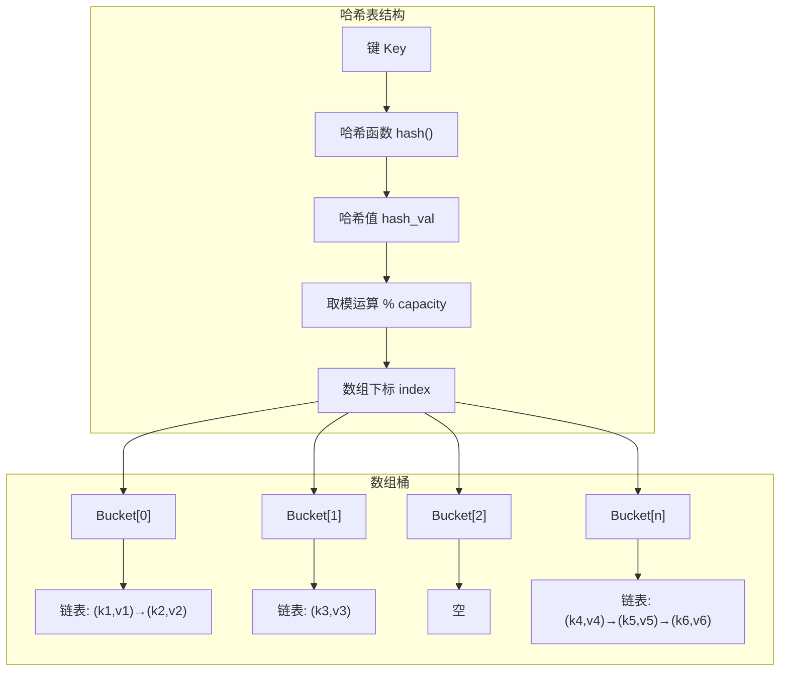
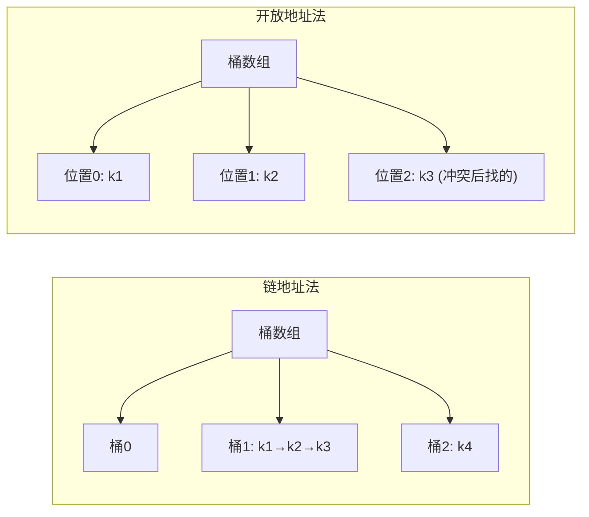
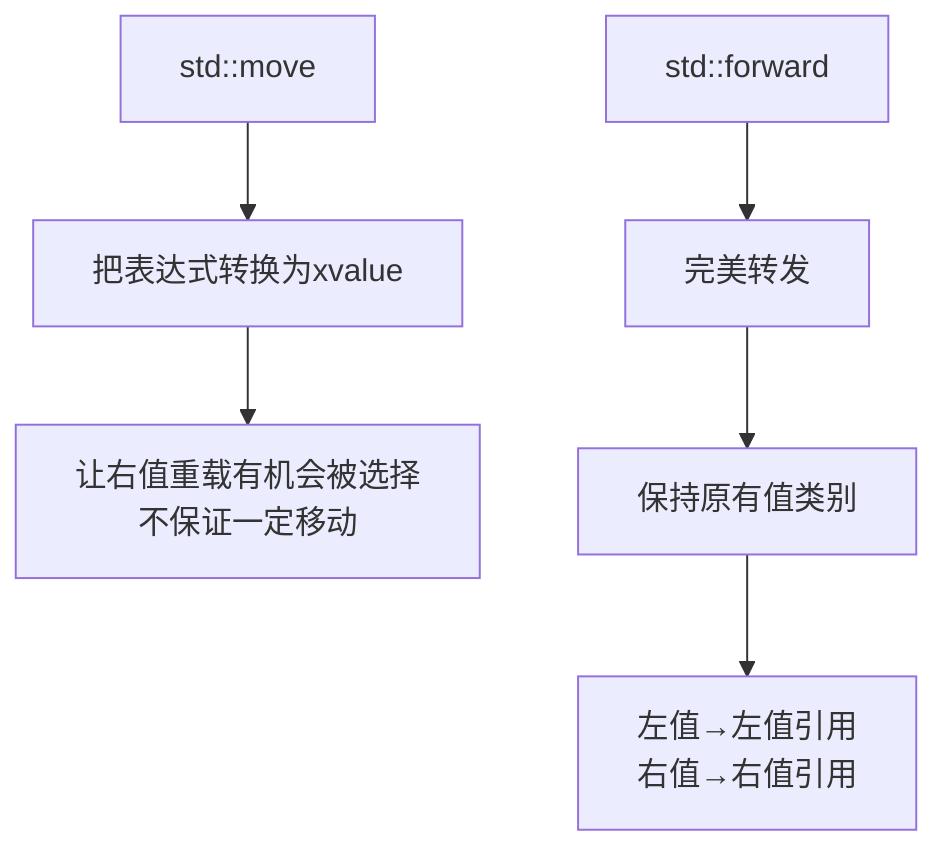
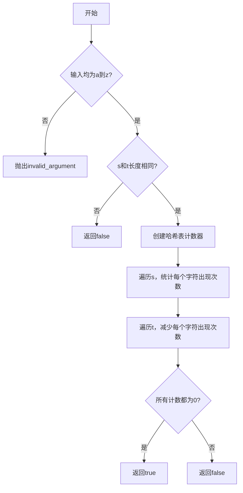
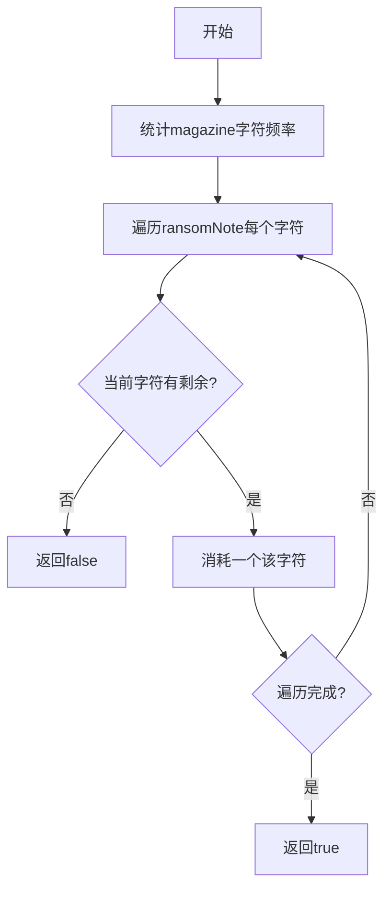

# Day 22：哈希表入门

> **学习定位**：算法主线从有序结构转向哈希映射；语言主线开始进入值类别。右值引用在今天只建立直觉，完整的移动构造、转发引用和重载规则会在 Day 23-25 分层展开。

## 📅 学习目标

- [ ] 理解哈希表的基本原理和核心概念
- [ ] 掌握哈希函数和冲突解决策略
- [ ] 学会使用C++中的unordered_map和unordered_set
- [ ] 理解右值引用的概念和移动语义基础
- [ ] 掌握using类型别名的现代写法
- [ ] 完成LeetCode 242、383

---

## 📖 知识点一：哈希表数据结构

### 概念定义

**哈希表(Hash Table)**，也称为散列表，是一种基于键值对(Key-Value Pair)的数据结构，它通过哈希函数将键映射到数组中的某个位置，从而实现快速的插入、删除和查找操作。哈希表的核心思想是"用空间换时间"，通过额外的存储空间来换取平均O(1)时间复杂度的查找效率。

### 专业介绍

哈希表是计算机科学中最重要的数据结构之一，其核心机制包括以下几个关键组成部分：

**哈希函数(Hash Function)**：哈希函数是哈希表的核心，它将任意大小的输入数据映射为固定大小的输出（哈希值）。一个好的哈希函数应该满足：计算高效、分布均匀、确定性（相同输入产生相同输出）。常见的哈希函数包括除留余数法、乘法哈希、加密哈希等。

**哈希冲突(Hash Collision)**：由于哈希函数的输出空间有限，而输入空间可能无限，因此必然存在不同的键映射到同一位置的情况，这称为哈希冲突。解决冲突是哈希表设计的核心问题之一，主要有链地址法(Separate Chaining)和开放地址法(Open Addressing)两种策略。

**负载因子(Load Factor)**：负载因子定义为元素数量除以哈希表容量，它反映了哈希表的填充程度。当负载因子超过阈值时，通常需要扩容重建（rehash）：改变桶数后，按新映射把已有元素重新分布。

**时间复杂度**：在哈希分布和负载因子受控的假设下，插入、删除、查找的平均时间复杂度是 O(1)。所有键严重冲突或遭遇对抗输入时，这些操作可退化为 O(n)；合理的哈希函数与扩容策略能降低风险，但不把最坏情况变成语言保证。

### 形象化理解

想象一个**超级智能的图书馆**：

```
传统图书馆（数组/链表）：
  书架按顺序排列，找书需要一本本翻
  《算法导论》 → 从第1架翻到第50架 → 找到了！
  
智能图书馆（哈希表）：
  书名 → 神奇公式计算 → 书架编号
  《算法导论》 → hash("算法导论") = 42 → 第42架 → 拿到！
```

**生活中的哈希表例子**：

- **电话簿**：人名→电话号码，通过姓名快速查找
- **图书馆索引**：书名→位置编号，快速定位书籍
- **仓库管理**：货号→货架位置，提高拣货效率
- **车位管理**：车牌号→车位编号，快速停车取车

### 哈希表内部结构



### 哈希冲突解决策略



| 方法 | 描述 | 优点 | 缺点 |
|------|------|------|------|
| 链地址法 | 每个桶维护一个链表 | 实现简单，删除方便 | 需要额外空间存储指针 |
| 开放地址法 | 冲突时找下一个空位 | 空间利用率高 | 聚集问题，删除复杂 |
| 双重散列探测 | 开放寻址冲突时，用第二个哈希函数计算探测步长 | 减少一次/二次聚集 | 需保证步长能遍历表，且计算更多 |

不要把两个过程都简称为“再哈希”：**rehash** 是修改桶数并重新分布全部元素，**double hashing** 则是当前开放寻址表中的一种探测序列策略。

### C++中的哈希容器

```cpp
#include <unordered_map>
#include <unordered_set>

// unordered_map: 键值对哈希表
std::unordered_map<std::string, int> scores;
scores["Alice"] = 95;           // 插入
scores.insert({"Bob", 87});     // 插入
scores["Alice"] = 100;          // 修改
int score = scores["Alice"];     // 查找: 100
scores.erase("Bob");            // 删除

// unordered_set: 唯一元素集合
std::unordered_set<int> nums;
nums.insert(1);
nums.insert(2);
nums.insert(1);  // 重复元素不会插入
bool found = nums.count(1);     // 查找: 1

// 遍历
for (const auto& [key, value] : scores) {
    std::cout << key << ": " << value << std::endl;
}
```

<a id="day22-unordered-contract"></a>

### 标准无序容器的正确性契约

哈希表的正确性不是由 `Hash` 一个函数独立决定的，而是由“哈希函数 + 键等价谓词 + 冲突处理”共同决定。对 `std::unordered_map<Key, T, Hash, KeyEqual>`，必须满足：

1. `KeyEqual` 对键建立等价关系：自反、对称、传递。
2. 若 `KeyEqual{}(a, b)` 为真，则必须有 `Hash{}(a) == Hash{}(b)`；反过来不要求，不等价键冲突是正常情况。
3. 键存储在容器期间，参与哈希和等价判断的状态必须稳定；不能通过外部可变状态让同一个已存键悄悄改变桶位置或等价类。

例如，若业务规则认为用户名不区分大小写，那么 `KeyEqual("Alice", "alice")` 为真时，`Hash` 也必须对两者产生相同哈希值。只把比较器改成不区分大小写、但仍使用区分大小写的哈希，违反了无序关联容器的前置要求；“小样例偶然查到”不能证明实现正确。

### 负载因子、rehash 与失效规则

`load_factor()` 是 `size() / bucket_count()`，`max_load_factor()` 是容器用于决定何时需要更多桶的阈值。`reserve(n)` 表达“为至少 n 个元素预留足够桶”，`rehash(b)` 则直接请求桶数至少达到某个下界；实际桶数和扩容策略由实现决定。预留可以减少批量插入时的重复 rehash，但不是“预留后查找必然 O(1)”的保证；对抗冲突仍可使最坏查找退化为 O(n)。

| 操作 | 迭代器 | 指向未删除元素的引用/指针 |
|------|----------|-----------------------------|
| `rehash` / 导致 rehash 的插入 | 全部失效 | 仍指向原元素 |
| 未导致 rehash 的插入 | 保持有效 | 保持有效 |
| `erase` | 只有被删元素的迭代器失效 | 只有指向被删元素的引用/指针失效 |

还要区分“查询”与“插入”：`map[key]` 在键不存在时会插入一个默认构造的值，不应用它检查“是否存在”。C++17 代码可用 `find()` 或 `count()`；若需要“存在则访问、不存在则抛异常”，使用 `at()`。遍历顺序也未被标准保证，不能把某次输出顺序写入业务契约或测试期望。

**本节练习**：为“不区分大小写的用户名”同时写 `Hash` 和 `KeyEqual`，用 `"Alice"/"alice"` 验证相等键得到同一哈希；再保存一个迭代器和一个元素引用，调用 `reserve()` 触发 rehash，预测哪一个仍可用，不要通过解引用已失效迭代器来“试运气”。

---

<a id="day22-value-categories"></a>

## 📖 知识点二：右值引用

### 概念定义

**右值引用(Rvalue Reference)** 是C++11引入的新特性，它可以绑定右值表达式。右值引用使用`&&`语法声明，是移动语义和完美转发的基础；它提供了选择移动重载的机会，但不保证一定发生移动，也不代表所指对象马上销毁。

### 专业介绍

要理解右值引用，首先需要区分左值和右值：

值类别是**表达式的属性**，不是对象身上的永久标签；同一个对象既可以被左值表达式 `x` 指代，也可以被将亡值表达式 `std::move(x)` 指代。

**左值(Lvalue)**：具有身份、通常可以取地址的表达式，例如变量名、解引用表达式和前置递增表达式。不要用“能否出现在赋值号左边”机械判断，因为 `const` 左值也不能被赋值。

**纯右值(Prvalue)**：用于初始化对象或计算操作数值的表达式，例如多数算术表达式和字面量。**将亡值(Xvalue)**：具有身份、但资源允许被复用的表达式，例如 `std::move(x)` 的结果。纯右值和将亡值共同属于右值；`std::move(live_object)` 也会产生 xvalue，因此右值并不等于“对象马上死亡”。

**右值引用的特点**：
1. 在特定绑定场景延长临时对象生命周期：临时量直接绑定到局部 `const T&` 或 `T&&` 变量时，通常延长到该引用变量的生命周期；这种延长不会因为把引用再传给函数或从函数返回引用而继续传播，`new` 初始化器、构造函数引用成员等场景还有更短的专门规则。
2. 支持移动语义：允许类型在满足契约时转移资源，通常比深拷贝便宜，但代价取决于类型。
3. 支持转发机制：可推导的 `T&&` 作为转发引用并配合 `std::forward`，可以保持实参的值类别。

把值类别放到同一张表中会比“左值就是有名字”更准确：

| 值类别 | 是否有身份 | 是否属于右值 | 常见例子 | 主要用途 |
|----------|------------|----------------|----------|----------|
| lvalue | 是 | 否 | `x`、`*p`、`++i` | 指认可重复访问的对象 |
| xvalue | 是 | 是 | `std::move(x)`、返回 `T&&` 的表达式 | 让重载集看到“状态可复用”的许可 |
| prvalue | 否（用于初始化/计算） | 是 | `42`、`x + y`、按值返回的工厂调用 | 计算值或直接初始化结果对象 |

glvalue 是 lvalue 与 xvalue 的总称，它们都能指认对象；rvalue 是 prvalue 与 xvalue 的总称。“通常可以取地址”只是识别 lvalue 的辅助经验，不是完整定义；例如函数名是 lvalue，但不能把所有表达式都靠“能否位于赋值号左边”分类。同样，“有名字的变量表达式通常是 lvalue”是重要规则，但不是 lvalue 的定义；`*p` 即使没有自己的变量名，也是 lvalue。

**本节练习**：对 `x`、`(x)`、`*p`、`++i`、`i++`、`x + 1`、`std::move(x)` 和按值返回的 `makeString()` 逐个标注“有无身份、是否属于右值、可绑定哪个重载”。然后把一个临时 `std::string` 直接绑定到局部 `const std::string&`，再对比“函数返回了指向其形参的引用”，说明为什么后者不传播临时量寿命延长。

**左值引用 vs 右值引用**：

```cpp
int x = 10;          // 表达式 x 是左值，字面量表达式 10 是纯右值
int& lr = x;         // 左值引用绑定左值
int&& rr = 10;       // 右值引用绑定右值
int&& rr2 = x + 5;   // 右值引用绑定临时对象
// int& lr2 = 10;    // 错误：左值引用不能绑定右值
// int&& rr3 = x;    // 错误：右值引用不能绑定左值
```

### 形象化理解

把对象看作"房产"，把资源看作"房屋"：

```
复制语义（深拷贝）：
  原房主 A → 盖新房子 → 新房主 B
  资源被复制，消耗大量时间和空间
  
移动语义（资源复用或转移由类型决定）：
  原房主 A → 房产过户 → 新房主 B
  A 办理过户，B 接管房屋；通常少做工作，但过户本身并非零成本
  
右值引用就像"临时居住证"：
  它告诉我们："当前表达式允许按可复用资源处理，
   是否真的搬、搬后留下什么状态，由类型的操作和契约决定。"
```

### 代码示例

本日只用重载观察**表达式值类别**，不提前再实现一遍资源类。移动构造、移动赋值、Rule of Zero/Five 和强异常保证以 [Day 23](../day_23/README.md#day23-rule-zero) 为唯一主讲位置。下面的完整程序要求先预测每次调用选中哪个重载，再编译运行。

```cpp
#include <iostream>
#include <string>
#include <utility>
#include <vector>

void observe(const std::string&) {
    std::cout << "const lvalue path\n";
}

void observe(std::string&&) {
    std::cout << "rvalue path\n";
}

int main() {
    std::string text = "named object";
    observe(text);             // 表达式 text 是左值
    observe(std::move(text));  // std::move(text) 是 xvalue

    // 右值引用变量一旦有了名字，该名字表达式仍是左值。
    std::string&& alias = std::string("temporary");
    observe(alias);
    observe(std::move(alias));

    std::vector<int> v1 = {1, 2, 3, 4, 5};
    std::vector<int> v2 = std::move(v1);
    if (v2.size() != 5) return 1;
    // v1 仍有效但状态未指定；先重新赋值再依赖新状态。
    v1 = {9, 10};
    if (v1.size() != 2) return 2;
    return 0;
}
```

### std::move 和 std::forward



---

## 📖 知识点三：EMC++ Item 9 - 类型别名

### 概念定义

**类型别名(Type Alias)** 是给已有类型起一个新名字的方式，C++11引入了`using`关键字作为`typedef`的现代替代方案。`using`语法更加清晰，支持模板别名，是更推荐使用的类型别名定义方式。

### 为什么优先使用using

**1. 语法更直观**

```cpp
// typedef 的语法：新名字在后面
typedef int (*FuncPtr)(int, int);      // 函数指针
typedef std::map<std::string, std::vector<int>> StringToInts;

// using 的语法：新名字在前面（更自然）
using FuncPtr = int(*)(int, int);       // 函数指针
using StringToInts = std::map<std::string, std::vector<int>>;
```

**2. 支持模板别名**

这是 `using` 最重要的语言能力差异：`typedef` 不能直接声明模板别名。旧代码可以用“类模板 + 嵌套 `type`”绕行，但使用时需要 `typename Meta<T>::type`；alias template 直接产生目标类型，也与标准库 C++14 的 `_t` 别名风格一致。

```cpp
// using 支持模板别名
template<typename T>
using Vec = std::vector<T>;

Vec<int> v1;           // std::vector<int>
Vec<std::string> v2;   // std::vector<std::string>

// typedef 不能直接声明模板别名；下面这种写法不成立：
// template<typename T>
// typedef std::vector<T> Vec;  // 编译错误！

// 旧式替代要包一层类模板
template<typename T>
struct VecMeta { typedef std::vector<T> type; };

typename VecMeta<int>::type oldStyle;
Vec<int> aliasStyle;  // 不需要 typename 和 ::type
```

**3. 可读性更好**

对于复杂的类型声明，`using`的"赋值"形式更容易理解：

```cpp
// typedef - 名字藏在类型中间
typedef void (*SignalHandler)(int);

// using - 名字清晰可见
using SignalHandler = void (*)(int);
```

### 代码示例

```cpp
#include <iostream>
#include <vector>
#include <map>
#include <memory>
#include <functional>

// 别名模板不能声明在函数块作用域，先放在命名空间作用域。
template<typename T>
using Vec = std::vector<T>;

template<typename K, typename V>
using Map = std::map<K, V>;

template<typename T>
using Ptr = std::shared_ptr<T>;

template<typename T, std::size_t N>
using Array = T[N];

int main() {
    std::cout << "=== 类型别名对比 ===" << std::endl;
    
    // 1. 基本类型别名
    typedef int TInt;           // 旧式写法
    using ULong = unsigned long; // 新式写法
    
    TInt integerValue = 10;
    ULong unsignedValue = 20UL;
    std::cout << "TInt integerValue = " << integerValue << std::endl;
    std::cout << "ULong unsignedValue = " << unsignedValue << std::endl;
    
    // 2. 指针类型别名
    typedef int* TIntPtr;
    using IntPtr = int*;
    
    int x = 100;
    TIntPtr p1 = &x;
    IntPtr p2 = &x;
    std::cout << "*p1 = " << *p1 << ", *p2 = " << *p2 << std::endl;
    
    // 3. 函数指针类型别名
    typedef int (*OldFuncPtr)(int, int);
    using NewFuncPtr = int (*)(int, int);
    
    auto add = [](int lhs, int rhs) { return lhs + rhs; };
    OldFuncPtr f1 = add;
    NewFuncPtr f2 = add;
    std::cout << "f1(3,4) = " << f1(3, 4) << std::endl;
    std::cout << "f2(3,4) = " << f2(3, 4) << std::endl;
    
    // Vec/Map/Ptr/Array 是别名模板，必须声明在命名空间或类作用域，
    // 不能声明在 main 的函数块作用域；它们已放在本示例的 main 之前。
    Vec<int> numbers = {1, 2, 3, 4, 5};
    Map<std::string, int> scores = {{"Alice", 95}, {"Bob", 87}};
    
    std::cout << "numbers: ";
    for (int n : numbers) std::cout << n << " ";
    std::cout << std::endl;
    
    // 5. 智能指针别名
    Ptr<int> smartPtr = std::make_shared<int>(42);
    std::cout << "*smartPtr = " << *smartPtr << std::endl;
    
    // 6. 固定大小的数组别名
    Array<int, 5> arr = {1, 2, 3, 4, 5};
    std::cout << "arr[0] = " << arr[0] << std::endl;
    
    return 0;
}
```

### 最佳实践

| 场景 | 推荐做法 |
|------|---------|
| 新代码 | 统一使用`using` |
| 模板别名 | 必须使用`using` |
| 函数指针 | `using`更清晰 |
| 标准库容器 | `using StringVector = std::vector<std::string>;` |

---

## 🎯 LeetCode 刷题

### 讲解题：LC 242. 有效的字母异位词

#### 题目链接

[LeetCode 242](https://leetcode.cn/problems/valid-anagram/)

#### 题目描述

给定两个字符串 `s` 和 `t`，编写一个函数来判断 `t` 是否是 `s` 的字母异位词。

**字母异位词**：两个字符串包含相同的字母，但顺序可能不同。

#### 形象化理解

想象两个"字母积木堆"：

```
字符串 s = "anagram"
字符串 t = "nagaram"

把两个字符串的字母打乱重排：
s → {a:3, n:1, g:1, r:1, m:1}
t → {a:3, n:1, g:1, r:1, m:1}

两个积木堆完全一样？ → 是字母异位词！
```

**生活类比**：
- 两袋积木，每袋的积木块数完全相同
- 两副扑克牌，每副牌的花色点数完全相同
- 两份食谱，所需的食材数量完全相同

#### 理论介绍

这道题的核心是**统计字符频率**。字母异位词的本质是：两个字符串中每个字符出现的次数完全相同。

本仓库按题目约束把三种公开解法的输入域统一为小写英文字母 `'a'` 到 `'z'`：发现其他字节时抛出 `std::invalid_argument`，而且校验发生在长度早退之前。这样哈希法、数组法和排序法不会对同一输入给出三种不同的失败方式；若业务要支持任意字节，应统一改用 256 项无符号字节计数，若要支持 Unicode 字符则应先解码。

哈希表是解决这类问题的利器，因为它可以：
1. 以字符为键，快速查找和更新计数
2. 在哈希分布良好的常见情况下，以平均 O(1) 时间完成插入和查询

#### 解题思路



**方法一：哈希表计数**
- 使用unordered_map统计每个字符出现次数
- 时间复杂度：O(n)
- 空间复杂度：O(k)，k为字符集大小

**方法二：数组计数（更优）**
- 由于只有26个小写字母，可以用长度26的数组
- 时间复杂度：O(n)
- 空间复杂度：O(1)

#### 代码实现

```cpp
#include <iostream>
#include <string>
#include <stdexcept>
#include <unordered_map>
#include <vector>
using namespace std;

size_t lowercaseIndex(char c) {
    const auto byte = static_cast<unsigned char>(c);
    if (byte < static_cast<unsigned char>('a') ||
        byte > static_cast<unsigned char>('z')) {
        throw invalid_argument("LC242只接受小写英文字母");
    }
    return static_cast<size_t>(byte - static_cast<unsigned char>('a'));
}

void validateLowercase(const string& text) {
    for (char c : text) {
        static_cast<void>(lowercaseIndex(c));
    }
}

// 方法一：哈希表
bool isAnagram_hash(string s, string t) {
    validateLowercase(s);
    validateLowercase(t);
    if (s.length() != t.length()) return false;
    
    unordered_map<char, int> count;
    
    // 统计s中每个字符的出现次数
    for (char c : s) {
        count[c]++;
    }
    
    // 减去t中每个字符的出现次数
    for (char c : t) {
        count[c]--;
        if (count[c] < 0) return false;
    }
    
    return true;
}

// 方法二：数组（最优解）
bool isAnagram_array(string s, string t) {
    validateLowercase(s);
    validateLowercase(t);
    if (s.length() != t.length()) return false;
    
    int count[26] = {0};
    
    // 一次遍历完成统计
    for (size_t i = 0; i < s.length(); ++i) {
        ++count[lowercaseIndex(s[i])];  // s中的字符加
        --count[lowercaseIndex(t[i])];  // t中的字符减
    }
    
    // 检查是否都为0
    for (int c : count) {
        if (c != 0) return false;
    }
    
    return true;
}

int main() {
    string s1 = "anagram", t1 = "nagaram";
    string s2 = "rat", t2 = "car";
    
    cout << "方法一（哈希表）：" << endl;
    cout << s1 << " vs " << t1 << ": " 
         << (isAnagram_hash(s1, t1) ? "true" : "false") << endl;
    cout << s2 << " vs " << t2 << ": " 
         << (isAnagram_hash(s2, t2) ? "true" : "false") << endl;
    
    cout << "\n方法二（数组）：" << endl;
    cout << s1 << " vs " << t1 << ": " 
         << (isAnagram_array(s1, t1) ? "true" : "false") << endl;
    cout << s2 << " vs " << t2 << ": " 
         << (isAnagram_array(s2, t2) ? "true" : "false") << endl;
    
    return 0;
}
```

---

### 实战题：LC 383. 赎金信

#### 题目链接

[LeetCode 383](https://leetcode.cn/problems/ransom-note/)

#### 提示

1. 这题与242题非常相似，都是字符计数问题
2. 区别：ransomNote中的字符数不能超过magazine中对应字符数
3. 使用哈希表或数组统计字符频率

#### 题目描述

给定一个赎金信字符串 `ransomNote` 和一个杂志字符串 `magazine`，判断 `ransomNote` 能否由 `magazine` 中的字符构成。

每个字符在 `magazine` 中只能使用一次。

#### 形象化理解

想象一个"拼字游戏"：

```
赎金信: "aabb"
杂志:   "aabbc"

从杂志中取字母拼赎金信：
  杂志: {a:2, b:2, c:1}
  需要: {a:2, b:2}
  
检查：每个字母的需求数 ≤ 杂志中的数量
  a: 2 ≤ 2 ✓
  b: 2 ≤ 2 ✓
  
结果：可以拼出赎金信！
```

**生活类比**：
- 你有一盒字母饼干，想拼出一句话
- 每种字母饼干的数量有限，够不够用？
- 就像超市购物清单，每种商品的数量是否充足

#### 理论介绍

这是典型的**集合包含问题**，本质是检查一个多重集合是否是另一个多重集合的子集。

哈希表解决这类问题的思路：
1. 先统计"供应方"（magazine）的字符数量
2. 再检查"需求方"（ransomNote）的需求能否被满足

这里沿用 LC 242 的统一输入契约：两种公开解法都只接受 `'a'` 到 `'z'`，非法字节抛 `std::invalid_argument`。数组优化的 O(1) 额外空间来自固定 26 项输入域，不是对任意 `std::string` 都安全的技巧。

#### 解题思路



#### 代码实现

```cpp
#include <iostream>
#include <string>
#include <stdexcept>
#include <unordered_map>
using namespace std;

size_t lowercaseIndex(char c) {
    const auto byte = static_cast<unsigned char>(c);
    if (byte < static_cast<unsigned char>('a') ||
        byte > static_cast<unsigned char>('z')) {
        throw invalid_argument("LC383只接受小写英文字母");
    }
    return static_cast<size_t>(byte - static_cast<unsigned char>('a'));
}

void validateLowercase(const string& text) {
    for (char c : text) {
        static_cast<void>(lowercaseIndex(c));
    }
}

// 方法一：哈希表
bool canConstruct_hash(string ransomNote, string magazine) {
    validateLowercase(ransomNote);
    validateLowercase(magazine);
    unordered_map<char, int> count;
    
    // 统计magazine中每个字符的数量
    for (char c : magazine) {
        count[c]++;
    }
    
    // 检查ransomNote能否被满足
    for (char c : ransomNote) {
        if (count[c] <= 0) return false;
        count[c]--;
    }
    
    return true;
}

// 方法二：数组（最优解）
bool canConstruct_array(string ransomNote, string magazine) {
    validateLowercase(ransomNote);
    validateLowercase(magazine);
    int count[26] = {0};
    
    // 统计magazine
    for (char c : magazine) {
        ++count[lowercaseIndex(c)];
    }
    
    // 检查ransomNote
    for (char c : ransomNote) {
        const size_t index = lowercaseIndex(c);
        if (count[index] <= 0) return false;
        --count[index];
    }
    
    return true;
}

int main() {
    cout << "测试用例1: " << endl;
    cout << "ransomNote = \"a\", magazine = \"b\"" << endl;
    cout << "结果: " << (canConstruct_array("a", "b") ? "true" : "false") << endl;
    
    cout << "\n测试用例2: " << endl;
    cout << "ransomNote = \"aa\", magazine = \"ab\"" << endl;
    cout << "结果: " << (canConstruct_array("aa", "ab") ? "true" : "false") << endl;
    
    cout << "\n测试用例3: " << endl;
    cout << "ransomNote = \"aa\", magazine = \"aab\"" << endl;
    cout << "结果: " << (canConstruct_array("aa", "aab") ? "true" : "false") << endl;
    
    return 0;
}
```

---

## 🚀 运行代码

```bash
./build_and_run.sh
```

---

## 📚 相关术语

| 术语 | 英文 | 定义 |
|------|------|------|
| 哈希表 | Hash Table | 基于键值对的数据结构 |
| 哈希函数 | Hash Function | 将键映射到数组索引的函数 |
| 哈希冲突 | Hash Collision | 不同键映射到相同位置 |
| 负载因子 | Load Factor | 元素数量/表容量 |
| 右值引用 | Rvalue Reference | 非转发语境中的 `U&&`，可绑定纯右值或 xvalue；命名后的引用表达式仍是左值 |
| 移动语义 | Move Semantics | 允许类型按自身契约复用或转移资源的机制 |
| 类型别名 | Type Alias | 给类型起一个新名字 |

---

## 💡 学习提示

### 哈希表的适用场景

当你遇到以下问题时，优先考虑哈希表：

1. **快速查找**：接受平均 O(1)、最坏 O(n) 的契约，并能控制哈希函数与负载因子
2. **去重**：判断元素是否重复出现
3. **计数统计**：统计元素出现次数
4. **两数之和**：找满足条件的配对

### 哈希表的时间复杂度

| 操作 | 平均 | 最坏 |
|------|------|------|
| 查找 | O(1) | O(n) |
| 插入 | O(1) | O(n) |
| 删除 | O(1) | O(n) |

### 右值引用的使用场景

1. **移动构造函数**：避免深拷贝
2. **移动赋值运算符**：高效资源转移
3. **std::move**：无条件转换并产生 xvalue，本身不搬运资源
4. **std::forward**：完美转发

### 明日预告

Day 23 将学习：
- 移动构造、移动赋值与资源所有权契约
- 先用 Rule of Zero 组织普通业务类型，再理解资源类为何需要 Rule of Five
- EMC++ Item 23-25：`std::move`、转发引用与 `std::forward`
- LC 1 与 LC 454：继续用哈希表训练“空间换时间”和问题拆分

### 今日工程动作：锁定哈希表所有权与接口契约

把 `SimpleHashTable` 当作缓存索引的第一块组件：明确删除复制和移动，避免裸指针浅复制导致重复释放；用 `std::optional<int>` 区分“缺失”与合法值 `-1`；用 `unsigned char` 参与哈希，避免有符号 `char` 形成负下标；再用自定义哈希/相等谓词和负载因子实验观察“键等价”与“桶分布”是两份必须一致的设计。运行 `cmake -S . -B build && cmake --build build && cmake -E chdir build ctest --output-on-failure`，让冲突键、缺失值、移动后复制等契约能真实返回失败；这条命令只依赖本周声明的 CMake 3.14 最低版本。

### 恰好五句复盘

1. 我能说明哈希表通过哈希、相等比较和冲突处理共同决定一次查找是否正确。
2. 我能解释负载因子升高为何通常增加冲突，也知道具体桶数依赖实现。
3. 我知道值类别属于表达式，并能区分 lvalue、prvalue 与 xvalue。
4. 我不会把 `std::move` 理解成搬运动作，也不会假定标准容器移动后一定为空。
5. 我为裸指针容器锁定了所有权策略和缺失值接口，为后续缓存项目保留了可测试边界。

---

## 🔗 参考资料

1. [Hello-Algo - 哈希表](https://www.hello-algo.com/chapter_hashing/)
2. [cppreference - unordered_map](https://en.cppreference.com/w/cpp/container/unordered_map)
3. [cppreference - unordered_set](https://en.cppreference.com/w/cpp/container/unordered_set)
4. [cppreference - std::hash](https://en.cppreference.com/w/cpp/utility/hash)
5. [cppreference - Value categories](https://en.cppreference.com/w/cpp/language/value_category)
6. [cppreference - References](https://en.cppreference.com/w/cpp/language/reference)
7. [Effective Modern C++ - Item 9](https://www.aristeia.com/EMC++.html)
8. 《C++ Primer》第 5 版：关联容器、右值引用与移动
9. 《A Tour of C++》第 2 版：无序容器与资源管理概览
