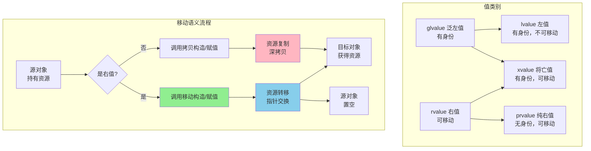
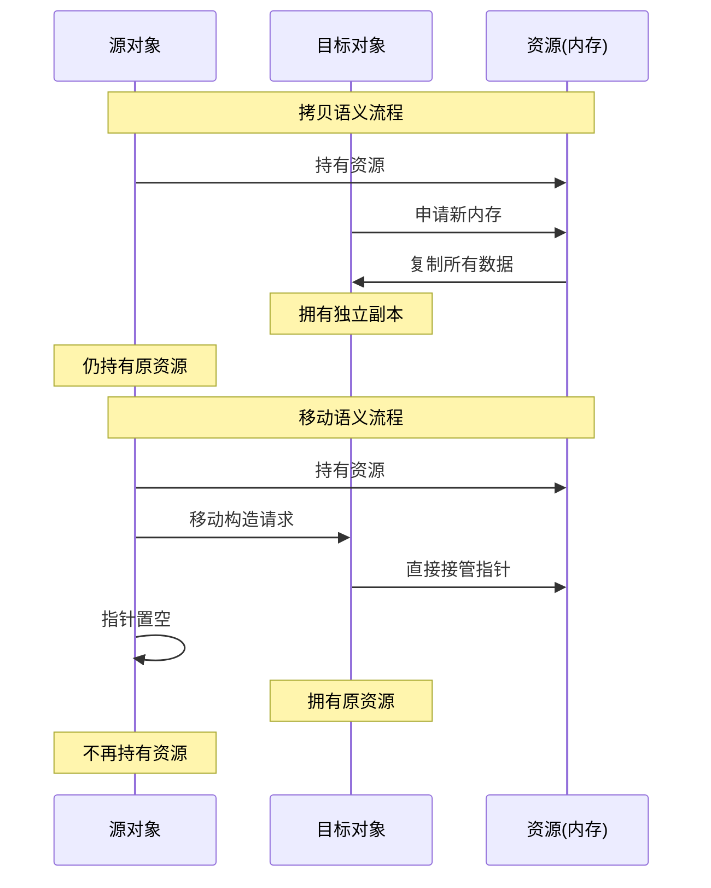

# Day 23: 移动语义 - 掌握现代C++性能优化的核心技术

## 📅 学习目标

今天我们将深入学习C++11引入的革命性特性——移动语义。移动语义是现代C++最重要的性能优化技术之一，它彻底改变了C++对象的管理方式，使得资源转移变得高效且安全。通过今天的学习，你将能够理解右值引用的本质，掌握std::move和std::forward的正确使用方式，区分通用引用与右值引用的微妙差异，并学会编写高效的移动构造函数和移动赋值运算符。此外，我们还将探讨《Effective Modern C++》中关于移动语义的重要条款，帮助你在实际开发中避免常见陷阱。

**本日学习要点：**
- 深入理解左值、右值、将亡值的概念及其分类体系
- 掌握移动语义的核心思想：资源窃取而非深拷贝
- 学会正确实现移动构造函数和移动赋值运算符
- 理解std::move和std::forward的工作原理与使用场景
- 区分通用引用（转发引用）与右值引用的关键差异
- 通过LeetCode题目实践算法思维与代码实现

---

## 📖 知识点一：移动语义

### 概念定义

**移动语义（Move Semantics）** 是C++11引入的一种资源管理机制，它允许将资源（如动态内存、文件句柄等）从一个对象"移动"到另一个对象，而不是进行昂贵的深拷贝操作。移动语义的核心思想是：当一个临时对象即将被销毁时，我们可以直接"窃取"其资源，而不需要复制它们，因为原对象马上就会消失，复制完全是浪费。

移动语义涉及以下几个关键概念：
- **左值（lvalue）**：有名字、有地址的对象，可以取地址，如变量、解引用表达式
- **右值（rvalue）**：临时对象、字面量，无法取地址，生命周期短暂
- **将亡值（xvalue）**：通过std::move或类似操作标记的即将被移动的对象
- **右值引用（rvalue reference）**：使用`T&&`声明的引用类型，专门用于绑定右值

### 专业介绍

在C++11之前，对象的复制是唯一的方式，即使我们知道源对象马上就会被销毁。例如，当一个函数返回一个包含动态内存的对象时，编译器会先创建一个临时副本，然后销毁原对象，最后再将临时副本赋给目标对象——这个过程可能涉及多次深拷贝，极其低效。

移动语义通过引入右值引用解决了这个问题。右值引用`T&&`只能绑定到右值（临时对象），这意味着它引用的对象"即将死亡"。当我们将一个右值传递给移动构造函数时，我们可以安全地"窃取"其资源，只需进行指针交换等轻量操作，而不需要进行耗时的深拷贝。

```cpp
// 传统拷贝语义：深拷贝，复制所有数据
String(const String& other) {
    data = new char[strlen(other.data) + 1];
    strcpy(data, other.data);  // 复制所有字符
}

// 移动语义：窃取资源，只需指针交换
String(String&& other) noexcept {
    data = other.data;         // 直接窃取指针
    other.data = nullptr;      // 源对象置空，防止重复释放
}
```

从性能角度看，移动语义带来的提升是数量级的。对于一个包含100万个字符的字符串，深拷贝需要分配新内存并复制100万个字符，而移动操作只需要交换一个指针，时间复杂度从O(n)降到O(1)。这在容器扩容、函数返回值、异常处理等场景中尤其重要。

### 通俗解释

想象你搬家时的两种情况。**拷贝语义**就像是你把旧房子的每一件家具都复制一份，然后搬到新房子里——这显然既昂贵又荒谬。**移动语义**则是更自然的做法：直接把家具从旧房子搬到新房子，旧房子空了，但家具还是那些家具，只是换了个位置。

在编程世界中，这种"搬家"随处可见：
- `vector.push_back(x)`：将元素添加到容器末尾
- `a = b + c`：表达式`b + c`产生的临时结果被赋给`a`
- `return obj`：函数返回局部对象

在C++11之前，这些操作都涉及不必要的拷贝。有了移动语义，编译器能够识别出"这个对象是临时的，马上要销毁"，从而选择移动而非拷贝，大大提升效率。

另一个形象的比喻是**银行卡与现金**：
- 拷贝语义像是把钱印一份副本，你和我各持有一份相同的钱
- 移动语义像是把银行卡转交给你，钱还是那些钱，只是持有者变了

### Mermaid图示





### 代码示例

```cpp
// 移动语义完整示例
#include <iostream>
#include <utility>  // for std::move
#include <cstring>

class MyString {
private:
    char* data;
    size_t length;

public:
    // 默认构造函数
    MyString() : data(nullptr), length(0) {}
    
    // 普通构造函数
    MyString(const char* str) {
        length = strlen(str);
        data = new char[length + 1];
        strcpy(data, str);
        std::cout << "构造: " << data << std::endl;
    }
    
    // 拷贝构造函数 - 深拷贝
    MyString(const MyString& other) {
        length = other.length;
        data = new char[length + 1];
        strcpy(data, other.data);
        std::cout << "拷贝构造: " << data << std::endl;
    }
    
    // 移动构造函数 - 资源窃取
    MyString(MyString&& other) noexcept {
        // 直接窃取资源
        data = other.data;
        length = other.length;
        
        // 源对象置空，防止重复释放
        other.data = nullptr;
        other.length = 0;
        
        std::cout << "移动构造: 资源已转移" << std::endl;
    }
    
    // 拷贝赋值运算符
    MyString& operator=(const MyString& other) {
        if (this != &other) {
            delete[] data;
            length = other.length;
            data = new char[length + 1];
            strcpy(data, other.data);
            std::cout << "拷贝赋值: " << data << std::endl;
        }
        return *this;
    }
    
    // 移动赋值运算符
    MyString& operator=(MyString&& other) noexcept {
        if (this != &other) {
            delete[] data;
            
            // 窃取资源
            data = other.data;
            length = other.length;
            
            // 源对象置空
            other.data = nullptr;
            other.length = 0;
            
            std::cout << "移动赋值: 资源已转移" << std::endl;
        }
        return *this;
    }
    
    ~MyString() {
        if (data) {
            std::cout << "析构: " << data << std::endl;
            delete[] data;
        } else {
            std::cout << "析构: 空对象" << std::endl;
        }
    }
    
    const char* c_str() const { return data ? data : ""; }
};

// 工厂函数，返回临时对象
MyString createString() {
    MyString temp("Hello Move Semantics!");
    return temp;  // 返回值优化(RVO)或移动语义
}

int main() {
    std::cout << "=== 移动语义演示 ===" << std::endl;
    
    std::cout << "\n1. 创建对象:" << std::endl;
    MyString s1("Hello");
    
    std::cout << "\n2. 拷贝构造:" << std::endl;
    MyString s2 = s1;  // 调用拷贝构造
    
    std::cout << "\n3. 移动构造:" << std::endl;
    MyString s3 = std::move(s1);  // 调用移动构造
    
    std::cout << "\n4. 使用临时对象(右值):" << std::endl;
    MyString s4 = MyString("Temporary");  // 可能触发移动构造或RVO
    
    std::cout << "\n5. 函数返回值:" << std::endl;
    MyString s5 = createString();  // 可能RVO优化
    
    std::cout << "\n6. 移动赋值:" << std::endl;
    MyString s6;
    s6 = std::move(s2);  // 调用移动赋值
    
    std::cout << "\n=== 程序结束，开始析构 ===" << std::endl;
    return 0;
}
```

---

## 📖 知识点二：EMC++ Item 23-25

### Item 23: 理解 std::move 和 std::forward

**std::move** 和 **std::forward** 是C++11中两个最重要的类型转换工具，它们都定义在`<utility>`头文件中。虽然名字听起来像是"移动"操作，但实际上它们只是进行类型转换，真正的移动操作发生在移动构造函数或移动赋值运算符中。

**std::move 的本质：**
```cpp
template<typename T>
constexpr typename std::remove_reference<T>::type&& move(T&& t) noexcept {
    return static_cast<typename std::remove_reference<T>::type&&>(t);
}
```

std::move 本质上是一个类型转换函数，它将传入的参数无条件转换为右值引用。它的工作可以概括为：
1. 如果T是左值引用，则移除引用后添加&&，变成右值引用
2. 如果T是非引用类型，直接添加&&
3. 如果T已经是右值引用，保持不变

**std::forward 的本质：**
```cpp
template<typename T>
constexpr T&& forward(typename std::remove_reference<T>::type& t) noexcept {
    return static_cast<T&&>(t);
}
```

std::forward 是有条件的类型转换，它只在特定条件下将参数转换为右值引用。它通常与万能引用（universal reference）配合使用，用于实现完美转发——保持参数原有的值类别。

**关键区别：**
- std::move 是无条件转换，总是产生右值引用
- std::forward 是有条件转换，只有当原始参数是右值时才转换为右值引用

**使用场景：**
- 当你确定要转移对象的所有权时，使用std::move
- 当你需要完美转发参数，保持其原有值类别时，使用std::forward

```cpp
// std::move 示例
void processValue(int& x) { std::cout << "左值: " << x << std::endl; }
void processValue(int&& x) { std::cout << "右值: " << x << std::endl; }

int value = 42;
processValue(value);           // 输出: 左值: 42
processValue(std::move(value)); // 输出: 右值: 42

// std::forward 示例
template<typename T>
void wrapper(T&& arg) {
    processValue(std::forward<T>(arg));  // 完美转发
}

wrapper(value);            // T = int&，转发为左值
wrapper(42);               // T = int，转发为右值
```

### Item 24: 区分通用引用和右值引用

**通用引用（Universal Reference）** 是Scott Meyers提出的概念，在C++标准中称为**转发引用（Forwarding Reference）**。它是一种特殊的引用类型，能够同时接受左值和右值。

**识别通用引用的两个必要条件：**
1. 类型声明形式必须是`T&&`（注意：T是模板参数）
2. 必须发生类型推导（模板参数推导或auto推导）

```cpp
// 通用引用 - 可以绑定左值或右值
template<typename T>
void universalRef(T&& param);  // T&& 是通用引用

auto&& x = 42;                 // auto&& 是通用引用
auto&& y = getValue();         // auto&& 是通用引用

// 右值引用 - 只能绑定右值
void rvalueRef(int&& param);   // int&& 是右值引用（无类型推导）
template<typename T>
void foo(typename std::vector<T>::iterator&& it);  // 右值引用（非T&&形式）
```

**通用引用的工作原理：**
当通用引用接受左值时，T被推导为左值引用（如`int&`），根据引用折叠规则，`int& &&`折叠为`int&`。当接受右值时，T被推导为非引用类型（如`int`），最终类型为`int&&`。

```cpp
template<typename T>
void analyze(T&& param) {
    if constexpr (std::is_lvalue_reference_v<T>) {
        std::cout << "T 是左值引用类型" << std::endl;
    } else {
        std::cout << "T 是非引用类型" << std::endl;
    }
}

int x = 10;
analyze(x);      // T = int&，param 类型 = int&
analyze(10);     // T = int，param 类型 = int&&
```

**常见陷阱：**
```cpp
template<typename T>
class Widget {
public:
    // 这不是通用引用！因为T在类实例化时已确定，无类型推导
    void process(T&& param);  // 这是右值引用
};

// 正确的通用引用写法
template<typename T>
class Widget {
public:
    template<typename U>
    void process(U&& param);  // 这是通用引用
};
```

### Item 25: 对右值引用使用 std::move，对通用引用使用 std::forward

这个条款的核心是告诉我们在不同的引用类型上应该使用不同的转换策略，以确保既不丢失效率，又不会产生意外行为。

**对右值引用使用 std::move：**
当参数是右值引用时，我们明确知道它绑定的是右值，可以安全地移动其资源。

```cpp
class String {
public:
    // 右值引用参数 - 使用 std::move
    void setName(std::string&& newName) {
        name = std::move(newName);  // 正确：newName是右值引用
    }
private:
    std::string name;
};
```

**对通用引用使用 std::forward：**
当参数是通用引用时，我们不知道它绑定的是左值还是右值，必须使用std::forward来保持其原有值类别。

```cpp
template<typename T>
void setName(T&& newName) {
    name = std::forward<T>(newName);  // 正确：保持原有值类别
}
```

**为什么不能混用：**

1. 在通用引用上使用std::move会导致意外移动：
```cpp
template<typename T>
void badExample(T&& param) {
    someFunction(std::move(param));  // 错误：总是移动，可能破坏左值
}

std::string s = "Hello";
badExample(s);  // s 被意外移动！
```

2. 在右值引用上使用std::forward虽然不会出错，但语义不清晰：
```cpp
void process(std::string&& s) {
    store(std::forward<std::string>(s));  // 可以工作，但std::move更清晰
}
```

**综合示例：**
```cpp
class Person {
public:
    // 通用引用版本 - 完美转发
    template<typename T>
    void setName(T&& newName) {
        name = std::forward<T>(newName);
    }
    
    // 右值引用版本 - 移动
    void setAddress(std::string&& newAddress) {
        address = std::move(newAddress);
    }
    
private:
    std::string name;
    std::string address;
};
```

---

## 🎯 LeetCode 刷题

### 讲解题：LC 1 两数之和

**题目描述：**
给定一个整数数组 `nums` 和一个整数目标值 `target`，请你在该数组中找出和为目标值 `target` 的那两个整数，并返回它们的数组下标。你可以假设每种输入只会对应一个答案，并且同一个元素在答案里不能重复出现。你可以按任意顺序返回答案。

**形象化提示：**
想象你是一个超市收银员，顾客给你一张购物清单和一个目标金额，你需要找出哪两件商品的价格之和正好等于目标金额。你不能让顾客买同一件商品两次，但商品可能有多件（不同位置的相同数字）。最直观的方法是：拿起第一件商品，然后找有没有其他商品的价格正好是"目标金额减去当前商品价格"。

这就像在玩配对游戏：你有一堆卡片，每张卡片上有一个数字。你的任务是找出两张卡片，它们的数字加起来等于目标数字。关键技巧是：一旦你拿起一张卡片，就知道另一张卡片上应该是什么数字。

**相关理论介绍：**
本题涉及的核心算法思想是**哈希表查找**。哈希表提供了O(1)时间复杂度的查找能力，可以快速判断某个元素是否存在。与暴力法（O(n²)）相比，使用哈希表可以将时间复杂度优化到O(n)，空间复杂度为O(n)。

**算法思路：**
1. 遍历数组，对于每个元素 `nums[i]`
2. 计算需要的补数 `complement = target - nums[i]`
3. 在哈希表中查找 `complement` 是否存在
4. 如果存在，返回两个下标；如果不存在，将当前元素加入哈希表

```mermaid
flowchart LR
    A[开始] --> B[遍历数组]
    B --> C[计算补数<br/>complement = target - nums[i]]
    C --> D{补数在哈希表中?}
    D -->|是| E[返回两个下标]
    D -->|否| F[将当前元素存入哈希表]
    F --> B
    E --> G[结束]
```

**代码实现：**
```cpp
class Solution {
public:
    vector<int> twoSum(vector<int>& nums, int target) {
        // 哈希表：存储{数值: 下标}
        unordered_map<int, int> numToIndex;
        
        for (int i = 0; i < nums.size(); ++i) {
            int complement = target - nums[i];
            
            // 查找补数是否存在
            auto it = numToIndex.find(complement);
            if (it != numToIndex.end()) {
                return {it->second, i};  // 找到答案
            }
            
            // 存入哈希表
            numToIndex[nums[i]] = i;
        }
        
        return {};  // 无解（题目保证有解）
    }
};
```

**复杂度分析：**
- 时间复杂度：O(n)，只需遍历一次数组
- 空间复杂度：O(n)，最坏情况需要存储n个元素

---

### 实战题：LC 454 四数相加 II

**题目描述：**
给定四个包含整数的数组列表 `A, B, C, D`，计算有多少个元组 `(i, j, k, l)`，使得 `A[i] + B[j] + C[k] + D[l] = 0`。为了使问题简单化，所有的 A, B, C, D 具有相同的长度 N，且 0 ≤ N ≤ 500。

**形象化提示：**
想象你有四副扑克牌（A、B、C、D），每副牌都只有数字。你的任务是从每副牌中各抽出一张，让这四张牌的数字之和等于零。直接尝试所有组合太慢了（如果有500张牌，就有500⁴ ≈ 625亿种组合！）。

聪明的方法是"分而治之"：先把A和B的所有组合算出来，记录每种和出现了多少次；然后计算C和D的组合，对于每个C+D的和，去找有没有A+B的和等于它的相反数。这就把O(n⁴)的问题变成了O(n²)的问题！

**相关理论介绍：**
本题的核心思想是**分组哈希**。通过将四个数组分成两组，先计算每组的所有可能和，然后利用哈希表快速查找匹配。这种"空间换时间"的策略在处理多维度组合问题时非常有效。此外，本题还体现了**对称性思维**：如果 A+B+C+D=0，那么 A+B = -(C+D)，这种对称关系让我们能够将问题规模减半。

**算法思路：**
1. 遍历数组A和B的所有组合，用哈希表记录每种和出现的次数
2. 遍历数组C和D的所有组合，计算 sumCD = C[k] + D[l]
3. 在哈希表中查找 -sumCD 出现的次数，累加到结果中

```mermaid
flowchart TB
    subgraph 第一阶段
        A1[遍历A和B] --> B1[计算sumAB = A[i] + B[j]]
        B1 --> C1[哈希表记录<br/>sumAB -> 出现次数]
    end
    
    subgraph 第二阶段
        A2[遍历C和D] --> B2[计算sumCD = C[k] + D[l]]
        B2 --> C2[查找 -sumCD 的出现次数]
        C2 --> D2[累加到结果]
    end
    
    C1 --> A2
```

**代码实现：**
```cpp
class Solution {
public:
    int fourSumCount(vector<int>& A, vector<int>& B, 
                     vector<int>& C, vector<int>& D) {
        // 哈希表：存储A+B的所有可能和及其出现次数
        unordered_map<int, int> sumAB;
        
        // 第一阶段：计算A+B的所有组合
        for (int a : A) {
            for (int b : B) {
                sumAB[a + b]++;
            }
        }
        
        int count = 0;
        
        // 第二阶段：计算C+D的所有组合，查找匹配
        for (int c : C) {
            for (int d : D) {
                int sumCD = c + d;
                // 查找是否存在A+B = -(C+D)
                auto it = sumAB.find(-sumCD);
                if (it != sumAB.end()) {
                    count += it->second;  // 累加所有匹配的组合数
                }
            }
        }
        
        return count;
    }
};
```

**复杂度分析：**
- 时间复杂度：O(n²)，两个嵌套循环各遍历n²次
- 空间复杂度：O(n²)，哈希表最多存储n²个不同的和

---

## 🚀 运行代码

### 环境要求
- C++ 编译器支持 C++11 或更高版本（推荐 GCC 5+ / Clang 3.4+ / MSVC 2015+）
- CMake 3.10 或更高版本

### 编译运行

```bash
# 进入 day_23 目录
cd /home/z/my-project/download/week_04/day_23

# 添加执行权限并运行
chmod +x build_and_run.sh
./build_and_run.sh
```

### 手动编译

```bash
# 创建构建目录
mkdir -p build && cd build

# 配置项目
cmake ..

# 编译
make -j$(nproc)

# 运行
./day_23_main
```

### 预期输出

程序运行后，你将看到以下内容：
1. **移动语义演示**：展示移动构造与拷贝构造的区别
2. **移动赋值演示**：展示移动赋值运算符的工作过程
3. **std::move 示例**：展示 std::move 的类型转换效果
4. **通用引用演示**：展示通用引用如何处理左值和右值
5. **完美转发示例**：展示 std::forward 的正确使用
6. **LeetCode 题解**：两数之和和四数相加 II 的解答结果

---

## 📚 相关术语

| 术语 | 英文 | 解释 |
|------|------|------|
| 左值 | lvalue | 有名字、有地址的表达式，可以取地址 |
| 右值 | rvalue | 临时对象或字面量，无法取地址 |
| 将亡值 | xvalue | 通过 std::move 标记的可移动对象 |
| 右值引用 | rvalue reference | 使用 T&& 声明的引用，只能绑定右值 |
| 通用引用 | universal reference | 模板参数 T&& 形式，可绑定左值或右值 |
| 移动语义 | move semantics | 资源转移机制，避免深拷贝 |
| 完美转发 | perfect forwarding | 保持参数原有值类别的转发方式 |
| 引用折叠 | reference collapsing | 多重引用的简化规则 |
| std::move | - | 将对象转换为右值引用的工具函数 |
| std::forward | - | 有条件转换类型的完美转发工具 |
| 移动构造函数 | move constructor | 接受右值引用参数的构造函数 |
| 移动赋值运算符 | move assignment operator | 接受右值引用参数的赋值运算符 |
| noexcept | - | 异常说明符，表示函数不会抛出异常 |
| 哈希表 | hash table | 键值对存储结构，提供O(1)查找 |

---

## 💡 学习提示

### 移动语义的实践建议

1. **理解资源的所有权转移**：移动语义的本质是"偷窃"资源，而不是复制。想象你把钥匙交给别人，而不是复制一把新钥匙。

2. **注意移动后的对象状态**：移动后的源对象应该处于"有效但未定义"的状态，可以安全地析构或重新赋值，但不应该访问其值。

3. **正确实现移动操作**：
   - 移动构造函数和移动赋值运算符应该标记为 noexcept
   - 移动后要将源对象的指针置空
   - 如果自定义了移动操作，通常也需要自定义析构函数

4. **不要过度使用 std::move**：如果函数返回局部对象，直接返回即可，编译器会进行返回值优化（RVO）。过度使用 std::move 可能反而阻碍优化。

5. **区分移动语义和拷贝语义**：当你需要保留原对象时使用拷贝，当你确定可以放弃原对象时使用移动。

### LeetCode 刷题建议

1. **两数之和**：这是哈希表应用的经典入门题。掌握这个技巧后，可以尝试三数之和、四数之和等变种。

2. **四数相加 II**：这道题的关键在于"分组"思想。将四个数组分成两组，分别计算后匹配，是一种重要的算法设计模式。

3. **举一反三**：理解了"空间换时间"的思想后，可以应用到更多问题中，如两数之和 III、三数之和等。

---

## 🔗 参考资料

1. **书籍**
   - 《Effective Modern C++》- Scott Meyers，Item 23-25
   - 《C++ Primer 第5版》- 第13章 拷贝控制
   - 《C++ Concurrency in Action》- Anthony Williams

2. **在线资源**
   - [cppreference - 移动语义](https://en.cppreference.com/w/cpp/language/move_constructor)
   - [cppreference - std::move](https://en.cppreference.com/w/cpp/utility/move)
   - [cppreference - std::forward](https://en.cppreference.com/w/cpp/utility/forward)

3. **视频教程**
   - CppCon: "Move Semantics Explained" - Howard Hinnant
   - CppCon: "Understanding C++ Moves" - Scott Meyers

4. **LeetCode 相关**
   - [LC 1 官方题解](https://leetcode.com/problems/two-sum/solution/)
   - [LC 454 官方题解](https://leetcode.com/problems/4sum-ii/solution/)
