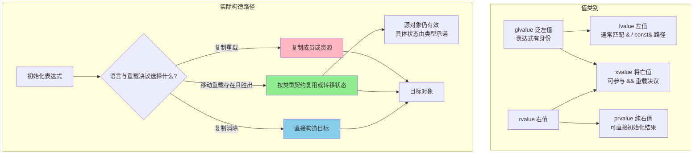
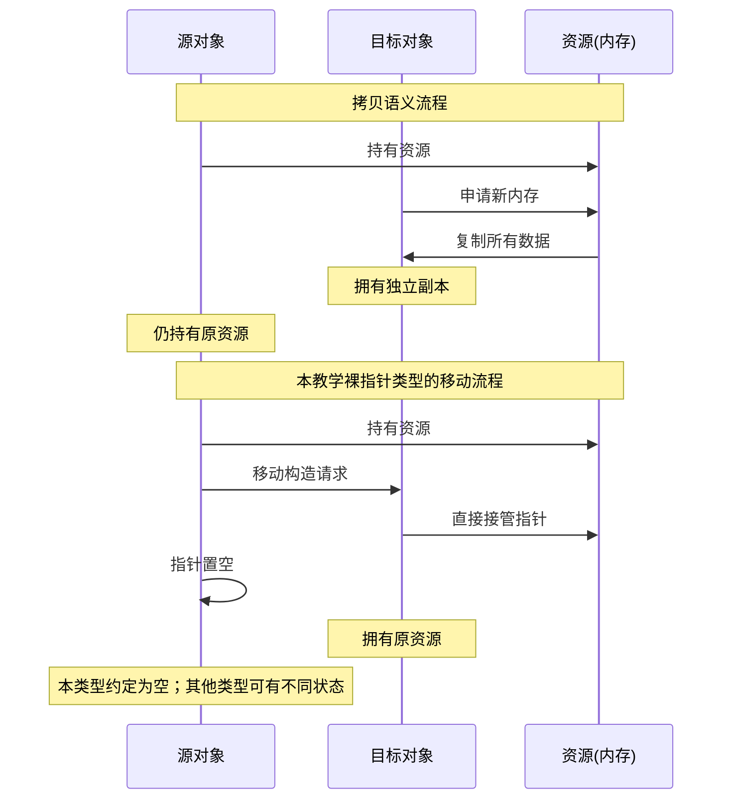
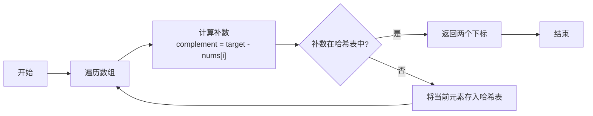
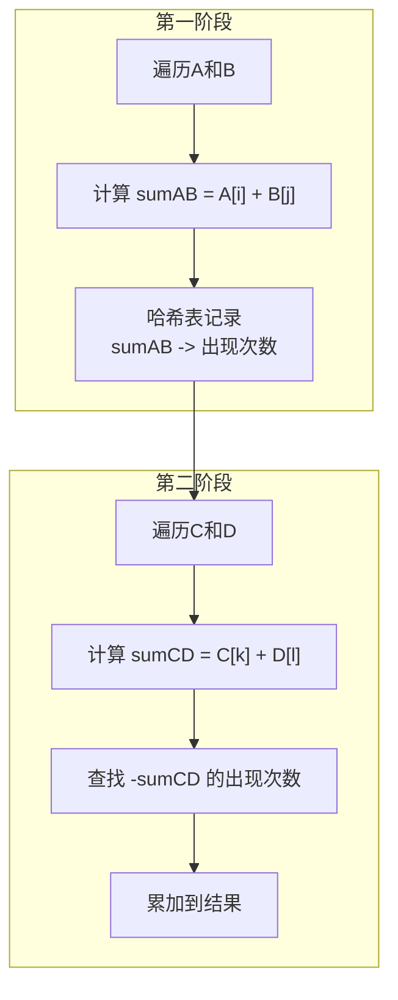

# Day 23: 移动语义 - 掌握现代C++性能优化的核心技术

> **学习定位**：承接 Day 22 的右值引用，本日从对象资源所有权解释移动构造和移动赋值。重点不是“到处加 `std::move`”，而是识别资源何时可被接管，以及移动后的对象只保证有效但状态未指定。

## 📅 学习目标

Day 22 已从表达式角度定义 [lvalue、xvalue 与 prvalue](../day_22/README.md#day22-value-categories)，本日不再另造一套“有名/无名”判断法。今天新增的问题是：类型如何在拷贝路径之外提供移动路径，目标对象、源对象和资源各自必须保持什么不变量，以及异常保证为什么会影响标准容器选择复制还是移动。学习结果不是“看到大对象就加 `std::move`”，而是能为类型选择 Rule of Zero、不可复制但可移动，或完整值语义策略，并用测试验证每条失败路径。

**本日学习要点：**
- 深入理解左值、右值、将亡值的概念及其分类体系
- 掌握移动语义的核心思想：允许类型按自身契约复用源对象状态，避免不必要的深拷贝
- 学会正确实现移动构造函数和移动赋值运算符
- 理解std::move和std::forward的工作原理与使用场景
- 区分通用引用（转发引用）与右值引用的关键差异
- 通过LeetCode题目实践算法思维与代码实现

---

## 📖 知识点一：移动语义

### 概念定义

**移动语义（Move Semantics）** 是C++11引入的一种资源管理机制，它允许目标对象复用源对象的资源，而不必总做深拷贝。源表达式可以是临时量，也可以是 `std::move(live_object)` 产生的 xvalue；因此“可按右值处理”不等于“对象马上死亡”。移动通常更便宜，但是否存在移动操作、是否真的选择移动，以及移动成本，都由类型和调用上下文决定。

移动语义涉及以下几个关键概念：
- **左值（lvalue）**：具有身份的表达式，通常可以取地址；变量名、解引用表达式是常见例子
- **右值（rvalue）**：纯右值与将亡值的总称；字面量、临时结果和 `std::move(x)` 分别展示了不同右值来源
- **将亡值（xvalue）**：具有身份、但资源允许被复用的表达式，例如 `std::move(x)` 的结果
- **右值引用（rvalue reference）**：非转发语境中的 `U&&`（如 `std::string&&`），可绑定纯右值或 xvalue

### 专业介绍

在 C++11 之前，用户自定义类型没有语言级移动构造与移动赋值；复制消除已经可能省掉函数返回中的副本，但一旦确实需要从一个仍存在的对象构造另一个对象，通常只能依赖复制接口。C++11 增加右值引用和移动特殊成员，让类型可以明确提供“源值允许被复用”时的另一条路径，同时保留复制消除优先直接构造目标的可能。

移动语义通过右值引用参与重载决议。固定类型的右值引用 `U&&` 可以绑定纯右值或 xvalue；但进入函数后，有名字的参数表达式仍是左值，所以需要继续传递“可按右值处理”的许可时通常要显式 `std::move(param)`。右值引用只表示调用者允许按右值路径处理，并不承诺对象何时销毁，也不强迫被调函数一定转移资源。

```cpp
// 传统拷贝语义：深拷贝，复制所有数据
String(const String& other) {
    data = new char[strlen(other.data) + 1];
    strcpy(data, other.data);  // 复制所有字符
}

// 这个教学类型的移动语义：转交独占指针
String(String&& other) noexcept {
    data = other.data;
    other.data = nullptr;      // 本类型选择空状态，防止重复释放
}
```

对直接拥有堆缓冲区的教学字符串，深拷贝要分配并复制字符，而移动可以只转交指针，常从 O(n) 降为 O(1)。这不是所有类型的普遍结论：小对象、`std::array` 或采用小字符串优化的字符串，移动仍可能复制内嵌数据；函数返回还可能由复制消除直接构造目标对象。

### 通俗解释

对直接拥有家具的“资源类”，可以把拷贝想成准备一套独立家具，把移动想成允许新住户复用原有家具。这个比喻只描述一种常见实现：有些类型没有移动操作，有些移动仍要逐个处理成员，源对象也只需满足类型承诺的有效状态，并不普遍要求“旧房子为空”。

在编程世界中，这种"搬家"随处可见：
- `vector.push_back(x)`：将元素添加到容器末尾
- `a = b + c`：表达式`b + c`产生的临时结果被赋给`a`
- `return obj`：函数返回局部对象

有了移动语义，重载决议可以为右值选择移动操作；但复制消除可能让复制和移动都不发生，`const` 源对象也常只能匹配复制操作。应观察真实的构造/赋值计数，而不是看到 `std::move` 就断言已经搬走资源。

对独占句柄类，还可以用**银行卡与现金**辅助理解，但仍要回到具体类型契约：
- 拷贝语义像是把钱印一份副本，你和我各持有一份相同的钱
- 该类型若用句柄转交实现移动，就像把银行卡交给新持有者；源对象仍须有效，是否为空以及还能做什么由类型说明

### Mermaid图示


```mermaid
flowchart TB
    subgraph 值类别
        A["glvalue 泛左值<br/>表达式有身份"] --> B["lvalue 左值<br/>通常匹配 & / const& 路径"]
        A --> C["xvalue 将亡值<br/>可参与 && 重载决议"]
        D["rvalue 右值"] --> C
        D --> E["prvalue 纯右值<br/>可直接初始化结果"]
    end

    subgraph 实际构造路径
        F["初始化表达式"] --> G{语言与重载决议选择什么?}
        G -->|复制重载| H["复制成员或资源"]
        G -->|移动重载存在且胜出| I["按类型契约复用或转移状态"]
        G -->|复制消除| J["直接构造目标"]
        I --> K["源对象仍有效<br/>具体状态由类型承诺"]
        H --> L["目标对象"]
        I --> L
        J --> L
    end

    style I fill:#90EE90
    style J fill:#87CEEB
    style H fill:#FFB6C1
```


```mermaid
sequenceDiagram
    participant S as 源对象
    participant T as 目标对象
    participant R as 资源(内存)
    
    Note over S,R: 拷贝语义流程
    S->>R: 持有资源
    T->>R: 申请新内存
    R->>T: 复制所有数据
    Note over T: 拥有独立副本
    Note over S: 仍持有原资源
    
    Note over S,R: 本教学裸指针类型的移动流程
    S->>R: 持有资源
    S->>T: 移动构造请求
    T->>R: 直接接管指针
    S->>S: 指针置空
    Note over T: 拥有原资源
    Note over S: 本类型约定为空；其他类型可有不同状态
```

### 代码示例

<a id="day23-rule-zero"></a>

### 先做默认选择：Rule of Zero

普通业务类型应优先把资源放进 `std::string`、`std::vector`、`std::unique_ptr` 等成员，让编译器组合出正确的析构、复制和移动操作。这就是 Rule of Zero：没有直接管理裸资源时，尽量不手写五个特殊成员。只有类直接拥有堆内存、文件句柄等资源，并且必须定义释放与复制策略时，才用下面的教学资源类解释 Rule of Five。下面代码块是完整、自包含的 C++17 程序，Day 23 的 CTest 会直接从 README 提取并严格编译运行它。

<a id="day23-special-members"></a>

### 特殊成员的选择、隐式生成与异常保证

手写一个特殊成员会影响其他成员是否隐式声明，所以“只补一个移动构造”通常不是局部优化，而是改变整个类型的值语义。常用决策如下：

| 类型责任 | 建议特殊成员策略 | 调用者看到的语义 |
|----------|----------------------|----------------------|
| 成员自己已管好资源 | Rule of Zero | 复制/移动能力由成员组合而成 |
| 独占资源，不允许复制 | 删除拷贝，显式默认或实现移动 | 对象可放入支持 move-only 元素的容器，不能复制 |
| 独占资源，需要值语义 | 完整审视析构、拷贝构造/赋值、移动构造/赋值 | 复制后两个对象独立，移动后两者仍满足各自不变量 |
| 多个对象共享资源 | 优先把共享策略放入成员类型 | 复制增加共享关系，必须额外说明可变状态和线程安全 |

隐式移动构造/赋值只在没有用户声明相关拷贝、移动和析构操作的条件下才会按规则声明；即使被声明，基类或成员不可移动时仍可被定义为删除。反过来，声明移动构造或移动赋值会使隐式拷贝操作被定义为删除。实务中不要靠背整张“抑制表”猜类型能力：用 `= default` / `= delete` 表达意图，用 `std::is_copy_constructible_v` 和 `std::is_nothrow_move_constructible_v` 锁定契约。

异常安全也是移动设计的一部分：

- 拷贝赋值先分配/构造替代资源，成功后再提交，可以在分配失败时保留旧值，提供强异常保证。
- 移动操作只在所有步骤确实不抛时才标记 `noexcept`；错误的 `noexcept` 不会“吞掉异常”，异常逃出时会调用 `std::terminate`。
- `std::vector` 等容器扩容时需要保护旧元素；对“移动可能抛、复制可用”的类型，实现可能选择复制以维持强保证。这就是正确 `noexcept` 承诺会影响容器路径的原因。

自移动赋值 `x = std::move(x)` 也应被当成边界用例。教学类可用 `if (this != &other)` 或先交换/提交的实现保持可析构、可重新赋值的状态；不能先释放资源再从同一已释放指针“接管”。这不要求自移动后保留原值，只要求类型契约明确且不触发重复释放等未定义行为。

**本节练习**：对一个 `std::vector<T>` 扩容实验，分别让 `T` 的移动构造为 `noexcept`、可能抛但可复制、可能抛且不可复制，在不假定具体移动次数的前提下预测容器能给出什么保证。再用 `static_assert` 检查资源类的复制/移动能力，并加入自拷贝、自移动、分配失败和 moved-from 后重新赋值四类用例。

```cpp
#include <cstddef>
#include <cstring>
#include <iostream>
#include <string>
#include <utility>
#include <vector>

// Rule of Zero：成员已经知道如何管理自己的资源
struct Record {
    std::string name;
    std::vector<int> samples;
};

// Rule of Five 教学示例：直接管理裸内存
class MyString {
private:
    char* data;
    std::size_t length;

public:
    // 默认构造函数
    MyString() : data(nullptr), length(0) {}
    
    // 普通构造函数
    explicit MyString(const char* str) {
        length = std::strlen(str);
        data = new char[length + 1];
        std::strcpy(data, str);
        // 特殊成员只负责资源状态；观察日志放在调用点。
        // 若这里的流在分配后抛异常，对象尚未构造完成，裸指针不会自动释放。
    }
    
    // 拷贝构造函数 - 深拷贝
    MyString(const MyString& other) {
        length = other.length;
        data = new char[length + 1];
        std::strcpy(data, other.c_str());  // 从 moved-from 空状态复制也安全
    }
    
    // 移动构造函数 - 本类型转交独占指针
    MyString(MyString&& other) noexcept {
        // 直接窃取资源
        data = other.data;
        length = other.length;
        
        // 本类型选择把源对象恢复为空串，防止重复释放；
        // 这是类型自己的契约，不是所有移动操作的统一要求。
        other.data = nullptr;
        other.length = 0;
        // noexcept 函数体不写流；若流启用异常，输出本身可能抛出。
    }
    
    // 拷贝赋值运算符
    MyString& operator=(const MyString& other) {
        if (this != &other) {
            // 先分配后提交：new 失败时，当前对象仍保留原值。
            char* replacement = new char[other.length + 1];
            std::strcpy(replacement, other.c_str());
            delete[] data;
            data = replacement;
            length = other.length;
            // 提交后不再执行可能抛出的观察日志，强异常保证覆盖整个赋值调用。
        }
        return *this;
    }
    
    // 移动赋值运算符
    MyString& operator=(MyString&& other) noexcept {
        if (this != &other) {
            delete[] data;
            
            // 窃取资源
            data = other.data;
            length = other.length;
            
            // 恢复本类型约定的空串状态
            other.data = nullptr;
            other.length = 0;
        }
        return *this;
    }
    
    ~MyString() {
        // 析构函数通常隐式 noexcept，同样不承担可能抛出的日志输出。
        delete[] data;
    }
    
    const char* c_str() const { return data ? data : ""; }
};

// 工厂函数，返回临时对象
MyString createString() {
    MyString temp("Hello Move Semantics!");
    return temp;  // 返回值优化(RVO)或移动语义
}

int main() {
    std::cout << "=== 移动语义演示 ===" << std::endl;

    Record record{"latency", {1, 2, 3}};
    std::cout << "Rule of Zero 记录: " << record.name
              << ", 样本数=" << record.samples.size() << std::endl;
    
    std::cout << "\n1. 创建对象:" << std::endl;
    MyString s1("Hello");
    
    std::cout << "\n2. 拷贝构造:" << std::endl;
    MyString s2 = s1;  // 调用拷贝构造
    std::cout << "s1: " << s1.c_str() << ", s2: " << s2.c_str() << std::endl;
    
    std::cout << "\n3. 移动构造:" << std::endl;
    MyString s3 = std::move(s1);  // 调用移动构造
    
    std::cout << "\n4. 使用临时对象(右值):" << std::endl;
    MyString s4 = MyString("Temporary");  // C++17同类型纯右值直接构造s4
    
    std::cout << "\n5. 函数返回值:" << std::endl;
    MyString s5 = createString();  // 可能RVO优化
    
    std::cout << "\n6. 移动赋值:" << std::endl;
    MyString s6;
    s6 = std::move(s2);  // 调用移动赋值
    
    std::cout << "\n=== 程序结束，开始析构 ===" << std::endl;
    return 0;
}
```

---

## 📖 知识点二：EMC++ Item 23-25

<a id="day23-move-forward"></a>

### Item 23: 理解 std::move 和 std::forward

**std::move** 和 **std::forward** 是C++11中两个最重要的类型转换工具，它们都定义在`<utility>`头文件中。虽然名字听起来像是"移动"操作，但实际上它们只是进行类型转换，真正的移动操作发生在移动构造函数或移动赋值运算符中。

**std::move 的本质：**
```cpp
template<typename T>
constexpr typename std::remove_reference<T>::type&& move(T&& t) noexcept {
    return static_cast<typename std::remove_reference<T>::type&&>(t);
}
```

std::move 本质上是一个无条件类型转换函数：返回类型通常形如 `T&&`，调用表达式的结果值类别是 xvalue。它的工作可以概括为：
1. 如果T是左值引用，则移除引用后添加&&，变成右值引用
2. 如果T是非引用类型，直接添加&&
3. 如果T已经是右值引用，保持不变

**std::forward 的本质：**
```cpp
template<typename T>
constexpr T&& forward(typename std::remove_reference<T>::type& t) noexcept {
    return static_cast<T&&>(t);
}
```

std::forward 是有条件的类型转换：当模板参数 `T` 记录了左值来源时，结果表达式仍是左值；否则结果是 xvalue。它通常与转发引用（forwarding reference）配合使用，用于实现完美转发——保持参数原有的值类别。

**关键区别：**
- std::move 是无条件转换，结果表达式是 xvalue，但不保证后续真的移动资源
- std::forward 是有条件转换：原始实参为左值时结果仍为左值，为右值时结果为 xvalue

**使用场景：**
- 当你准备允许后续操作把一个仍有名字的对象当作 xvalue，并接受其随后进入 moved-from 状态时，使用 `std::move`
- 当你需要完美转发参数，保持其原有值类别时，使用std::forward

```cpp
// std::move 示例
void processValue(int& x) { std::cout << "左值: " << x << std::endl; }
void processValue(int&& x) { std::cout << "右值: " << x << std::endl; }

int value = 42;
processValue(value);           // 输出: 左值: 42
processValue(std::move(value)); // 输出: 右值: 42

// std::forward 示例
template<typename T>
void wrapper(T&& arg) {
    processValue(std::forward<T>(arg));  // 完美转发
}

wrapper(value);            // T = int&，转发为左值
wrapper(42);               // T = int，转发为右值
```

### Item 24: 区分通用引用和右值引用

**通用引用（Universal Reference）** 是Scott Meyers提出的概念，在C++标准中称为**转发引用（Forwarding Reference）**。它是一种特殊的引用类型，能够同时接受左值和右值。

**识别转发引用的必要条件：**
1. 函数模板形参必须是未加 `const/volatile` 的模板参数 `T` 的精确 `T&&` 形式，并且这次调用正在推导这个 `T`
2. `auto&&` 从普通初始化表达式推导时有对应行为；大括号列表是专门例外，不能据此把任何带 `&&` 的声明都称为转发引用

```cpp
// 通用引用 - 可以绑定左值或右值
template<typename T>
void universalRef(T&& param);  // T&& 是通用引用

auto&& x = 42;                 // auto&& 是通用引用
auto&& y = getValue();         // auto&& 是通用引用

// 右值引用 - 只能绑定右值
void rvalueRef(int&& param);   // int&& 是右值引用（无类型推导）
template<typename T>
void foo(std::vector<T>&& values);  // T会推导，但整个形参不是模板参数T本身的T&&
```

**通用引用的工作原理：**
当通用引用接受左值时，T被推导为左值引用（如`int&`），根据引用折叠规则，`int& &&`折叠为`int&`。当接受右值时，T被推导为非引用类型（如`int`），最终类型为`int&&`。

```cpp
template<typename T>
void analyze(T&& param) {
    if constexpr (std::is_lvalue_reference_v<T>) {
        std::cout << "T 是左值引用类型" << std::endl;
    } else {
        std::cout << "T 是非引用类型" << std::endl;
    }
}

int x = 10;
analyze(x);      // T = int&，param 类型 = int&
analyze(10);     // T = int，param 类型 = int&&
```

**常见陷阱：**
```cpp
template<typename T>
class Widget {
public:
    // 这不是通用引用！因为T在类实例化时已确定，无类型推导
    void process(T&& param);  // 这是右值引用
};

// 正确的通用引用写法
template<typename T>
class Widget {
public:
    template<typename U>
    void process(U&& param);  // 这是通用引用
};
```

### Item 25: 对右值引用使用 std::move，对通用引用使用 std::forward

这个条款的核心是告诉我们在不同的引用类型上应该使用不同的转换策略，以确保既不丢失效率，又不会产生意外行为。

**对右值引用使用 std::move：**
当参数是右值引用时，调用者已经允许按右值路径处理；但这个右值也可能来自仍在作用域内的 `std::move(live_object)`，不一定是临时量。由于命名参数 `newName` 作为表达式是左值，内部要用 `std::move(newName)` 才能把许可继续传给成员赋值，成员类型再依据自身契约决定如何移动。

```cpp
class String {
public:
    // 右值引用参数 - 使用 std::move
    void setName(std::string&& newName) {
        name = std::move(newName);  // 正确：newName是右值引用
    }
private:
    std::string name;
};
```

**对通用引用使用 std::forward：**
编写模板时，同一形参会在不同实例化中绑定左值或右值；只有需要继续交给另一个重载集时，才用 `std::forward<T>` 恢复调用点值类别。若函数只读取参数或有意统一按左值处理，就不需要机械地转发。

```cpp
template<typename T>
void setName(T&& newName) {
    name = std::forward<T>(newName);  // 正确：保持原有值类别
}
```

**为什么不能混用：**

1. 在通用引用上使用 `std::move` 会把实参无条件交给 xvalue/右值路径，可能触发意外移动：
```cpp
template<typename T>
void badExample(T&& param) {
    someFunction(std::move(param));  // 错误：左值也进入右值路径；目标决定是否真的移动
}

std::string s = "Hello";
badExample(s);  // 若目标右值重载转移资源，s 的状态可能改变
```

2. 在右值引用上使用std::forward虽然不会出错，但语义不清晰：
```cpp
void process(std::string&& s) {
    store(std::forward<std::string>(s));  // 可以工作，但std::move更清晰
}
```

**综合示例：**
```cpp
class Person {
public:
    // 通用引用版本 - 完美转发
    template<typename T>
    void setName(T&& newName) {
        name = std::forward<T>(newName);
    }
    
    // 右值引用版本 - 移动
    void setAddress(std::string&& newAddress) {
        address = std::move(newAddress);
    }
    
private:
    std::string name;
    std::string address;
};
```

**返回引用的生命周期边界：** `std::forward` 只恢复值类别，不延长对象寿命。从右值限定成员返回成员的 `T&&`，或把转发引用形参原样返回，都只是借用；若所有者或实参是临时量，`auto&& result = callReturningReference(...)` 不会把临时量寿命传播过函数返回边界，初始化完整表达式结束后 `result` 就可能悬空。调用者需要拥有结果时，应按值返回，例如右值限定成员写成 `std::string takeName() && { return std::move(name_); }`，转发参数则构造 `std::decay_t<T>` 结果；只有 API 明确借用且调用者能证明所有者更长寿时才返回引用。

仓库把两个故意悬空的反例隔离在 `code/tests/lifetime_boundary_asan_demo.cpp`，默认构建和 CTest 都不会执行未定义行为。要复现实例而不污染正常测试，可使用独立目录启用 ASan；下面两个运行都应由 ASan 报告错误并以非零退出，分别覆盖“临时所有者的成员引用”和“转发临时参数的引用返回”。本轮按下列 `RelWithDebInfo` 命令得到 `stack-use-after-scope`；若优化级别或字符串表示改变，访问也可能落到已释放的堆缓冲并显示为 `heap-use-after-free`。诊断名称可以变化，稳定契约是两条路径都存在生命周期错误、ASan 必须拦截且默认测试绝不能执行它们：

```bash
cmake -S . -B build_lifetime_asan -DCMAKE_BUILD_TYPE=RelWithDebInfo \
  -DBUILD_UNSAFE_LIFETIME_DEMO=ON -DENABLE_ASAN=ON
cmake --build build_lifetime_asan --target day23_lifetime_boundary_asan_demo
./build_lifetime_asan/day23_lifetime_boundary_asan_demo member
./build_lifetime_asan/day23_lifetime_boundary_asan_demo forward
```

---

## 🎯 LeetCode 刷题

### 讲解题：LC 1 两数之和

**题目描述：**
给定一个整数数组 `nums` 和一个整数目标值 `target`，请你在该数组中找出和为目标值 `target` 的那两个整数，并返回它们的数组下标。你可以假设每种输入只会对应一个答案，并且同一个元素在答案里不能重复出现。你可以按任意顺序返回答案。

**形象化提示：**
想象你是一个超市收银员，顾客给你一张购物清单和一个目标金额，你需要找出哪两件商品的价格之和正好等于目标金额。你不能让顾客买同一件商品两次，但商品可能有多件（不同位置的相同数字）。最直观的方法是：拿起第一件商品，然后找有没有其他商品的价格正好是"目标金额减去当前商品价格"。

这就像在玩配对游戏：你有一堆卡片，每张卡片上有一个数字。你的任务是找出两张卡片，它们的数字加起来等于目标数字。关键技巧是：一旦你拿起一张卡片，就知道另一张卡片上应该是什么数字。

**相关理论介绍：**
本题涉及的核心算法思想是**哈希表查找**。在哈希分布正常的平均情况下，每次查找可按 O(1) 分析，因此整体期望时间为 O(n)、空间为 O(n)；严重冲突时单次查找仍可退化为 O(n)。与暴力法的 O(n²) 相比，这是以额外空间换取平均性能的选择，不是无条件的最坏常数时间保证。

**算法思路：**
1. 遍历数组，对于每个元素 `nums[i]`
2. 先用更宽的整数计算需要的补数 `complement = target - nums[i]`
3. 在哈希表中查找 `complement` 是否存在
4. 如果存在，返回两个下标；如果不存在，将当前元素加入哈希表

这里不能让两个任意 `int` 直接相减：若输入不只来自 LeetCode 的受限数据，`target - nums[i]` 可能发生有符号溢出。仓库真实实现先提升到 `long long`，仅当补数仍落在 `int` 范围内时才查询以 `int` 为键的哈希表；返回下标沿用题目 `int` 接口并显式检查容器下标可表示性。


```mermaid
flowchart LR
    A[开始] --> B[遍历数组]
    B --> C["计算补数<br/>complement = target - nums[i]"]
    C --> D{补数在哈希表中?}
    D -->|是| E[返回两个下标]
    D -->|否| F[将当前元素存入哈希表]
    F --> B
    E --> G[结束]
```

**代码实现（核心片段，与真实实现采用相同整数边界）：**
```cpp
class Solution {
public:
    vector<int> twoSum(const vector<int>& nums, int target) {
        // 哈希表：存储{数值: 下标}
        unordered_map<int, size_t> numToIndex;
        
        for (size_t i = 0; i < nums.size(); ++i) {
            const long long complement =
                static_cast<long long>(target) - nums[i];
            
            if (complement >= numeric_limits<int>::min() &&
                complement <= numeric_limits<int>::max()) {
                auto it = numToIndex.find(static_cast<int>(complement));
                if (it != numToIndex.end()) {
                    return {static_cast<int>(it->second), static_cast<int>(i)};
                }
            }
            
            // 存入哈希表
            numToIndex[nums[i]] = i;
        }
        
        return {};  // 无解（题目保证有解）
    }
};
```

**复杂度分析：**
- 时间复杂度：哈希操作平均 O(1) 时为期望 O(n)，严重冲突时最坏可退化
- 空间复杂度：O(n)，最坏情况需要存储n个元素

---

### 实战题：LC 454 四数相加 II

**题目描述：**
给定四个包含整数的数组列表 `A, B, C, D`，计算有多少个元组 `(i, j, k, l)`，使得 `A[i] + B[j] + C[k] + D[l] = 0`。为了使问题简单化，所有的 A, B, C, D 具有相同的长度 N，且 0 ≤ N ≤ 500。

**形象化提示：**
想象你有四副扑克牌（A、B、C、D），每副牌都只有数字。你的任务是从每副牌中各抽出一张，让这四张牌的数字之和等于零。直接尝试所有组合太慢了（如果有500张牌，就有500⁴ ≈ 625亿种组合！）。

聪明的方法是"分而治之"：先把A和B的所有组合算出来，记录每种和出现了多少次；然后计算C和D的组合，对于每个C+D的和，去找有没有A+B的和等于它的相反数。这就把O(n⁴)的问题变成了O(n²)的问题！

**相关理论介绍：**
本题的核心思想是**分组哈希**。通过将四个数组分成两组，先计算每组的所有可能和，然后利用哈希表快速查找匹配。这种"空间换时间"的策略在处理多维度组合问题时非常有效。此外，本题还体现了**对称性思维**：如果 A+B+C+D=0，那么 A+B = -(C+D)，这种对称关系让我们能够将问题规模减半。

**算法思路：**
1. 遍历数组A和B的所有组合，用哈希表记录每种和出现的次数
2. 遍历数组C和D的所有组合，计算 sumCD = C[k] + D[l]
3. 在哈希表中查找 -sumCD 出现的次数，累加到结果中


```mermaid
flowchart TB
    subgraph 第一阶段
        A1[遍历A和B] --> B1["计算 sumAB = A[i] + B[j]"]
        B1 --> C1["哈希表记录<br/>sumAB -> 出现次数"]
    end
    
    subgraph 第二阶段
        A2[遍历C和D] --> B2["计算 sumCD = C[k] + D[l]"]
        B2 --> C2[查找 -sumCD 的出现次数]
        C2 --> D2[累加到结果]
    end
    
    C1 --> A2
```

**代码实现（核心片段）：**
```cpp
class Solution {
public:
    int fourSumCount(vector<int>& A, vector<int>& B, 
                     vector<int>& C, vector<int>& D) {
        // 哈希表：存储A+B的所有可能和及其出现次数
        unordered_map<long long, int> sumAB;
        
        // 第一阶段：计算A+B的所有组合
        for (int a : A) {
            for (int b : B) {
                const long long pairSum = static_cast<long long>(a) + b;
                sumAB[pairSum]++;
            }
        }
        
        int count = 0;
        
        // 第二阶段：计算C+D的所有组合，查找匹配
        for (int c : C) {
            for (int d : D) {
                const long long sumCD = static_cast<long long>(c) + d;
                // 查找是否存在A+B = -(C+D)
                auto it = sumAB.find(-sumCD);
                if (it != sumAB.end()) {
                    count += it->second;  // 累加所有匹配的组合数
                }
            }
        }
        
        return count;
    }
};
```

两数和与取相反数都在 `long long` 中完成，避免 `int` 边界溢出；返回计数保留 LeetCode 的 `int` 接口，并依赖原题“答案可由 32 位有符号整数表示”的前提。

**复杂度分析：**
- 时间复杂度：哈希操作平均 O(1) 时为期望 O(n²)，严重冲突时最坏界更高
- 空间复杂度：O(n²)，哈希表最多存储n²个不同的和

这里的 O(n²) 包含两个同阶阶段，不等于只做一次 n²：当 `n = 100` 时，A+B 枚举 10,000 个数对，C+D 再枚举 10,000 个数对，合计约 20,000 次数对枚举；暴力四重循环枚举 100,000,000 个四元组，因此只按循环枚举数量比较约为 5,000 倍，而不是 10,000 倍。大 O 会忽略常数 2，但面向具体输入估算工作量时不能把第二阶段漏掉，真实耗时还会受哈希、分配与缓存影响。

---

## 🚀 运行代码

### 环境要求
- 支持 C++17 与 `std::string_view` 的编译器；本日 CMake 强制 C++17（例如 GCC 7+ / Clang 5+ / MSVC 2017 15.3+）
- CMake 3.14 或更高版本；本日使用 `add_link_options` 配置 Sanitizer 链接参数

### 编译运行

```bash
# 进入 day_23 目录
cd week_04/day_23

# 编译并运行
./build_and_run.sh
```

### 手动编译

```bash
# 创建构建目录
mkdir -p build && cd build

# 配置项目
cmake ..

# 编译
make -j$(nproc)

# 运行
./day_23_main

# 自动化/CI：不进入交互菜单，直接运行全部演示
./day_23_main --all
```

无参数启动保留给学习者的交互菜单；自动化测试必须使用 `--all`，不把 TTY 是否连接当作测试前提。交互模式按整行解析选项：EOF 会正常退出，空行、非整数或带多余字符的输入会报错并重新显示菜单，不会使用未初始化选项。

### 预期输出

程序运行后，你将看到以下内容：
1. **移动语义演示**：展示移动构造与拷贝构造的区别
2. **移动赋值演示**：展示移动赋值运算符的工作过程
3. **std::move 示例**：展示 std::move 的类型转换效果
4. **通用引用演示**：展示通用引用如何处理左值和右值
5. **完美转发示例**：展示 std::forward 的正确使用
6. **LeetCode 题解**：两数之和和四数相加 II 的解答结果

---

## 📚 相关术语

| 术语 | 英文 | 解释 |
|------|------|------|
| 左值 | lvalue | 具有身份、通常可取地址的表达式，变量名是常见例子 |
| 右值 | rvalue | 纯右值与将亡值的总称，不等同于“马上销毁的对象” |
| 将亡值 | xvalue | 具有身份、资源允许被复用的表达式，如 `std::move(x)` 的结果 |
| 右值引用 | rvalue reference | 非转发语境中的 `U&&`（如 `std::string&&`），可绑定 prvalue 或 xvalue；命名后的变量表达式仍是左值 |
| 转发引用 | forwarding reference | 函数模板中被推导且未加 cv 限定的模板参数 `T` 之精确 `T&&` 形参，可记录左值或右值来源 |
| 移动语义 | move semantics | 允许类型在右值路径中按契约复用或转移状态，是否更便宜取决于类型 |
| 完美转发 | perfect forwarding | 保持参数原有值类别的转发方式 |
| 引用折叠 | reference collapsing | 多重引用的简化规则 |
| std::move | - | 把表达式转换为 xvalue 的类型转换工具 |
| std::forward | - | 有条件转换类型的完美转发工具 |
| 移动构造函数 | move constructor | 接受右值引用参数的构造函数 |
| 移动赋值运算符 | move assignment operator | 接受右值引用参数的赋值运算符 |
| noexcept | - | 异常说明符，表示函数不会抛出异常 |
| 哈希表 | hash table | 键值对存储结构，常见契约为平均 O(1) 查找、最坏 O(n) |

---

## 💡 学习提示

### 移动语义的实践建议

1. **理解移动许可与类型实现**：右值路径表示源值可以被复用，但真正执行指针转交、逐成员移动还是复制，由被调用类型的操作决定；钥匙转交只适合解释独占资源类。

2. **注意移动后的对象状态**：标准库对象移动后通常处于“有效但状态未指定”的状态，可以安全析构、重新赋值，也可以调用前置条件仍满足的操作；不要依赖它为空或保留旧值。

3. **正确实现移动操作**：
   - 只有确实不会抛异常时才把移动构造和移动赋值标记为 `noexcept`
   - 移动后必须维持类型不变量；把裸指针置空只是资源类常用实现
   - 如果自定义了移动操作，通常也需要自定义析构函数

4. **不要过度使用 std::move**：如果函数返回局部对象，直接返回即可，编译器会进行返回值优化（RVO）。过度使用 std::move 可能反而阻碍优化。

5. **区分移动语义和拷贝语义**：需要保留源值时走复制语义；允许源对象进入类型规定的 moved-from 状态时，才把它交给右值路径。

### LeetCode 刷题建议

1. **两数之和**：这是哈希表应用的经典入门题。掌握这个技巧后，可以尝试三数之和、四数之和等变种。

2. **四数相加 II**：这道题的关键在于"分组"思想。将四个数组分成两组，分别计算后匹配，是一种重要的算法设计模式。

3. **举一反三**：理解了"空间换时间"的思想后，可以应用到更多问题中，如两数之和 III、三数之和等。

### 今日工程动作：给资源类写可执行契约

先画出 `MyString/Buffer` 的所有权表，再把“复制得到独立资源、移动目标保留值、moved-from 对象可析构和重新赋值、复制赋值失败不破坏旧值、移动操作是否 `noexcept`”写成测试。资源特殊成员不写教学日志：构造函数在裸资源分配后若因流异常退出，对象尚未构造完成，裸指针不会自动释放；复制赋值在提交后才因日志抛出，则调用方会收到失败却看到对象已改变。课程把日志移到调用点，并在会抛异常的输出缓冲下真实运行构造、复制、赋值和移动，证明资源契约不依赖观察流。运行构造/移动计数实验时，分别比较左值 `push_back`、临时量 `push_back`、`std::move` 和 `emplace_back`，并记录复制消除可能让预期的移动次数为零。项目组织上把演示源文件放进库 target，把 `main` 和契约测试做成两个独立可执行 target，再交给 CTest 统一运行。

### 恰好五句复盘

1. 我会先选择 Rule of Zero，只有直接管理资源时才系统实现 Rule of Five。
2. 我知道 `std::move` 产生 xvalue，但它既不搬资源，也不保证对象马上销毁。
3. 我能用先分配后提交保护复制赋值的强异常保证。
4. 我会把 moved-from 状态写成类型契约，并区分自定义空状态与标准库的状态未指定。
5. 我能用复制和移动计数加真实失败返回值验证设计，而不是只观察日志猜测行为。

---

## 🔗 参考资料

1. **书籍**
   - 《Effective Modern C++》- Scott Meyers，Item 23-25
   - 《C++ Primer 第5版》- 第13章 拷贝控制
   - 《C++ Concurrency in Action》- Anthony Williams

2. **在线资源**
   - [cppreference - 移动语义](https://en.cppreference.com/w/cpp/language/move_constructor)
   - [cppreference - std::move](https://en.cppreference.com/w/cpp/utility/move)
   - [cppreference - std::forward](https://en.cppreference.com/w/cpp/utility/forward)
   - [cppreference - 复制赋值](https://en.cppreference.com/w/cpp/language/copy_assignment)
   - [cppreference - 移动赋值](https://en.cppreference.com/w/cpp/language/move_assignment)
   - [C++ Core Guidelines C.20/C.21 - Rule of Zero/Five](https://isocpp.github.io/CppCoreGuidelines/CppCoreGuidelines#c20-if-you-can-avoid-defining-default-operations-do)
   - [C++ Core Guidelines C.65/C.66 - 自移动与 noexcept](https://isocpp.github.io/CppCoreGuidelines/CppCoreGuidelines#c65-make-move-assignment-safe-for-self-assignment)

3. **视频教程**
   - CppCon: "Move Semantics Explained" - Howard Hinnant
   - CppCon: "Understanding C++ Moves" - Scott Meyers

4. **LeetCode 相关**
   - [LC 1 官方题解](https://leetcode.com/problems/two-sum/solution/)
   - [LC 454 官方题解](https://leetcode.com/problems/4sum-ii/solution/)
