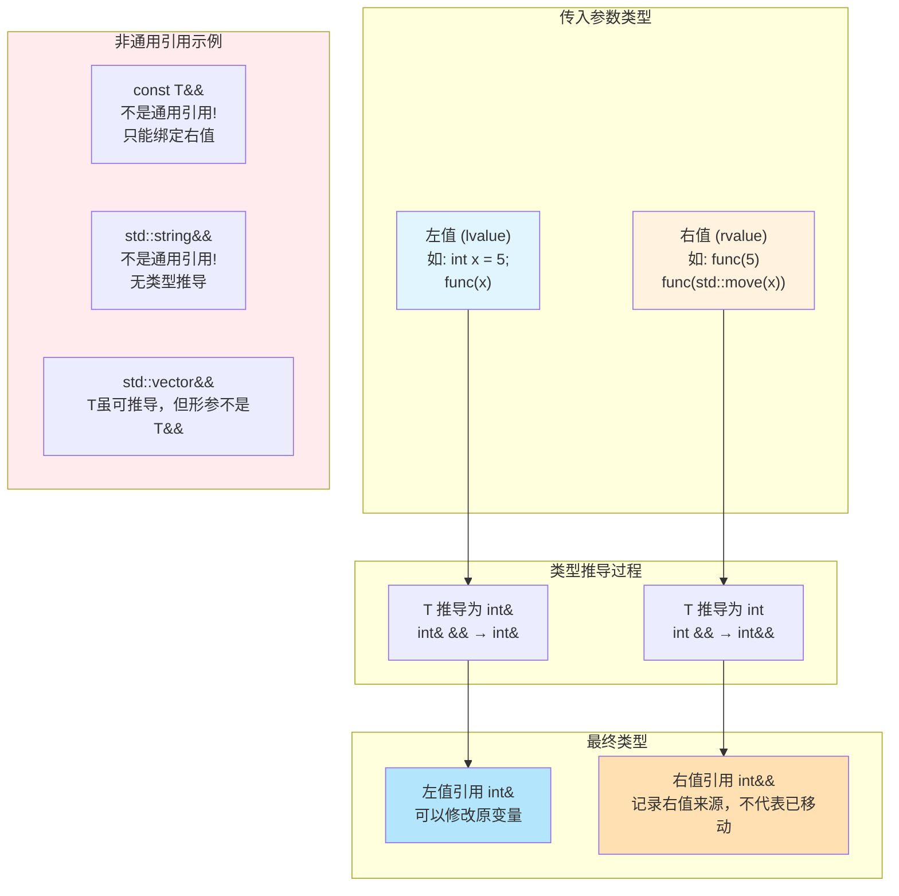
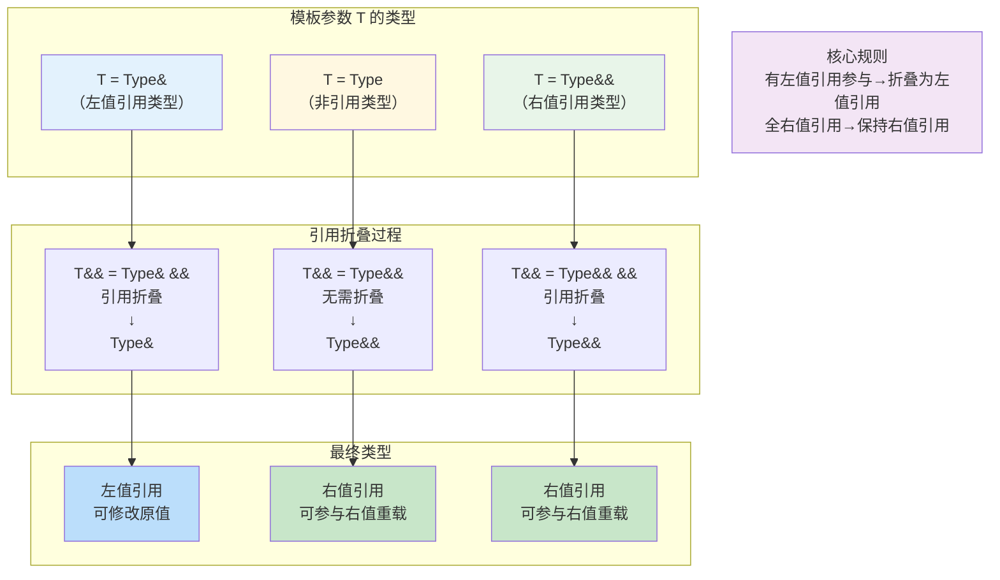
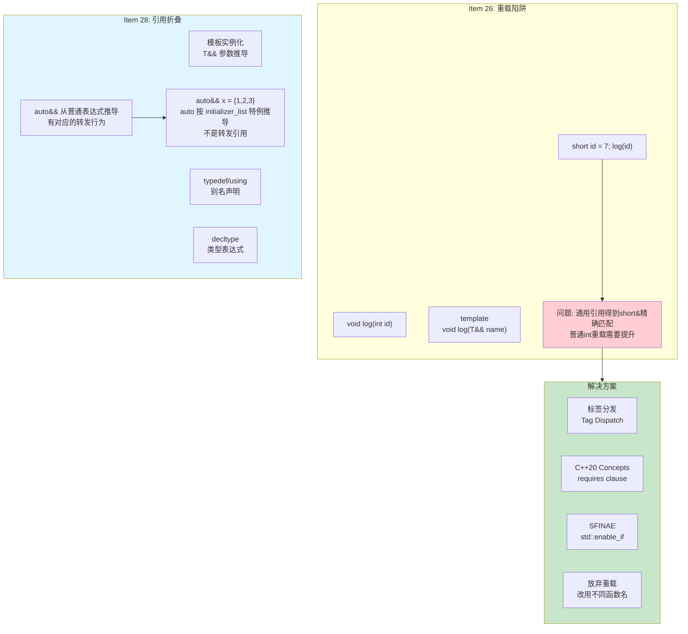
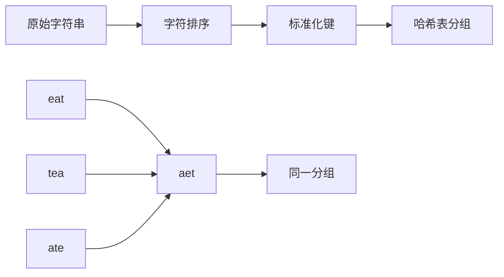
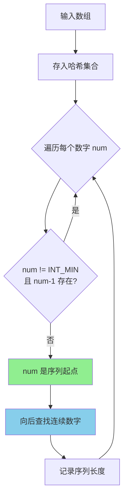

# Day 24: 通用引用 (Universal Reference)

> **学习定位**：Day 23 讨论固定类型的右值引用，本日进入发生类型推导时的转发引用。函数模板中要同时确认“这次调用正在推导 `T`、形参是未加 cv 的精确 `T&&`”，`auto&&` 还要记住直接列表初始化例外；不要只凭看到 `&&` 就下结论。

> 📅 **学习进度**: 第 24 天 | 🎯 **难度**: ⭐⭐⭐⭐ | ⏱️ **预计时间**: 3-4小时

---

## 📅 学习目标

今天我们将深入学习 C++11 引入的核心概念——通用引用（Universal Reference），这是现代 C++ 模板编程和完美转发的基石。通过今天的学习，你将：

1. **理解通用引用的本质**：掌握 `T&&` 的两种不同含义，区分右值引用和通用引用
2. **掌握引用折叠规则**：理解模板实例化过程中引用类型的推导机制
3. **学会避免常见陷阱**：了解为什么不应该在通用引用上进行重载
4. **实践完美转发**：使用 `std::forward` 实现参数的完美传递
5. **刷题巩固基础**：通过 LeetCode 49 和 128 题练习哈希表与集合的应用

通用引用是 Scott Meyers 在《Effective Modern C++》中提出的术语，也被称为转发引用（Forwarding Reference）。它是 C++ 模板元编程的重要工具，掌握它对于理解现代 C++ 的移动语义和完美转发至关重要。今天的学习将为后续理解智能指针、并发编程等高级主题打下坚实基础。

**本日差异**：[Day 22](../day_22/README.md#day22-value-categories) 已定义表达式值类别，[Day 23](../day_23/README.md#day23-rule-zero) 已讲移动特殊成员与 moved-from 契约。本日只回答三个新问题：什么形式的 `T&&` 会记录实参值类别，`T` 和最终形参类型如何分别推导，以及转发引用为什么容易劫持其他重载。

---

<a id="day24-forwarding-reference"></a>

## 📖 知识点一：通用引用 (Universal Reference)

### 🎯 概念定义

**通用引用（Universal Reference，标准术语为 forwarding reference）** 不是“看到 `&&` 就成立”的新引用种类，而是特定推导上下文中的右值引用声明。函数模板形参成为转发引用必须满足两个条件：

1. **类型推导必须发生**：本次函数调用正在推导未加 cv 限定的模板参数 `T`
2. **必须是精确的 `T&&` 形式**：形参不能是 `const T&&`、`std::vector<T>&&` 等复合形式

### 📚 专业介绍

在 C++ 类型系统中，`T&&` 的含义取决于上下文。当函数模板形参正好是被推导、未加 cv 限定的模板参数 `T` 的 `T&&` 时，它是转发引用。`auto&&` 从普通表达式推导时有对应规则，但直接列表初始化是例外。转发引用依赖引用折叠记录调用点值类别，为后续 `std::forward` 提供信息。

```cpp
template<typename T>
void func(T&& arg);  // T&& 是通用引用，因为 T 的类型会被推导
```

当传入左值时，编译器会将 `T` 推导为 `T&`（左值引用），通过引用折叠最终得到 `T& && → T&`。当传入右值时，`T` 被推导为 `T`（非引用类型），最终得到 `T&&`。这种机制使得同一个函数模板能够同时处理左值和右值，为完美转发提供了基础。

分析时必须把四个层次分开，否则很容易把“形参声明类型含 `&&`”误写成“形参名是右值表达式”：

| 调用 | `T` 的推导结果 | 折叠后形参类型 | 函数体中 `arg` 的值类别 | `std::forward<T>(arg)` |
|------|-----------------|--------------------|--------------------------|-------------------------|
| `int n; f(n)` | `int&` | `int&` | lvalue | lvalue |
| `const int n; f(n)` | `const int&` | `const int&` | lvalue | const lvalue |
| `f(42)` | `int` | `int&&` | lvalue | xvalue |
| `f(std::move(n))` | `int` | `int&&` | lvalue | xvalue |

有名形参 `arg` 作为表达式始终是 lvalue，这只是“变量名表达式的分类”，不是 lvalue 的完整定义。转发引用把调用点信息保存在 `T` 中，`std::forward<T>` 只在转交给下一个重载集时恢复这个信息；它不自动延长寿命、不创建副本、也不承诺下游一定移动。

`decltype` 是泛型 Lambda 中转发的关键，但它有一条容易混淆的分支：对未加括号的名字 `decltype(arg)`，结果是该实体的声明类型；对一般表达式 `decltype((arg))`，结果按值类别映射：lvalue 得 `U&`，xvalue 得 `U&&`，prvalue 得 `U`。在 `[](auto&& x) { target(std::forward<decltype(x)>(x)); }` 中，需要的恰好是形参 `x` 的声明类型，所以写 `decltype(x)`，不写 `decltype((x))`。

**本节练习**：为 `int&`、`const int&`、`int&&`、字符串字面量与 `std::vector<int>` 临时量各填一行“`T` / 形参类型 / `arg` 表达式值类别 / 转发后值类别”表。再对比 `template<class T> void f(T&&)`、`template<class T> void f(const T&&)`、`template<class T> void f(std::vector<T>&&)` 和类模板成员 `void f(T&&)`，逐个写明为什么只有第一种在相应调用中是转发引用。

### 💡 通俗解释

想象你是一个快递员，面前有两种交付表达式；这个比喻只帮助理解绑定规则，值类别仍是表达式属性：
- **左值包裹**：表达式指认一个已有对象，之后仍可通过它访问该对象
- **右值包裹**：表达式给出新值，或像 `std::move(x)` 那样把已有对象标记为资源可复用；右值不等于“无地址、马上消失”

普通右值引用 `SomeType&&` 就像只接受“可按右值处理”标签的交付窗口。转发引用 `T&&` 更像记录标签的快递单：左值调用记录左值来源，右值调用记录右值来源；它只建立绑定并保存分类信息，不会自动复制、移动或接管所有权。只有包装器随后把 `std::forward<T>(item)` 交给具体目标重载，目标类型才决定是否消费或转移资源。

**核心规则**：
```cpp
// 这是转发引用；能否接受某个实参还受函数体和后续目标接口约束
template<typename T>
void smartForward(T&& item);  // 智能快递员

// 这是右值引用 - 接收纯右值或 xvalue，不接收左值表达式
void takeRightRef(std::string&& temp);
```

### 📊 Mermaid 图示



### 💻 代码示例

```cpp
// ==================== 通用引用示例 ====================
#include <iostream>
#include <string>
#include <utility>
#include <type_traits>

// 通用引用：T&& 配合类型推导
template<typename T>
void universalRefDemo(T&& arg) {
    // 判断 arg 的实际类型
    if constexpr (std::is_lvalue_reference_v<T>) {
        std::cout << "左值引用版本: " << arg << std::endl;
    } else {
        std::cout << "右值引用版本: " << arg << std::endl;
    }
    
    // 使用 std::forward 保持原有值类别
    // process(std::forward<T>(arg));
}

// 非通用引用：类型固定，不是模板推导
void notUniversalRef(std::string&& arg) {
    std::cout << "只能接收右值: " << arg << std::endl;
}

// 非通用引用：有 const 修饰
template<typename T>
void alsoNotUniversal(const T&& arg) {
    std::cout << "const T&& 不是通用引用: " << arg << std::endl;
}

int main() {
    std::string leftVal = "Hello";
    
    std::cout << "=== 通用引用演示 ===" << std::endl;
    
    // 传入左值 → T 推导为 std::string&
    universalRefDemo(leftVal);  
    
    // 传入 std::string 纯右值 → T 推导为 std::string
    universalRefDemo(std::string("World"));

    // 字符串字面量表达式是 const char 数组左值，不是 std::string 右值
    universalRefDemo("Literal");
    
    // 传入 std::move 的结果 → 右值
    universalRefDemo(std::move(leftVal));
    
    std::cout << "\n=== 非通用引用对比 ===" << std::endl;
    
    // notUniversalRef(leftVal);  // 编译错误！只能接收右值
    notUniversalRef("Right Value");  // OK
    
    // alsoNotUniversal(leftVal);  // 编译错误！const T&& 不是通用引用
    alsoNotUniversal(42);  // OK，可以接收右值
    
    return 0;
}
```

**输出结果**：
```
=== 通用引用演示 ===
左值引用版本: Hello
右值引用版本: World
左值引用版本: Literal
右值引用版本: Hello

=== 非通用引用对比 ===
只能接收右值: Right Value
const T&& 不是通用引用: 42
```

---

## 📖 知识点二：引用折叠 (Reference Collapsing)

### 🎯 规则详解

**引用折叠（Reference Collapsing）** 是 C++ 编译器在处理引用的引用时所遵循的规则。由于 C++ 不允许直接定义"引用的引用"（如 `int& &`），编译器通过折叠规则将其转换为有效的类型。

**四大规则**（记住：只要组合中出现左值引用，结果就是左值引用；只有两个都是右值引用时，结果才是右值引用）：

| 组合 | 折叠结果 | 记忆口诀 |
|------|----------|----------|
| `T& &` | `T&` | 左 + 左 → 左 |
| `T& &&` | `T&` | 左 + 右 → 左 |
| `T&& &` | `T&` | 右 + 左 → 左 |
| `T&& &&` | `T&&` | 右 + 右 → 右 |

### 📚 专业介绍

引用折叠主要发生在以下四种上下文中：

1. **模板实例化**：当模板参数 `T` 是引用类型时，`T&&` 会触发引用折叠
2. **auto 类型推导**：`auto&&` 从普通表达式推导时按同样规则记录值类别；直接用大括号列表初始化是专门例外，不能把每个 `auto&&` 机械称为转发引用
3. **typedef 和 alias 声明**：使用 `using` 或 `typedef` 时可能产生引用的引用
4. **decltype 使用**：在 `decltype` 表达式中也可能出现引用折叠

引用折叠的设计初衷是为了支持**完美转发**。通过这套规则，我们可以确保：
- 传入左值时，最终得到左值引用
- 传入右值时，最终得到右值引用
- 保持原始值类别不被丢失

### 💡 通俗解释

想象你在玩俄罗斯套娃游戏，每个"引用"就是一层套娃。规则很简单：

- **左值引用是"强力胶"**：只要有一层是左值引用（`&`），最终结果就会被"粘"成左值引用
- **右值引用是"透明纸"**：只有全部都是右值引用（`&&`），才能保持透明

```
胶水规则：
  胶水 + 透明 = 胶水（左值引用"传染"）
  透明 + 胶水 = 胶水
  胶水 + 胶水 = 胶水
  透明 + 透明 = 透明（只有这个例外）
```

**实际应用**：
```cpp
template<typename T>
void wrapper(T&& arg) {
    // 当 arg 是左值时：T = int&, T&& = int& && → int&
    // 当 arg 是右值时：T = int,  T&& = int&&
}
```

### 📊 Mermaid 图示



### 💻 代码示例

```cpp
// ==================== 引用折叠示例 ====================
#include <iostream>
#include <type_traits>
#include <string>

// 辅助函数：打印类型信息
template<typename T>
void printType(const std::string& name) {
    std::cout << name << ":\n";
    std::cout << "  is_lvalue_reference: " << std::is_lvalue_reference_v<T> << "\n";
    std::cout << "  is_rvalue_reference: " << std::is_rvalue_reference_v<T> << "\n";
    std::cout << "  is_reference: " << std::is_reference_v<T> << "\n\n";
}

// 演示引用折叠的模板函数
template<typename T>
void demonstrateFolding(T&& arg) {
    using ParamType = T&&;  // 这里的 T&& 会发生引用折叠
    
    std::cout << "=== 引用折叠演示，参数值=" << arg << " ===\n";
    
    // 打印 T 的类型
    printType<T>("模板参数 T");
    
    // 打印 T&& 的类型
    printType<ParamType>("参数类型 T&&");
}

// 使用 using 别名演示引用折叠
void aliasCollapseDemo() {
    std::cout << "\n=== using 别名中的引用折叠 ===\n";
    
    using IntRef = int&;
    using IntRRef = int&&;
    
    // 这些都会发生引用折叠
    using Type1 = IntRef&;     // int& & → int&
    using Type2 = IntRef&&;    // int& && → int&
    using Type3 = IntRRef&;    // int&& & → int&
    using Type4 = IntRRef&&;   // int&& && → int&&
    
    printType<Type1>("IntRef&");
    printType<Type2>("IntRef&&");
    printType<Type3>("IntRRef&");
    printType<Type4>("IntRRef&&");
}

int main() {
    int x = 42;
    int& lr = x;
    
    std::cout << "传左值:\n";
    demonstrateFolding(x);
    
    std::cout << "传左值引用:\n";
    demonstrateFolding(lr);
    
    std::cout << "传右值:\n";
    demonstrateFolding(100);
    
    std::cout << "传 std::move 结果:\n";
    demonstrateFolding(std::move(x));
    
    aliasCollapseDemo();
    
    return 0;
}
```

---

## 📖 知识点三：EMC++ Item 26-28

### 📚 Item 26: 避免在通用引用上重载

#### 🎯 问题背景

当函数重载涉及通用引用时，会产生意想不到的行为。通用引用是"贪婪"的——它能匹配几乎任何类型的参数，包括那些本意是传给其他重载版本的参数。

#### 📖 专业分析

考虑一个典型的工厂函数 `makeWidget`：

```cpp
// 重载 1：接受整数参数
Widget makeWidget(int id);

// 重载 2：通用引用版本
template<typename T>
Widget makeWidget(T&& arg);
```

当调用 `makeWidget(42)` 时，两个候选都是精确匹配，同等级下**非模板的 `int` 重载优先**，因此这里不会被劫持。真正的问题可用 `short index` 看出：`makeWidget(index)` 对通用引用是 `short&` 精确匹配，而 `int` 重载需要整数提升，于是模板胜出。危险点不是“模板永远更精确”，而是它能为几乎每种实参生成一次精确匹配。

| 调用 | 普通重载 | 转发引用模板 | 结果与原因 |
|------|----------|--------------|------------|
| `makeWidget(42)` | `int` 精确匹配 | `T=int` 精确匹配 | 同等级时非模板优先，选普通重载 |
| `short id=7; makeWidget(id)` | `short -> int` 整数提升 | `T=short&` 精确匹配 | 模板匹配更好，发生劫持 |
| `makeWidget("name")` | 若普通重载收 `std::string`，需用户定义转换 | `T=const char(&)[5]` 精确匹配 | 模板优先，函数体可能随后编译失败 |
| 复制一个带转发构造函数的对象 | 复制构造通常收 `const Widget&` | 模板可生成 `Widget&` 精确匹配 | 非 const 左值可能被转发构造函数劫持 |

**常见问题场景**：
- 拷贝构造函数被劫持
- 重载决议产生意外结果
- 代码可维护性下降

### 📚 Item 27: 熟悉通用引用重载的替代方案

Item 26 负责指出风险，Item 27 才系统整理替代方案。不要只记“SFINAE 能修”，应按复杂度从低到高选择：

1. **放弃重载**：改用 `logById`/`logByName` 等不同函数名，调用意图最清楚，初学阶段优先选它。
2. **传递具体类型的 `const T&`**：例如名称接口收 `const std::string&`；它接受左值和临时量，但调用方可能先做类型转换。这里的 `T` 表示具体业务类型，不是再次写一个无约束函数模板。
3. **按值传递**：函数本来就要保存一份值时收 `std::string name`，左值付出一次复制，右值可以移动或直接构造形参，接口通常最简单。
4. **标签分发**：保留一个公开入口，在内部根据 `std::is_integral` 等类型特征选择实现；它把复杂度藏在内部，但需要多理解一层编译期分支。
5. **SFINAE/Concepts 约束**：只有满足条件的类型才让模板参与重载；这是最精确的方案，但应在前几种简单接口不足时再引入。

### 📚 Item 28: 理解引用折叠规则

#### 🎯 核心要点

引用折叠是实现完美转发的技术基础。理解这套规则对于正确使用 `std::forward` 至关重要。

**记住规则**：任何包含左值引用的组合都会折叠为左值引用。

#### 📖 实践意义

```cpp
template<typename T>
void forwarder(T&& arg) {
    // std::forward 利用引用折叠
    // 当 arg 是左值时，返回左值引用
    // 当 arg 是右值时，返回右值引用
    target(std::forward<T>(arg));
}
```

`std::forward<T>(arg)` 的实现原理：
- 如果 `T` 是 `Type&`：返回 `Type&`
- 如果 `T` 是 `Type`：返回 `Type&&`

#### Item 28 补充：引用折叠出现的上下文

#### 🎯 四大上下文

1. **模板实例化**
2. **auto 类型推导**
3. **typedef/using 别名声明**
4. **decltype 表达式**

#### 📊 Mermaid 图示



### 💻 代码示例

详细代码请参见 `code/emcpp/` 目录下的：
- `item26_avoid_overloading.cpp` - Item 26 的重载陷阱与 Item 27 的替代方案
- `item28_folding_rules.cpp` - Item 28 的四条引用折叠规则
- `item28_perfect_forward.cpp` - Item 28 的四种折叠上下文与转发应用

---

## 🎯 LeetCode 刷题

### 📖 讲解题：LC 49 字母异位词分组

#### 📋 题目简介

**题目描述**：给定一个字符串数组，将字母异位词分组在一起。字母异位词是由相同字母重新排列形成的字符串。

**示例**：
```
输入: strs = ["eat", "tea", "tan", "ate", "nat", "bat"]
输出: [["bat"], ["nat", "tan"], ["ate", "eat", "tea"]]
```

#### 🎯 形象化提示

想象你是一个图书管理员，需要把所有"用相同字母拼成"的书分到同一个书架上：

```
书架管理：
┌─────────────────────────────────────────┐
│  书架 A (key: "aet")                     │
│  ├── "eat" (吃)                          │
│  ├── "tea" (茶)                          │
│  └── "ate" (ate动词过去式)               │
├─────────────────────────────────────────┤
│  书架 B (key: "ant")                     │
│  ├── "tan" (晒黑)                        │
│  └── "nat" (国家)                        │
├─────────────────────────────────────────┤
│  书架 C (key: "abt")                     │
│  └── "bat" (蝙蝠)                        │
└─────────────────────────────────────────┘

秘诀：把每个单词的字母排序后作为"书架标签"
"eat" → 排序 → "aet" → 找到标签为 "aet" 的书架
"tea" → 排序 → "aet" → 找到标签为 "aet" 的书架（同一个！）
```

#### 📚 相关理论介绍

**哈希表 (Hash Table)** 是本题的核心数据结构：

- **哈希函数**：将字符串（排序后的字母）映射到固定索引
- **键值对存储**：键是排序后的字符串，值是原字符串列表
- **平均 O(1) 查找**：快速判断属于哪个分组

**时间复杂度分析**：
- 外层遍历：O(N)，N 为字符串数量
- 排序每个字符串：O(K log K)，K 为字符串最大长度
- 总体：O(N × K log K)

#### 🔍 解题思路

解决本题的核心思路是：**找到一种方法，让所有字母异位词映射到同一个标识**。

**方法一：排序法（推荐）**
1. 遍历每个字符串，将其字符排序后作为"标准化形式"
2. 字母异位词排序后结果相同，如 "eat"、"tea"、"ate" 都变成 "aet"
3. 用哈希表以排序后的字符串为键，存储原始字符串列表
4. 最后返回哈希表的所有值



**方法二：计数法（优化空间）**
1. 统计每个字符串中各字母出现的次数
2. 用计数结果作为键（可用长度26的字符串编码）
3. 相同字母组成的字符串计数结果相同

两种公开实现共享同一输入契约：每个字符串只能包含 `'a'` 到 `'z'`，否则在开始分组前抛出 `std::invalid_argument`。这让排序法与 26 项计数法的失败方式一致，也避免计数法直接用 `c - 'a'` 形成越界；若需要任意字节或 Unicode，应整体更换键设计，而不是只放宽其中一种解法。

**为什么选择排序法？**
- 实现简单，代码量少
- 对于短字符串效率高
- C++ 的 sort 函数对小数组优化良好

#### 💻 代码实现

```cpp
class Solution {
public:
    vector<vector<string>> groupAnagrams(vector<string>& strs) {
        // 哈希表：键是排序后的字符串，值是原字符串列表
        unordered_map<string, vector<string>> groups;
        
        for (const string& s : strs) {
            // 将字符串排序作为键
            string key = s;
            sort(key.begin(), key.end());
            
            // 加入对应的分组
            groups[key].push_back(s);
        }
        
        // 收集所有分组
        vector<vector<string>> result;
        for (auto& pair : groups) {
            result.push_back(std::move(pair.second));
        }
        
        return result;
    }
};
```

---

### 🎯 实战题：LC 128 最长连续序列

#### 📋 题目简介

**题目描述**：给定一个未排序的整数数组，找出最长连续元素序列的长度。要求算法时间复杂度为 O(n)。

**示例**：
```
输入: nums = [100, 4, 200, 1, 3, 2]
输出: 4
解释: 最长连续序列是 [1, 2, 3, 4]，长度为 4
```

#### 🎯 形象化提示

想象你在整理一堆扑克牌，需要找出最长的连续数字序列：

```
扑克牌整理：
散落的牌: [100, 4, 200, 1, 3, 2]

步骤1: 把所有牌摊开（放入哈希集合）
       ┌───┬───┬───┬───┬───┬───┐
       │ 1 │ 2 │ 3 │ 4 │100│200│
       └───┴───┴───┴───┴───┴───┘

步骤2: 找"起点"（前面没有相邻数字的牌）
       - 1 是起点（集合中没有 0）
       - 100 是起点（集合中没有 99）
       - 200 是起点（集合中没有 199）

步骤3: 从起点开始"数连续"
       从 1 开始: 1→2→3→4 (长度 4) ✓ 最长！
       从 100 开始: 100 (长度 1)
       从 200 开始: 200 (长度 1)

结果: 最长连续序列长度 = 4
```

#### 📚 相关理论介绍

**哈希集合 (HashSet)** 是解决本题的关键：

- **平均 O(1) 查找**：在哈希分布正常时快速判断某个数是否存在，最坏仍可能退化
- **去重**：自动处理重复数字
- **空间换时间**：使用 O(N) 空间换取 O(N) 时间

**核心思想**：
1. 把所有数字放入哈希集合
2. 只从"序列起点"开始计数（在 `int` 定义域内没有前驱）
3. 向后查找连续数字

**为什么期望为 O(N)**：虽然有两层循环，但每个数字最多参与一次起点判断，并在所属序列扩展中最多再被访问一次；再加上哈希操作平均 O(1) 的前提，总体期望为 O(N)。严重冲突时，哈希查找仍可能让最坏时间退化。

#### 🔍 解题思路

解决本题的关键在于：**避免对每个数字都进行完整的序列搜索，只从"起点"开始搜索**。

**核心优化思想**：
- 若 `num != INT_MIN` 且前驱 `num-1` 存在，那么 num 不可能是序列起点
- `num == INT_MIN` 在 `int` 定义域内没有前驱；其他数字只有在 `num-1` 不存在时才是起点
- 从起点开始向后搜索，直到序列结束

**算法步骤**：
1. **预处理**：将所有数字存入哈希集合（去重 + 平均 O(1) 查找）
2. **遍历集合**：对于每个数字，判断是否为序列起点
3. **起点判断**：先排除 `INT_MIN` 再计算 `num-1`，避免有符号整数溢出
4. **序列扩展**：仅在 `current != INT_MAX` 时计算并查找 `current+1`，直到断开
5. **记录结果**：更新最大序列长度



**复杂度证明与前提**：
- 每个数字最多被访问两次：
  - 第一次：判断是否为起点
  - 第二次：作为序列的一部分被遍历
- 哈希查找按平均 O(1) 分析时，总体期望时间为 O(N)，空间为 O(N)；最坏时间仍受哈希冲突影响
- 题目接口返回 `int`，以下片段沿用 LeetCode 的输入规模前提，即最长序列长度可由 `int` 表示

**常见错误**：
- ❌ 对每个数字都进行双向扩展 → 时间复杂度退化为 O(N²)
- ❌ 先排序再找连续 → 排序本身就是 O(N log N)

#### 💻 代码实现

以下是与仓库真实实现同边界的核心片段，省略了头文件、命名空间和 `std::` 限定；整数域覆盖完整 `int`，所以在做相邻值运算前显式检查 `INT_MIN/INT_MAX`。

```cpp
class Solution {
public:
    int longestConsecutive(vector<int>& nums) {
        if (nums.empty()) return 0;
        
        // 将所有数字放入哈希集合，去重 + 平均 O(1) 查找
        unordered_set<int> numSet(nums.begin(), nums.end());
        
        int maxLen = 0;
        
        for (int num : numSet) {
            // 只从序列的起点开始计数
            // 如果 num-1 存在，说明 num 不是起点，跳过
            if (num != std::numeric_limits<int>::min() &&
                numSet.find(num - 1) != numSet.end()) {
                continue;
            }
            
            // 从起点开始向后查找连续序列
            int currentLen = 1;
            int current = num;
            
            while (current != std::numeric_limits<int>::max() &&
                   numSet.find(current + 1) != numSet.end()) {
                current++;
                currentLen++;
            }
            
            maxLen = max(maxLen, currentLen);
        }
        
        return maxLen;
    }
};
```

---

## 🚀 运行代码

### 编译运行

```bash
# 进入 day_24 目录
cd week_04/day_24

# 编译并运行
./build_and_run.sh
```

### 手动编译

```bash
# 创建构建目录
mkdir -p build && cd build

# 配置 CMake
cmake ..

# 编译
make -j$(nproc)

# 运行
./day_24_demo
```

### 预期输出

```
========================================
    Day 24: 通用引用 (Universal Reference)
========================================

=== 1. 通用引用演示 ===
传入左值: T 推导为 std::string&
传入右值: T 推导为 std::string

=== 2. 引用折叠演示 ===
...
```

---

## 📚 相关术语

| 术语 | 英文 | 解释 |
|------|------|------|
| 通用引用 | Universal Reference | 转发引用的早期常用称呼 |
| 转发引用 | Forwarding Reference | 函数调用中被推导且未加 cv 限定的模板参数 `T` 的精确 `T&&` 形参；`auto&&` 从普通表达式推导时有对应行为，但 `auto&& x = {1, 2, 3}` 是 `initializer_list` 特殊推导，不是转发引用 |
| 引用折叠 | Reference Collapsing | 编译器处理"引用的引用"的规则 |
| 完美转发 | Perfect Forwarding | 保持参数原有值类别的转发方式 |
| 值类别 | Value Category | C++ 中表达式的分类：左值、右值、将亡值等 |
| 类型推导 | Type Deduction | 编译器自动推断模板参数或 auto 类型的过程 |
| SFINAE | Substitution Failure Is Not An Error | 模板替换失败时不报错，用于模板元编程 |
| 标签分发 | Tag Dispatch | 使用类型标签控制函数重载选择的技术 |

---

## 💡 学习提示

### 🎯 今日重点

1. **区分右值引用和通用引用**：
   - 被推导、未加 cv 的模板参数 `T` 且形参精确为 `T&&` → 转发引用
   - 已知具体类型 `Widget&&` → 普通右值引用
   - `const T&&` 或 `vector<T>&&` 即使发生部分模板推导，也不是转发引用

2. **记住引用折叠规则**：
   - 有 `&` 参与 → 结果是 `&`
   - 全 `&&` → 结果是 `&&`

3. **理解完美转发**：
   - `std::forward<T>(arg)` 配合通用引用使用
   - 保持参数原有的值类别

### ⚠️ 常见陷阱

1. **误认为所有 `T&&` 都是通用引用**
   ```cpp
   template<typename T>
   void func(std::vector<T>&& arg);  // 这不是通用引用！
   ```

2. **在通用引用上重载**
   ```cpp
   void process(int x);
   template<typename T>
   void process(T&& x);  // 危险！可能劫持其他重载
   ```

3. **忘记使用 std::forward**
   ```cpp
   template<typename T>
   void badForward(T&& arg) {
       process(arg);  // 错误！命名参数变量的表达式 arg 是左值
       process(std::forward<T>(arg));  // 正确！
   }
   ```

### 今日工程动作：把类型边界隔离并建立决议测试

每个教学模块使用独立命名空间，LC 49 与 LC 128 的 `Solution` 也分别放进题目命名空间，避免多个翻译单元出现同名但定义不同的类型。把重载决议写成表，再用返回枚举的测试验证 `int` 选择非模板、`short` 选择转发引用；把 `std::forward` 真正送到 `target(int&)`/`target(int&&)` 两个目标重载，而不是只打印类型名。算法测试同时覆盖 `INT_MIN` 和 `INT_MAX`，构建时显式使用 `-DBUILD_TESTS=ON` 并让 CTest 运行契约测试与主程序烟雾测试。

### 恰好五句复盘

1. 我会同时检查调用点是否推导 `T`、形参是否为未加 cv 的精确 `T&&`，并单独记住 `auto&&` 的列表初始化例外。
2. 我记住引用折叠只有一条口诀：只要有 `&` 参与就是 `&`，只有 `&& &&` 得到 `&&`。
3. 我知道 `f(42)` 的同等级精确匹配会优先非模板，而 `short` 到 `int` 的提升可能让转发引用模板胜出。
4. 我能按不同函数名、具体 `const&`、按值、标签分发和约束模板的顺序选择 Item 27 替代方案。
5. 我会用命名空间、边界输入和真实失败退出码把类型系统知识转成大型项目可维护的构建契约。

### 📖 延伸阅读

- 《Effective Modern C++》Item 24-28
- 《C++ Templates: The Complete Guide》第2版
- C++ 标准文档 [temp.deduct.call] 关于引用折叠的描述

---

## 🔗 参考资料

1. **书籍**：
   - Scott Meyers, *Effective Modern C++*, Items 24-28
   - Nicolai M. Josuttis, *C++ Templates: The Complete Guide*, 2nd Edition

2. **在线资源**：
   - [cppreference - Template argument deduction](https://en.cppreference.com/w/cpp/language/template_argument_deduction)
   - [cppreference - Reference collapsing](https://en.cppreference.com/w/cpp/language/reference)
   - [C++ Rvalue References Explained](http://thbecker.net/articles/rvalue_references/section_01.html)

3. **视频教程**：
   - CppCon: "Type Deduction and Why You Care" by Scott Meyers
   - CppCon: "Moving Experiences with C++" by Howard Hinnant

---

> 💪 **记住**：通用引用是现代 C++ 最重要的特性之一，它是理解完美转发和移动语义的基础。掌握它，你就能写出更高效、更优雅的 C++ 代码！

*最后更新：2024年 Day 24*
