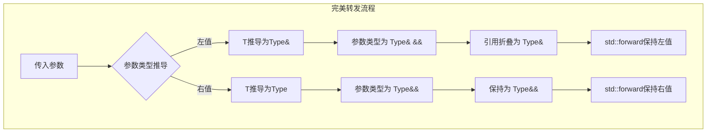
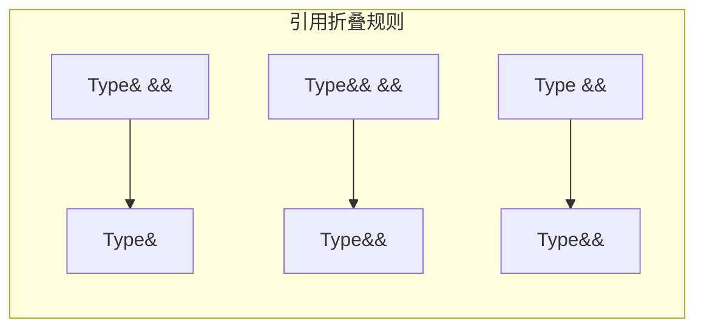
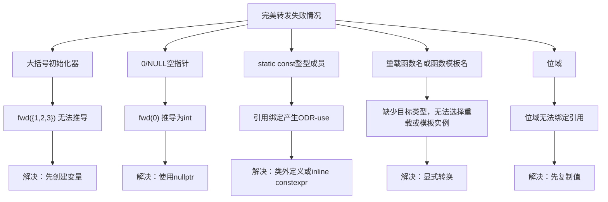
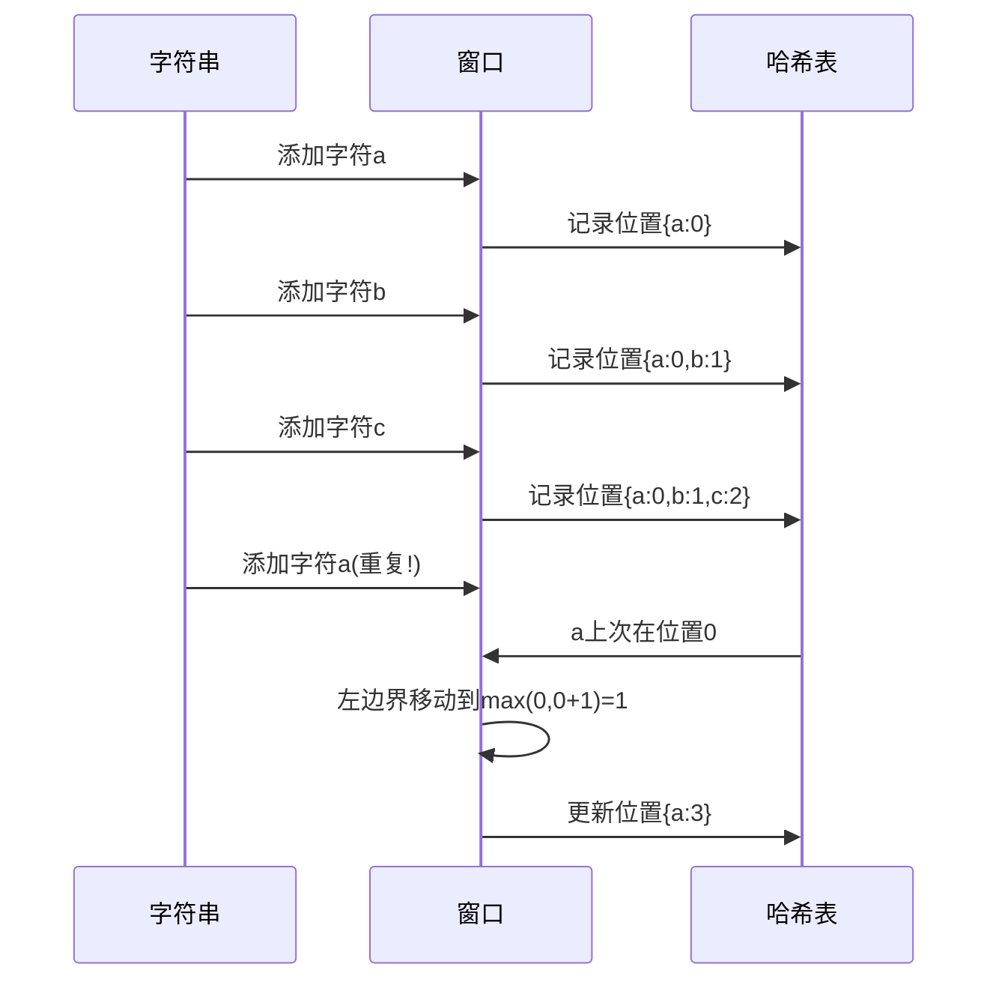
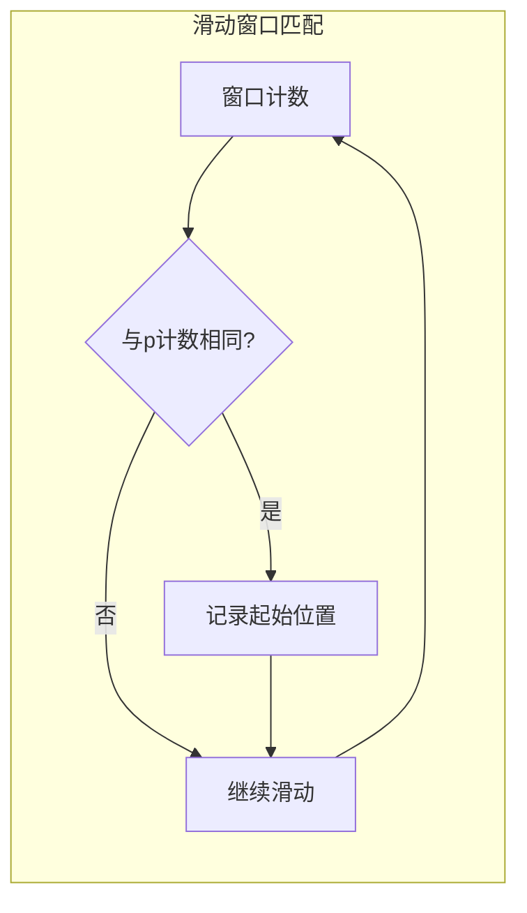

# Day 25：完美转发

> **学习定位**：本日把 Day 24 的引用折叠用于包装器和工厂函数。`std::forward` 的价值是按原值类别转发，不是比 `std::move` 更高级；先掌握正常模式，再学习失败案例。

> **本日差异**：转发引用的识别、`T`/形参类型推导和 `decltype` 规则以 [Day 24](../day_24/README.md#day24-forwarding-reference) 为准。本日新增的是包装器何时应转发、转发后还能否使用形参、如何透传返回类型与异常说明，以及哪些输入根本无法完成模板推导。

## 📅 学习目标

- [ ] 理解完美转发的核心概念和设计目的
- [ ] 掌握std::forward的工作原理和使用方法
- [ ] 了解引用折叠（Reference Collapsing）规则
- [ ] 学习EMC++ Item 29-30：校正移动成本假设并识别完美转发失败案例
- [ ] 完成LeetCode 3、438两道滑动窗口题目

---

## 📖 知识点一：完美转发

### 概念定义

**完美转发（Perfect Forwarding）** 是C++11引入的重要特性，它允许函数模板将参数转发给另一个函数时保持值类别（左值/右值）和 const 属性。它的目标是让下游重载看到调用点原本的语义，不保证一定移动、转移所有权或得到更快的执行路径。

### 专业介绍

在 C++ 中，函数参数的转发是一个常见需求。实参对应的左值/右值来源不会被“永久改变”，但进入包装函数后，**有名字的形参变量表达式总是左值**，即使它的声明类型是 `T&&` 或 `U&&`。若包装器直接把形参名传给下一个重载集，右值调用也会落到左值重载；转发引用记录了来源，`std::forward` 负责在继续交付时恢复它。

完美转发通过两个机制协同工作来实现：
1. **模板参数推导**：函数模板形参必须是这次调用正在推导的、未加 `const/volatile` 的模板参数 `T` 之精确 `T&&`，它才是转发引用（旧称万能引用），能够记录左值或右值来源
2. **引用折叠规则**：通过复杂的类型推导规则，保持参数的值类别信息



### 通俗解释

想象你在帮朋友传递包裹：
- **普通转发**：不管朋友给你的是"可以拆开的快递"（右值）还是"不能拆的礼盒"（左值），你都把它重新包装成一个标准的"不能拆的盒子"再转交出去。这样，原本可以拆开的快递就失去了它的特性。
- **完美转发**：你像一个透明的快递站，原封不动地保持包裹的状态。可拆的快递转交出去还是可拆的，不能拆的礼盒转交出去还是不能拆的。

```cpp
// 普通左值引用包装器：只能接收左值
void process(int& x);        // 左值版本
void process(int&& x);       // 右值版本

template<typename T>
void normalForward(T& param) {
    process(param);
}

// T 在调用时推导，所以这是转发引用，它能接收左值和右值。
// 失败原因不是“右值引用不会转发”，而是命名形参 param 作为表达式是左值。
template<typename T>
void forwardingReferenceWithoutForward(T&& param) {
    process(param);  // 传入右值也会调用左值版本。
}

// 完美转发 - 保持原有特性
template<typename T>
void perfectForward(T&& param) {
    process(std::forward<T>(param));  // 根据原类型选择正确版本
}
```

这三种形式要分开看：`T&` 包装器在接口边界就拒绝右值；被推导的精确 `T&&` 是转发引用，但不用 `std::forward` 时会把左、右值调用都交给左值重载；只有转发引用与 `std::forward<T>` 配合，才能把调用点值类别送到真实目标重载。

### 代码示例

```cpp
#include <iostream>
#include <utility>
#include <string>

// 目标函数：分别处理左值和右值
void process(const std::string& s) {
    std::cout << "处理左值: " << s << std::endl;
}

void process(std::string&& s) {
    std::cout << "处理右值: " << s << " (已到达右值重载)" << std::endl;
}

// 完美转发包装器
template<typename T>
void wrapper(T&& param) {
    process(std::forward<T>(param));  // 完美转发
}

int main() {
    std::string str = "Hello";
    
    wrapper(str);           // 调用左值版本
    wrapper(std::string("World"));  // 调用右值版本
    
    return 0;
}
```

---

<a id="day25-std-forward"></a>

## 📖 知识点二：std::forward详解

### 工作原理

`std::forward` 是一个条件转换工具，它的定义看起来像这样（简化版）：

```cpp
template<typename T>
T&& forward(typename std::remove_reference<T>::type& param) {
    return static_cast<T&&>(param);
}
```

当传入参数的类型信息保存在模板参数`T`中时，`std::forward<T>`会根据`T`的类型：
- 如果`T`是`Type&`（左值引用），返回`Type&`（左值）
- 如果`T`是`Type`（非引用），返回`Type&&`（右值）

### 引用折叠规则

引用折叠是完美转发的理论基础，规则如下：

| 模板参数T | T&& 实际类型 |
|----------|-------------|
| Type& | Type& |
| Type&& | Type&& |
| Type | Type&& |
| const Type& | const Type& |

记忆口诀是：只要组合中有一个 `&`，折叠结果就是 `&`；只有 `&&` 与 `&&` 组合时结果才是 `&&`。在转发引用的直接模板推导中，左值会让 `T` 推导为 `Type&`，右值通常让 `T` 推导为非引用的 `Type`。



### 使用场景

```cpp
#include <iostream>
#include <utility>
#include <vector>
#include <memory>

// 场景1：工厂函数
template<typename T, typename... Args>
std::unique_ptr<T> make_unique(Args&&... args) {
    return std::unique_ptr<T>(new T(std::forward<Args>(args)...));
}

// 场景2：包装器函数
template<typename Func, typename... Args>
auto invoke(Func&& func, Args&&... args) 
    -> decltype(std::forward<Func>(func)(std::forward<Args>(args)...)) 
{
    return std::forward<Func>(func)(std::forward<Args>(args)...);
}

// 场景3：容器元素构造
class Widget {
public:
    Widget(const std::string& name, int value) 
        : name_(name), value_(value) {}
    
    Widget(std::string&& name, int value) 
        : name_(std::move(name)), value_(value) {}
    
private:
    std::string name_;
    int value_;
};

int main() {
    // 使用完美转发的工厂函数
    auto ptr = make_unique<Widget>("Test", 42);
    
    // 使用完美转发的调用包装器
    auto add = [](int a, int b) { return a + b; };
    std::cout << "Result: " << invoke(add, 3, 4) << std::endl;
    
    return 0;
}
```

### std::move vs std::forward

| 特性 | std::move | std::forward |
|------|-----------|--------------|
| 目的 | 无条件产生 xvalue | 按模板参数恢复调用者的值类别 |
| 参数 | 任意类型 | 需要模板参数 |
| 使用场景 | 明确允许后续代码考虑右值路径 | 在转发引用中保持原调用类别 |
| 返回结果 | `std::remove_reference_t<T>&&`，表达式为 xvalue | 返回 `T&&` 并应用引用折叠，结果可为左值或 xvalue |

```cpp
// std::move：无条件产生 xvalue，本身不移动资源
std::string str = "Hello";
std::string moved = std::move(str);  // std::move(str) 是 xvalue；是否移动由后续重载决定
// str 仍有效但状态未指定；本次观察值不能当成“必为空”的保证。
str = "reused";  // 重新赋值后可按新值继续使用

// std::forward：条件转换
template<typename T>
void wrapper(T&& param) {
    // 如果传入的是右值，这里会恢复为 xvalue
    // 如果传入的是左值，这里保持为左值
    someFunction(std::forward<T>(param));
}
```

<a id="day25-forwarding-boundaries"></a>

### 转发的生命周期、多次使用与异常边界

完美转发保存的是调用点的 cv/值类别，不是对象寿命和所有权。包装器应在“最后一次把参数交给可能消费它的下游”时才转发；在此之前若只做检查、记录或读取，使用有名形参的 lvalue 形式更清楚。

```cpp
template<class T>
void storeOnce(T&& value) {
    validate(value);                    // 只读，不转发
    storage.emplace_back(
        std::forward<T>(value));        // 最后一次交付时转发
    // 不再依赖 value 保留原状态
}
```

若对同一个转发引用连续调用两次 `std::forward<T>(value)`，左值实参通常仍以左值传递，而右值实参第一次交付后可能已进入 moved-from 状态；第二次再消费不是语法错误，却通常违反业务契约。对参数包也一样：每个 `args` 应只在目标调用处转发一次，不要先把它们转发给日志器，再转发给真实目标。

返回值也需要单独设计。`decltype(auto)` 可以原样保留目标函数的引用返回类型，但这会把借用契约一起暴露给调用者；若目标返回临时对象成员的引用，包装器忠实传递的仍是悬空引用，之后解引用会产生未定义行为。当 API 要求调用者拥有结果时，应按值返回，而不是用转发技巧伪装成零拷贝借用。

通用调用包装器还应透传目标的异常说明，但只能在目标调用确实不抛时声明 `noexcept`：

```cpp
template<class F, class... Args>
decltype(auto) invokeExact(F&& function, Args&&... args)
    noexcept(noexcept(
        std::forward<F>(function)(std::forward<Args>(args)...))) {
    return std::forward<F>(function)(std::forward<Args>(args)...);
}
```

这个 `noexcept(noexcept(expr))` 是编译期查询，不会执行 `expr`。盲目把包装器写成无条件 `noexcept` 会在目标真正抛异常时调用 `std::terminate`；盲目省略又会让泛型代码失去可用的不抛属性。该模式适合“语义透明”的调用适配器，不适合需要捕获异常、重试或转换错误类型的业务边界。

**本节练习**：给一个目标重载集同时传入左值字符串、临时字符串和 `const` 字符串，记录包装器在“不转发 / 转发一次 / 转发两次”下的可观察行为。再写一个返回借用引用的目标和一个按值返回的目标，分别用 `static_assert(noexcept(...))` 与 ASan 检查异常属性和生命周期边界。

---

## 📖 知识点三：EMC++ Item 29-30

### Item 29：假定移动操作不存在、成本高、或未被使用

Item 29 的重点不是再次解释 `std::forward`，而是约束我们对“移动一定很快”的想象。泛型代码面对未知类型时，应先假设：

配套可运行源码位于 `code/emcpp/item29_move_assumptions.cpp`，文件名与真实条款主题保持一致。

1. 类型可能没有移动构造/移动赋值；右值仍可绑定 `const T&`，所以代码能编译却实际发生拷贝。
2. 移动可能并不便宜；例如 `std::array<T, N>` 的元素就在对象内部，没有一个独立堆缓冲区可直接“偷走”，移动仍需逐个移动元素；许多实现的短字符串优化（SSO）也会把少量字符放在对象内部，移动短字符串未必比拷贝快很多。
3. 移动可能未被使用；`std::move` 保留 `const`，`const T&&` 通常不能绑定需要修改源对象的 `T&&` 移动构造，于是退回拷贝。
4. 容器迁移旧元素时还要维护异常保证；当移动构造可能抛异常而拷贝可用时，`std::vector` 等容器可能选择拷贝，给移动构造正确标注 `noexcept` 会影响这项选择。
5. 只有对已知类型、已知实现并经过测量时，才能把移动的低成本当作性能事实；SSO 的具体布局也不是标准保证。

下面这段是 Day 24/Item 25 的前置知识回顾，用来区分“请求移动”和“实际是否移动”：

```cpp
// 正确的完美转发用法
template<typename T>
void correct(T&& param) {
    doSomething(std::forward<T>(param));
}

// 固定右值引用：forward<int>虽然可编译，但没有需要恢复的推导信息
void wrong(int&& param) {
    // std::forward<int>(param)能得到int&&，但std::move更直接表达意图
    doSomething(std::move(param));
}
```

### Item 30：完美转发失败案例

完美转发并非万能，以下情况会导致转发失败：

#### 1. 大括号初始化器

```cpp
void process(const std::vector<int>& v);

template<typename T>
void fwd(T&& param) {
    process(std::forward<T>(param));  // 真正调用目标函数，而不是只打印类型
}

// 失败！大括号初始化器无法推导
fwd({1, 2, 3});  // 编译错误

// 解决方法：先创建目标类型对象
std::vector<int> values{1, 2, 3};
fwd(values);  // 成功，并真实调用 process
```

严格地说，`{1, 2, 3}` 通常不是一个具有普通表达式类型的表达式，所以转发引用无法从它推导 `T`。`auto init = {1, 2, 3};` 能推导出 `std::initializer_list<int>`，是 `auto` 对列表初始化的特殊规则，不代表裸大括号列表本身拥有这个类型。

#### 2. 0或NULL作为空指针

```cpp
void process(void* ptr);

// 失败！0被推导为int
fwd(0);    // 编译错误
fwd(NULL); // 编译错误

// 解决方法：使用nullptr
fwd(nullptr);  // 成功
```

`nullptr` 的类型是 `std::nullptr_t`，它本身不是指针类型，但可以转换为空对象指针或空函数指针；这正是它比整数 `0` 和实现相关的 `NULL` 宏更适合泛型代码的原因。

#### 3. 仅类内声明的静态 const 整型成员

```cpp
struct Config {
    static const std::size_t MinValues = 2;
};

// fwd 的形参会绑定引用，产生 ODR-use；仅有类内声明可能在链接阶段失败
fwd(Config::MinValues);

// C++11/14 方案：在一个 .cpp 中补定义
const std::size_t Config::MinValues;

// C++17 方案：inline static constexpr std::size_t MinValues = 2;
```

按值用于常量表达式与“绑定引用后转发”不是同一种使用方式；后者需要对象存储，因此必须补类外定义，或从 C++17 起改用 `inline static constexpr`。

#### 4. 重载函数名与函数模板名

```cpp
#include <utility>

int process(int x) { return x * 2; }
double process(double x) { return x * 2.0; }

template<typename T>
int processTemplate(T x) { return static_cast<int>(x) + 1; }

int call(int (*func)(int)) { return func(21); }

template<typename T>
int fwd(T&& func) {
    return call(std::forward<T>(func));
}

// 失败！无法确定哪个重载
fwd(process);  // 编译错误

// 失败！无法从函数模板名选择所需实例
fwd(processTemplate);  // 编译错误

// 解决方法：显式指定重载类型，并为函数模板选择实例
const int result = fwd(static_cast<int(*)(int)>(process));  // 成功，result == 42
const int templated = fwd(
    static_cast<int(*)(int)>(processTemplate<int>));         // 成功，templated == 22
```

#### 5. 位域

```cpp
struct BitField {
    int value : 4;
};

BitField bf{5};

// 失败！位域无法被绑定到非const引用
fwd(bf.value);  // 编译错误

// 解决方法：先复制
auto copy = bf.value;
fwd(copy);  // 成功
```



---

## 🎯 LeetCode 刷题

### 讲解题：LC 3. 无重复字符的最长子串

#### 题目链接

[LeetCode 3](https://leetcode.cn/problems/longest-substring-without-repeating-characters/)

#### 题目描述

给定一个字符串 `s`，请你找出其中不含有重复字符的**最长子串**的长度。

#### 形象化理解

想象你在一条走廊上行走，走廊两侧有各种颜色的门：
- 你可以用一个"滑动窗口"来框住你当前观察的区域
- 当遇到重复的颜色时，你需要从左边缩小窗口，直到没有重复

```
字符串: "abcabcbb"

步骤演示：
[abc]abcbb  → 窗口大小3，无重复
a[bca]bcbb  → 窗口大小3，无重复（左边界右移）
ab[cab]cbb  → 窗口大小3，无重复
abc[abc]bb  → 窗口大小3，无重复
abcab[cb]b  → 窗口大小2（right=6 遇到重复的b，left移到5）
abcabcb[b]  → 窗口大小1（right=7 再遇到b，left移到7）
...

最长无重复子串: "abc", 长度 = 3
```

#### 理论介绍

**滑动窗口（Sliding Window）** 是一种解决数组/字符串子区间问题的常用技巧：

1. **窗口**：维护一个连续的区间[left, right]
2. **右边界扩展**：向右移动，纳入新元素
3. **左边界收缩**：当不满足条件时，从左边缩小窗口
4. **记录最优解**：在过程中记录满足条件的最大/最小值

#### 解题思路

1. 使用双指针`left`和`right`维护滑动窗口
2. 用哈希表记录字符最后出现的位置
3. 当遇到重复字符时，移动左边界到重复位置的下一个
4. 不断更新最大长度



#### 代码实现

下面是突出“最后出现位置”思路的核心片段，并非本日可执行 README 契约程序。它沿用题目长度可由 `int` 表示的前提；仓库真实实现用 `std::size_t` 维护边界、在返回 `int` 前检查范围，256 项数组版本还先把字节转换为 `unsigned char`，避免有符号 `char` 形成负下标。

```cpp
int lengthOfLongestSubstring(string s) {
    unordered_map<char, int> charIndex;  // 记录字符最后出现的位置
    int maxLen = 0;
    int left = 0;
    
    for (int right = 0; right < s.size(); ++right) {
        char c = s[right];
        
        // 如果字符已存在于窗口中
        if (charIndex.find(c) != charIndex.end() && charIndex[c] >= left) {
            // 移动左边界到重复字符的下一个位置
            left = charIndex[c] + 1;
        }
        
        // 更新字符位置
        charIndex[c] = right;
        
        // 更新最大长度
        maxLen = max(maxLen, right - left + 1);
    }
    
    return maxLen;
}
```

#### 复杂度分析

- **时间复杂度**：O(n)，每个字符最多被访问两次（一次扩展，一次收缩）
- **空间复杂度**：O(min(m, n))，m为字符集大小，n为字符串长度

---

### 实战题：LC 438. 找到字符串中所有字母异位词

#### 题目链接

[LeetCode 438](https://leetcode.cn/problems/find-all-anagrams-in-a-string/)

#### 题目描述

给定两个字符串 `s` 和 `p`，找到 `s` 中所有 `p` 的**字母异位词**的起始索引。字母异位词指由相同字母重新排列形成的字符串。

#### 形象化理解

想象你在整理货架上的商品：
- `p`是你要找的商品组合模式（比如"苹果-香蕉-橙子"）
- 你需要在` s`的货架上找到所有符合这个模式（顺序可以不同）的连续区域

```
s = "cbaebabacd"
p = "abc"

寻找"abc"的异位词：
[cba]ebabacd  → cba是abc的异位词 ✓ 起始索引0
c[bae]babacd  → bae不是
cb[aeb]abacd  → aeb不是
cba[eba]bacd  → eba不是
cbae[bab]acd  → bab不是
cbaeb[aba]cd  → aba不是
cbaeba[bac]d  → bac是abc的异位词 ✓ 起始索引6
cbaebab[acd]  → acd不是

结果：[0, 6]
```

#### 理论介绍

**字母异位词**的特点：
- 两个字符串包含完全相同的字符
- 每个字符出现的次数相同
- 但字符的顺序可以不同

判断两个字符串是否为字母异位词的方法：
1. 排序后比较（O(n log n)）
2. 使用哈希表计数比较（O(n)）

在滑动窗口中，我们使用**计数数组**来高效判断。LeetCode 原题把 `s` 与 `p` 限定为小写英文字母；本教学模块把这个前置条件提升为公开接口契约：任一输入含 `'a'` 到 `'z'` 之外的字节就抛出 `std::invalid_argument`，即使 `s` 比 `p` 短也先验证输入。空模式没有固定窗口语义，两个公开方法都返回空结果；若业务要支持任意字节，可改用 256 项计数表，若要按 Unicode 字符处理则必须先增加解码层。

#### 解题思路

1. 使用固定大小的滑动窗口，长度等于`p`的长度
2. 用数组记录窗口内各字符的出现次数
3. 每次移动窗口，更新计数并比较是否与`p`的计数相同
4. 在任何 `c - 'a'` 下标运算前验证输入域，否则越界下标会造成未定义行为



#### 真实实现与完整契约程序

基础版本维护模式计数与窗口计数；优化版本维护两者的差值，差值全零时窗口匹配。二者共享同一输入域、空模式语义和失败方式，唯一实现源是 `code/leetcode/0438_find_anagrams/solution.h` 与 `solution.cpp`，README 不再复制一份容易漂移的函数体。下面完整程序同时验证正常结果、空模式和非法字符；Day 25 的 CTest 会从 README 提取它，严格编译并链接真实实现。

```cpp
#include "code/leetcode/0438_find_anagrams/solution.h"

#include <stdexcept>
#include <vector>

int main() {
    leetcode::lc0438::Solution solution;
    const std::vector<int> expected{0, 6};
    if (solution.findAnagrams("cbaebabacd", "abc") != expected ||
        solution.findAnagramsOptimized("cbaebabacd", "abc") != expected) {
        return 1;
    }
    if (!solution.findAnagrams("abc", "").empty() ||
        !solution.findAnagramsOptimized("abc", "").empty()) {
        return 2;
    }

    bool basicRejected = false;
    bool optimizedRejected = false;
    try {
        static_cast<void>(solution.findAnagrams("A", "abc"));
    } catch (const std::invalid_argument&) {
        basicRejected = true;
    }
    try {
        static_cast<void>(solution.findAnagramsOptimized("ab", "aB"));
    } catch (const std::invalid_argument&) {
        optimizedRejected = true;
    }
    return basicRejected && optimizedRejected ? 0 : 3;
}
```

在 `week_04/day_25` 目录中，该程序必须与真实 `solution.cpp` 一起编译；只复制一个同名函数到测试里不能证明模块契约成立。

```bash
c++ -std=c++17 -Wall -Wextra -Wpedantic -Werror -pedantic-errors -I. \
  /tmp/lc438_readme_contract.cpp \
  code/leetcode/0438_find_anagrams/solution.cpp \
  -o /tmp/lc438_readme_contract
/tmp/lc438_readme_contract
```

#### 复杂度分析

- **时间复杂度**：O(|s| + |p|)，包含输入域验证和一次窗口扫描
- **空间复杂度**：O(1)，使用固定大小的数组

---

## 🛠️ 今日工程动作：锁定缓存值的所有权与生命周期

在本周缓存项目卡中补一条可执行决策：缓存内部按值拥有键和值，`put` 的公开接口先采用按值接收并在内部移动，避免一开始就暴露容易劫持其他重载的转发引用模板。再写清 `get` 返回副本还是借用引用；若返回引用，必须注明后续插入、淘汰、扩容或缓存析构会让引用失效。最后为“大对象值”“短字符串值”“`const` 输入值”和“移动可能抛异常的值”各写一个用例，检查实现是否在没有廉价移动时仍保持正确。

## 🧭 恰好五句复盘

1. 完美转发只恢复调用者原来的值类别，并不保证目标对象一定执行移动。
2. `std::array`、采用 SSO 的短字符串以及没有移动成员的类型，都提醒我们移动成本需要按具体类型判断。
3. `const` 源或可能抛异常的移动构造都可能让可拷贝类型实际走拷贝路径，拷贝不可用时则要另看操作契约。
4. 大括号列表、空指针常量、静态 const 整型成员、重载函数名或函数模板名以及位域都会让普通转发模式遇到边界。
5. 滑动窗口题与转发包装器都应通过可失败测试锁定不变量，而不是只比较打印结果。

## 🚀 运行代码

```bash
./build_and_run.sh

# 同一入口启用 ASan/UBSan；脚本仍会配置、构建、CTest、演示
ENABLE_SANITIZERS=ON ./build_and_run.sh
```

默认 CMake 已为 GCC/Clang 系列编译器启用 `-Wall -Wextra -Wpedantic`，因此 `build_and_run.sh` 本身就包含基础告警门禁；终审命令再叠加 `-Werror -pedantic-errors` 用于更严格的质量验收。

---

## 📚 相关术语

| 术语 | 英文 | 定义 |
|------|------|------|
| 完美转发 | Perfect Forwarding | 保持参数值类别的转发机制 |
| 转发引用 | Forwarding Reference | 函数调用中被推导且未加 cv 限定的模板参数 `T` 之精确 `T&&` 形参；可记录左值或右值来源 |
| 引用折叠 | Reference Collapsing | 多重引用的简化规则 |
| 值类别 | Value Category | 表达式的分类(左值/右值等) |
| std::forward | Forward | 条件性类型转换函数 |
| 滑动窗口 | Sliding Window | 维护动态区间的算法技巧 |
| 字母异位词 | Anagram | 相同字符重排形成的字符串 |

---

## 💡 学习提示

### 完美转发的识别

当你在编写函数模板时，如果需要：
1. 将参数原封不动地传递给另一个函数
2. 保持参数的值类别（左值/右值）
3. 支持接口计划接纳的类型范围，并用约束或具体目标接口拒绝不支持的类型

就应该考虑使用完美转发。

### 滑动窗口的识别

当你看到以下问题时，考虑使用滑动窗口：
1. 求最长/最短满足条件的子数组/子串
2. 子数组/子串需要满足某种连续性质
3. 窗口大小固定或可变

### 避免完美转发陷阱

1. `std::forward<T>` 通常只用于恢复转发引用记录的调用点值类别；固定右值引用继续交付时优先用 `std::move`
2. 记住完美转发失败的情况
3. 理解`std::move`和`std::forward`的区别

---

## 🔗 参考资料

1. [cppreference - std::forward](https://en.cppreference.com/w/cpp/utility/forward)
2. [cppreference - Reference collapsing](https://en.cppreference.com/w/cpp/language/reference)
3. [Effective Modern C++ - Item 29-30](https://www.aristeia.com/EMC++.html)
4. [C++ Core Guidelines F.18 - will-move-from 形参](https://isocpp.github.io/CppCoreGuidelines/CppCoreGuidelines#f18-for-will-move-from-parameters-pass-by-x-and-stdmove-the-parameter)
5. [C++ Core Guidelines F.19 - forward 形参](https://isocpp.github.io/CppCoreGuidelines/CppCoreGuidelines#f19-for-forward-parameters-pass-by-t-and-only-stdforward-the-parameter)
6. [cppreference - noexcept operator](https://en.cppreference.com/w/cpp/language/noexcept)
7. 《C++ Primer》第 5 版：右值引用与转发
4. [LeetCode 滑动窗口专题](https://leetcode.cn/tag/sliding-window/)
