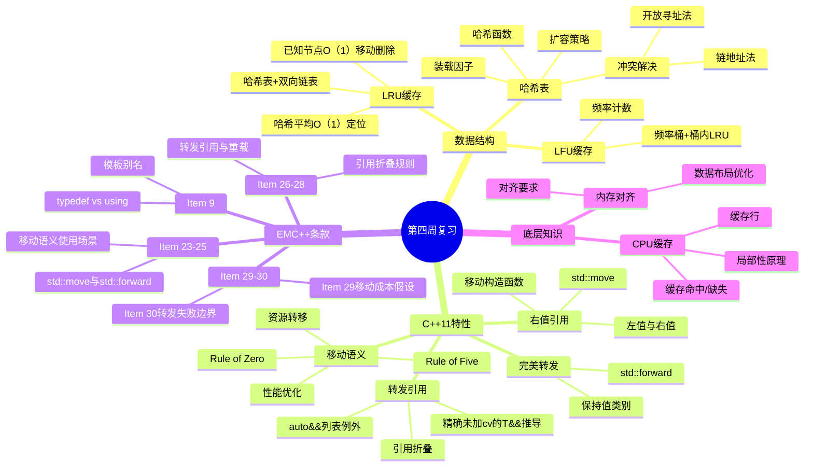
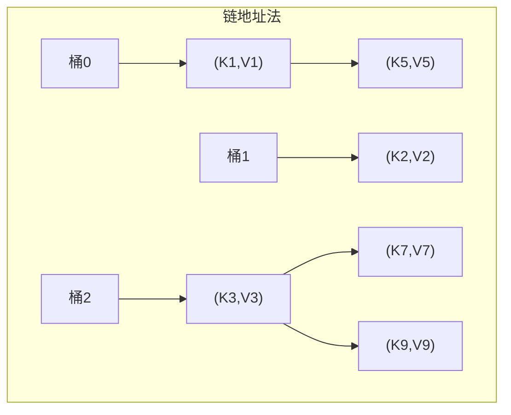
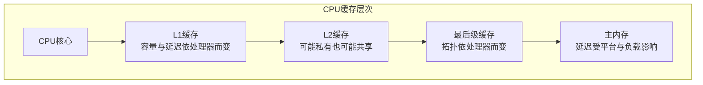
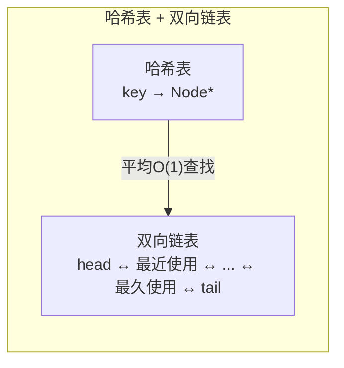
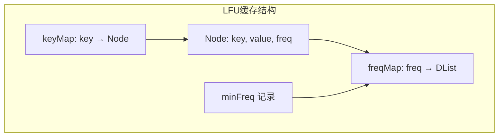

# Day 28：第四周复习

> **学习定位**：本日用缓存设计题把哈希表、双向链表、所有权和复杂度连接起来，并二次复盘 Item 23-30。进入并发前，必须能解释对象怎样移动、谁仍拥有资源以及何时析构。

## 📅 学习目标

- [ ] 复习哈希表的核心概念与实现原理
- [ ] 巩固移动语义、右值引用的理解与应用
- [ ] 回顾转发引用（旧称通用引用）与完美转发的核心要点
- [ ] 掌握EMC++ Item 9, 23-30的核心思想
- [ ] 完成LeetCode 146 (LRU缓存) 和 460 (LFU缓存)
- [ ] 总结本周底层知识：CPU缓存与内存对齐

---

## 📖 第四周知识图谱



### 复习页的使用方法

Day 28 不再作为值类别、移动特殊成员或完美转发的另一个主讲版本。先合上 Day 22-27 README，完成下表；不能回答时，再回到唯一主讲位置查缺补漏：

| 回忆任务 | 必须说出的证据 | 主讲位置 |
|----------|--------------------|----------|
| 哈希表为什么“平均 O(1)” | 哈希/等价一致、负载因子受控、最坏冲突退化 | [Day 22](../day_22/README.md#day22-unordered-contract) |
| `std::move` 为什么不等于移动 | 它产生 xvalue，后续重载和类型能力决定复制/移动/消除 | [Day 23](../day_23/README.md#day23-move-forward) |
| moved-from 对象能做什么 | 类型契约、可析构/重新赋值、只调用前置条件满足的操作 | [Day 23](../day_23/README.md#day23-special-members) |
| 什么时候 `T&&` 是转发引用 | 本次调用正在推导未加 cv 的模板参数，形参是精确 `T&&` | [Day 24](../day_24/README.md#day24-forwarding-reference) |
| 包装器何时转发 | 只在最后一次交付时转发，不重复消费，不伪造寿命延长 | [Day 25](../day_25/README.md#day25-forwarding-boundaries) |

本日新增的学习量是把上述规则放进哈希表、LRU 和 LFU 的所有权图、异常提交边界和测试契约，而不是再读一遍术语定义。

---

## 📖 知识点复习一：哈希表

### 核心概念回顾

哈希表（Hash Table）是一种基于键值对（Key-Value Pair）的高效数据结构，其核心思想是通过哈希函数将键映射到数组索引，从而实现平均O(1)时间的查找、插入和删除操作。哈希表在现代软件开发中应用极为广泛，从数据库索引到缓存系统，从编译器符号表到编程语言的字典类型，都能看到哈希表的身影。

哈希函数是哈希表的核心组件，它负责将任意长度的输入数据转换为固定长度的输出值。一个优秀的哈希函数应该具备以下特性：首先，计算效率要高，能够快速完成映射；其次，分布要均匀，避免大量键映射到相同位置；最后，确定性要强，相同的输入必须产生相同的输出。常见的哈希函数包括除留余数法、乘法哈希、MurmurHash等。

### 冲突解决策略

由于哈希函数可能将不同的键映射到相同的索引位置，这种现象称为哈希冲突（Hash Collision）。解决冲突主要有两种策略：链地址法（Separate Chaining）和开放寻址法（Open Addressing）。

链地址法将所有哈希到同一位置的元素存储在一个链表中。这种方法实现简单，对装载因子不敏感，但在最坏情况下会退化为链表，时间复杂度变为O(n)。开放寻址法在发生冲突时，按照某种探测序列（如线性探测、二次探测、双重哈希）寻找下一个可用位置。这种方法缓存友好，内存连续，但对装载因子敏感，删除操作复杂。



### 常见问题与陷阱

在实际使用哈希表时，开发者经常会遇到一些典型问题。首先是键类型的选择：自定义类型作为键时，必须提供哈希函数和相等比较函数。其次是装载因子的控制：当装载因子过高时，哈希表性能会显著下降，需要及时扩容。另外，迭代顺序的不确定性也是一个需要注意的点，标准库的`std::unordered_map`不保证元素的遍历顺序。

<a id="day28-hash-exception"></a>

### 教学哈希表的异常契约

`code/data_structure/simple_hash_table.h` 中的 `SimpleHashTable<K, V, Hash>` 是泛型教学类型，所以模板定义必须放在头文件中：调用方只有看到完整定义，才能用自定义键、值和会抛异常的 Hash 实例化并测试。把模板只藏在 `.cpp` 中虽然能让本文件自己的演示编译，却会让外部测试无法覆盖真实泛型边界。

该类型的 `insert` 提供**强异常保证**：哈希计算、键比较、节点分配或键值复制失败时，表中的旧键值、`size()`、`bucketCount()` 和桶链拓扑保持不变，新键不会半提交。用户提供的 Hash 或键相等比较在外部对象、日志、计数器上产生的副作用无法由容器回滚；同时 Hash 必须在键存储期间保持稳定，并对相等键产生相同哈希值，相等比较也不能改写已存键。`find` 与 `erase` 在哈希或比较失败时也不修改表；键和值的析构函数则应遵守普通 C++ 容器要求，不向外抛异常。

rehash 的实现分成两阶段：prepare 阶段先分配新桶和 O(n) 迁移计划，并计算全部旧键的新桶位置，期间完全不改写旧节点的 `next`；全部成功后，commit 阶段才执行不分配、不调用用户代码的指针重连和桶数组交换。更新已有键也先构造完整替代节点，再替换旧节点，避免一个会“先改一半再抛出”的 `V::operator=` 破坏旧值。代价是扩容本来就需要 O(n) 时间之外，还会临时使用 O(n) 的迁移计划；这是用额外空间换清晰强保证的教学取舍，而不是声称这份简化实现可替代标准库容器。

CTest `day28_hash_table_exception_contracts` 使用可控抛异常 Hash 复现终审探针，并检查失败前后的旧键、桶数和元素数；它还注入值复制失败，确保“测试全绿”确实覆盖失败路径，而不是只运行成功示例。

### 最佳实践

```cpp
// 1. 选择合适的初始容量
std::unordered_map<std::string, int> freqMap;
freqMap.reserve(10000);  // 预分配容量，避免频繁rehash

// 2. 自定义类型的哈希函数
struct Point {
    int x, y;
    bool operator==(const Point& other) const {
        return x == other.x && y == other.y;
    }
};

struct PointHash {
    std::size_t operator()(const Point& p) const noexcept {
        return std::hash<int>()(p.x) ^ (std::hash<int>()(p.y) << 1);
    }
};

std::unordered_map<Point, std::string, PointHash> pointMap;

// 3. 使用 emplace 避免临时对象
std::unordered_map<int, std::string> map;
map.emplace(1, "one");  // 原地构造，更高效
```

---

## 📖 知识点复习二：移动语义

### 主动回忆表

完整语义以 [Day 23](../day_23/README.md#day23-special-members) 为准。本节只将这些规则映射到缓存项目中可观察的设计决策：

| 缓存中的场景 | 应用的移动规则 | 必须验证的反例/失败路径 |
|----------------|--------------------|--------------------------|
| 缓存按值拥有键和值 | 入口可先按值接收，提交时再移入节点 | `const` 输入可能复制；不要把“调用了 `std::move`”当成已移动证据 |
| 节点用标准成员管理资源 | 优先 Rule of Zero | 不为了打日志手写析构/移动并意外抑制隐式操作 |
| 教学节点直接拥有裸指针 | 拷贝要么深拷贝、要么删除；移动后两个对象都可安全析构 | 自移动、重复释放、分配失败后旧值被破坏 |
| 容器扩容或内部重组 | 只在真正不抛时承诺 `noexcept` | 移动可能抛且复制可用时，容器为维持强保证可选择复制 |
| 函数返回局部对象 | 直接 `return object;`，让复制消除/隐式移动参与 | `return std::move(object);` 可阻碍 NRVO，不能当成“更现代”的固定写法 |

### moved-from 状态的可用性边界

“有效但状态未指定”表示类型不变量仍成立，对象可析构、可重新赋值，也可调用当下前置条件可以证明满足的操作；它不表示“任意成员函数都安全”。例如 moved-from `vector` 可以调用 `clear()` 或重新赋值，但在没有先证明它非空时不能调用 `front()`。自定义缓存节点若承诺移动后为空，那是该类型自己的更强契约，不能倒推成所有标准库类型都为空。

### 异常安全检查

对 LRU/LFU 的一次插入，可能抛异常的步骤包括节点分配、键值构造、哈希项插入和频率桶分配。强保证的设计顺序是“prepare：构造全部可能失败的新状态；commit：只执行不抛的链接、指针替换与计数更新”。若先淘汰旧节点，再为新节点分配内存，分配失败时就会出现“`put` 报错但缓存已丢数据”，这正是本日应注入的反例。

**复习练习**：为一次满容量 `put` 画出所有权和 prepare/commit 边界，在“新节点分配”、“哈希插入”和“新频率桶分配”三处分别注入异常。每次失败后检查键集合、值、LRU/LFU 顺序、`size` 和 `minFreq`，不只检查程序是否崩溃。

---

## 📖 知识点复习三：转发引用与完美转发

### 决策表：先识别，再转发

完整推导规则以 [Day 24](../day_24/README.md#day24-forwarding-reference) 为准，生命周期、多次转发和异常透传以 [Day 25](../day_25/README.md#day25-forwarding-boundaries) 为准。Day 28 只检查是否能把下列场景归入正确分支：

| 声明/调用 | 是否转发引用 | 正确处理 |
|-----------|----------------|----------|
| `template<class T> void f(T&&)`，调用点推导 `T` | 是 | 若要交给下游重载集，用 `std::forward<T>` |
| `void f(std::string&&)` | 否，固定右值引用 | 函数内要继续交付时用 `std::move` |
| `template<class T> void f(const T&&)` | 否 | 只绑定 const 右值，通常不是理想的消费接口 |
| `template<class T> void f(std::vector<T>&&)` | 否 | 虽推导内层 `T`，形参不是精确 `T&&` |
| `auto&& values = {1, 2, 3}` | 否 | `auto` 走 `initializer_list` 特殊推导 |

下面是闭卷自测，不重讲推导步骤：先手写三个 `assert` 的预期，再用编译器检查“有名形参是 lvalue，最后一次交付才恢复调用者值类别”。

```cpp
#include <cassert>
#include <utility>

enum class Category { lvalue, rvalue };

Category classify(int&) noexcept { return Category::lvalue; }
Category classify(int&&) noexcept { return Category::rvalue; }

template <typename T>
Category deliver(T&& value)
    noexcept(noexcept(classify(std::forward<T>(value)))) {
    return classify(std::forward<T>(value));
}

int main() {
    int key = 7;
    assert(deliver(key) == Category::lvalue);
    assert(deliver(7) == Category::rvalue);
    assert(deliver(std::move(key)) == Category::rvalue);
}
```

### 转发失败的诊断表

| 现象 | 根因 | 修复 |
|------|------|------|
| `fwd({1, 2, 3})` 无法推导 | 裸大括号列表没有可供普通模板推导的单一表达式类型 | 先构造明确容器或提供专门 `initializer_list` 接口 |
| `fwd(0)` 未选空指针路径 | `0/NULL` 保留整数类型 | 使用 `nullptr` |
| 重载函数名/函数模板名无法推导 | 缺少唯一的目标类型或实例 | 显式选择函数指针类型和模板实例 |
| 位域无法绑定 | 位域不能绑定到所需非 const 引用 | 先复制到普通对象 |
| 静态 const 整型成员在链接时失败 | 引用绑定产生 ODR-use | 提供定义，或 C++17 使用 `inline static constexpr` |

缓存的 `put` 接口本来就要拥有键和值时，先选择按值接收并在内部移动，往往比暴露无约束 `T&&` 更简单：左值付出一次复制，右值可移动或直接构造形参，也不会劫持整数 ID、复制构造或其他重载。只有测量证明按值成本不可接受，且能明确约束可构造类型时，才升级为转发接口。

**复习练习**：对缓存 `put(key, value)` 比较 `const T&`、按值和受约束转发三种设计，分别列出左值、临时量、`const` 对象、不可复制类型和隐式转换输入的路径。选择一种作为公开接口，必须同时说明所有权、重载决议风险和异常提交点。

---

## 📖 知识点复习四：底层知识要点

### CPU缓存基础

现代CPU的多级缓存结构对程序性能有着深远影响。理解缓存的工作原理可以帮助我们编写更高效的代码。常见处理器具有 L1、L2 和最后级缓存，但容量、共享拓扑和延迟都由具体处理器决定；只能通过目标机器资料或测量取得事实，不能把示意数字当成语言保证。

缓存通常以缓存行（Cache Line）为传输和一致性管理单位，64 字节是许多桌面与服务器处理器上的常见实验值，但并非所有机器固定如此。顺序访问常能利用空间局部性，不过真实收益还受预取器、工作集、步长和编译器生成代码影响。



### 内存对齐

内存对齐是指对象起始地址满足该类型的 `alignof(T)` 要求。`alignof(T)`、`sizeof(T)` 与硬件缓存行边界是三件不同的事：类型对齐不等于对象大小，对象大小满足类型对齐也不代表它从真实缓存行边界开始。

C++中可以使用 `alignas` 指定更严格的类型或对象对齐，使用 `alignof` 查询类型要求；`sizeof(T)` 还会包含成员与尾部填充。若要把 64 字节当作伪共享实验参数，需要同时控制起始对齐和布局跨度，并另行确认目标硬件的真实缓存行大小。

```cpp
// 类型对齐示例：只承诺16字节对齐，不假定对象大小。
struct alignas(16) AlignedStruct {
    double data[4];
    int value;
};

static_assert(alignof(AlignedStruct) >= 16, "type alignment check");
static_assert(sizeof(AlignedStruct) % alignof(AlignedStruct) == 0,
              "array elements must keep their alignment");

// 64只是本次布局实验参数；即使这些断言成立，也不能证明硬件缓存行就是64字节。
struct alignas(64) CacheLineExperiment {
    unsigned char bytes[64];
};

static_assert(alignof(CacheLineExperiment) >= 64, "experiment alignment check");
static_assert(sizeof(CacheLineExperiment) >= 64, "experiment span check");
```

---

## 🎯 LeetCode 刷题

### 讲解题：LC 146. LRU缓存机制

#### 题目链接

[LeetCode 146](https://leetcode.cn/problems/lru-cache/)

#### 题目描述

请你设计并实现一个满足 LRU (最近最少使用) 缓存约束的数据结构。实现 `LRUCache` 类：
- `LRUCache(int capacity)` 以正整数作为容量 `capacity` 初始化 LRU 缓存
- `int get(int key)` 如果关键字 `key` 存在于缓存中，则返回关键字的值，否则返回 -1
- `void put(int key, int value)` 如果关键字 `key` 已经存在，则变更其数据值 `value`；如果不存在，则向缓存中插入该组 `key-value`。如果插入操作导致关键字数量超过 `capacity`，则应该逐出最久未使用的关键字。

函数 `get` 和 `put` 必须以 O(1) 的平均时间复杂度运行。

#### 形象化理解

想象一个"书架借阅系统"，书架上只能放固定数量的书：
- 每次有人借书，这本书就移到"最近使用"的位置
- 借出去的书放回时，也移到"最近使用"位置
- 当书架满了需要淘汰书时，就淘汰"最久没动过"的那本

```
容量为3的LRU缓存操作示例：

操作          缓存状态（左为最近使用，右为最久使用）
put(1,1)     [1]
put(2,2)     [2, 1]
get(1)→1     [1, 2]        // 访问后移到前面
put(3,3)     [3, 1, 2]     // 满了
put(4,4)     [4, 3, 1]     // 淘汰最久未使用的2
get(2)→-1    [4, 3, 1]     // 2已被淘汰
get(3)→3     [3, 4, 1]     // 访问3，移到前面
get(4)→4     [4, 3, 1]     // 访问4，移到前面
```

#### 📚 理论介绍

**LRU（Least Recently Used，最近最少使用）** 是一种经典的缓存淘汰策略，广泛应用于操作系统、数据库和Web缓存等领域。

**缓存淘汰策略家族**：
| 策略 | 全称 | 淘汰标准 | 应用场景 |
|------|------|---------|---------|
| LRU | Least Recently Used | 最久未使用 | 通用场景 |
| LFU | Least Frequently Used | 使用频率最低 | 热点数据场景 |
| FIFO | First In First Out | 最先进入 | 简单场景 |
| Random | Random | 随机淘汰 | 极简实现 |

**为什么选择 LRU？**
1. **局部性原理**：程序访问具有时间和空间局部性，最近访问的数据很可能再次被访问
2. **实现成本可控**：在哈希表平均常数时间的假设下，哈希表 + 双向链表可让核心操作达到平均 O(1)
3. **策略易解释**：它直接追踪最近性，但命中效果仍取决于真实访问模式，不能脱离工作负载断言最优

**LRU 的核心操作复杂度要求**：
- `get(key)`: 平均 O(1) — 依赖哈希表快速定位
- `put(key, value)`: 平均 O(1) — 依赖哈希表插入并在已知节点位置完成淘汰

**数据结构组合的设计智慧**：
```
单一数据结构的局限：
┌─────────────────────────────────────────────────────┐
│ 哈希表：平均O(1)查找 ✓   但无法维护访问顺序 ✗       │
│ 链表：维护顺序 ✓     但查找O(n) ✗                   │
│ 数组：按下标O(1) ✓   按key查找及中间移动常为O(n) ✗  │
└─────────────────────────────────────────────────────┘

组合方案：
┌─────────────────────────────────────────────────────┐
│ 哈希表：key → Node指针（快速定位节点）              │
│ 双向链表：已知节点指针时O(1)移动/删除                │
│ 结果：哈希平均O(1)定位 + 链表O(1)维护顺序            │
└─────────────────────────────────────────────────────┘
```

**为什么用双向链表而非单向链表？**
- 单向链表删除节点需要知道前驱，无法 O(1) 完成
- 双向链表可以直接获取前驱，支持 O(1) 删除

#### 解题思路

LRU缓存需要支持两个核心操作：快速查找和维护访问顺序。这需要两种数据结构配合，并依赖哈希表平均常数时间这一通常假设：
1. **哈希表**：平均 O(1) 定位键；碰撞严重或遭遇对抗输入时可能退化
2. **双向链表**：已经拿到节点指针时，O(1) 完成移动和删除



#### 真实实现与可编译契约示例

LRU 的唯一实现源是 `code/leetcode/0146_lru_cache/solution.h` 与 `solution.cpp`。README 不复制私有节点和链表实现；下面程序只使用真实公开接口验证非正容量、更新不增容、成功访问改变顺序以及淘汰契约。

```cpp
// 保存为 /tmp/lru_readme_contract.cpp；编译时必须链接仓库真实 solution.cpp。
#include "code/leetcode/0146_lru_cache/solution.h"

#include <type_traits>

static_assert(!std::is_copy_constructible_v<LRUCache>);
static_assert(!std::is_move_constructible_v<LRUCache>);

int main() {
    LRUCache disabled(-1);
    disabled.put(1, 1);
    if (disabled.capacity() != 0 || disabled.size() != 0 || disabled.get(1) != -1) {
        return 1;
    }

    LRUCache cache(2);
    cache.put(1, 10);
    cache.put(2, 20);
    cache.put(1, 11); // 更新既改变新旧顺序，也不得增加大小。
    if (cache.size() != 2 || cache.get(1) != 11) {
        return 2;
    }

    cache.put(3, 30); // 刚访问过1，因此淘汰更旧的2。
    return cache.get(2) == -1 && cache.get(1) == 11 && cache.get(3) == 30 ? 0 : 3;
}
```

```bash
c++ -std=c++17 -Wall -Wextra -Wpedantic -Werror -I. \
  /tmp/lru_readme_contract.cpp \
  code/leetcode/0146_lru_cache/solution.cpp \
  -o /tmp/lru_readme_contract
/tmp/lru_readme_contract
```

#### 复杂度分析

- 时间复杂度：在哈希表平均 O(1) 的前提下，`get` 和 `put` 都是平均 O(1)；最坏情况受哈希容器行为影响
- 空间复杂度：O(capacity)，用于存储缓存条目

---

### 实战题：LC 460. LFU缓存

#### 题目链接

[LeetCode 460](https://leetcode.cn/problems/lfu-cache/)

#### 题目描述

请你为最不经常使用（LFU）缓存算法设计并实现数据结构。实现 `LFUCache` 类：
- `LFUCache(int capacity)` 用数据结构的容量 `capacity` 初始化对象
- `int get(int key)` 如果键 `key` 存在于缓存中，则获取键的值，否则返回 -1
- `void put(int key, int value)` 如果键 `key` 已存在，则变更其值；如果不存在，请插入键值对。当缓存达到其容量 `capacity` 时，则应该在插入新项之前，移除最不经常使用的项。如果存在多个使用频率相同的项，则移除最久未使用的那一项。

#### 形象化理解

LFU比LRU多了一个"访问频率"的概念：
- 每次访问一个键，它的"频率计数器"就+1
- 淘汰时，优先淘汰频率最低的；如果频率相同，淘汰最久未使用的

```
容量为2的LFU缓存操作示例：

操作              缓存状态[(key,value,freq)]
put(1,1)         [(1,1,1)]
put(2,2)         [(1,1,1), (2,2,1)]
get(1)→1         [(1,1,2), (2,2,1)]    // 1的频率变为2
put(3,3)         [(1,1,2), (3,3,1)]    // 淘汰频率最低的2
get(2)→-1        [(1,1,2), (3,3,1)]
get(3)→3         [(1,1,2), (3,3,2)]
put(4,4)         [(3,3,2), (4,4,1)]    // 1和3频率相同，淘汰最久未使用的1
```

#### 📚 理论介绍

**LFU（Least Frequently Used，最不经常使用）** 是另一种经典的缓存淘汰策略，与 LRU 的区别在于它基于"使用频率"而非"最近使用时间"来做淘汰决策。

**LRU vs LFU 对比**：
| 特性 | LRU | LFU |
|------|-----|-----|
| 淘汰依据 | 最近访问时间 | 访问频率 |
| 适合场景 | 时间局部性强的数据 | 热点数据明显 |
| 容量与元数据 | 至多保存 capacity 个条目，另有哈希与链表元数据 | 同样是 O(capacity)，频率桶通常需要更多元数据 |
| 策略倾向 | 更重视最近访问，可能丢失长期热点 | 更重视累计频率，可能滞留历史热点 |
| 实现复杂度 | 中等 | 较高 |
| 对访问模式变化 | 通常更快反映近期变化 | 未老化的历史计数可能反应较慢 |

**LFU 的优缺点分析**：

**优点**：
- 长期热点数据通常更不容易被少量偶发访问挤掉
- 对于频率分布稳定的负载，命中率可能优于只看最近性的策略；仍需用真实工作负载测量

**缺点**：
- 新数据需要"热身"才能获得较高优先级
- 历史热点可能长期占用空间（即使已经不再使用）
- 实现比 LRU 复杂

**LFU 的典型应用场景**：
- CDN 缓存：热点内容长期缓存
- 数据库查询缓存：频繁执行的 SQL 语句缓存
- 推荐系统：热门内容优先展示

**LFU 的优化变体**：
1. **LFU with Aging**：频率会随时间衰减，解决"历史热点"问题
2. **Window-LFU**：只统计最近N次访问的频率
3. **LFU* (LFU with dynamic aging)**：动态调整老化参数

**本题的实现要点**：
```
┌────────────────────────────────────────────────────┐
│ 需要维护三个维度：                                   │
│ 1. key → Node 的映射（快速查找）                    │
│ 2. freq → 节点列表（同一频率的节点）                │
│ 3. 每个频率列表内的LRU顺序（频率相同时淘汰最久未用）  │
└────────────────────────────────────────────────────┘
```

**为什么 LFU 需要三层结构？**
- 哈希表：在哈希假设下平均 O(1) 查找节点，最坏可能退化
- 频率映射：快速定位最小频率的节点
- 双向链表：维护同频率节点的 LRU 顺序

#### 解题思路

LFU缓存需要同时维护访问频率和访问时间顺序，可以使用三层结构：
1. **主哈希表**：key → Node（存储键值对和频率）
2. **频率哈希表**：freq → 双向链表（存储该频率的所有节点，按LRU顺序）
3. **最小频率记录**：用于快速定位需要淘汰的节点



#### 真实实现与可编译契约示例

LFU 的唯一实现源是 `code/leetcode/0460_lfu_cache/solution.h` 与 `solution.cpp`。README 不再复制一份容易漂移的私有 `Node/DList` 实现；下面代码直接包含真实公开头，并链接真实实现来验证公开接口、非正容量、空桶回收和频率饱和后的同频 LRU 语义。

```cpp
// 保存为 /tmp/lfu_readme_contract.cpp；这是一段契约验证程序，不是另一份 LFU 实现。
#include "code/leetcode/0460_lfu_cache/solution.h"

#include <type_traits>

static_assert(std::is_unsigned_v<LFUCache::Frequency>);

int main() {
    LFUCache disabled(-1);
    disabled.put(1, 1);
    if (disabled.capacity() != 0 || disabled.size() != 0 || disabled.get(1) != -1) {
        return 1;
    }

    LFUCache minimumCeiling(1, 0); // 上界0按真实构造契约规范化为1。
    minimumCeiling.put(9, 90);
    minimumCeiling.get(9);
    minimumCeiling.get(9);
    if (minimumCeiling.minFreq() != 1 || minimumCeiling.frequencyBucketCount() != 1) {
        return 2;
    }

    LFUCache cache(2, 3); // 测试专用上界；默认上界是 uint64_t 最大值。
    cache.put(1, 10);
    cache.put(2, 20);
    cache.get(1);
    cache.get(1);
    cache.get(2);
    cache.get(2);
    cache.get(1); // 两个键都饱和于3；访问1后，2成为同频桶内最旧节点。

    if (cache.minFreq() != 3 || cache.frequencyBucketCount() != 1) {
        return 3;
    }

    cache.put(3, 30); // 淘汰同频且更旧的键2；插入结束后不得留下空桶。
    const bool valuesCorrect =
        cache.get(2) == -1 && cache.get(1) == 10 && cache.get(3) == 30;
    const bool stateBounded =
        cache.size() == 2 && cache.frequencyBucketCount() <= cache.size();
    return valuesCorrect && stateBounded ? 0 : 4;
}
```

在 `week_04/day_28` 目录按下面命令保存并验证该片段；必须同时编译 `solution.cpp`，这样检查的是仓库真实实现而不是文档替身。

```bash
c++ -std=c++17 -Wall -Wextra -Wpedantic -Werror -I. \
  /tmp/lfu_readme_contract.cpp \
  code/leetcode/0460_lfu_cache/solution.cpp \
  -o /tmp/lfu_readme_contract
/tmp/lfu_readme_contract
```

#### 复杂度分析

- 时间复杂度：`get` 和 `put` 在哈希表平均 O(1) 的前提下都是平均 O(1)
- 空间复杂度：O(capacity)；一次升频会先创建新桶再删除空旧桶，瞬时映射项最多为 `capacity + 1`，每次公开操作结束后不保留空桶，非空频率桶数不超过真实缓存节点数

### 缓存实现的所有权与边界契约

LRU 中，`LRUCache` 独占真实节点和两个哨兵，哈希表只保存借用指针；因此析构沿链表释放一次即可，复制和移动都显式禁用，避免浅拷贝后重复释放。LFU 中，`LFUCache` 独占所有真实节点，每个 `DList` 只拥有自己的头尾哨兵并借用真实节点；析构时先释放真实节点，再用 `delete` 释放每个 `DList`，而 `DList` 析构不得遍历或释放借来的真实节点。仅写 `pointer->~DList()` 只调用析构函数却不归还 `new DList` 的存储，不是正确的释放方式。

失败路径也必须保持这些关系：LFU 升频先创建新桶，成功后才从旧桶摘链；更新已有键先完成可能分配的新频率桶，再提交不抛的整数值更新。满容量插入新键时先取得节点、频率桶和哈希项，若分配失败就删除临时节点与新建空桶且不淘汰旧键；全部成功后才按插入前保存的最小频率执行摘链淘汰。这个顺序让分配异常不会留下空桶、半迁移节点或提前丢失的缓存项。

容量小于等于零统一规范化为零，此时 `put` 是无操作、`get` 返回 `-1`、`size()` 保持零。每次 LRU 的成功 `get` 都会改变新旧顺序，例如 `[3,1]` 再 `get(1)` 后成为 `[1,3]`，随后插入 4 应淘汰 3；测试必须按完整操作序列推导，不能只凭插入先后猜测。每次 LFU 节点升频时，旧链表移除、新链表插入、空桶删除和 `minFreq` 更新必须作为一个整体维持不变量。频率使用 `std::uint64_t`；默认上界是其最大值，双参数构造仅用于有限步测试且把上界 0 规范化为 1，到达上界后不再递增但仍更新同频桶内的 LRU 顺序，从而避免溢出并保留淘汰语义。

### EMC++ Item 9、23–30 完整复盘

| Item | 正确主题 | 本周应用 |
|------|----------|----------|
| 9 | 优先使用别名声明而非 `typedef` | alias template 直接产生目标类型；旧式 typedef 元函数要包类模板并写 `typename ...::type`，而 `_t` 风格别名能去掉这层语法噪声 |
| 23 | 理解 `std::move` 与 `std::forward` | `move` 无条件产生 xvalue，`forward` 按推导结果有条件恢复值类别，二者本身都不搬资源 |
| 24 | 区分转发引用与右值引用 | 函数形参须为被推导、未加 cv 的模板参数 `T` 之 `T&&` 才是转发引用；已知类型的 `Widget&&` 是右值引用，命名后表达式仍是左值 |
| 25 | 右值引用用 `move`，转发引用用 `forward` | 需要继续交付时，右值引用形参用 `move` 延续右值许可，转发引用用 `forward` 恢复调用者原来的值类别；二者都不保证目标实际搬资源 |
| 26 | 避免对转发引用重载 | `std::string&` 可比 `const std::string&` 少一次限定转换，字符串字面量也可能被贪婪模板直接接走；同为精确匹配时普通非模板仍优先 |
| 27 | 熟悉转发引用重载的替代方案 | 从不同函数名、`const T&`、按值接收开始，确有分类需求再使用标签分发或 SFINAE/约束 |
| 28 | 理解引用折叠 | 只要有 `&` 参与就是 `&`，只有 `&&` 与 `&&` 才得到 `&&` |
| 29 | 假定移动不存在、不便宜、未被使用 | 类型可能只有复制；`std::array` 与 SSO 字符串可能逐元素处理；`const` 源或可抛移动在拷贝可用时可能走拷贝路径 |
| 30 | 熟悉完美转发失败情形 | 大括号列表、`0/NULL`、仅声明静态 const 整型成员、重载函数名/函数模板名和位域构成五类边界；修复后仍要真实调用目标接口验证路线 |

Item 29 的结论不是“不要移动”，而是不能在泛型设计和复杂度承诺中先验地把移动算作常数时间。Item 30 中 `auto values = {1,2,3}` 推导出 `std::initializer_list<int>` 是 `auto` 的特殊规则，不代表普通函数模板也能从裸大括号列表推导；`nullptr` 的类型是 `std::nullptr_t`，不是指针类型，但能安全转换到目标指针类型。完美转发助手必须真实调用目标函数，并用目标重载的输出验证左值仍到 `const&`/`&`、右值仍到 `&&`，只打印 `T` 的名字不能证明转发正确。

### 缓存项目卡

1. **需求与用例**：在哈希表平均常数时间假设下支持平均 O(1) 的 `get/put`；LRU 淘汰最久未访问项，LFU 先淘汰最低频项、同频再淘汰最久未访问项。
2. **输入输出和失败方式**：整数键值，未命中返回 `-1`；非正容量不保存数据；测试断言失败时进程必须返回非零。
3. **数据与不变量**：哈希表中的每个键恰好对应一个真实节点；链表前后指针互相一致；LRU 的尾端是最旧节点；LFU 的 `minFreq` 指向当前最小非空频率，且 `freqMap` 不保留空桶；可能抛出的资源取得发生在摘链和淘汰之前。
4. **最小接口**：保留构造、`get`、`put` 和用于学习测试的只读 `size/capacity/minFreq/frequencyBucketCount`，有限频率上界构造重载只用于在可控步数内验证饱和边界，链表拼接、移除与升频都封装为私有操作。
5. **所有权与生命周期**：缓存独占真实节点，链表或哈希表中的裸指针只是索引；哨兵由所属链表释放；类禁用浅复制和移动。
6. **文件和 target**：每道缓存题都以 `solution.h` 公布接口、`solution.cpp` 实现，`day28_lru_cache/day28_lfu_cache` 是库 target，`day28_lc0146/day28_lc0460` 是只包含头文件并链接库的测试 target。
7. **测试**：覆盖官方序列、重复更新、访问顺序、同频 LRU、容量 1/0/负数、10000 次连续升频和可控饱和边界；CTest 负责非零失败传播，ASan/UBSan 负责发现 UAF、double free 和未定义行为。
8. **设计取舍复盘**：教学实现保留裸指针以展示 O(1) 链表操作，但用清晰的唯一所有者和禁用复制锁住风险；生产代码还应评估泛型键值、异常安全、并发控制和指标观测。

### 今日工程动作：画提交边界与所有权图并让工具验证

先在纸上给每种节点画一条且仅一条“拥有”箭头，再把索引中的裸指针标成“借用”，并为 rehash、升频和淘汰分别画出 prepare/commit 分界。每次修改这些路径，都运行普通 CTest 与 `-DENABLE_SANITIZERS=ON` 构建；其中 `day28_hash_table_exception_contracts` 必须证明 Hash 或值复制抛异常后旧状态不变。测试打印失败还不够，必须返回非零，自动化系统才能阻止错误继续传播。

---

## 📊 本周学习检验

### 自测题

1. **哈希表基础**
   - 哈希表的平均时间复杂度是多少？最坏情况呢？
   - 常见的哈希冲突解决方法有哪些？各有什么优缺点？
   - 什么是装载因子？为什么需要扩容？

2. **移动语义**
   - 左值和右值有什么区别？
   - `std::move` 做了什么？它真的"移动"了吗？
   - 什么情况下应该定义移动构造函数？

3. **转发引用**
   - 什么是转发引用？它和右值引用有什么区别？
   - 引用折叠规则是什么？
   - 为什么需要完美转发？

4. **LRU与LFU**
   - LRU缓存的核心数据结构是什么？为什么这样设计？
   - LRU和LFU有什么区别？各自的淘汰策略是什么？

### 综合练习

实现一个支持过期时间的缓存系统：
- 基于 LRU 缓存
- 每个键值对有过期时间
- get 时检查是否过期，过期则返回 -1
- 可以手动清理过期条目

---

## 🚀 运行代码

```bash
# 编译并运行当天所有代码
./build_and_run.sh

# 或者手动编译
mkdir build && cd build
cmake -DBUILD_TESTING=ON ..
cmake --build .
ctest --output-on-failure
./day_28_main

# ASan 与 UBSan 分开统计，避免把两种仪器化结果混成一个数字
cmake -S .. -B ../build_asan -DBUILD_TESTING=ON -DENABLE_ASAN=ON
cmake --build ../build_asan
cmake -E chdir ../build_asan ctest -LE strict-no-sanitizer --output-on-failure

cmake -S .. -B ../build_ubsan -DBUILD_TESTING=ON -DENABLE_UBSAN=ON
cmake --build ../build_ubsan
cmake -E chdir ../build_ubsan ctest -LE strict-no-sanitizer --output-on-failure
```

---

## 📚 相关术语汇总

| 术语 | 英文 | 定义 |
|------|------|------|
| 哈希表 | Hash Table | 基于键值对的高效数据结构 |
| 哈希函数 | Hash Function | 将键映射到索引的函数 |
| 冲突 | Collision | 不同键映射到相同索引 |
| 链地址法 | Separate Chaining | 用链表解决冲突的方法 |
| 开放寻址法 | Open Addressing | 探测下一个位置的方法 |
| 装载因子 | Load Factor | 元素数量/桶数量 |
| 左值 | Lvalue | 具有身份的表达式；变量名、解引用表达式是常见例子 |
| 右值 | Rvalue | 纯右值与将亡值的总称，包括字面量、临时结果和 `std::move(x)` 产生的 xvalue |
| 右值引用 | Rvalue Reference | 非转发语境中的 `U&&`（如 `std::string&&`），可绑定 prvalue 或 xvalue；命名后的变量表达式仍是左值 |
| 移动语义 | Move Semantics | 允许类型按契约复用或转移资源的机制 |
| 转发引用 | Forwarding Reference | 函数调用中被推导且未加 cv 限定的模板参数 `T` 的精确 `T&&` 形参，可记录左值或右值来源；`auto&&` 从非列表初始化式推导时也属于转发引用 |
| 引用折叠 | Reference Collapsing | 引用之引用的推导规则 |
| 完美转发 | Perfect Forwarding | 保持参数原始值类别的转发 |
| LRU | Least Recently Used | 最近最少使用淘汰策略 |
| LFU | Least Frequently Used | 最不经常使用淘汰策略 |
| 缓存行 | Cache Line | 某级缓存分配、传输和一致性跟踪使用的固定大小数据块；大小由具体硬件决定 |
| 内存对齐 | Memory Alignment | 数据地址满足特定边界要求 |

---

## 💡 学习提示

1. **哈希表学习建议**：理解哈希表的关键在于理解哈希函数的设计和冲突解决策略。建议手动实现一个简单的哈希表，加深对内部机制的理解。

2. **移动语义学习建议**：移动语义是现代C++最重要的特性之一。建议通过调试工具观察移动构造和拷贝构造的调用时机，体会两者的性能差异。

3. **LRU/LFU学习建议**：这两道题是面试高频题，也是数据结构设计的经典问题。重点理解为什么选择哈希表+链表的组合，以及如何协调两种数据结构。

4. **常见错误提醒**：
   - 不要滥用`std::move`，尤其是在返回局部对象时
   - 使用自定义类型作为哈希表键时，记得提供哈希函数和相等比较
   - 只有移动操作确实不会抛异常时才标记 `noexcept`；正确承诺有利于标准容器选择移动路径

---

## 🔗 参考资料

1. [Hello-Algo - 哈希表](https://www.hello-algo.com/chapter_hashing/)
2. [cppreference - unordered_map](https://en.cppreference.com/w/cpp/container/unordered_map)
3. [cppreference - std::move](https://en.cppreference.com/w/cpp/utility/move)
4. [cppreference - std::forward](https://en.cppreference.com/w/cpp/utility/forward)
5. [Effective Modern C++ - Item 9, 23-30](https://www.aristeia.com/EMC++.html)
6. [LeetCode 146 - LRU缓存](https://leetcode.cn/problems/lru-cache/)
7. [LeetCode 460 - LFU缓存](https://leetcode.cn/problems/lfu-cache/)

## 恰好五句复盘

1. 缓存设计先从用例和淘汰规则出发，再选择哈希表与双向链表组合，而不是先堆数据结构。
2. LRU 的每次成功访问都会改变顺序，LFU 的每次访问则同时改变频率桶与桶内新旧顺序。
3. 手写容器既要给节点唯一所有者，也要让 rehash 先完成全部可失败准备再提交链表拓扑。
4. Item 23–30 把值类别、重载决议、移动假设与完美转发失败连接成了一条完整推理链。
5. 本周用可失败的 CTest 和 Sanitizer 验证了接口边界与生命周期，下周遇到更大结构仍沿用同一张项目卡。
