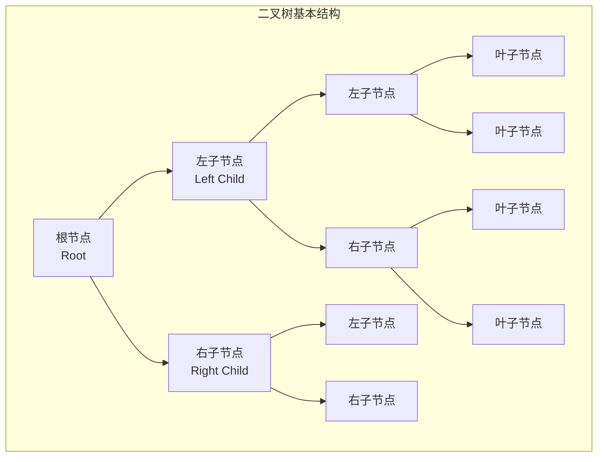
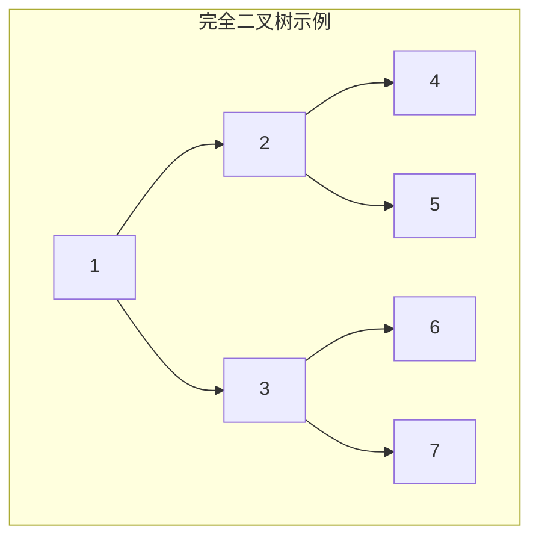
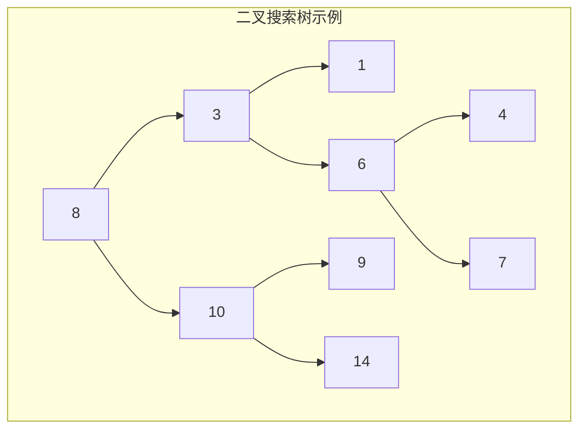
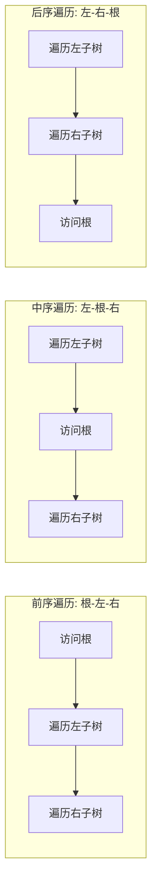
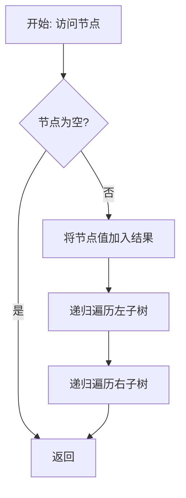

# Day 29：二叉树入门

## 📅 学习目标

今天我们正式开启树形数据结构的学习之旅，从最基础也是最重要的二叉树开始。二叉树是数据结构中的基石，它不仅是理解更复杂树形结构（如红黑树、B树、堆）的基础，更是众多算法问题的核心数据结构。在面试和算法竞赛中，二叉树相关的题目占据了重要位置，掌握二叉树的遍历、操作和性质是每个程序员的必修课。

与此同时，我们将学习C++11引入的多线程编程基础——std::thread。在现代软件开发中，多核处理器已成为标配，并发编程能力越来越重要。std::thread提供了简洁的线程创建和管理接口，是C++程序员进入并发编程世界的第一步。最后，我们还将学习Effective Modern C++中的重要条款：优先使用基于任务的编程而非基于线程的编程，这是编写高质量并发代码的关键建议。

通过今天的学习，你将建立对二叉树的直观认识，掌握三种基本遍历方式（前序、中序、后序），理解多线程编程的基本概念，并学会如何编写更安全的并发代码。

## 📖 知识点一：二叉树数据结构

### 1.1 概念定义

二叉树（Binary Tree）是一种重要的非线性数据结构，它的每个节点最多有两个子节点，分别称为左子节点和右子节点。二叉树的定义具有递归性质：一棵二叉树或者为空，或者由一个根节点和两棵不相交的、分别称为左子树和右子树的二叉树组成。这种递归定义使得二叉树的许多操作都可以用递归算法优雅地实现。

二叉树与普通树的关键区别在于：普通树的节点可以有任意数量的子节点，而二叉树的每个节点最多只有两个子节点，并且这两个子节点有左右之分，顺序不同则构成不同的二叉树。这意味着即使只有一个子节点，区分它是左子节点还是右子节点也是重要的，这会影响到二叉树的结构和遍历结果。

从抽象层面看，二叉树可以表示层次关系、决策过程、表达式结构等多种信息。例如，组织结构图可以用树来表示，表达式 `a + b * c` 可以用二叉树来表示，其中 `+` 是根节点，`a` 是左子节点，`*` 是右子节点，而 `*` 又有子节点 `b` 和 `c`。

### 1.2 专业介绍

从计算机科学的角度，二叉树有着严格的数学定义和丰富的性质：

**完全二叉树（Complete Binary Tree）**：如果一棵二叉树除最后一层外，每一层都被完全填满，并且最后一层的所有节点都集中在左侧，则称为完全二叉树。完全二叉树非常适合用数组来存储，因为节点可以按层序编号，父子节点的索引存在简单的数学关系：对于索引为 i 的节点，其父节点索引为 (i-1)/2，左子节点索引为 2i+1，右子节点索引为 2i+2。

**满二叉树（Full Binary Tree）**：如果一棵二叉树的每个节点要么是叶子节点（没有子节点），要么有两个子节点，则称为满二叉树。满二叉树的一个重要性质是：叶子节点的数量等于内部节点（非叶子节点）的数量加一。

**二叉搜索树（Binary Search Tree, BST）**：如果一棵二叉树满足对于每个节点，其左子树中所有节点的值都小于该节点的值，右子树中所有节点的值都大于该节点的值，则称为二叉搜索树。BST支持高效的查找、插入和删除操作，平均时间复杂度为 O(log n)。

**平衡二叉树**：如果一棵二叉树的任意节点的左右子树高度差不超过某个常数（通常为1），则称为平衡二叉树。平衡性的保证使得树的高度保持在 O(log n) 量级，从而保证操作的效率。常见的平衡二叉树有 AVL 树和红黑树。

二叉树的重要性质：
- 第 i 层最多有 2^(i-1) 个节点（根节点为第1层）
- 深度为 k 的二叉树最多有 2^k - 1 个节点
- 具有 n 个节点的完全二叉树的深度为 ⌊log₂n⌋ + 1
- 对于任意二叉树，如果叶子节点数为 n₀，度为2的节点数为 n₂，则 n₀ = n₂ + 1

### 1.3 通俗解释

想象一个家族的族谱图，每个人（节点）最多有两个孩子（左孩子和右孩子）。最年长的祖先就是"根节点"，没有孩子的成员就是"叶子节点"。这就是二叉树的直观模型。

再想象你在玩一个猜数字游戏，系统会问"数字大于50吗？"如果你回答"是"，就进入右分支；如果回答"否"，就进入左分支。每次选择都会让范围缩小一半，这就是二叉搜索树查找的原理——每次比较都能排除一半的可能性。

二叉树的三种遍历方式可以这样理解：
- **前序遍历**：先访问"自己"，再访问"左孩子"，最后访问"右孩子"。就像你先介绍自己，再介绍你的左孩子，最后介绍你的右孩子。
- **中序遍历**：先访问"左孩子"，再访问"自己"，最后访问"右孩子"。就像先介绍左孩子，再介绍自己，最后介绍右孩子。
- **后序遍历**：先访问"左孩子"，再访问"右孩子"，最后访问"自己"。就像先介绍孩子们，最后才介绍自己。

对于二叉搜索树，中序遍历的结果正好是从小到大排序的，这就像把所有节点"投影"到一条线上。

### 1.4 Mermaid 图示









### 1.5 代码示例

```cpp
/**
 * 二叉树节点定义
 * 这是二叉树最基础的构建块
 */
struct TreeNode {
    int val;            // 节点存储的值
    TreeNode* left;     // 指向左子节点的指针
    TreeNode* right;    // 指向右子节点的指针
    
    // 构造函数
    TreeNode() : val(0), left(nullptr), right(nullptr) {}
    TreeNode(int x) : val(x), left(nullptr), right(nullptr) {}
    TreeNode(int x, TreeNode* left, TreeNode* right) 
        : val(x), left(left), right(right) {}
};

/**
 * 二叉树的基本操作
 */
class BinaryTree {
public:
    // 前序遍历：根 -> 左 -> 右
    void preorderTraversal(TreeNode* root, vector<int>& result) {
        if (root == nullptr) return;
        result.push_back(root->val);           // 访问根
        preorderTraversal(root->left, result);  // 遍历左子树
        preorderTraversal(root->right, result); // 遍历右子树
    }
    
    // 中序遍历：左 -> 根 -> 右
    void inorderTraversal(TreeNode* root, vector<int>& result) {
        if (root == nullptr) return;
        inorderTraversal(root->left, result);   // 遍历左子树
        result.push_back(root->val);            // 访问根
        inorderTraversal(root->right, result);  // 遍历右子树
    }
    
    // 后序遍历：左 -> 右 -> 根
    void postorderTraversal(TreeNode* root, vector<int>& result) {
        if (root == nullptr) return;
        postorderTraversal(root->left, result);  // 遍历左子树
        postorderTraversal(root->right, result); // 遍历右子树
        result.push_back(root->val);             // 访问根
    }
    
    // 计算树的高度
    int getHeight(TreeNode* root) {
        if (root == nullptr) return 0;
        int leftHeight = getHeight(root->left);
        int rightHeight = getHeight(root->right);
        return max(leftHeight, rightHeight) + 1;
    }
    
    // 统计节点数量
    int countNodes(TreeNode* root) {
        if (root == nullptr) return 0;
        return 1 + countNodes(root->left) + countNodes(root->right);
    }
};
```

## 📖 知识点二：std::thread 基础

### 2.1 概念定义

std::thread 是 C++11 标准库引入的线程类，用于创建和管理线程。线程是操作系统能够进行运算调度的最小单位，它被包含在进程之中，是进程中的实际运作单位。一个进程可以包含多个线程，它们共享进程的资源（如内存空间、文件描述符等），但各自拥有独立的执行栈和程序计数器。

在单核处理器时代，多线程主要用于处理阻塞式 I/O 操作，如网络请求、文件读写等。当某个线程在等待 I/O 完成时，其他线程可以继续执行，从而提高程序的响应性。在多核处理器时代，多线程可以实现真正的并行计算，将计算任务分配到多个核心上同时执行，显著提高计算密集型任务的效率。

std::thread 的设计目标是提供一个类型安全、跨平台的线程接口。它封装了底层操作系统的线程 API（如 POSIX 的 pthread 或 Windows 的线程 API），使得开发者可以用统一的 C++ 语法编写多线程代码。std::thread 支持任意可调用对象（函数指针、函数对象、lambda 表达式等）作为线程入口，参数通过模板可变参数传递，确保类型安全。

### 2.2 创建线程

创建线程的第一种方式是传递函数指针。这是最传统的创建线程的方法，只需要将函数名和参数传递给 std::thread 的构造函数即可。线程会立即开始执行，无需手动启动。

```cpp
#include <thread>
#include <iostream>

// 线程入口函数
void printMessage(const std::string& message, int times) {
    for (int i = 0; i < times; i++) {
        std::cout << message << " " << i << std::endl;
    }
}

int main() {
    // 创建线程，传入函数指针和参数
    std::thread t(printMessage, "Hello from thread", 5);
    
    // 等待线程完成
    t.join();
    
    return 0;
}
```

创建线程的第二种方式是使用 Lambda 表达式。Lambda 表达式提供了一种简洁的方式来定义线程要执行的代码，可以直接在创建线程时编写代码逻辑，无需单独定义函数。

```cpp
int main() {
    int value = 42;
    
    // 使用Lambda表达式创建线程
    std::thread t([value]() {
        std::cout << "Lambda thread: value = " << value << std::endl;
    });
    
    t.join();
    return 0;
}
```

创建线程的第三种方式是使用函数对象（Functor）。通过重载 operator()，我们可以创建具有状态的线程对象，这种方式适合需要复用或封装复杂逻辑的场景。

```cpp
class Worker {
public:
    Worker(int id) : id_(id) {}
    
    void operator()() const {
        std::cout << "Worker " << id_ << " is working" << std::endl;
    }
    
private:
    int id_;
};

int main() {
    Worker worker(1);
    std::thread t(worker);  // 传入函数对象
    t.join();
    return 0;
}
```

### 2.3 线程管理

**join() 与 detach()**：这是 std::thread 管理中最基本也是最重要的概念。当一个 std::thread 对象销毁前，必须决定线程的归宿——要么调用 join() 等待线程完成，要么调用 detach() 让线程在后台独立运行。如果两者都没有调用，程序会在 std::thread 析构时调用 std::terminate() 终止程序。

join() 是一种阻塞操作，调用线程会等待被 join 的线程执行完毕。这适用于需要等待线程结果的场景。join() 只能调用一次，调用后 std::thread 对象就不再关联任何线程，可以安全销毁。

```cpp
std::thread t(someFunction);
// ... 做一些其他工作 ...
t.join();  // 等待线程完成
// t 不再关联任何线程，可以安全销毁
```

detach() 将线程分离，使其成为"守护线程"，在后台独立运行。分离后的线程不再受 std::thread 对象管理，当主线程结束时，分离的线程可能还在运行。这适用于不需要等待结果的场景，如后台日志记录、监控任务等。

```cpp
std::thread t(backgroundTask);
t.detach();  // 线程在后台运行，不再被管理
// 主线程继续执行，不等待 t 完成
```

**joinable() 检查**：在调用 join() 或 detach() 之前，应该先检查线程是否 joinable。一个 std::thread 对象如果没有关联任何线程（如默认构造、已被 join 或 detach），则 joinable() 返回 false。

```cpp
std::thread t;
if (t.joinable()) {  // false，默认构造没有关联线程
    t.join();
}

std::thread t2(someFunction);
if (t2.joinable()) {  // true
    t2.join();
}
```

**RAII 管理线程**：为了确保线程一定会被 join 或 detach，可以使用 RAII（资源获取即初始化）技术，封装一个线程守卫类。这样无论函数是正常返回还是异常退出，线程都会被正确处理。

```cpp
class ThreadGuard {
public:
    explicit ThreadGuard(std::thread& t) : thread_(t) {}
    
    ~ThreadGuard() {
        if (thread_.joinable()) {
            thread_.join();  // 析构时自动 join
        }
    }
    
    // 禁止拷贝
    ThreadGuard(const ThreadGuard&) = delete;
    ThreadGuard& operator=(const ThreadGuard&) = delete;
    
private:
    std::thread& thread_;
};

void safeFunction() {
    std::thread t(someFunction);
    ThreadGuard guard(t);  // 确保函数退出时 t 会被 join
    // 即使这里抛出异常，guard 析构时也会 join t
}
```

### 2.4 代码示例

```cpp
/**
 * std::thread 基础演示
 * 展示线程创建、参数传递、join/detach 的基本用法
 */
#include <thread>
#include <iostream>
#include <vector>
#include <chrono>
#include <mutex>

std::mutex printMutex;  // 用于同步输出的互斥锁

// 线程安全的打印函数
void safePrint(const std::string& message) {
    std::lock_guard<std::mutex> lock(printMutex);
    std::cout << message << std::endl;
}

// 1. 使用函数指针创建线程
void workerFunction(int id, int iterations) {
    for (int i = 0; i < iterations; i++) {
        safePrint("Thread " + std::to_string(id) + 
                  ": iteration " + std::to_string(i));
        std::this_thread::sleep_for(std::chrono::milliseconds(100));
    }
}

// 2. 函数对象（Functor）
class Task {
public:
    Task(int id) : id_(id) {}
    
    void operator()() const {
        safePrint("Task " + std::to_string(id_) + " started");
        std::this_thread::sleep_for(std::chrono::milliseconds(200));
        safePrint("Task " + std::to_string(id_) + " completed");
    }
    
private:
    int id_;
};

// 3. RAII 线程守卫
class ThreadJoiner {
public:
    explicit ThreadJoiner(std::thread& t) : thread_(t) {}
    ~ThreadJoiner() {
        if (thread_.joinable()) {
            thread_.join();
        }
    }
private:
    std::thread& thread_;
};

int main() {
    std::cout << "=== std::thread 基础演示 ===" << std::endl;
    
    // 创建多个线程
    std::vector<std::thread> threads;
    
    // 方式1：函数指针
    threads.emplace_back(workerFunction, 1, 3);
    
    // 方式2：Lambda表达式
    threads.emplace_back([]() {
        safePrint("Lambda thread started");
        std::this_thread::sleep_for(std::chrono::milliseconds(150));
        safePrint("Lambda thread completed");
    });
    
    // 方式3：函数对象
    threads.emplace_back(Task(3));
    
    // 等待所有线程完成
    for (auto& t : threads) {
        if (t.joinable()) {
            t.join();
        }
    }
    
    std::cout << "\n所有线程已完成" << std::endl;
    
    // 演示 RAII 管理
    {
        std::thread t([]() {
            safePrint("RAII 管理的线程运行中...");
        });
        ThreadJoiner joiner(t);  // 离开作用域时自动 join
    }
    
    std::cout << "程序结束" << std::endl;
    return 0;
}
```

## 📖 知识点三：EMC++ Item 35 - 优先使用基于任务的编程而非基于线程

### 3.1 条款概述

Effective Modern C++ Item 35 提出：**Prefer task-based programming to thread-based**（优先使用基于任务的编程而非基于线程的编程）。这个条款的核心观点是，在大多数情况下，使用 `std::future` 和 `std::async` 的"基于任务"的方式比直接使用 `std::thread` 的"基于线程"的方式更加优雅和安全。

Scott Meyers 指出，基于线程的编程方式要求程序员手动管理线程的方方面面，包括线程创建、参数传递、结果获取、异常处理、资源管理等。这种低层次的管理不仅繁琐，而且容易出错。相比之下，基于任务的编程让程序员表达"做什么"（任务本身），而让系统决定"怎么做"（线程调度）。

基于任务的编程模型使用 `std::async` 启动异步任务，返回 `std::future` 对象。通过 future，我们可以方便地获取任务的返回值或捕获任务抛出的异常。系统会自动管理底层线程的创建和销毁，程序员只需要关心业务逻辑。

### 3.2 基于线程 vs 基于任务

**基于线程的方式**存在以下问题：

1. **难以获取返回值**：`std::thread` 没有提供获取线程函数返回值的机制。如果需要获取结果，必须通过共享变量、指针传递或全局变量等方式，这增加了代码复杂性和出错风险。

2. **异常处理困难**：如果线程函数抛出异常，异常无法传递到主线程。默认情况下，这会导致程序调用 `std::terminate()` 终止。即使捕获了异常，也需要设计复杂的机制将异常信息传回主线程。

3. **资源管理负担**：程序员必须确保每个 `std::thread` 对象都被正确地 join 或 detach，否则会导致程序崩溃。当程序逻辑复杂、有多个退出路径或存在异常时，这一点尤其容易出错。

4. **线程数量控制**：创建过多的线程会导致"超额订阅"（oversubscription），引发频繁的上下文切换，降低性能。基于线程的方式没有自动控制线程数量的机制。

**基于任务的方式**的优势：

1. **直接获取返回值**：`std::future::get()` 可以直接获取任务的返回值，类型安全。

2. **异常自动传递**：如果任务抛出异常，异常会被存储在 future 中，调用 `get()` 时会重新抛出，可以在调用方处理。

3. **自动资源管理**：系统负责管理线程的生命周期，无需手动 join。

4. **调度灵活性**：系统可以根据当前负载决定是否创建新线程或复用现有线程。

### 3.3 代码对比

```cpp
/**
 * EMC++ Item 35: 优先使用基于任务的编程而非基于线程
 * 
 * 本示例对比两种方式获取异步计算结果的差异
 */
#include <thread>
#include <future>
#include <iostream>
#include <chrono>
#include <stdexcept>

// 模拟一个耗时的计算任务
int computeValue(int input) {
    std::this_thread::sleep_for(std::chrono::milliseconds(100));
    
    if (input < 0) {
        throw std::invalid_argument("Input must be non-negative");
    }
    
    return input * input;  // 返回平方值
}

// ========== 基于线程的方式 ==========
void threadBasedApproach() {
    std::cout << "\n--- 基于线程的方式 ---" << std::endl;
    
    int result = 0;
    bool exceptionOccurred = false;
    std::string exceptionMessage;
    
    // 必须使用引用或指针来获取结果
    std::thread t([&result, &exceptionOccurred, &exceptionMessage]() {
        try {
            result = computeValue(10);
        } catch (const std::exception& e) {
            exceptionOccurred = true;
            exceptionMessage = e.what();
        }
    });
    
    t.join();  // 必须手动 join
    
    if (exceptionOccurred) {
        std::cout << "异常: " << exceptionMessage << std::endl;
    } else {
        std::cout << "结果: " << result << std::endl;
    }
    
    // 问题总结：
    // 1. 需要额外的变量来存储结果和异常信息
    // 2. 必须手动 join
    // 3. 异常处理复杂
}

// ========== 基于任务的方式 ==========
void taskBasedApproach() {
    std::cout << "\n--- 基于任务的方式 ---" << std::endl;
    
    // 使用 std::async 启动异步任务
    std::future<int> future = std::async(std::launch::async, computeValue, 10);
    
    // 可以做其他工作...
    std::cout << "等待计算结果..." << std::endl;
    
    try {
        int result = future.get();  // 直接获取结果，异常会自动重新抛出
        std::cout << "结果: " << result << std::endl;
    } catch (const std::exception& e) {
        std::cout << "异常: " << e.what() << std::endl;
    }
    
    // 优势总结：
    // 1. 直接获取返回值
    // 2. 无需手动管理线程
    // 3. 异常自动传递
}

// 演示异常处理的差异
void demonstrateExceptionHandling() {
    std::cout << "\n--- 异常处理对比 ---" << std::endl;
    
    // 基于任务：异常处理简洁
    auto future = std::async(std::launch::async, computeValue, -5);
    
    try {
        future.get();  // 异常在这里重新抛出
    } catch (const std::exception& e) {
        std::cout << "捕获到异常: " << e.what() << std::endl;
    }
}

// 演示多个任务的并行执行
void multipleTasksDemo() {
    std::cout << "\n--- 多任务并行执行 ---" << std::endl;
    
    auto start = std::chrono::high_resolution_clock::now();
    
    // 创建多个异步任务
    std::vector<std::future<int>> futures;
    for (int i = 0; i < 5; i++) {
        futures.push_back(std::async(std::launch::async, computeValue, i));
    }
    
    // 收集结果
    std::cout << "计算结果: ";
    for (auto& f : futures) {
        std::cout << f.get() << " ";
    }
    std::cout << std::endl;
    
    auto end = std::chrono::high_resolution_clock::now();
    auto duration = std::chrono::duration_cast<std::chrono::milliseconds>(end - start);
    std::cout << "总耗时: " << duration.count() << "ms (并行执行)" << std::endl;
}

int main() {
    std::cout << "=== Item 35: 任务 vs 线程 ===" << std::endl;
    
    threadBasedApproach();
    taskBasedApproach();
    demonstrateExceptionHandling();
    multipleTasksDemo();
    
    std::cout << "\n结论: 在大多数情况下，优先使用 std::async 和 std::future"
              << std::endl;
    std::cout << "它们提供了更简洁的语法、更好的异常安全性和更灵活的调度策略。"
              << std::endl;
    
    return 0;
}
```

### 3.4 什么时候仍然需要 std::thread

虽然 Item 35 推荐基于任务的编程，但在以下场景中，直接使用 `std::thread` 仍然是合适的：

1. **需要访问底层线程 API**：如设置线程优先级、亲和性等
2. **需要实现线程池**：线程池需要更精细的线程控制
3. **需要手动管理线程生命周期**：某些特定场景需要
4. **需要线程本地存储**：配合 `thread_local` 使用

## 🎯 LeetCode 刷题

### 讲解题：LC 144 二叉树的前序遍历

#### 题目概述

给你二叉树的根节点 `root`，返回它节点值的 **前序遍历** 序列。

**示例**：
```
输入：root = [1,null,2,3]
     1
      \
       2
      /
     3

输出：[1,2,3]
```

**前序遍历**：按照「根 -> 左 -> 右」的顺序访问二叉树的节点。这意味着我们首先访问当前节点本身，然后递归地遍历它的左子树，最后递归地遍历它的右子树。

#### 形象化理解

想象你在探索一个家族的家谱图。前序遍历就像是你按照特定的规则来介绍每个家庭成员：先介绍这个人自己，然后介绍他的左孩子家族，最后介绍他的右孩子家族。

```
        家谱图:
           爷爷(1)
          /      \
       爸爸(2)   叔叔(3)
       /    \
    哥哥(4) 我(5)

前序遍历介绍顺序：
1. 先介绍爷爷："这是爷爷"
2. 然后介绍爷爷的左边家族：
   - 先介绍爸爸："这是爸爸"
   - 然后介绍爸爸的左边：介绍哥哥
   - 最后介绍爸爸的右边：介绍我
3. 最后介绍爷爷的右边家族：介绍叔叔

结果：爷爷 -> 爸爸 -> 哥哥 -> 我 -> 叔叔
即：[1, 2, 4, 5, 3]
```

#### 📚 理论介绍

**前序遍历（Preorder Traversal）** 是二叉树深度优先遍历的一种，其名称来源于根节点在遍历序列中的位置——"前"表示根节点在左右子树之前被访问。

**三种遍历方式的对比**：

| 遍历方式 | 访问顺序 | 记忆口诀 | 典型应用 |
|---------|---------|---------|---------|
| 前序遍历 | 根-左-右 | "根在前" | 复制树、表达式前缀表示 |
| 中序遍历 | 左-根-右 | "根在中" | BST排序输出 |
| 后序遍历 | 左-右-根 | "根在后" | 删除树、表达式求值 |

**前序遍历的特点**：
- 根节点总是第一个被访问
- 对于任意节点，其所有左子树节点都在其右子树节点之前被访问
- 遍历序列的第一个节点一定是根节点

**为什么前序遍历重要？**
1. **复制二叉树**：前序遍历可以确定树的结构，结合空节点标记可以唯一确定一棵树
2. **前缀表达式**：算术表达式的前序遍历就是前缀表达式（波兰表达式）
3. **序列化与反序列化**：树的结构化存储常用前序遍历

#### 解题思路

**方法一：递归实现**

递归是最直观的实现方式，严格按照"根-左-右"的顺序访问：



**方法二：迭代实现**

迭代实现使用栈来模拟递归调用栈：

```cpp
// 迭代前序遍历的核心思想
// 1. 访问当前节点
// 2. 先将右子节点入栈（因为要后访问）
// 3. 再将左子节点入栈（因为要先访问）
```

**两种方法对比**：

| 特性 | 递归实现 | 迭代实现 |
|-----|---------|---------|
| 代码简洁性 | 非常简洁 | 相对复杂 |
| 空间复杂度 | O(h) 递归栈 | O(h) 显式栈 |
| 理解难度 | 容易理解 | 需要理解栈操作 |
| 栈溢出风险 | 深树时有风险 | 无风险 |

#### 代码实现

见 `code/leetcode/0144_binary_tree_preorder/` 目录。

#### 复杂度分析

- **时间复杂度**：O(n)，其中 n 是二叉树的节点数。每个节点被访问一次。
- **空间复杂度**：O(h)，其中 h 是树的高度。递归栈或显式栈的最大深度等于树的高度。最坏情况下（树退化为链表），空间复杂度为 O(n)；平均情况下（平衡树），空间复杂度为 O(log n)。

---

### 实战题：LC 145 二叉树的后序遍历

#### 题目概述

给你二叉树的根节点 `root`，返回它节点值的 **后序遍历** 序列。

**示例**：
```
输入：root = [1,null,2,3]
     1
      \
       2
      /
     3

输出：[3,2,1]
```

**后序遍历**：按照「左 -> 右 -> 根」的顺序访问二叉树的节点。这意味着我们先递归地遍历左子树，然后递归地遍历右子树，最后访问当前节点本身。

#### 形象化理解

后序遍历就像是"先处理孩子，再处理自己"的原则。想象你在处理一个公司的组织架构，后序遍历意味着：先处理所有下属的工作，最后再处理自己的工作——这样你做自己的工作时，已经知道下属的所有情况了。

```
         组织架构:
              CEO(1)
             /      \
         经理A(2)   经理B(3)
         /    \
      员工C(4) 员工D(5)

后序遍历处理顺序：
1. 先处理CEO的左边：
   - 先处理经理A的左边：处理员工C
   - 再处理经理A的右边：处理员工D
   - 最后处理经理A自己
2. 然后处理CEO的右边：处理经理B
3. 最后处理CEO自己

结果：员工C -> 员工D -> 经理A -> 经理B -> CEO
即：[4, 5, 2, 3, 1]
```

后序遍历的一个经典应用是**计算目录大小**：要计算一个目录的大小，需要先计算所有子目录的大小，最后再加总得到当前目录的大小。这就是"后序"的思想。

#### 📚 理论介绍

**后序遍历（Postorder Traversal）** 同样是深度优先遍历的一种，"后"表示根节点在左右子树之后被访问。

**后序遍历的独特性质**：
- **根节点总是最后一个被访问**：这使得后序遍历非常适合"自底向上"的处理
- **父节点在子节点之后处理**：适合需要先处理子节点再处理父节点的场景

**后序遍历的典型应用**：

1. **删除二叉树**：必须先删除子节点，再删除父节点，否则会丢失子节点的引用
2. **计算表达式树**：后序遍历的结果就是后缀表达式（逆波兰表达式），可以直接用于计算
3. **目录空间计算**：先计算子目录大小，再汇总父目录
4. **查找两个节点的最近公共祖先**：后序遍历可以方便地收集子树信息

**前序与后序的关系**：

有趣的是，前序遍历和后序遍历存在一种"镜像"关系：
- 前序：根 -> 左 -> 右
- 后序：左 -> 右 -> 根

如果我们将前序遍历中的"左"和"右"交换，得到：根 -> 右 -> 左
然后将结果反转，就得到：左 -> 右 -> 根（即后序遍历）

这个性质可以用来实现一种巧妙的迭代后序遍历算法。

#### 解题思路

**方法一：递归实现**

递归实现严格按照"左-右-根"的顺序：

```cpp
void postorder(TreeNode* root, vector<int>& result) {
    if (root == nullptr) return;
    postorder(root->left, result);   // 先遍历左子树
    postorder(root->right, result);  // 再遍历右子树
    result.push_back(root->val);     // 最后访问根
}
```

**方法二：迭代实现（经典方法）**

后序遍历的迭代实现比前序和中序更复杂，因为我们需要在访问完左右子树之后才能访问根节点。这引入了一个问题：当我们从栈中弹出一个节点时，如何判断它的左右子树是否已经被处理？

解决方案是记录上一个访问的节点：
- 如果上一个访问的是右子节点，说明左右子树都已处理完，可以访问当前节点
- 如果上一个访问的是左子节点，说明右子树还没处理，先处理右子树
- 如果上一个访问的不是子节点，说明左右子树都没处理，先处理左子树

**方法三：迭代实现（反转法）**

利用前序和后序的关系：
1. 按照"根 -> 右 -> 左"的顺序遍历（修改版前序）
2. 将结果反转

```cpp
vector<int> postorderTraversal(TreeNode* root) {
    vector<int> result;
    stack<TreeNode*> stk;
    if (root) stk.push(root);
    
    while (!stk.empty()) {
        TreeNode* node = stk.top();
        stk.pop();
        result.push_back(node->val);  // 先访问根
        
        // 注意：先压左，再压右（与前序遍历相反）
        if (node->left) stk.push(node->left);
        if (node->right) stk.push(node->right);
    }
    
    reverse(result.begin(), result.end());  // 反转得到后序
    return result;
}
```

#### 代码实现

见 `code/leetcode/0145_binary_tree_postorder/` 目录。

#### 复杂度分析

- **时间复杂度**：O(n)，每个节点被访问一次。
- **空间复杂度**：O(h)，递归栈或显式栈的最大深度。

## 🚀 运行代码

```bash
# 进入Day 29目录
cd /home/z/my-project/download/week_05/day_29

# 编译并运行
./build_and_run.sh

# 或手动编译
mkdir build && cd build
cmake ..
make
./day_29_demo
```

## 📚 相关术语

| 术语 | 英文 | 解释 |
|------|------|------|
| 二叉树 | Binary Tree | 每个节点最多有两个子节点的树结构 |
| 根节点 | Root | 树的顶端节点，没有父节点 |
| 叶子节点 | Leaf Node | 没有子节点的节点 |
| 完全二叉树 | Complete Binary Tree | 除最后一层外完全填满，最后一层靠左排列 |
| 满二叉树 | Full Binary Tree | 每个节点要么是叶子，要么有两个子节点 |
| 二叉搜索树 | Binary Search Tree | 左子树值 < 根值 < 右子树值 |
| 前序遍历 | Preorder Traversal | 根-左-右的遍历顺序 |
| 中序遍历 | Inorder Traversal | 左-根-右的遍历顺序 |
| 后序遍历 | Postorder Traversal | 左-右-根的遍历顺序 |
| 线程 | Thread | 操作系统调度的最小执行单元 |
| 异步任务 | Async Task | 通过 std::async 启动的异步计算 |
| Future | std::future | 用于获取异步任务结果的同步原语 |

## 💡 学习提示

1. **理解递归的本质**：二叉树的问题大多可以用递归优雅地解决。递归的关键在于相信子问题能够正确解决，然后专注于当前节点的处理。

2. **画图辅助理解**：在学习二叉树时，养成画图的习惯。画出树的结构，追踪遍历的顺序，能极大帮助理解。

3. **掌握三种遍历**：前序、中序、后序遍历是二叉树最基础的操作，必须熟练掌握。建议先用递归实现，再尝试迭代实现。

4. **注意边界条件**：处理二叉树问题时，特别注意空节点的情况。递归的终止条件通常是 `root == nullptr`。

5. **多线程编程的复杂性**：std::thread 是并发编程的入门，但要写出正确的多线程代码，还需要学习互斥锁、条件变量、原子操作等知识。今天的重点是理解线程的基本概念和任务优先原则。

6. **任务优于线程**：在实际开发中，优先考虑使用 std::async 和 std::future，除非你有特殊需求必须直接控制线程。

## 🔗 参考资料

- [C++ Reference - std::thread](https://en.cppreference.com/w/cpp/thread/thread)
- [C++ Reference - std::async](https://en.cppreference.com/w/cpp/thread/async)
- [LeetCode 144 - Binary Tree Preorder Traversal](https://leetcode.com/problems/binary-tree-preorder-traversal/)
- [LeetCode 145 - Binary Tree Postorder Traversal](https://leetcode.com/problems/binary-tree-postorder-traversal/)
- 《Effective Modern C++》Item 35
- 《算法导论》第12章：二叉搜索树
- 《数据结构与算法分析》第4章：树
