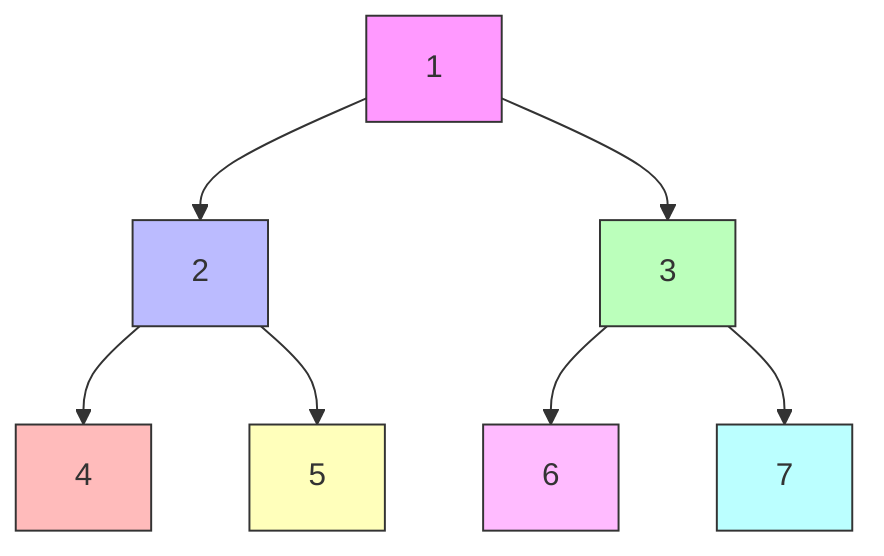
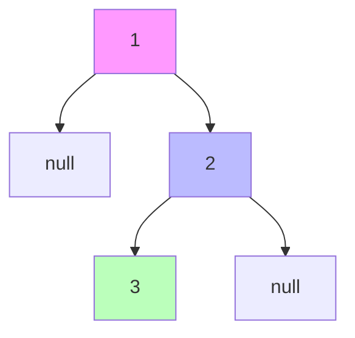
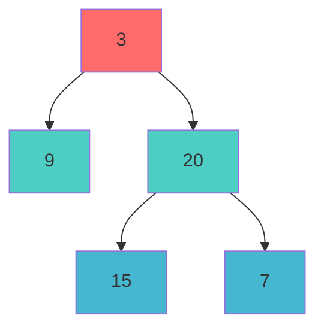

# Day 30: 树遍历

> **学习定位**：树遍历关注“何时访问节点”，互斥锁关注“何时允许线程访问共享状态”。两条线都要求明确时序。本日 EMC++ Item 36-37 分别讨论 `async` 启动策略和 `thread` 生命周期。

> **共性入口**：四种遍历的队列/栈手算见 [形象化指南的 Day 30](../树与并发专题形象化题解指南.md#day30-visual)；mutex、多锁与 RAII 的完整机制见 [C++ 并发编程教程](../../tutorials/CPP并发编程教程.md)；Item 36–37 的主讲见 [Effective Modern C++ 教程](../../tutorials/Effective_Modern_CPP教程.md)。本日新增的是“访问顺序不变量”“mutex 建立的同步边”和“多锁事务边界”。

> **前后关系**：上一日 [Day 29](../day_29/README.md) 只管理单个线程和树的递归入口；下一日 [Day 31](../day_31/README.md) 把局部有序关系升级成 BST 全局上下界，并让线程等待受锁谓词而不是忙等。

## 📅 学习目标

今天我们将深入学习二叉树的核心操作——遍历，以及C++多线程编程中至关重要的同步机制——互斥锁。通过今天的学习，你将掌握四种经典的二叉树遍历方式（前序、中序、后序、层序），理解它们各自的访问顺序和应用场景。同时，你将学会如何使用 `std::mutex` 保护共享数据，避免多线程环境下的数据竞争问题。此外，我们还将探讨 Effective Modern C++ 中关于异步任务执行策略的重要建议，帮助你写出更高效、更可靠的多线程代码。

**本日学习重点：**
- 掌握四种二叉树遍历方式的递归与迭代实现
- 理解 `std::mutex` 的基本用法和死锁预防策略
- 学习 `std::launch::async` 策略的正确使用方式
- 用所有权、不变量和非零退出码组织六个可执行测试
- 完成两道经典的二叉树遍历 LeetCode 题目

---

## 📖 知识点一：二叉树遍历

### 概念定义

二叉树遍历是指按照某种特定顺序访问二叉树中的每个节点，且每个节点恰好被访问一次。遍历是二叉树上最基础也是最重要的操作，它是许多树相关算法的基础。根据访问根节点的时机不同，遍历方式主要分为四种：前序遍历、中序遍历、后序遍历和层序遍历。

前三种遍历（前序、中序、后序）属于深度优先遍历（DFS）的范畴，它们沿着树的深度方向尽可能深地搜索，直到到达叶子节点再回溯。而层序遍历属于广度优先遍历（BFS），它按照从上到下、从左到右的顺序逐层访问节点。不同的遍历方式在表达式求值、语法分析、序列化与反序列化等场景中有着各自独特的应用价值。

### 四种遍历方式详解

#### 1. 前序遍历（Pre-order Traversal）

**访问顺序：根节点 → 左子树 → 右子树**

前序遍历的特点是"根优先"，即在任何子树被访问之前，先访问其根节点。这种遍历方式的名称"前序"正是来源于根节点在访问顺序中的"前"位置。前序遍历在实际应用中常用于：复制二叉树、计算表达式树的前缀表达式（波兰表示法）、序列化二叉树结构等场景。

遍历过程中，当我们访问一个节点时，首先处理该节点的数据，然后递归地遍历其左子树，最后递归地遍历其右子树。这种"先处理后遍历"的模式使得前序遍历非常适合需要"自顶向下"处理问题的场景。

#### 2. 中序遍历（In-order Traversal）

**访问顺序：左子树 → 根节点 → 右子树**

中序遍历的特点是根节点在左右子树"中间"被访问，这也是"中序"名称的由来。对于二叉搜索树（BST），中序遍历能够按照升序输出所有节点值，这一特性使得中序遍历在BST相关操作中具有特殊的重要性。

在实际应用中，中序遍历常用于：二叉搜索树的有序输出、表达式树的中缀表达式生成、验证二叉搜索树的有效性等。中序遍历的递归过程体现了"先深入再处理"的思想，先完全处理左子树后，才处理当前节点，最后处理右子树。

#### 3. 后序遍历（Post-order Traversal）

**访问顺序：左子树 → 右子树 → 根节点**

后序遍历的特点是根节点"最后"被访问，只有在左右子树都遍历完成后，才会访问根节点。这种"自底向上"的访问模式使得后序遍历特别适合需要先处理子节点再处理父节点的场景。

后序遍历的经典应用包括：计算表达式树的后缀表达式（逆波兰表示法）、计算目录占用的磁盘空间（先计算子目录，再汇总）、释放二叉树的内存（先释放子节点，再释放根节点）。在这些问题中，必须先获得子节点的信息，才能正确处理父节点。

#### 4. 层序遍历（Level-order Traversal）

**访问顺序：从上到下，从左到右，逐层访问**

层序遍历按照树的层级从上到下，每一层从左到右依次访问所有节点。与前三种深度优先遍历不同，层序遍历是广度优先的体现，它需要借助队列这种数据结构来实现。

层序遍历在实际应用中非常广泛：计算树的最大深度、判断是否为完全二叉树、找出每一层的最右节点（右视图问题）、二叉树的序列化与反序列化等。层序遍历天然地保持了节点的"邻居关系"，使得它非常适合处理需要按层级处理节点的问题。

### Mermaid 图示：遍历过程演示

下面我们用一个具体的二叉树来展示四种遍历的结果：



**四种遍历结果：**
| 遍历方式 | 访问顺序 | 结果序列 |
|---------|---------|---------|
| 前序遍历 | 根→左→右 | 1, 2, 4, 5, 3, 6, 7 |
| 中序遍历 | 左→根→右 | 4, 2, 5, 1, 6, 3, 7 |
| 后序遍历 | 左→右→根 | 4, 5, 2, 6, 7, 3, 1 |
| 层序遍历 | 逐层从左到右 | 1, 2, 3, 4, 5, 6, 7 |

### 递归与迭代实现对比

**递归实现**的代码简洁优雅，直接反映了遍历的逻辑定义。以前序遍历为例，递归版本只需三行核心代码：访问根节点、递归左子树、递归右子树。递归实现的缺点是对于深度很大的树，可能导致栈溢出。

**迭代实现**使用显式的栈（前/中/后序）或队列（层序）来模拟递归过程。迭代实现虽然代码更复杂，但不会因树过深直接耗尽调用栈；它的容器仍可能因内存不足而失败。对于后序遍历，迭代实现尤其需要注意处理“何时访问根节点”的判断逻辑。

可以把 DFS 的接口契约写成三个部分：输入指针只借用且允许为空，函数不改变树结构，每个可达节点恰好向结果追加一次。递归版把“处理一棵子树”交给调用栈，迭代版必须自己保存尚未完成的工作；显式栈避免耗尽调用栈，但仍占 O(h) 到 O(n) 的动态内存。层序遍历的关键不变量是“每轮开始时，队列前 `levelSize` 个节点恰好属于当前层”，因此必须先保存队列大小，再把新发现的孩子排到下一层尾部。

下块是 LeetCode 原始指针接口的局部遍历片段，**不可单独编译**；省略 `<vector>`、`<stack>`、`std::` 限定和 `TreeNode { int val; TreeNode* left; TreeNode* right; }`。

```cpp
// 前序遍历 - 递归版本
void preorder(TreeNode* root, vector<int>& result) {
    if (root == nullptr) return;
    result.push_back(root->val);      // 访问根节点
    preorder(root->left, result);     // 遍历左子树
    preorder(root->right, result);    // 遍历右子树
}

// 前序遍历 - 迭代版本
vector<int> preorderTraversal(TreeNode* root) {
    vector<int> result;
    stack<TreeNode*> stk;
    if (root) stk.push(root);
    
    while (!stk.empty()) {
        TreeNode* node = stk.top(); stk.pop();
        result.push_back(node->val);
        if (node->right) stk.push(node->right);  // 右孩子先入栈
        if (node->left) stk.push(node->left);    // 左孩子后入栈（先出）
    }
    return result;
}
```

---

## 📖 知识点二：mutex 互斥锁

### 概念定义

在多线程编程中，若两个可能并发的访问作用于同一内存位置、至少一个访问会修改该位置、至少一个访问不是原子操作，并且两者之间没有 happens-before，就形成数据竞争（Data Race）。数据竞争在 C++ 内存模型中是未定义行为，不能把“偶尔得到较小计数”当作可重复实验，更不能在正常测试里故意执行它。`std::mutex`（互斥锁）通过一次 `unlock` 与随后成功取得同一 mutex 的 `lock` 之间的同步关系，既排除同一临界区的并发进入，也让前一个线程在解锁前完成的写入对后一个线程可见。

互斥锁的工作原理类似于一把钥匙：线程在进入临界区之前必须先“获取锁”，离开时“释放锁”。当一个线程持有锁时，其他试图获取同一把锁的线程会等待；这提供互斥和可见性，但不代表临界区变成 CPU 的单条原子指令，也不自动保护忘记使用同一把锁的访问。mutex 真正保护的是一组业务不变量，而不是名为 `counter` 或 `balance` 的某个变量；所有参与该不变量的读写都必须遵守同一锁协议。

### 基本使用方法

C++11 提供了 `std::mutex` 类，其核心操作包括：

- `lock()`：获取锁。如果锁已被其他线程持有，当前线程将阻塞等待。
- `unlock()`：释放锁。必须由持有锁的线程调用。
- `try_lock()`：尝试获取锁。如果锁可用则获取并返回 true；否则立即返回 false，不阻塞。

```cpp
#include <mutex>
#include <thread>
#include <iostream>

std::mutex mtx;
int shared_counter = 0;

void increment(int iterations) {
    for (int i = 0; i < iterations; ++i) {
        const std::lock_guard<std::mutex> lock(mtx);
        ++shared_counter;  // 临界区：受保护的操作
    }
}

int main() {
    std::thread t1(increment, 10000);
    std::thread t2(increment, 10000);
    
    t1.join();
    t2.join();
    
    std::cout << "Counter: " << shared_counter << std::endl;  // 正确输出 20000
    return 0;
}
```

### 死锁问题与预防

**死锁（Deadlock）** 是多线程编程中的经典问题，指两个或多个线程互相等待对方释放锁，导致所有相关线程都无法继续执行的情况。死锁产生的四个必要条件（Coffman条件）：

1. **互斥条件**：资源只能被一个线程占用
2. **持有并等待**：线程持有资源同时等待其他资源
3. **不可剥夺**：资源不能被强制抢占
4. **循环等待**：存在线程等待的循环链

**预防死锁的常用策略：**

1. **按固定顺序加锁**：当需要同时获取多把锁时，所有线程都按相同顺序获取
2. **使用 `std::scoped_lock` 或 `std::lock` 获取多把锁**：它们使用避免死锁的加锁算法
3. **限制锁的持有时间**：尽快释放锁，减少锁的争用
4. **避免嵌套锁**：在持有锁的情况下，不要再尝试获取其他锁

最典型的失败方式是线程 A 先锁 `mtx1` 再等 `mtx2`，线程 B 同时先锁 `mtx2` 再等 `mtx1`；它可能偶发卡死，所以不能放进自动测试等待“复现”。安全版本把“两个账户余额之和保持不变”写成不变量，并让同一个 RAII 对象管理两把锁：

```cpp
#include <limits>
#include <mutex>
#include <stdexcept>

struct Account {
    explicit Account(int initial_balance) : balance(initial_balance) {
        if (initial_balance < 0) {
            throw std::invalid_argument("account balance must be non-negative");
        }
    }

    int balance;
    std::mutex mutex;
};

bool transfer(Account& from, Account& to, int amount) {
    if (&from == &to || amount <= 0) {
        return false;  // 同一 mutex 不能作为两把锁交给 scoped_lock
    }
    const std::scoped_lock lock(from.mutex, to.mutex);
    const int maximum = std::numeric_limits<int>::max();
    if (from.balance < amount || to.balance > maximum - amount) {
        return false;
    }
    from.balance -= amount;
    to.balance += amount;
    return true;
}
```

`std::scoped_lock` 的构造过程使用避免死锁的算法，但调用者仍要先处理“两个参数其实是同一个账户”的别名情况；把同一个非递归 mutex 作为两把不同锁传入不满足多锁算法的前提。这里的数值契约是：初始余额必须位于 `[0, INT_MAX]`，金额必须为正，来源余额必须充足，目标余额执行加法后仍须位于 `int` 范围。两把锁都取得后才检查余额与容量，`to.balance > INT_MAX - amount` 在真正相加前拒绝溢出；任一检查失败都不修改任何余额，因此失败也是原子事务结果。`mutex_demo` 同时回归 `INT_MAX + 1` 拒绝且余额不变、恰好到达 `INT_MAX` 成功，以及正常双向并发转账。避免死锁也不等于公平：某个线程仍可能长期拿不到锁；若需等待条件、超时或可取消获取，应选择 `std::unique_lock` 配合条件变量或可定时互斥量，而不是扩大临界区。

### lock_guard 与 RAII

手动调用 `lock()` 和 `unlock()` 存在隐患：如果临界区代码抛出异常，`unlock()` 可能永远不会被执行，导致死锁。C++11 提供的 `std::lock_guard` 利用 RAII（资源获取即初始化）机制，在构造时自动获取锁，在析构时自动释放锁，无论是否发生异常。

下块是临界区局部片段，**不可单独编译**；省略 `<mutex>` 及由外部所有者管理的 `std::mutex mtx` 和 `int shared_counter` 定义。

```cpp
void safe_increment() {
    std::lock_guard<std::mutex> lock(mtx);  // 构造时自动 lock()
    ++shared_counter;
    // 函数结束，lock_guard 析构时自动 unlock()
    // 即使抛出异常，也能正确释放锁
}
```

C++17 进一步提供了 `std::scoped_lock`，它可以同时管理多把互斥锁，使用更加灵活。同时，`std::unique_lock` 提供了比 `lock_guard` 更丰富的功能，如延迟加锁、条件变量配合等。

下块是多锁临界区局部片段，**不可单独编译**；省略 `<mutex>` 和两个不同的 `std::mutex mtx1`/`mtx2` 定义。

```cpp
// C++17 scoped_lock 同时管理多把锁
void safe_multi_lock() {
    std::scoped_lock lock(mtx1, mtx2);  // 自动获取并释放两把锁
    // ... 临界区操作
}
```

---

## 📖 知识点三：EMC++ Item 36-37

<a id="item-36"></a>

### Item 36: 如果异步是必要的，使用 std::launch::async

`std::async` 返回关联共享状态的 `std::future`。省略策略时等价于允许 `std::launch::async | std::launch::deferred`：实现可以让函数在新的执行线程中运行，也可以把它推迟到第一次非定时等待，在执行等待的线程中运行。选择 `deferred` 时，如果 future 从未被 `get()` 或 `wait()`，任务甚至不会执行。

下块是启动策略局部片段，**不可单独编译**；省略 `<future>`、外围函数和可调用对象 `doWork` 的定义。

```cpp
auto unspecified = std::async(doWork);  // async 或 deferred 都合法

auto required = std::async(std::launch::async, doWork);  // 必须异步执行，否则抛异常
```

默认策略会破坏一些隐含假设：任务未必与调用者并行，`thread_local` 状态可能属于等待线程，依赖“另一个线程先做某事”的协议可能卡住，轮询 `wait_for` 的循环若不识别 `deferred` 还可能永远循环。若异步执行是接口契约的一部分，就显式指定 `std::launch::async`；资源不足时它可能抛出 `std::system_error`，调用方应决定传播、降级还是限流。

不要用耗时阈值证明任务“并行”：调度器、机器负载和虚拟化都会改变时间。可稳定测试的是策略状态与结果不变量：显式 `deferred` 的 `wait_for(0s)` 必须返回 `future_status::deferred`，显式 `async` 则不会返回该状态，但可能已经完成也可能仍为 `timeout`。

下块是状态检查局部片段，**不可单独编译**；省略 `<future>`、`<chrono>` 和外围函数。读取结果只能对普通 `future` 调用一次 `get()`。

```cpp
auto task = std::async(std::launch::deferred, [] { return 9; });
if (task.wait_for(std::chrono::seconds(0)) == std::future_status::deferred) {
    // 明确知道 get() 将在当前线程执行任务，而不是继续做错误的轮询。
}
int value = task.get();
```

默认策略并非总是错误：如果调用方接受延迟求值或异步执行两种语义，且没有线程身份、时限或并行性依赖，交给实现选择可能合理。需要有界并发、任务队列、优先级、背压或统一停止时，`std::async` 也不是线程池的替代品，应使用项目提供的执行器或线程池接口。

<a id="item-37"></a>

### Item 37: 确保 `std::thread` 在所有路径上都不可 join

`std::thread` 对象析构时若仍 `joinable()`，程序会调用 `std::terminate()`；正常返回写了 `join()` 并不够，提前返回和异常路径也必须覆盖。最稳妥的 C++17 方案是让 RAII 对象拥有线程，并在析构时把它变成不可 join；析构选择 `join` 会等待任务结束，因此任务还必须有有界完成或明确停止协议，否则作用域退出可能永久阻塞。

```cpp
#include <thread>
#include <utility>

class JoiningThread {
public:
    explicit JoiningThread(std::thread thread) : thread_(std::move(thread)) {}

    ~JoiningThread() {
        if (thread_.joinable()) {
            thread_.join();
        }
    }

    JoiningThread(const JoiningThread&) = delete;
    JoiningThread& operator=(const JoiningThread&) = delete;

private:
    std::thread thread_;
};
```

不要机械地 `detach()`：它会丢失完成点和异常通道，外部对象销毁后继续访问会形成悬空引用。也不能从线程自身对同一线程 `join()`，那会导致 `std::system_error`；C++20 的 `std::jthread` 提供析构请求停止并 join 的更好默认值，但任务仍需主动检查停止令牌。

### 补充：不要随手丢弃 `std::async` 返回的 future

当 `std::async(std::launch::async, ...)` 创建的共享状态只剩最后一个关联句柄时，释放该状态可能等待异步任务完成。因此临时 future 在完整表达式结束时就销毁，常会让两次看似异步的调用表现成顺序等待；普通 promise 或 packaged_task 产生的 future 析构不具有这项特殊等待语义。这个现象属于 Item 38 的句柄析构边界，但与 Item 36 的 API 使用紧密相关，放在这里一起观察。

```cpp
#include <future>

int calculate(int value) {
    return value * value;
}

// 问题代码：每条语句都立即丢弃 future。
int wrong_way() {
    static_cast<void>(std::async(std::launch::async, calculate, 20));
    // 临时 future 在完整表达式末尾释放；对 launch::async 创建的状态，可能在此等待任务完成
    static_cast<void>(std::async(std::launch::async, calculate, 30));
    return 0;  // 两个结果也都丢失了
}

// 正确做法：先保留两个句柄，再通过 get 建立完成点并检查结果。
int right_way() {
    auto first = std::async(std::launch::async, calculate, 20);
    auto second = std::async(std::launch::async, calculate, 30);
    return first.get() + second.get();  // 稳定结果为 1300，不检查耗时或完成顺序
}
```

这里验证的是句柄生命周期和结果不变量，不是“多少毫秒内完成”；即使运行环境只给一个核心或调度器延后某个任务，`right_way()` 的接口契约仍然成立。

**重要原则：**
- 不要忽视 `std::async` 返回的 `std::future`
- `wait()` 只等待，`get()` 还会取得值或重新抛出异常，并使该 future 失效
- 考虑使用线程池等更可控的并发方案替代 `std::async`

---

## 🎯 LeetCode 刷题

### 讲解题：LC 94 二叉树的中序遍历

#### 题目概述

给定一个二叉树的根节点 `root`，返回它的**中序遍历**结果。中序遍历的访问顺序是：左子树 → 根节点 → 右子树。

**示例输入输出：**
```
输入: root = [1,null,2,3]
     1
      \
       2
      /
     3

输出: [1,3,2]
```

#### 形象化提示

想象你是一位考古学家，正在探索一座树形的古墓：
1. 你总是先深入**左侧**的通道，直到无路可走
2. 在最深处，你**记录**当前位置的宝藏（访问节点）
3. 然后回溯，看看有没有**右侧**的通道可以探索
4. 这就是"左→根→右"的探索模式



**遍历过程：**
1. 从根节点 1 开始，尝试深入左子树 → 空，返回
2. 访问当前节点 1 → 记录 [1]
3. 进入右子树（节点 2）
4. 尝试深入左子树（节点 3）
5. 节点 3 无左子树 → 访问 3 → 记录 [1, 3]
6. 节点 3 无右子树 → 返回节点 2
7. 访问节点 2 → 记录 [1, 3, 2]
8. 完成！

#### 解题思路

**方法一：递归（推荐初学者）**

递归是最直观的实现方式，代码简洁易懂：
1. 如果当前节点为空，直接返回
2. 递归遍历左子树
3. 记录当前节点值
4. 递归遍历右子树

**方法二：迭代（使用栈）**

迭代方式模拟递归的调用栈：
1. 使用一个指针从根节点开始，一路向左，沿途节点入栈
2. 当无法继续向左时，弹出栈顶节点并访问
3. 然后转向该节点的右子树，重复上述过程

下块是 LeetCode 的局部中序遍历片段，**不可单独编译**；省略 `<vector>`、`<stack>`、`std::` 限定和 `TreeNode` 原始指针接口定义。

```cpp
// 迭代版本
vector<int> inorderTraversal(TreeNode* root) {
    vector<int> result;
    stack<TreeNode*> stk;
    TreeNode* curr = root;
    
    while (curr != nullptr || !stk.empty()) {
        // 一路向左，入栈
        while (curr != nullptr) {
            stk.push(curr);
            curr = curr->left;
        }
        // 弹出并访问
        curr = stk.top();
        stk.pop();
        result.push_back(curr->val);
        // 转向右子树
        curr = curr->right;
    }
    return result;
}
```

**复杂度分析：**
- 时间复杂度：O(n)，每个节点访问一次
- 空间复杂度：O(h)，h 为树的高度（栈的最大深度）

---

### 实战题：LC 102 二叉树的层序遍历

#### 题目概述

给定一个二叉树，返回其节点值的**层序遍历**结果（按层次从上到下，从左到右）。

**示例输入输出：**
```
输入: root = [3,9,20,null,null,15,7]
     3
    / \
   9  20
     /  \
    15   7

输出: [[3], [9,20], [15,7]]
```

#### 形象化提示

想象你站在一座金字塔前，需要从上到下记录每一层的人数：
1. 站在最顶层（第0层），记录人数
2. 然后走向下一层，从左到右记录这一层所有人
3. 继续向下，直到最底层

这就像**电梯停靠**：每一层都要停一下，看看这一层有哪些人（节点），然后继续下一层。



**颜色说明：** 红色为第0层，青色为第1层，蓝色为第2层

#### 解题思路

**核心算法：广度优先搜索（BFS）+ 队列**

层序遍历天然适合使用队列来实现：
1. 将根节点入队
2. 循环处理队列，每次处理一层的所有节点
3. 对于每个出队的节点，将其子节点入队
4. 记录每一层的节点值

**关键技巧：如何区分不同层？**

方法一：使用两个变量 `currentLevelSize` 和 `nextLevelSize`
方法二：在每层开始时，记录当前队列大小，这就是该层的节点数

下块是 LeetCode 的局部层序遍历片段，**不可单独编译**；省略 `<vector>`、`<queue>`、`<cstddef>`、`std::` 限定和 `TreeNode` 定义。

```cpp
vector<vector<int>> levelOrder(TreeNode* root) {
    vector<vector<int>> result;
    if (root == nullptr) return result;
    
    queue<TreeNode*> q;
    q.push(root);
    
    while (!q.empty()) {
        const std::size_t levelSize = q.size();  // 当前层的节点数
        vector<int> currentLevel;
        
        for (std::size_t i = 0; i < levelSize; ++i) {
            TreeNode* node = q.front();
            q.pop();
            currentLevel.push_back(node->val);
            
            if (node->left) q.push(node->left);
            if (node->right) q.push(node->right);
        }
        result.push_back(currentLevel);
    }
    return result;
}
```

**复杂度分析：**
- 时间复杂度：O(n)，每个节点入队出队各一次
- 空间复杂度：O(w)，w 为树的最大宽度（队列最大容量）

课程工程中的树演示使用 `std::unique_ptr` 表达父节点独占子树；LeetCode 固定接口使用原始指针时，测试负责在所有断言之后按后序释放。实现与验证分别见 [LC 94 源码](code/leetcode/0094_binary_tree_inorder/solution.cpp)、[LC 94 测试](code/leetcode/0094_binary_tree_inorder/test.cpp)、[LC 102 源码](code/leetcode/0102_binary_tree_level_order/solution.cpp) 和 [LC 102 测试](code/leetcode/0102_binary_tree_level_order/test.cpp)。

---

## 🚀 运行代码

### 今日工程动作：把并发不变量写成稳定测试

本日不执行故意的数据竞争或死锁，也不以“100 ms 内完成”之类时序阈值作断言。`mutex_demo` 验证受锁保护的计数器精确达到目标，验证正常双向转账后的余额内容与总和，并回归目标余额溢出时拒绝且零修改；Item 36–37 测试检查 future 状态、计算结果和异常退栈时自动 join。脚本从全新 `build` 目录按 C++17 Release 与严格告警构建六个可执行目标，CTest 中任何不变量失败都会得到非零退出码。

### 编译与运行

```bash
# 进入 day_30 目录
cd week_05/day_30

# 脚本已随仓库保存为可执行文件，直接运行
./build_and_run.sh

# 或逐条执行同一流程
cmake -E remove_directory build
cmake -S . -B build -DCMAKE_BUILD_TYPE=Release -DCMAKE_CXX_STANDARD=17 \
  -DCMAKE_CXX_FLAGS="-Wall -Wextra -Wpedantic -Wconversion -Wsign-conversion -Wshadow -Werror"
cmake --build build --parallel
ctest --test-dir build --output-on-failure
```

### 预期输出

CTest 将验证：
1. 四种树遍历的结果对比
2. mutex 保护共享变量的多线程示例
3. EMC++ Item 36-37 的异步策略演示
4. LeetCode 94 和 102 的解题代码运行

---

## 📚 相关术语

| 术语 | 英文 | 解释 |
|------|------|------|
| 前序遍历 | Pre-order Traversal | 先访问根节点，再遍历左右子树 |
| 中序遍历 | In-order Traversal | 先遍历左子树，再访问根节点，最后遍历右子树 |
| 后序遍历 | Post-order Traversal | 先遍历左右子树，最后访问根节点 |
| 层序遍历 | Level-order Traversal | 按层级从上到下、从左到右访问节点 |
| 互斥锁 | Mutex | 保证同一时刻只有一个线程访问临界区的同步原语 |
| 死锁 | Deadlock | 多个线程互相等待对方释放资源，导致无法继续执行 |
| RAII | Resource Acquisition Is Initialization | 资源获取即初始化，利用对象生命周期管理资源 |
| 临界区 | Critical Section | 需要互斥访问的代码区域 |
| 数据竞争 | Data Race | 无 happens-before 的冲突访问；至少一个访问会修改且至少一个不是原子操作，结果是未定义行为 |
| 异步策略 | Launch Policy | 决定 std::async 如何执行任务的策略 |

---

## 💡 学习提示

1. **理解遍历本质**：四种遍历方式的核心区别在于访问根节点的时机不同，理解这一点有助于记忆和区分它们。

2. **递归与迭代的选择**：递归代码简洁但可能栈溢出；迭代代码复杂但更可控。建议先用递归理解逻辑，再学习迭代实现。

3. **mutex 使用原则**：
   - 优先使用 `std::lock_guard` 或 `std::unique_lock`，避免手动 lock/unlock
   - 尽量减少临界区代码量
   - 获取多把锁时优先使用 `std::scoped_lock`

4. **std::async 的陷阱**：
   - 默认策略可能是延迟执行，不保证真正的异步
   - 不要忽视返回的 `std::future` 对象

5. **刷题技巧**：
   - 中序遍历是二叉搜索树（BST）相关题目的基础
   - 层序遍历的 BFS 模板可迁移到无权图或每条边等权的最短边数问题；带权图要改用 Dijkstra 等算法

---

## 🔗 参考资料

1. [C++ working draft：mutex requirements](https://eel.is/c++draft/thread.mutex.requirements)
2. [cppreference：`std::mutex`](https://en.cppreference.com/w/cpp/thread/mutex.html)
3. [cppreference：`std::async`](https://en.cppreference.com/w/cpp/thread/async.html)
4. [C++ Core Guidelines CP.2、CP.20、CP.21](https://isocpp.github.io/CppCoreGuidelines/CppCoreGuidelines#rconc-races)
5. [LeetCode 94 - Binary Tree Inorder Traversal](https://leetcode.com/problems/binary-tree-inorder-traversal/)
6. [LeetCode 102 - Binary Tree Level Order Traversal](https://leetcode.com/problems/binary-tree-level-order-traversal/)
7. Scott Meyers, *Effective Modern C++*, Item 36–37
8. Anthony Williams, *C++ Concurrency in Action*（共享数据与线程管理）

## 🧭 每日复盘（恰好五句）

1. 我能用“根节点何时被访问”区分前序、中序和后序，并用队列层边界解释层序遍历。
2. 我能说明数据竞争为何属于未定义行为，并用同一把 mutex 建立互斥与 happens-before 关系。
3. 我能识别相反加锁顺序导致的循环等待，并用 `std::scoped_lock` 与余额总和不变量验证安全转账。
4. 我能解释 Item 36 的默认策略歧义和 Item 37 的 joinable 析构风险，并避免用耗时阈值验证并发。
5. 我能运行严格构建与六项 CTest，并在 ASan、UBSan 或 TSan 报告问题时区分代码缺陷与运行环境限制。
