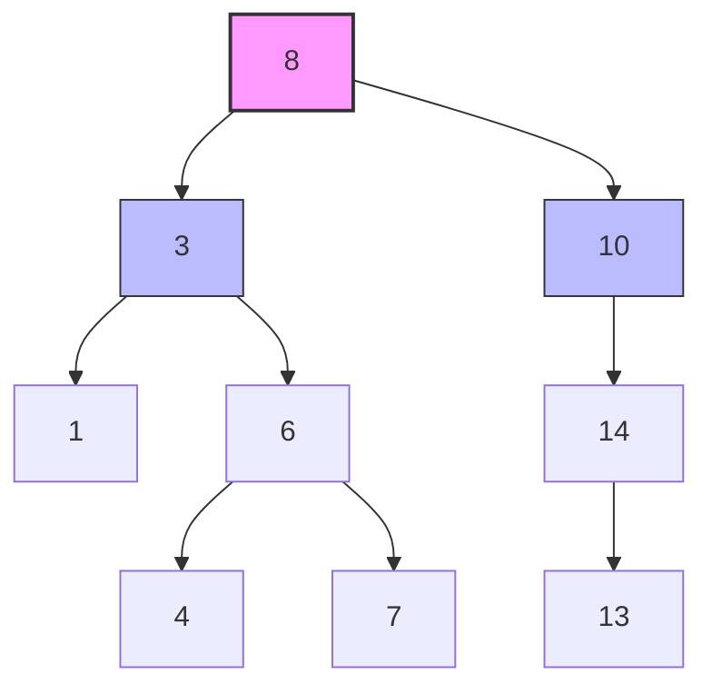
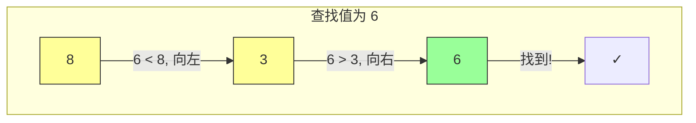
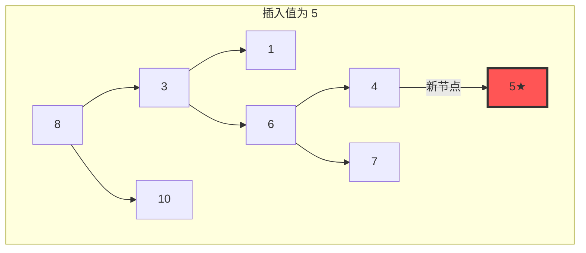
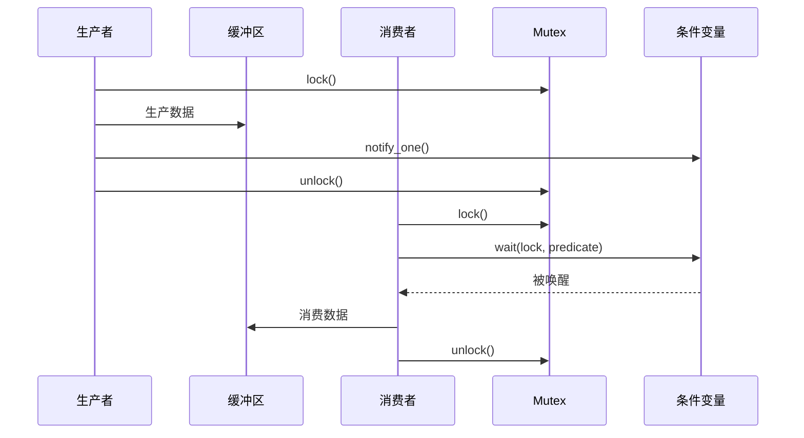
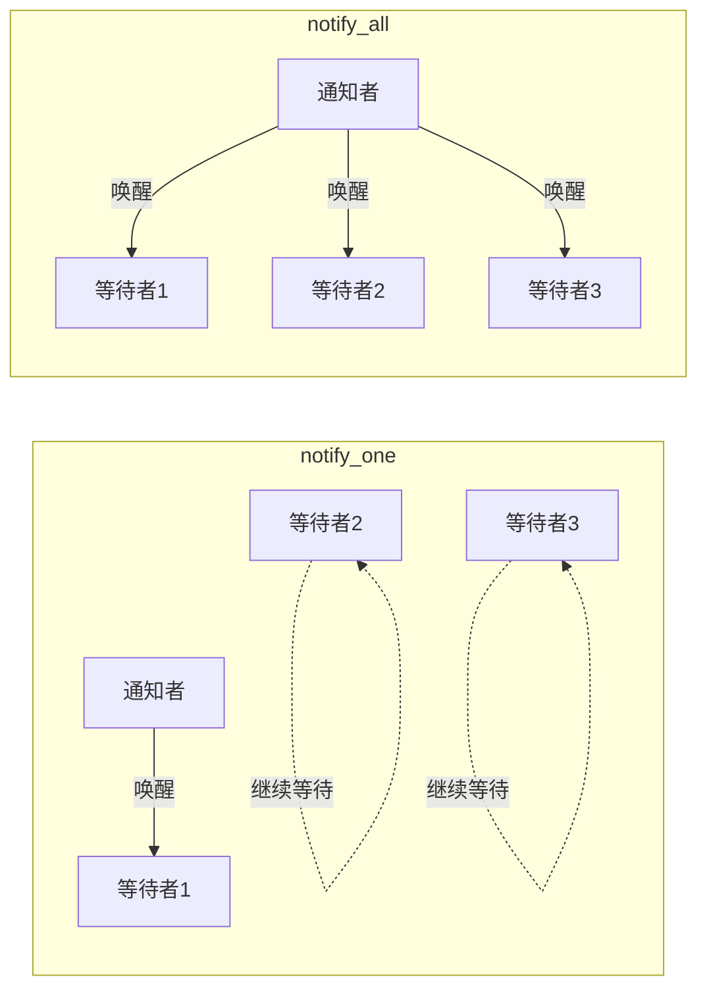
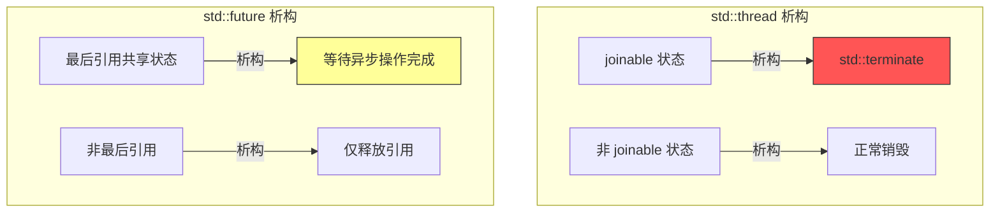
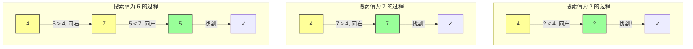

# Day 31: 二叉搜索树 (BST)

## 📅 学习目标

今天是 C++ 35天学习计划的第31天，我们将深入学习二叉搜索树这一重要的数据结构，同时掌握 C++11 的条件变量和 EMC++ Item 38 关于线程句柄析构行为的知识。二叉搜索树是一种特殊的二叉树，它通过维护特定的排序性质，实现了高效的查找、插入和删除操作。在实际开发中，BST 是许多高级数据结构（如 set、map）的基础，也是理解红黑树、AVL 树等自平衡树的前提。通过今天的学习，你将掌握 BST 的核心操作原理、条件变量在多线程编程中的应用，以及线程句柄析构的关键细节。

---

## 📖 知识点一：二叉搜索树

### BST 定义与核心性质

二叉搜索树（Binary Search Tree，简称 BST）是一种特殊的二叉树数据结构，它具有以下核心性质：对于树中的任意节点，其左子树中所有节点的值都**小于**该节点的值，而右子树中所有节点的值都**大于**该节点的值。这一性质被称为 BST 不变性，它保证了中序遍历 BST 会得到一个有序序列。BST 的每个节点最多有两个子节点，分别称为左孩子和右孩子，这种结构使得查找、插入和删除操作的时间复杂度在理想情况下为 O(log n)。



**图示说明**：上图展示了一个标准的 BST 结构。根节点值为 8，左子树所有节点值（1, 3, 4, 6, 7）都小于 8，右子树所有节点值（10, 13, 14）都大于 8。中序遍历结果为：1, 3, 4, 6, 7, 8, 10, 13, 14。

### BST 的查找操作

查找操作是 BST 最基础的操作，它充分利用了 BST 的有序性质。从根节点开始，将目标值与当前节点值比较：如果相等则找到目标；如果目标值较小，则在左子树中继续查找；如果目标值较大，则在右子树中继续查找。如果到达空节点仍未找到，说明目标值不存在于树中。这种查找方式类似于二分查找，每次比较都能排除约一半的搜索空间。



**查找时间复杂度分析**：
- 最佳情况（平衡树）：O(log n)
- 最坏情况（退化为链表）：O(n)
- 平均情况：O(log n)

### BST 的插入操作

插入操作需要找到合适的叶子位置来放置新节点。从根节点开始，沿着查找路径向下搜索，直到找到一个空位置。在这个过程中，每个节点都根据 BST 性质决定搜索方向：新值较小则向左，较大则向右。当找到空位置时，创建新节点并链接到父节点的相应子指针上。插入操作的时间复杂度与查找操作相同。



**插入步骤**：
1. 比较新值 5 与根节点 8，5 < 8，向左
2. 比较新值 5 与节点 3，5 > 3，向右
3. 比较新值 5 与节点 6，5 < 6，向左
4. 比较新值 5 与节点 4，5 > 4，向右
5. 节点 4 的右子节点为空，在此处插入新节点

### BST 的删除操作

删除操作是 BST 中最复杂的操作，需要考虑三种情况：

1. **删除叶子节点**：直接删除，将其父节点的相应指针置空
2. **删除只有一个孩子的节点**：用其唯一的孩子节点替代它
3. **删除有两个孩子的节点**：找到其中序遍历的前驱或后继节点，用该节点的值替换被删节点的值，然后删除前驱/后继节点

```mermaid
graph TD
    subgraph 情况1: 删除叶子节点 1
    A3[8] --> B3[3]
    A3 --> C3[10]
    B3 --> D3[1✗]
    B3 --> E3[6]
    end
    
    subgraph 情况2: 删除单孩子节点 10
    A4[8] --> B4[3]
    A4 --> C4[10✗]
    C4 -->.-> F4[14]
    end
    
    subgraph 情况3: 删除双孩子节点 3
    A5[8] --> B5[3✗]
    A5 --> C5[10]
    B5 --> D5[1]
    B5 --> E5[6]
    E5 --> H5[7]
    B5 -.->|用后继 4 替换| NEW5[4]
    end
    
    style D3 fill:#f55,stroke:#333
    style C4 fill:#f55,stroke:#333
    style B5 fill:#f55,stroke:#333
```

**删除有两个孩子节点的详细过程**：
- 找到被删节点的中序后继（右子树的最小值）或前驱（左子树的最大值）
- 用后继/前驱的值覆盖被删节点的值
- 删除原来的后继/前驱节点（它最多有一个孩子）

### BST 的应用场景

BST 在实际开发中有广泛的应用：
- **关联容器**：C++ STL 的 `std::set` 和 `std::map` 通常基于红黑树实现
- **数据库索引**：B+ 树是 BST 的变体，广泛用于数据库索引
- **符号表**：编译器中的符号表常使用 BST 实现
- **优先队列**：虽然常用堆实现，但 BST 也可以支持优先队列操作

---

## 📖 知识点二：条件变量

### 概念定义

条件变量（Condition Variable）是 C++11 引入的同步原语，定义在 `<condition_variable>` 头文件中。它允许线程在满足特定条件之前处于等待状态，当其他线程改变状态并发出通知后，等待的线程被唤醒继续执行。条件变量必须与互斥量（mutex）配合使用，以避免竞态条件。`std::condition_variable` 提供了 `wait()`、`notify_one()` 和 `notify_all()` 三个核心方法，用于实现线程间的协调通信。

### 生产者-消费者模型

生产者-消费者模型是条件变量最经典的应用场景。生产者线程负责生产数据并放入共享缓冲区，消费者线程从缓冲区取出数据进行处理。当缓冲区满时，生产者需要等待；当缓冲区空时，消费者需要等待。条件变量完美解决了这种协调问题，避免了忙等待带来的 CPU 资源浪费。



**模型核心要点**：
- 缓冲区是共享资源，需要互斥量保护
- 生产者通知消费者"有数据了"
- 消费者等待"有数据"这个条件

### wait() 的工作机制

`wait()` 函数有两种重载形式：

1. **基本形式**：`wait(unique_lock<mutex>& lock)` - 释放锁并进入等待状态，被唤醒后重新获取锁
2. **谓词形式**：`wait(unique_lock<mutex>& lock, Predicate pred)` - 等待直到谓词为真，内部实现了"虚假唤醒"处理

```cpp
// 不推荐：可能产生虚假唤醒问题
cv.wait(lock);  // 被唤醒后需要手动检查条件

// 推荐：使用谓词形式，自动处理虚假唤醒
cv.wait(lock, []{ return !buffer.empty(); });
```

**wait() 的执行过程**：
1. 检查谓词，如果为真则立即返回
2. 如果为假，原子地释放锁并进入等待状态
3. 被唤醒后重新获取锁，再次检查谓词
4. 循环直到谓词为真

### notify_one() 与 notify_all()

- **notify_one()**：唤醒一个等待的线程，适用于只有一个线程需要响应的情况
- **notify_all()**：唤醒所有等待的线程，适用于多个线程可能被条件满足的情况



### 使用注意事项

1. **必须在持有锁时调用 wait()**：wait 需要知道当前线程持有哪个锁
2. **使用谓词形式的 wait**：避免虚假唤醒导致的问题
3. **notify 可以在锁外调用**：减少临界区持有时间
4. **条件变量只能与 unique_lock 配合**：不能使用 lock_guard

---

## 📖 知识点三：EMC++ Item 38 - 了解不同线程句柄的析构行为

### 条款核心思想

Item 38 强调理解不同线程句柄类型（`std::thread`、`std::future` 等）在析构时的行为差异，这对于正确编写并发程序至关重要。不同类型的线程句柄在析构时有不同的默认行为，如果理解不当，可能导致程序崩溃、资源泄漏或未定义行为。

### std::thread 的析构行为

`std::thread` 在析构时会调用 `std::terminate()` 终止程序，如果该线程对象是 joinable 状态（即关联了一个正在执行的线程）。这是一种防御性设计，防止程序员忘记处理线程的结束状态。因此，在销毁 `std::thread` 对象之前，必须调用 `join()` 或 `detach()`。

```cpp
void dangerous_code() {
    std::thread t([]{ 
        // 执行一些任务
    });
    // 函数结束时 t 析构
    // 如果 t 仍然 joinable，程序会被终止！
}  // std::terminate() 被调用
```

**正确做法**：
```cpp
void safe_code() {
    std::thread t([]{ /* 任务 */ });
    t.join();  // 或 t.detach()
    // 现在 t 不再 joinable，安全析构
}
```

### std::future 的析构行为

`std::future` 的析构行为与 `std::thread` 完全不同。当 `std::future` 析构时，如果共享状态是最后引用，它会等待异步操作完成。这意味着如果你忘记获取结果，析构函数会阻塞直到异步操作完成。



### 行为对比总结

| 句柄类型 | 析构行为 | 风险 |
|---------|---------|------|
| `std::thread` (joinable) | 调用 `std::terminate()` | 程序崩溃 |
| `std::thread` (非 joinable) | 正常销毁 | 无 |
| `std::future` (最后引用) | 阻塞等待异步完成 | 意外阻塞 |
| `std::future` (非最后引用) | 释放引用 | 无 |
| `std::shared_future` | 仅释放引用 | 无 |

### RAII 包装器设计

为了安全地管理线程句柄，可以设计 RAII 包装器：

```cpp
class ThreadGuard {
    std::thread& t;
public:
    explicit ThreadGuard(std::thread& t_) : t(t_) {}
    ~ThreadGuard() {
        if (t.joinable()) {
            t.join();  // 析构时自动 join
        }
    }
    // 禁止拷贝
    ThreadGuard(const ThreadGuard&) = delete;
    ThreadGuard& operator=(const ThreadGuard&) = delete;
};
```

---

## 🎯 LeetCode 刷题

### 讲解题：LC 98 验证二叉搜索树

#### 题目描述

给定一个二叉树，判断其是否是一个有效的二叉搜索树。有效的 BST 定义为：
- 节点的左子树只包含**小于**当前节点的数
- 节点的右子树只包含**大于**当前节点的数
- 所有左子树和右子树自身必须也是二叉搜索树

#### 形象化提示

想象你是一个图书管理员，正在检查一排书架上的书是否按照编号正确排列。规则是：每本书左边的所有书编号都必须更小，右边的所有书编号都必须更大。你不能只看相邻的书，必须确保整个左边区域的书都比当前书小，整个右边区域的书都比当前书大！

```mermaid
graph TD
    subgraph "错误理解：只比较父子"
    A1[10] --> B1[5]
    A1 --> C1[15]
    B1 --> D1[3]
    B1 --> E1[12❌]
    style E1 fill:#f55,stroke:#333
    end
    
    subgraph "正确理解：比较范围"
    A2[10] --> B2[5<br/>范围:(-∞,10)]
    A2 --> C2[15<br/>范围:(10,+∞)]
    B2 --> D2[3<br/>范围:(-∞,5)]
    B2 --> E2[12❌<br/>应该在(5,10)<br/>但12>10]
    style E2 fill:#f55,stroke:#333
    end
```

#### 解题思路

**方法一：递归 + 范围验证**
- 每个节点都有一个有效的取值范围 `(min_val, max_val)`
- 根节点范围是 `(-∞, +∞)`
- 左子节点范围变为 `(min_val, 当前节点值)`
- 右子节点范围变为 `(当前节点值, max_val)`
- 如果节点值不在范围内，则不是有效的 BST

**方法二：中序遍历验证**
- BST 的中序遍历结果是严格递增的
- 遍历时检查当前节点值是否大于前一个节点值

#### 代码实现

```cpp
// 方法一：递归 + 范围验证
class Solution {
public:
    bool isValidBST(TreeNode* root) {
        return validate(root, LONG_MIN, LONG_MAX);
    }
    
private:
    bool validate(TreeNode* node, long long min_val, long long max_val) {
        if (node == nullptr) return true;
        
        // 检查当前节点是否在有效范围内
        if (node->val <= min_val || node->val >= max_val) {
            return false;
        }
        
        // 递归检查左右子树，更新范围
        return validate(node->left, min_val, node->val) &&
               validate(node->right, node->val, max_val);
    }
};

// 方法二：中序遍历验证
class Solution2 {
public:
    bool isValidBST(TreeNode* root) {
        prev = nullptr;
        return inorder(root);
    }
    
private:
    TreeNode* prev;  // 记录中序遍历的前一个节点
    
    bool inorder(TreeNode* node) {
        if (node == nullptr) return true;
        
        // 遍历左子树
        if (!inorder(node->left)) return false;
        
        // 检查当前节点是否大于前一个节点
        if (prev != nullptr && node->val <= prev->val) {
            return false;
        }
        prev = node;
        
        // 遍历右子树
        return inorder(node->right);
    }
};
```

#### 复杂度分析

- **时间复杂度**：O(n)，每个节点访问一次
- **空间复杂度**：O(h)，递归栈深度，h 为树高

---

### 实战题：LC 700 二叉搜索树中的搜索

#### 题目描述

给定二叉搜索树（BST）的根节点和一个值，在 BST 中找到节点值等于给定值的节点，返回以该节点为根的子树。如果节点不存在，则返回 NULL。

#### 形象化提示

想象你在玩一个猜数字游戏！主持人心里想了一个数字，你来猜。每次你猜一个数，主持人会告诉你"太大了"还是"太小了"。BST 搜索就是这样的过程：当前节点告诉你要往哪边找，你只需要听它的话就行！



#### 解题思路

BST 的搜索非常直观，利用 BST 的性质：
1. 如果目标值等于当前节点值，找到了！
2. 如果目标值小于当前节点值，在左子树中继续搜索
3. 如果目标值大于当前节点值，在右子树中继续搜索
4. 如果到达空节点，说明目标值不存在

#### 代码实现

```cpp
// 方法一：递归实现
class Solution {
public:
    TreeNode* searchBST(TreeNode* root, int val) {
        // 基本情况：空节点或找到目标
        if (root == nullptr || root->val == val) {
            return root;
        }
        
        // 根据值的大小决定搜索方向
        if (val < root->val) {
            return searchBST(root->left, val);  // 搜索左子树
        } else {
            return searchBST(root->right, val); // 搜索右子树
        }
    }
};

// 方法二：迭代实现（推荐，空间效率更高）
class Solution2 {
public:
    TreeNode* searchBST(TreeNode* root, int val) {
        while (root != nullptr && root->val != val) {
            if (val < root->val) {
                root = root->left;   // 向左走
            } else {
                root = root->right;  // 向右走
            }
        }
        return root;  // 返回找到的节点或 nullptr
    }
};
```

#### 复杂度分析

- **时间复杂度**：
  - 平均情况：O(log n)
  - 最坏情况：O(n)（树退化为链表）
- **空间复杂度**：
  - 递归：O(h)，h 为树高
  - 迭代：O(1)

---

## 🚀 运行代码

### 编译与运行

```bash
# 进入 day_31 目录
cd /home/z/my-project/download/week_05/day_31

# 添加执行权限
chmod +x build_and_run.sh

# 编译并运行
./build_and_run.sh
```

### 程序输出说明

程序将依次演示：
1. **BST 基本操作**：插入、查找、删除
2. **条件变量示例**：生产者-消费者模型
3. **EMC++ Item 38**：线程句柄析构行为
4. **LeetCode 题解**：LC 98 和 LC 700 的验证

---

## 📚 相关术语

| 术语 | 英文 | 解释 |
|------|------|------|
| 二叉搜索树 | Binary Search Tree (BST) | 一种特殊的二叉树，满足左<根<右的性质 |
| 中序遍历 | In-order Traversal | 按照 左->根->右 的顺序访问节点 |
| 前驱节点 | Predecessor | 中序遍历中当前节点的前一个节点 |
| 后继节点 | Successor | 中序遍历中当前节点的后一个节点 |
| 条件变量 | Condition Variable | 用于线程同步的原语，允许线程等待条件 |
| 互斥量 | Mutex | 用于保护共享资源的同步原语 |
| 虚假唤醒 | Spurious Wakeup | 线程被唤醒但条件未满足的现象 |
| 线程句柄 | Thread Handle | 表示线程的对象，如 std::thread |
| joinable | 可结合的 | 表示线程对象关联了一个执行线程 |

---

## 💡 学习提示

1. **BST 的关键**：理解"左子树所有节点 < 根 < 右子树所有节点"这个全局性质，不是简单地比较父子关系！

2. **删除操作的难点**：重点掌握删除有两个孩子节点的情况，理解为什么要用前驱或后继替换。

3. **条件变量的陷阱**：
   - 必须使用 `unique_lock`，不能用 `lock_guard`
   - 推荐使用带谓词的 `wait()` 形式
   - 注意"虚假唤醒"问题

4. **线程句柄析构**：
   - `std::thread` 在 joinable 状态析构会终止程序
   - `std::future` 析构可能阻塞等待异步完成
   - 使用 RAII 包装器是最佳实践

5. **刷题技巧**：
   - LC 98：不要只比较父子，要用范围验证或中序遍历
   - LC 700：迭代实现比递归更高效，推荐掌握

---

## 🔗 参考资料

1. **书籍**：
   - 《Effective Modern C++》by Scott Meyers - Item 38
   - 《算法导论》第12章 - 二叉搜索树

2. **在线资源**：
   - [cppreference - condition_variable](https://en.cppreference.com/w/cpp/thread/condition_variable)
   - [LeetCode 98 题解](https://leetcode.cn/problems/validate-binary-search-tree/)
   - [LeetCode 700 题解](https://leetcode.cn/problems/search-in-a-binary-search-tree/)

3. **视频教程**：
   - MIT 6.006 - Binary Search Trees
   - C++ Concurrency in Action - Condition Variables
