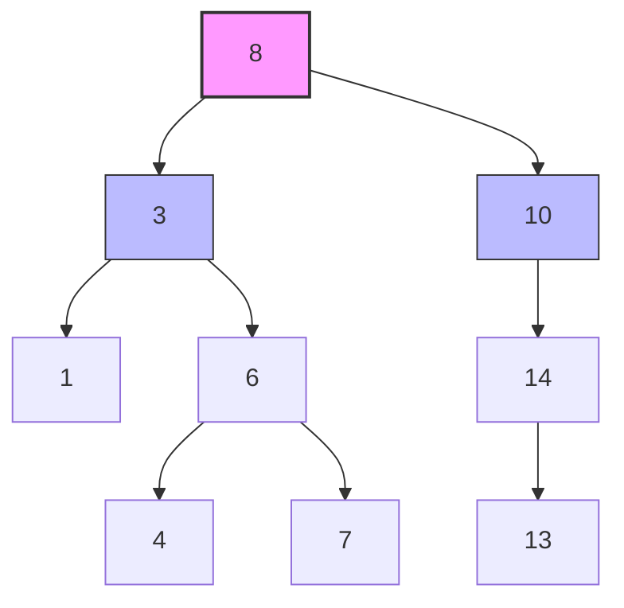
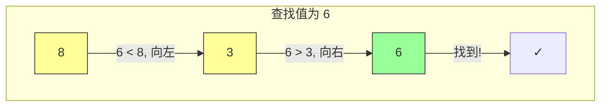
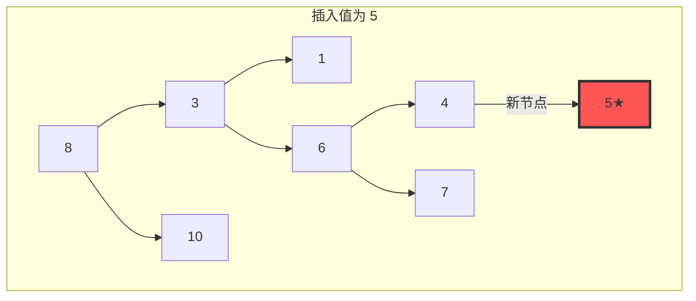
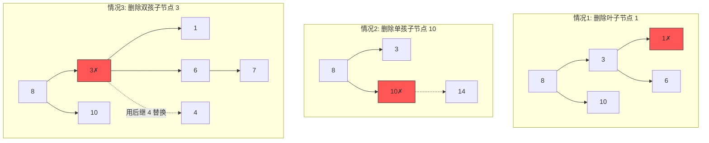
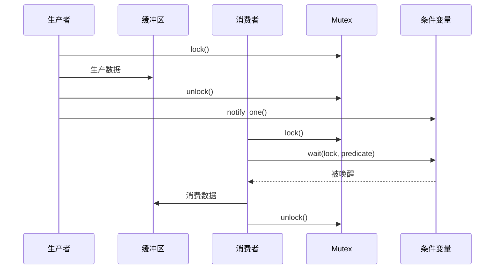
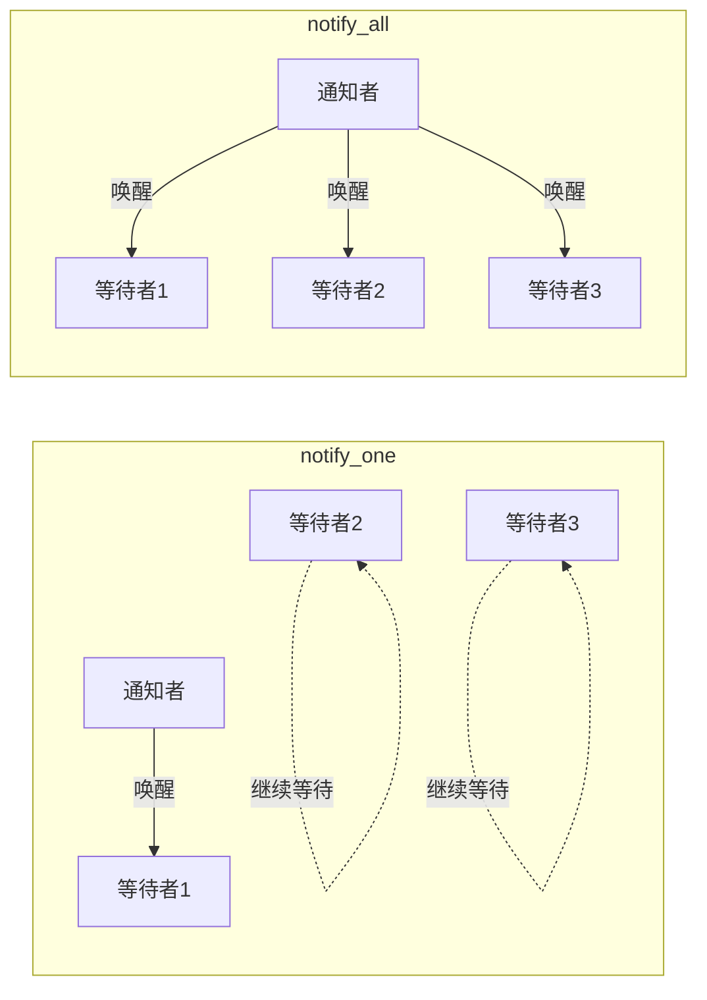
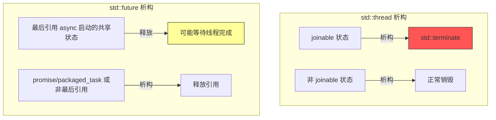
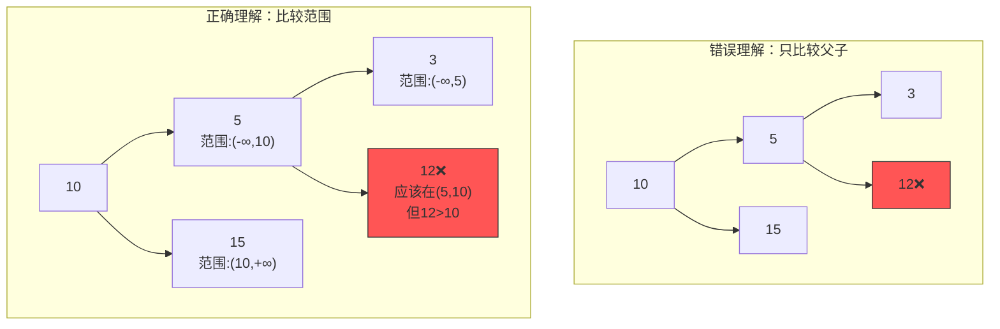
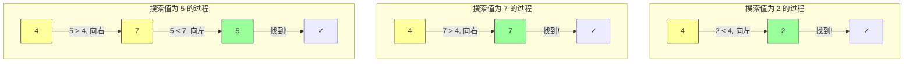

# Day 31: 二叉搜索树 (BST)

> **学习定位**：树线利用有序性质缩小搜索范围；并发线利用条件变量避免忙等。重点是 BST 上下界和条件变量谓词，二者都不能只检查一次局部条件就假定整体正确。

> **共性入口**：BST 范围如何沿祖先收紧见 [形象化指南的 Day 31](../树与并发专题形象化题解指南.md#day31-visual)；条件变量、future 共享状态来源和析构边界的完整机制见 [C++ 并发编程教程](../../tutorials/CPP并发编程教程.md)；Item 38 主讲见 [Effective Modern C++ 教程](../../tutorials/Effective_Modern_CPP教程.md)。本日只展开“全局上下界”“受锁谓词”和“可关闭队列”。

> **前后关系**：上一日 [Day 30](../day_30/README.md) 用 mutex 保护主动访问；下一日 [Day 32](../day_32/README.md) 把 DFS 推广到图，并比较条件变量/future 与 atomic 的同步粒度。

## 📅 学习目标

今天是 C++ 35天学习计划的第31天，我们将深入学习二叉搜索树这一重要的数据结构，同时掌握 C++11 的条件变量和 EMC++ Item 38 关于线程句柄析构行为的知识。二叉搜索树通过维护有序不变量缩小查找方向；平衡搜索树是 `set`、`map` 一类有序关联容器的常见实现基础，但 C++ 标准只规定接口和复杂度，不规定必须采用红黑树。通过今天的学习，你将掌握 BST 的核心操作原理、条件变量在多线程编程中的应用，以及线程句柄析构的关键细节。

---

## 📖 知识点一：二叉搜索树

### BST 定义与核心性质

二叉搜索树（Binary Search Tree，简称 BST）是一种特殊的二叉树数据结构，它具有以下核心性质：对于树中的任意节点，其左子树中所有节点的值都**小于**该节点的值，而右子树中所有节点的值都**大于**该节点的值。这是覆盖整棵子树的全局不变量，不只是“左孩子小、右孩子大”的局部关系。它保证中序遍历得到严格递增序列；操作代价由树高 `h` 决定，查找、插入和删除都是 O(h)，只有树较平衡时 `h` 才接近 O(log n)。

### 先写清重复值契约

“相等时放哪边”不是实现细节，而是数据结构接口的一部分。本日代码采用**集合语义**：节点值严格满足 `left < node < right`，插入重复值返回失败，LC 98 也把重复值判为非法。另一种合法设计是把相等值固定放左边或右边，或者在节点内维护 `count`，但插入、删除、验证和文档必须使用同一规则；混用规则会让中序判断、上下界和删除都失去一致性。

### 树高、退化与替代方案

普通 BST 不会自动平衡。按 `1, 2, 3, 4, ...` 插入时，每个节点都只有右孩子，树会退化成链表：时间复杂度从 O(log n) 变为 O(n)，递归算法还会增加栈溢出风险。因此不能把“每次比较排除一半”当作 BST 的无条件保证；需要稳定对数复杂度时，应选 `std::map`/`std::set` 所代表的平衡关联容器，或学习 AVL、红黑树，批量静态数据也可以排序后用二分查找。


```mermaid
graph TD
    A[8] --> B[3]
    A --> C[10]
    B --> D[1]
    B --> E[6]
    C --> F[14]
    E --> G[4]
    E --> H[7]
    F --> I[13]
    
    style A fill:#f9f,stroke:#333,stroke-width:2px
    style B fill:#bbf,stroke:#333
    style C fill:#bbf,stroke:#333
```

**图示说明**：上图展示了一个标准的 BST 结构。根节点值为 8，左子树所有节点值（1, 3, 4, 6, 7）都小于 8，右子树所有节点值（10, 13, 14）都大于 8。中序遍历结果为：1, 3, 4, 6, 7, 8, 10, 13, 14。

### BST 的查找操作

查找操作是 BST 最基础的操作，它充分利用了 BST 的有序性质。从根节点开始，将目标值与当前节点值比较：如果相等则找到目标；如果目标值较小，则在左子树中继续查找；如果目标值较大，则在右子树中继续查找。如果到达空节点仍未找到，说明目标值不存在于树中。它和二分查找都利用有序性排除一个方向，但只有平衡 BST 才能近似每次排除一半节点。


```mermaid
graph TD
    subgraph 查找值为 6
    A1[8] -->|"6 < 8, 向左"| B1[3]
    B1 -->|"6 > 3, 向右"| E1[6]
    E1 -->|找到!| F1[✓]
    end
    
    style A1 fill:#ff9,stroke:#333
    style B1 fill:#ff9,stroke:#333
    style E1 fill:#9f9,stroke:#333
```

**查找时间复杂度分析**：
- 最佳情况（平衡树）：O(log n)
- 最坏情况（退化为链表）：O(n)
- 典型随机形状：期望 O(log n)，但它不是最坏情况保证

### BST 的插入操作

插入操作需要找到合适的叶子位置来放置新节点。从根节点开始，沿着查找路径向下搜索，直到找到一个空位置。在这个过程中，每个节点都根据 BST 性质决定搜索方向：新值较小则向左，较大则向右。当找到空位置时，创建新节点并链接到父节点的相应子指针上。插入操作的时间复杂度与查找操作相同。


```mermaid
graph TD
    subgraph 插入值为 5
    A2[8] --> B2[3]
    A2 --> C2[10]
    B2 --> D2[1]
    B2 --> E2[6]
    E2 --> G2[4]
    E2 --> H2[7]
    G2 -->|新节点| NEW[5★]
    end
    
    style NEW fill:#f55,stroke:#333,stroke-width:3px
```

**插入步骤**：
1. 比较新值 5 与根节点 8，5 < 8，向左
2. 比较新值 5 与节点 3，5 > 3，向右
3. 比较新值 5 与节点 6，5 < 6，向左
4. 比较新值 5 与节点 4，5 > 4，向右
5. 节点 4 的右子节点为空，在此处插入新节点

### BST 的删除操作

删除操作是 BST 中最复杂的操作，需要考虑三种情况：

1. **删除叶子节点**：直接删除，将其父节点的相应指针置空
2. **删除只有一个孩子的节点**：用其唯一的孩子节点替代它
3. **删除有两个孩子的节点**：找到其中序遍历的前驱或后继节点，用该节点的值替换被删节点的值，然后删除前驱/后继节点


```mermaid
graph TD
    subgraph 情况1: 删除叶子节点 1
    A3[8] --> B3[3]
    A3 --> C3[10]
    B3 --> D3[1✗]
    B3 --> E3[6]
    end
    
    subgraph 情况2: 删除单孩子节点 10
    A4[8] --> B4[3]
    A4 --> C4[10✗]
    C4 -.-> F4[14]
    end
    
    subgraph 情况3: 删除双孩子节点 3
    A5[8] --> B5[3✗]
    A5 --> C5[10]
    B5 --> D5[1]
    B5 --> E5[6]
    E5 --> H5[7]
    B5 -.->|用后继 4 替换| NEW5[4]
    end
    
    style D3 fill:#f55,stroke:#333
    style C4 fill:#f55,stroke:#333
    style B5 fill:#f55,stroke:#333
```

**删除有两个孩子节点的详细过程**：
- 找到被删节点的中序后继（右子树的最小值）或前驱（左子树的最大值）
- 用后继/前驱的值覆盖被删节点的值
- 删除原来的后继/前驱节点（它最多有一个孩子）

### BST 的应用场景

BST 在实际开发中有广泛的应用：
- **关联容器**：`std::set` 和 `std::map` 要满足标准规定的有序接口与对数级复杂度，常见实现采用红黑树，但标准不指定具体树型
- **数据库索引**：B/B+ 树是多路搜索树，不是二叉树；它们通过更高分支因子适配页式存储和外存访问
- **符号表**：编译器中的符号表常使用 BST 实现
- **有序集合原型**：普通 BST 适合讲清顺序、前驱/后继和范围查询；需要最坏界时应换成自平衡结构

---

## 📖 知识点二：条件变量

### 概念定义

条件变量（Condition Variable）是 C++11 引入的同步原语，定义在 `<condition_variable>` 头文件中。它允许线程在满足特定条件之前处于等待状态，当其他线程改变状态并发出通知后，等待的线程被唤醒继续执行。条件变量必须与互斥量（mutex）配合使用，以避免竞态条件。`std::condition_variable` 提供了 `wait()`、`notify_one()` 和 `notify_all()` 三个核心方法，用于实现线程间的协调通信。

### 生产者-消费者模型

生产者-消费者模型是条件变量最经典的应用场景。生产者线程负责生产数据并放入共享缓冲区，消费者线程从缓冲区取出数据进行处理。当缓冲区满时，生产者需要等待；当缓冲区空时，消费者需要等待。条件变量完美解决了这种协调问题，避免了忙等待带来的 CPU 资源浪费。


```mermaid
sequenceDiagram
    participant P as 生产者
    participant B as 缓冲区
    participant C as 消费者
    participant M as Mutex
    participant CV as 条件变量
    
    P->>M: lock()
    P->>B: 生产数据
    P->>M: unlock()
    P->>CV: notify_one()
    
    C->>M: lock()
    C->>CV: wait(lock, predicate)
    CV-->>C: 被唤醒
    C->>B: 消费数据
    C->>M: unlock()
```

**模型核心要点**：
- 缓冲区是共享资源，需要互斥量保护
- 生产者通知消费者"有数据了"
- 消费者等待"有数据"这个条件

### wait() 的工作机制

`wait()` 函数有两种重载形式：

1. **基本形式**：`wait(unique_lock<mutex>& lock)` - 释放锁并进入等待状态，被唤醒后重新获取锁
2. **谓词形式**：`wait(unique_lock<mutex>& lock, Predicate pred)` - 等待直到谓词为真，内部实现了"虚假唤醒"处理

下块是已持有 `std::unique_lock<std::mutex> lock` 时的局部对比片段，**不可单独编译**；省略 `<condition_variable>`、`<mutex>` 以及受同一把锁保护的 `cv`/`buffer` 定义。

```cpp
// 不推荐：可能产生虚假唤醒问题
cv.wait(lock);  // 被唤醒后需要手动检查条件

// 推荐：使用谓词形式，自动处理虚假唤醒
cv.wait(lock, []{ return !buffer.empty(); });
```

**wait() 的执行过程**：
1. 检查谓词，如果为真则立即返回
2. 如果为假，原子地释放锁并进入等待状态
3. 被唤醒后重新获取锁，再次检查谓词
4. 循环直到谓词为真

谓词不是条件变量“内部保存的通知”，而是受互斥量保护的共享状态，例如 `!queue.empty()` 或 `closed`。`notify_one()` 本身不携带数据，也不记住历史通知：如果通知发生时没有等待者，通知会消失；但只要通知者先在同一把锁下修改状态，后来到达的等待者会先检查谓词并直接继续，这就不会发生业务层面的“丢失唤醒”。反过来，若状态修改没有和等待者使用同一把 mutex 协调，即使随后通知也可能留下“检查旧状态后入睡”的窗口。

无谓词的 `wait(lock)` 还允许**虚假唤醒**，即没有对应通知也返回，所以正确等价形式永远是 `while (!predicate()) cv.wait(lock);`。不能写成 `if`，因为唤醒后锁重新竞争期间，其他消费者可能已经取走数据，谓词会再次变假。超时等待也应使用 `wait_for(lock, duration, predicate)` 或 `wait_until` 的谓词重载，并把超时视为正常结果而非正确性协议。

### 停止协议也是接口契约

生产者只推数据而消费者无限 `wait`，程序就没有完整的生命周期。本日 `CloseableQueue` 明确约定：`close()` 在锁内设置 `closed`，随后 `notify_all()`；消费者等待 `closed || !queue.empty()`，先排空关闭前的数据，最终用 `std::nullopt` 表示结束；关闭后的 `push` 返回失败。`push` 与 `close` 通过同一把锁决定队列状态的先后：入队先取得锁就属于已接受数据，必须被 drain；关闭先取得锁则队列保持不变且 push 返回失败。当前接口按值接收 `T value`，因此调用者传入右值时，实参可能在进入函数体、检查 `closed` 之前就已移动进形参；“拒绝不修改队列”不等于“拒绝一定保留调用者实参”，需要这种更强保证时必须另行设计接口并测试。这样消费者测试无需 `sleep_for` 猜测调度顺序，也不会把“某线程大概已经等起来了”当成前置条件。

### notify_one() 与 notify_all()

- **notify_one()**：唤醒一个等待的线程，适用于只有一个线程需要响应的情况
- **notify_all()**：唤醒所有等待的线程，适用于关闭、配置切换等所有等待者都必须重新检查状态的情况；被唤醒不等于获得锁或谓词为真，每个线程仍要竞争锁并复查谓词


```mermaid
graph LR
    subgraph notify_one
    N1[通知者] -->|唤醒| W1[等待者1]
    W2[等待者2] -.->|继续等待| W2
    W3[等待者3] -.->|继续等待| W3
    end
    
    subgraph notify_all
    N2[通知者] -->|唤醒| W4[等待者1]
    N2 -->|唤醒| W5[等待者2]
    N2 -->|唤醒| W6[等待者3]
    end
```

### 使用注意事项

1. **必须在持有锁时调用 wait()**：wait 需要知道当前线程持有哪个锁
2. **使用谓词形式的 wait**：同时处理虚假唤醒和通知早于等待的情况
3. **先在锁内改变谓词，再按协议通知**：通知通常可放在解锁后以减少刚唤醒线程再次阻塞的机会，但是否在锁内通知要结合对象销毁、等待者注册和具体接口生命周期证明，不能背成绝对规则
4. **`std::condition_variable` 的 wait 使用 `unique_lock`**：等待过程中必须临时解锁并在返回前重新加锁，`lock_guard` 不提供这种操作

---

## 📖 知识点三：EMC++ Item 38 - 了解不同线程句柄的析构行为

<a id="item-38"></a>

### 条款核心思想

Item 38 强调理解不同线程句柄类型（`std::thread`、`std::future` 等）在析构时的行为差异，这对于正确编写并发程序至关重要。不同类型的线程句柄在析构时有不同的默认行为，如果理解不当，可能导致程序崩溃、资源泄漏或未定义行为。

### std::thread 的析构行为

`std::thread` 在析构时会调用 `std::terminate()`，如果该句柄仍是 joinable 状态。joinable 的准确含义是“仍关联一个尚未被 `join` 或 `detach` 的执行线程”；即使线程函数已经返回，句柄在 `join` 前仍然 joinable。它不是“线程此刻正在运行”的状态查询，因此销毁前必须按所有权协议 `join` 或在极少数已证明生命周期安全的场景 `detach`。

```cpp
#include <thread>

void dangerous_code() {
    std::thread t([]{ 
        // 执行一些任务
    });
    // 函数结束时 t 析构
    // 如果 t 仍然 joinable，程序会被终止！
}  // std::terminate() 被调用
```

**正确做法**：
```cpp
#include <thread>

void safe_code() {
    std::thread t([]{ /* 任务 */ });
    t.join();
    // 现在 t 不再 joinable，安全析构
}
```

`detach()` 也会令句柄不再 joinable，但它把执行线程与所有者分离：线程捕获的引用、指针、日志对象或进程退出顺序都更难证明安全，因此不能把它当成“忘记 join 的通用修补”。C++17 可用拥有 `std::thread` 的 RAII 包装器保证所有退出路径都 join；C++20 则优先考虑 `std::jthread`，它还提供停止令牌，但停止仍需任务主动配合。

### std::future 的析构行为

`std::future` 的析构行为与 `std::thread` 不同。future 析构通常只是释放它对共享状态的引用；**关键例外**是共享状态来自 `std::async`、任务实际按 `std::launch::async` 运行、状态尚未就绪并且当前句柄释放了最后一个引用时，该释放操作可能等待异步线程完成。来自 `std::promise` 或 `std::packaged_task` 的 future 析构不会因为生产者未完成而普遍阻塞；若 promise 在未满足状态时先销毁，等待方随后会观察到 `broken_promise`。

`std::launch::deferred` 是另一个常见误区：任务只在某个等待函数（如 `get()` 或 `wait()`）被调用时，才在调用等待函数的线程中惰性执行；如果 future 直接析构，任务不会为了析构而执行。默认策略 `std::async(f)` 可以由实现选择 async 或 deferred，所以当并发执行语义是接口契约时要显式写 `std::launch::async`。本日代码不靠耗时测量断言析构是否阻塞，因为调度时间不是稳定测试信号，而是分别验证来源、策略和结果观察方式。


```mermaid
graph TD
    subgraph "std::thread 析构"
    T1[joinable 状态] -->|析构| T2[std::terminate]
    T3[非 joinable 状态] -->|析构| T4[正常销毁]
    end
    
    subgraph "std::future 析构"
    F1[最后引用 async 启动的共享状态] -->|释放| F2[可能等待线程完成]
    F3[promise/packaged_task 或非最后引用] -->|析构| F4[释放引用]
    end
    
    style T2 fill:#f55,stroke:#333
    style F2 fill:#ff9,stroke:#333
```

### 行为对比总结

| 句柄类型 | 析构行为 | 风险 |
|---------|---------|------|
| `std::thread` (joinable) | 调用 `std::terminate()` | 程序崩溃 |
| `std::thread` (非 joinable) | 正常销毁 | 无 |
| `std::future` / `shared_future`（最后关联 async 状态） | 可能等待异步线程完成 | 意外阻塞 |
| 关联 promise / packaged_task 的 future | 释放引用 | 不自动等待生产者完成 |
| 非最后一个共享状态引用 | 释放引用 | 任务由其他句柄继续观察 |

### RAII 包装器设计

为了安全地管理线程句柄，可以设计 RAII 包装器：

```cpp
#include <thread>
#include <utility>

class JoiningThread {
    std::thread t;
public:
    explicit JoiningThread(std::thread t_) : t(std::move(t_)) {}
    ~JoiningThread() {
        if (t.joinable()) {
            t.join();
        }
    }
    JoiningThread(const JoiningThread&) = delete;
    JoiningThread& operator=(const JoiningThread&) = delete;
};
```

拥有句柄比只保存外部引用更容易说明生命周期，但析构 join 也可能长时间等待，所以还必须定义任务的停止协议，不能只定义“最终回收”。

---

## 🎯 LeetCode 刷题

### 讲解题：LC 98 验证二叉搜索树

#### 题目描述

给定一个二叉树，判断其是否是一个有效的二叉搜索树。有效的 BST 定义为：
- 节点的左子树只包含**小于**当前节点的数
- 节点的右子树只包含**大于**当前节点的数
- 所有左子树和右子树自身必须也是二叉搜索树

#### 形象化提示

想象你是一个图书管理员，正在检查一排书架上的书是否按照编号正确排列。规则是：每本书左边的所有书编号都必须更小，右边的所有书编号都必须更大。你不能只看相邻的书，必须确保整个左边区域的书都比当前书小，整个右边区域的书都比当前书大！


```mermaid
graph TD
    subgraph "错误理解：只比较父子"
    A1[10] --> B1[5]
    A1 --> C1[15]
    B1 --> D1[3]
    B1 --> E1[12❌]
    style E1 fill:#f55,stroke:#333
    end
    
    subgraph "正确理解：比较范围"
    A2[10] --> B2["5<br/>范围:(-∞,10)"]
    A2 --> C2["15<br/>范围:(10,+∞)"]
    B2 --> D2["3<br/>范围:(-∞,5)"]
    B2 --> E2["12❌<br/>应该在(5,10)<br/>但12>10"]
    style E2 fill:#f55,stroke:#333
    end
```

#### 解题思路

**方法一：递归 + 范围验证**
- 每个节点都有一个有效的取值范围 `(min_val, max_val)`
- 根节点范围是 `(-∞, +∞)`
- 左子节点范围变为 `(min_val, 当前节点值)`
- 右子节点范围变为 `(当前节点值, max_val)`
- 如果节点值不在范围内，则不是有效的 BST

范围必须沿祖先链不断收紧。例如根为 10、左孩子为 5、5 的右孩子为 12 时，12 大于父节点 5，却越过祖先给整个左子树规定的上界 10，因此非法。本日严格 BST 使用开区间 `(lower, upper)`；边界类型用比节点值更宽的 `std::int64_t`，避免 `INT_MIN`/`INT_MAX` 与哨兵重合。

**方法二：中序遍历验证**
- BST 的中序遍历结果是严格递增的
- 遍历时检查当前节点值是否大于前一个节点值

#### 代码实现

在线评测给出的 `TreeNode*` 是平台管理生命周期的观察指针；本地工程不能假定有人替自己回收节点，因此实际示例让父节点用 `std::unique_ptr` 独占孩子，算法只接收 `const TreeNode*` 观察树而不取得所有权。两种表示不改变上下界算法，但接口契约更清楚：算法不删除、不转移、也不保存传入节点。

下块是 LeetCode `int val` 节点接口的局部解法，**不可单独编译**；省略 `<cstdint>`、`<limits>` 和 `TreeNode` 定义。当节点类型改为 `int64_t` 时，应使用可选边界或中序比较，避免把同类型极值当严格开区间哨兵。

```cpp
// 方法一：递归 + 范围验证
class Solution {
public:
    bool isValidBST(TreeNode* root) {
        return validate(root,
                        std::numeric_limits<std::int64_t>::lowest(),
                        std::numeric_limits<std::int64_t>::max());
    }
    
private:
    bool validate(TreeNode* node, std::int64_t min_val, std::int64_t max_val) {
        if (node == nullptr) return true;
        const std::int64_t value = node->val;
        
        // 检查当前节点是否在有效范围内
        if (value <= min_val || value >= max_val) {
            return false;
        }
        
        // 递归检查左右子树，更新范围
        return validate(node->left, min_val, value) &&
               validate(node->right, value, max_val);
    }
};

// 方法二：中序遍历验证
class Solution2 {
public:
    bool isValidBST(TreeNode* root) {
        prev = nullptr;
        return inorder(root);
    }
    
private:
    TreeNode* prev;  // 记录中序遍历的前一个节点
    
    bool inorder(TreeNode* node) {
        if (node == nullptr) return true;
        
        // 遍历左子树
        if (!inorder(node->left)) return false;
        
        // 检查当前节点是否大于前一个节点
        if (prev != nullptr && node->val <= prev->val) {
            return false;
        }
        prev = node;
        
        // 遍历右子树
        return inorder(node->right);
    }
};
```

#### 复杂度分析

- **时间复杂度**：O(n)，每个节点访问一次
- **空间复杂度**：O(h)，递归栈深度，h 为树高

---

### 实战题：LC 700 二叉搜索树中的搜索

#### 题目描述

给定二叉搜索树（BST）的根节点和一个值，在 BST 中找到节点值等于给定值的节点，返回以该节点为根的子树。如果节点不存在，则返回 NULL。

#### 形象化提示

想象你在玩一个猜数字游戏！主持人心里想了一个数字，你来猜。每次你猜一个数，主持人会告诉你"太大了"还是"太小了"。BST 搜索就是这样的过程：当前节点告诉你要往哪边找，你只需要听它的话就行！


```mermaid
graph TD
    subgraph "搜索值为 2 的过程"
    A[4] -->|"2 < 4, 向左"| B[2]
    B -->|找到!| C[✓]
    end
    
    subgraph "搜索值为 7 的过程"
    D[4] -->|"7 > 4, 向右"| E[7]
    E -->|找到!| F[✓]
    end
    
    subgraph "搜索值为 5 的过程"
    G[4] -->|"5 > 4, 向右"| H[7]
    H -->|"5 < 7, 向左"| I[5]
    I -->|找到!| J[✓]
    end
    
    style A fill:#ff9,stroke:#333
    style B fill:#9f9,stroke:#333
    style D fill:#ff9,stroke:#333
    style E fill:#9f9,stroke:#333
    style G fill:#ff9,stroke:#333
    style H fill:#ff9,stroke:#333
    style I fill:#9f9,stroke:#333
```

#### 解题思路

BST 的搜索非常直观，利用 BST 的性质：
1. 如果目标值等于当前节点值，找到了！
2. 如果目标值小于当前节点值，在左子树中继续搜索
3. 如果目标值大于当前节点值，在右子树中继续搜索
4. 如果到达空节点，说明目标值不存在

#### 代码实现

下块是 LeetCode `TreeNode*` 接口的局部搜索片段，**不可单独编译**；省略 `TreeNode { int val; TreeNode* left; TreeNode* right; }` 定义，返回的非空指针仍由原树所有者保管。

```cpp
// 方法一：递归实现
class Solution {
public:
    TreeNode* searchBST(TreeNode* root, int val) {
        // 基本情况：空节点或找到目标
        if (root == nullptr || root->val == val) {
            return root;
        }
        
        // 根据值的大小决定搜索方向
        if (val < root->val) {
            return searchBST(root->left, val);  // 搜索左子树
        } else {
            return searchBST(root->right, val); // 搜索右子树
        }
    }
};

// 方法二：迭代实现（推荐，空间效率更高）
class Solution2 {
public:
    TreeNode* searchBST(TreeNode* root, int val) {
        while (root != nullptr && root->val != val) {
            if (val < root->val) {
                root = root->left;   // 向左走
            } else {
                root = root->right;  // 向右走
            }
        }
        return root;  // 返回找到的节点或 nullptr
    }
};
```

#### 复杂度分析

- **时间复杂度**：
  - 平均情况：O(log n)
  - 最坏情况：O(n)（树退化为链表）
- **空间复杂度**：
  - 递归：O(h)，h 为树高
  - 迭代：O(1)

---

## 🚀 运行代码

### 今日工程动作：让接口契约进入自动测试

```bash
# 进入 day_31 目录
cd week_05/day_31

# 脚本已随仓库保存为可执行文件，直接编译并运行
./build_and_run.sh
```

### 程序输出说明

程序将依次演示：
1. **BST 基本操作**：插入、查找、删除
2. **条件变量示例**：生产者-消费者模型
3. **EMC++ Item 38**：线程句柄析构行为
4. **LeetCode 题解**：LC 98 和 LC 700 的验证

脚本每次删除并重建 `build/`，以 C++17 Release 配置和 `-Wall -Wextra -Wpedantic -Wconversion -Wsign-conversion -Wshadow -Werror` 编译，再运行 6 个 CTest；任一断言失败都会让对应程序返回非零并使脚本失败。执行时不要只观察示例输出，还要从 CTest 的失败状态确认接口契约确实进入了自动测试。

---

## 📚 相关术语

| 术语 | 英文 | 解释 |
|------|------|------|
| 二叉搜索树 | Binary Search Tree (BST) | 一种特殊的二叉树，满足左<根<右的性质 |
| 中序遍历 | In-order Traversal | 按照 左->根->右 的顺序访问节点 |
| 前驱节点 | Predecessor | 中序遍历中当前节点的前一个节点 |
| 后继节点 | Successor | 中序遍历中当前节点的后一个节点 |
| 条件变量 | Condition Variable | 用于线程同步的原语，允许线程等待条件 |
| 互斥量 | Mutex | 用于保护共享资源的同步原语 |
| 虚假唤醒 | Spurious Wakeup | 线程被唤醒但条件未满足的现象 |
| 线程句柄 | Thread Handle | 表示线程的对象，如 std::thread |
| joinable | 可结合的 | 表示线程对象关联了一个执行线程 |

---

## 💡 学习提示

1. **BST 的关键**：理解"左子树所有节点 < 根 < 右子树所有节点"这个全局性质，不是简单地比较父子关系！

2. **删除操作的难点**：重点掌握删除有两个孩子节点的情况，理解为什么要用前驱或后继替换。

3. **条件变量的陷阱**：
   - 必须使用 `unique_lock`，不能用 `lock_guard`
   - 推荐使用带谓词的 `wait()` 形式
   - 注意"虚假唤醒"问题

4. **线程句柄析构**：
   - `std::thread` 在 joinable 状态析构会终止程序
   - 只有在释放特定 `std::async(std::launch::async, ...)` 共享状态的最后关联句柄等条件下，`std::future` 的释放才可能等待异步完成
   - 使用 RAII 包装器是最佳实践

5. **刷题技巧**：
   - LC 98：不要只比较父子，要用范围验证或中序遍历
   - LC 700：迭代实现避免递归调用栈，在极深的树上更容易控制栈风险；实际性能差异需要测量

---

## 🔗 参考资料

1. **书籍**：
   - 《Effective Modern C++》by Scott Meyers - Item 38
   - 《算法导论》第12章 - 二叉搜索树

2. **在线资源**：
   - [C++ working draft：condition variables](https://eel.is/c++draft/thread.condition)
   - [cppreference：`std::condition_variable`](https://en.cppreference.com/w/cpp/thread/condition_variable.html)
   - [cppreference：`std::future`](https://en.cppreference.com/w/cpp/thread/future.html)
   - [C++ Core Guidelines CP.42：不要在没有条件时等待](https://isocpp.github.io/CppCoreGuidelines/CppCoreGuidelines#rconc-wait)
   - [LeetCode 98 题解](https://leetcode.cn/problems/validate-binary-search-tree/)
   - [LeetCode 700 题解](https://leetcode.cn/problems/search-in-a-binary-search-tree/)

3. **教材**：
   - Stanley B. Lippman 等，*C++ Primer*（关联容器与对象生命周期）
   - Anthony Williams, *C++ Concurrency in Action*（条件变量与基于任务的并发）

## 每日复盘（恰好五句）

1. 我能用沿祖先传播的开区间解释为什么只比较父子节点不能验证 BST。
2. 我能先声明重复值契约，并说明有序插入如何让普通 BST 退化到 O(n)。
3. 我能把条件变量理解为“共享状态加互斥量加通知”，并用谓词同时处理丢失通知和虚假唤醒。
4. 我能为阻塞队列定义关闭后的 push、排空和消费者退出协议，而不依赖 sleep 猜测时序。
5. 我能准确区分 joinable thread、async future、promise future 与 deferred future 的析构边界。
