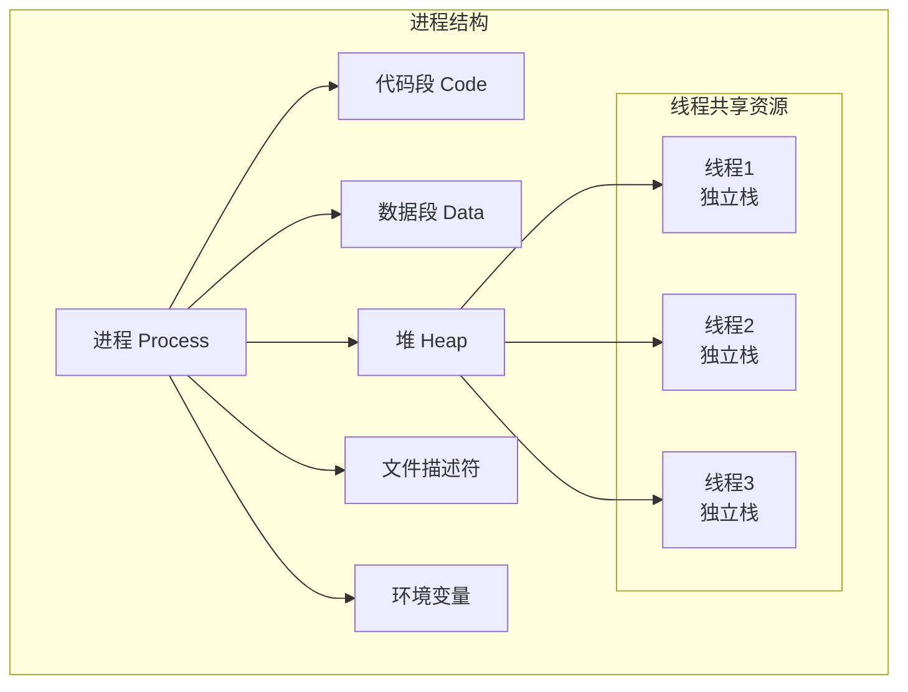
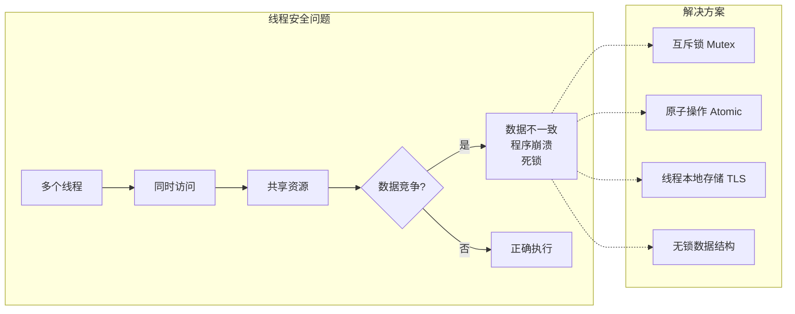
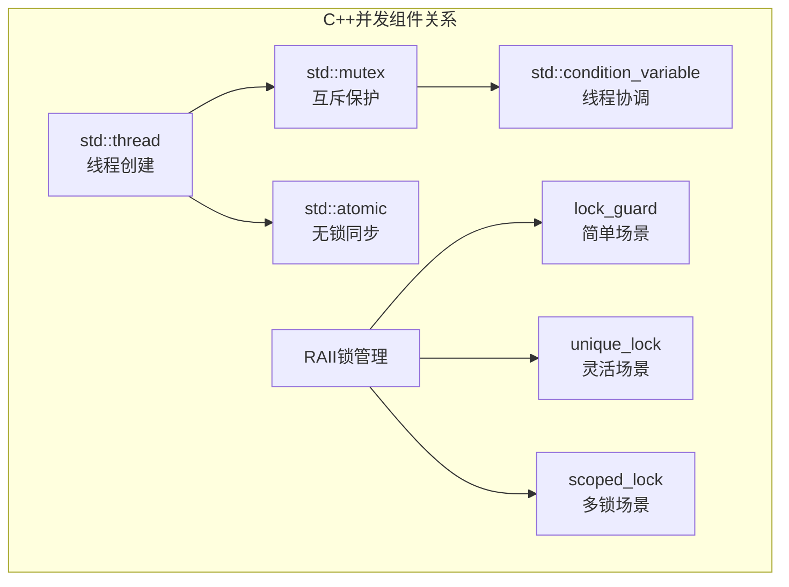
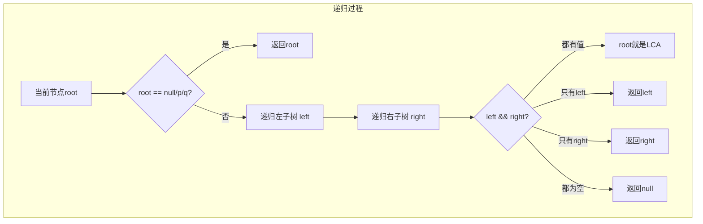
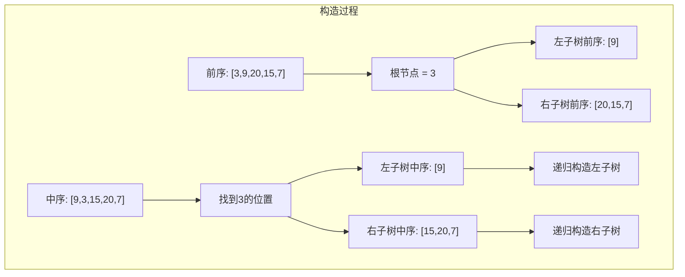

# Day 34：并发编程综合

## 📅 学习目标

- [ ] 深入理解进程与线程的区别与联系
- [ ] 掌握线程安全的核心概念与实现方法
- [ ] 熟练运用同步机制（互斥锁、条件变量、原子操作）
- [ ] 复习C++11并发编程核心组件（thread/mutex/condition_variable/atomic）
- [ ] 掌握EMC++ Item 35-40 并发相关条款
- [ ] 完成LeetCode 236（二叉树最近公共祖先）和 105（从前序与中序遍历构造二叉树）

---

## 📖 知识点一：进程线程模型

### 进程与线程的概念

进程（Process）是操作系统资源分配的基本单位，每个进程都有独立的地址空间、文件描述符、环境变量等资源。线程（Thread）是CPU调度的基本单位，同一进程内的多个线程共享进程的资源，但拥有独立的栈空间和寄存器状态。理解进程和线程的区别是并发编程的基础，也是系统设计和性能优化的重要依据。

从操作系统角度来看，进程是一个正在运行的程序实例，它包含了程序的代码、数据和运行时状态。线程则是在进程内部执行的一个控制流，多个线程可以并发执行同一程序的不同部分。进程创建开销大（需要复制父进程的资源），线程创建开销小（共享进程资源）。进程间通信需要IPC机制，而线程间可以直接读写共享变量。

### 进程与线程的对比

| 特性 | 进程 | 线程 |
|------|------|------|
| 资源分配 | 独立地址空间 | 共享地址空间 |
| 创建开销 | 大（需要复制资源） | 小（共享资源） |
| 通信方式 | IPC（管道、消息队列等） | 共享内存 |
| 切换开销 | 大（需要切换地址空间） | 小（同一地址空间） |
| 健壮性 | 高（进程崩溃不影响其他进程） | 低（线程崩溃可能影响整个进程） |
| 适用场景 | 隔离性要求高的任务 | 需要频繁通信的任务 |



### 线程安全

线程安全（Thread Safety）是指多线程环境下，代码能够正确处理多个线程同时访问共享资源的情况，不会出现数据竞争或不确定的行为。实现线程安全的核心挑战在于保证操作的原子性和可见性，即一个操作要么完全执行，要么完全不执行，且一个线程对共享变量的修改能够被其他线程及时看到。

线程安全问题通常出现在以下场景：多个线程同时读写共享变量、操作非线程安全的容器、调用非线程安全的函数等。解决线程安全问题的基本策略包括：互斥锁保护临界区、使用原子操作、使用线程本地存储（Thread Local Storage）、避免共享状态等。其中，互斥锁是最常用的同步机制，通过加锁保证同一时刻只有一个线程能够访问临界区。



### 同步机制详解

#### 互斥锁（Mutex）

互斥锁是最基本的同步原语，用于保护临界区。C++11提供了`std::mutex`及其变体`std::recursive_mutex`、`std::timed_mutex`等。使用互斥锁时需要注意死锁问题：当两个或多个线程互相等待对方释放锁时，程序将无限等待下去。

```cpp
// 基本互斥锁使用
std::mutex mtx;
int shared_counter = 0;

void increment() {
    std::lock_guard<std::mutex> lock(mtx);  // RAII风格加锁
    ++shared_counter;
    // 离开作用域自动解锁
}

// 避免死锁：使用std::lock同时锁定多个互斥量
std::mutex mtx1, mtx2;
void safeOperation() {
    std::lock(mtx1, mtx2);  // 原子地锁定两个互斥量
    std::lock_guard<std::mutex> lg1(mtx1, std::adopt_lock);
    std::lock_guard<std::mutex> lg2(mtx2, std::adopt_lock);
    // 临界区操作
}
```

#### 条件变量（Condition Variable）

条件变量用于线程间的通知机制，允许一个线程等待某个条件成立，另一个线程通知条件已满足。条件变量必须与互斥锁配合使用，以避免竞态条件。

```cpp
std::mutex mtx;
std::condition_variable cv;
bool ready = false;

// 等待线程
void waitForReady() {
    std::unique_lock<std::mutex> lock(mtx);
    cv.wait(lock, []{ return ready; });  // 等待条件成立
    // 条件成立后继续执行
}

// 通知线程
void setReady() {
    {
        std::lock_guard<std::mutex> lock(mtx);
        ready = true;
    }
    cv.notify_one();  // 或 notify_all()
}
```

#### 原子操作（Atomic）

原子操作是不可分割的操作，在执行过程中不会被中断。C++11提供了`std::atomic`模板类，支持对基本类型的原子操作。原子操作比互斥锁更轻量，适用于简单的计数器、标志位等场景。

```cpp
std::atomic<int> counter(0);
std::atomic<bool> flag(false);

// 原子递增
counter.fetch_add(1);  // 或 counter++

// 原子交换
int expected = 0;
bool success = counter.compare_exchange_strong(expected, 1);

// 内存序
counter.load(std::memory_order_acquire);
counter.store(1, std::memory_order_release);
```

### 同步机制对比

| 同步机制 | 适用场景 | 性能开销 | 特点 |
|---------|---------|---------|------|
| mutex | 保护复杂临界区 | 较高 | 使用简单，但可能死锁 |
| recursive_mutex | 递归调用场景 | 较高 | 允许同一线程多次加锁 |
| condition_variable | 线程间通知 | 中等 | 需配合mutex使用 |
| atomic | 简单变量操作 | 低 | 无锁，但功能有限 |
| 读写锁 | 读多写少 | 中等 | 允许并发读 |

---

## 📖 知识点二：C++并发编程综合

### std::thread 线程管理

C++11的`std::thread`是并发编程的基础组件，用于创建和管理线程。每个`std::thread`对象代表一个执行线程，可以通过构造函数传递参数启动线程。使用线程时需要特别注意资源管理：线程对象必须在销毁前调用`join()`或`detach()`，否则程序会调用`std::terminate()`终止。

```cpp
#include <thread>
#include <iostream>

void worker(int id) {
    std::cout << "Worker " << id << " running\n";
}

int main() {
    std::thread t1(worker, 1);  // 创建并启动线程
    std::thread t2(worker, 2);
    
    t1.join();  // 等待线程结束
    t2.join();
    
    return 0;
}
```

线程管理的关键实践包括：使用RAII包装器管理线程生命周期（如`std::jthread`，C++20）、避免异常导致的资源泄漏、合理设置线程数量（通常与CPU核心数相关）、使用线程池避免频繁创建销毁线程的开销。

### std::mutex 互斥量家族

互斥量家族提供了多种锁机制，满足不同场景的需求：

- `std::mutex`：基本互斥量，不可递归加锁
- `std::recursive_mutex`：递归互斥量，同一线程可多次加锁
- `std::timed_mutex`：定时互斥量，支持超时尝试加锁
- `std::shared_mutex`（C++17）：读写锁，允许多读单写

```cpp
// RAII风格的锁管理
std::mutex mtx;

void safeOperation() {
    // lock_guard: 最简单，自动加锁解锁
    {
        std::lock_guard<std::mutex> lg(mtx);
        // 临界区
    }
    
    // unique_lock: 更灵活，支持延迟加锁、提前解锁
    {
        std::scoped_lock<std::mutex> ul(mtx);  // C++17
        // 临界区
    }
}
```

### std::condition_variable 条件变量

条件变量实现了线程间的等待/通知机制，是生产者-消费者模式、线程池等并发结构的核心组件。使用条件变量时需要遵循固定模式：在循环中检查条件（防止虚假唤醒），使用`std::unique_lock`管理锁。

```cpp
#include <condition_variable>
#include <queue>
#include <thread>

template<typename T>
class ThreadSafeQueue {
private:
    std::queue<T> queue_;
    mutable std::mutex mtx_;
    std::condition_variable cv_;
    
public:
    void push(T value) {
        {
            std::lock_guard<std::mutex> lg(mtx_);
            queue_.push(std::move(value));
        }
        cv_.notify_one();
    }
    
    T pop() {
        std::unique_lock<std::mutex> ul(mtx_);
        cv_.wait(ul, [this]{ return !queue_.empty(); });
        T value = std::move(queue_.front());
        queue_.pop();
        return value;
    }
};
```

### std::atomic 原子操作

原子操作是无锁编程的基础，C++11提供了丰富的原子类型和操作。原子操作不仅保证操作的原子性，还通过内存序（Memory Order）控制不同线程间的可见性。

```cpp
#include <atomic>

// 常用原子操作
std::atomic<int> counter(0);
std::atomic<bool> flag(false);
std::atomic<int*> ptr(nullptr);

// 原子操作示例
void atomicDemo() {
    // 加载和存储
    int val = counter.load();  // 原子读取
    counter.store(10);         // 原子写入
    
    // 交换
    int old = counter.exchange(20);  // 原子交换并返回旧值
    
    // 比较并交换（CAS）
    int expected = 20;
    bool success = counter.compare_exchange_strong(expected, 30);
    
    // 原子算术
    counter.fetch_add(1);  // 原子加
    counter.fetch_sub(1);  // 原子减
}

// 内存序详解
void memoryOrderDemo() {
    // memory_order_relaxed: 只保证原子性，不保证顺序
    counter.fetch_add(1, std::memory_order_relaxed);
    
    // memory_order_acquire: 获取语义，后续读写不能重排到此操作之前
    int val = counter.load(std::memory_order_acquire);
    
    // memory_order_release: 释放语义，之前的读写不能重排到此操作之后
    counter.store(10, std::memory_order_release);
    
    // memory_order_seq_cst: 默认，最强约束，全局顺序一致
    counter.store(10, std::memory_order_seq_cst);
}
```

### 并发编程综合示例



---

## 📖 知识点三：EMC++ Item 35-40 复习

### Item 35: Prefer task-based programming to thread-based

基于任务（task-based）的编程比基于线程（thread-based）的编程更优。使用`std::async`可以避免手动管理线程，让运行时决定最佳执行策略（同步或异步），同时提供异常安全的返回值传递。

```cpp
// 不推荐：手动管理线程
int result;
std::thread t([&result]{ result = compute(); });
t.join();

// 推荐：使用async
auto future = std::async(std::launch::async, compute);
int result = future.get();  // 自动处理异常
```

**核心要点**：
- `std::thread`不提供返回值机制，异常会导致程序终止
- `std::async`返回`std::future`，可以获取返回值和异常
- 默认启动策略允许运行时优化调度决策

### Item 36: Specify std::launch::async if asynchronicity is essential

当异步执行至关重要时，必须显式指定`std::launch::async`启动策略。默认启动策略不保证异步执行，运行时可能选择延迟执行（在调用get()时同步执行）。

```cpp
// 默认策略：可能异步，可能延迟
auto f1 = std::async(func);

// 强制异步执行
auto f2 = std::async(std::launch::async, func);

// 强制延迟执行
auto f3 = std::async(std::launch::deferred, func);
```

**核心要点**：
- 默认策略是`async | deferred`，运行时决定
- 需要真正并行时使用`std::launch::async`
- 延迟执行适用于负载均衡场景

### Item 37: Make std::threads unjoinable on all paths

确保所有路径下`std::thread`都是不可连接状态（joined或detached）。未处理的线程会在析构时调用`std::terminate()`导致程序崩溃。

```cpp
// RAII包装器
class ThreadGuard {
    std::thread& t_;
public:
    explicit ThreadGuard(std::thread& t) : t_(t) {}
    ~ThreadGuard() {
        if (t_.joinable()) {
            t_.join();
        }
    }
    ThreadGuard(const ThreadGuard&) = delete;
    ThreadGuard& operator=(const ThreadGuard&) = delete;
};

// C++20: 使用std::jthread自动join
std::jthread t(func);  // 析构时自动join
```

### Item 38: Be aware of varying thread handle destructor behavior

不同并发句柄的析构行为不同：`std::thread`会终止程序，`std::future`会阻塞等待共享状态，了解这些行为对于正确管理资源至关重要。

```cpp
// thread析构：程序终止（如果joinable）
std::thread t(func);
// t析构时若joinable()为true -> std::terminate()

// future析构：等待共享状态就绪
auto f = std::async(func);
// f析构时会阻塞直到异步操作完成
```

### Item 39: Consider void futures for one-shot event communication

对于一次性事件通信，考虑使用`std::promise<void>`和`std::future<void>`组合，这比条件变量更简洁且不易出错。

```cpp
// 使用promise/future进行一次性通知
std::promise<void> readyPromise;
std::future<void> readyFuture = readyPromise.get_future();

// 等待线程
readyFuture.wait();  // 阻塞直到被通知

// 通知线程
readyPromise.set_value();  // 发送通知
```

### Item 40: Use std::atomic for concurrency, volatile for special memory

`std::atomic`用于并发编程，`volatile`用于特殊内存（如内存映射I/O）。两者用途完全不同，不能混用。

```cpp
// atomic: 用于并发访问
std::atomic<int> counter(0);
counter++;  // 原子递增，线程安全

// volatile: 用于特殊内存，告诉编译器不要优化
volatile int* hardwareReg = reinterpret_cast<volatile int*>(0xFFFF0000);
*hardwareReg = 0x01;  // 每次都要写入，不能被优化掉

// 错误用法：volatile不保证原子性
volatile int x = 0;
x++;  // 非原子操作，不线程安全！
```

**总结对比**：

| 特性 | std::atomic | volatile |
|------|-------------|----------|
| 原子性 | 保证 | 不保证 |
| 可见性 | 保证（通过内存序） | 不保证 |
| 线程安全 | 是 | 否 |
| 用途 | 并发编程 | 特殊内存访问 |

---

## 🎯 LeetCode 刷题

### 讲解题：LC 236. 二叉树的最近公共祖先

#### 题目链接

[LeetCode 236](https://leetcode.cn/problems/lowest-common-ancestor-of-a-binary-tree/)

#### 题目描述

给定一个二叉树, 找到该树中两个指定节点的最近公共祖先。最近公共祖先的定义为："对于有根树 T 的两个节点 p、q，最近公共祖先表示为一个节点 x，满足 x 是 p、q 的祖先且 x 的深度尽可能大（一个节点也可以是它自己的祖先）。"

#### 形象化理解

想象一个"家族族谱"：
- 你和你的堂兄弟的最近公共祖先是你们的祖父
- 你和你的兄弟姐妹的最近公共祖先是你们的父亲
- 你和自己的"最近公共祖先"就是你自己

```
        3
       / \
      5   1
     / \ / \
    6  2 0  8
      / \
     7   4

节点5和节点1的最近公共祖先是节点3
节点5和节点4的最近公共祖先是节点5（5是4的祖先）
节点6和节点4的最近公共祖先是节点5
```

#### 📚 理论介绍

**公共祖先（Common Ancestor）**：在树中，如果节点A在节点B到根节点的路径上，则称A是B的祖先。如果A同时是两个节点P和Q的祖先，则A是P和Q的公共祖先。

**最近公共祖先（LCA, Lowest Common Ancestor）**：在所有公共祖先中，离P和Q最近的那一个。LCA是树论中的经典问题，广泛应用于计算生物学、地理信息系统等领域。

**LCA问题的特点**：
1. **唯一性**：对于任意两个节点，LCA存在且唯一
2. **包含性**：节点可以是自己的祖先
3. **传递性**：LCA(P, Q)必在P到根和Q到根的路径交点上

**常见求解方法**：
| 方法 | 时间复杂度 | 空间复杂度 | 特点 |
|------|-----------|-----------|------|
| 递归DFS | O(n) | O(h) | 简洁直观 |
| 存储路径 | O(n) | O(n) | 思路简单 |
| Tarjan算法 | O(n) | O(n) | 离线查询最优 |
| 倍增法 | O(nlogn)预处理，O(logn)查询 | O(nlogn) | 在线查询高效 |

#### 解题思路

递归DFS是解决LCA问题的经典方法，核心思想是：

1. **递归终止条件**：如果当前节点为空、等于p或等于q，直接返回当前节点
2. **递归左右子树**：分别在左右子树中查找p和q
3. **根据左右子树结果判断**：
   - 如果左右子树都找到了节点，说明当前节点就是LCA
   - 如果只有一边找到了，说明LCA在那一侧
   - 如果都没找到，返回空



**关键洞察**：
- 如果p和q分别在root的左右子树，root就是LCA
- 如果p和q都在同一子树，LCA就在那个子树中
- 如果p或q就是root，root就是LCA

#### 代码实现

```cpp
// 文件位置：code/leetcode/0236_lca/solution.h

#ifndef SOLUTION_H
#define SOLUTION_H

// 二叉树节点定义
struct TreeNode {
    int val;
    TreeNode* left;
    TreeNode* right;
    TreeNode(int x) : val(x), left(nullptr), right(nullptr) {}
};

class Solution {
public:
    TreeNode* lowestCommonAncestor(TreeNode* root, TreeNode* p, TreeNode* q);
};

#endif // SOLUTION_H
```

```cpp
// 文件位置：code/leetcode/0236_lca/solution.cpp

#include "solution.h"

TreeNode* Solution::lowestCommonAncestor(TreeNode* root, TreeNode* p, TreeNode* q) {
    // 基本情况：到达空节点或找到p/q
    if (root == nullptr || root == p || root == q) {
        return root;
    }
    
    // 递归左右子树
    TreeNode* left = lowestCommonAncestor(root->left, p, q);
    TreeNode* right = lowestCommonAncestor(root->right, p, q);
    
    // 如果左右子树都找到了，说明p和q分别在root两侧
    if (left != nullptr && right != nullptr) {
        return root;  // root就是LCA
    }
    
    // 如果只有一边找到了，返回那一侧的结果
    // 如果两边都没找到，返回nullptr
    return left != nullptr ? left : right;
}
```

#### 复杂度分析

- 时间复杂度：O(n)，最坏情况下需要遍历所有节点
- 空间复杂度：O(h)，h为树高，递归栈深度

---

### 实战题：LC 105. 从前序与中序遍历序列构造二叉树

#### 题目链接

[LeetCode 105](https://leetcode.cn/problems/construct-binary-tree-from-preorder-and-inorder-traversal/)

#### 题目描述

给定两个整数数组 `preorder` 和 `inorder`，其中 `preorder` 是二叉树的先序遍历，`inorder` 是同一棵树的中序遍历，请构造二叉树并返回其根节点。

#### 形象化理解

想象你在还原一个"被打乱的拼图"：
- 前序遍历告诉你：每个子树的"老大"（根节点）是谁
- 中序遍历告诉你：这个"老大"的"左翼"和"右翼"分别是谁

```
前序遍历: [3, 9, 20, 15, 7]  -> 根节点在前面
中序遍历: [9, 3, 15, 20, 7]  -> 根节点分割左右

第一步：前序第一个是3 -> 根节点
第二步：中序找3，左边[9]是左子树，右边[15,20,7]是右子树
第三步：递归处理左右子树

        3
       / \
      9  20
        /  \
       15   7
```

#### 📚 理论介绍

**前序遍历（Preorder）**：根 → 左 → 右，第一个元素总是当前子树的根节点。

**中序遍历（Inorder）**：左 → 根 → 右，根节点将序列分为左子树和右子树两部分。

**为什么这两种遍历可以确定一棵树？**
1. 前序遍历确定了根节点的位置（第一个元素）
2. 中序遍历确定了左右子树的范围（根节点左侧是左子树，右侧是右子树）
3. 递归应用以上规则即可还原整棵树

**构造过程可视化**：
```
前序: [根, [左子树前序], [右子树前序]]
中序: [[左子树中序], 根, [右子树中序]]

步骤：
1. 前序首元素 -> 根节点
2. 在中序中找到根节点位置 -> 确定左右子树大小
3. 根据子树大小，分割前序序列
4. 递归构造左右子树
```

**边界情况**：
- 空数组：返回空树
- 单元素：叶子节点
- 前序和中序长度必须相等

#### 解题思路

递归构造的核心步骤：

1. **确定根节点**：前序遍历的第一个元素
2. **分割中序数组**：找到根节点在中序中的位置，左边是左子树，右边是右子树
3. **分割前序数组**：根据中序分割结果，确定前序中左右子树的范围
4. **递归构造**：对左右子树重复以上步骤



**优化技巧**：使用哈希表存储中序值到索引的映射，避免重复查找。

#### 代码实现

```cpp
// 文件位置：code/leetcode/0105_construct_tree/solution.h

#ifndef SOLUTION_H
#define SOLUTION_H

#include <vector>
#include <unordered_map>

struct TreeNode {
    int val;
    TreeNode* left;
    TreeNode* right;
    TreeNode(int x) : val(x), left(nullptr), right(nullptr) {}
};

class Solution {
private:
    std::unordered_map<int, int> inorderMap_;
    
    TreeNode* buildTreeHelper(
        const std::vector<int>& preorder,
        int preStart, int preEnd,
        int inStart, int inEnd
    );

public:
    TreeNode* buildTree(std::vector<int>& preorder, std::vector<int>& inorder);
};

#endif // SOLUTION_H
```

```cpp
// 文件位置：code/leetcode/0105_construct_tree/solution.cpp

#include "solution.h"

TreeNode* Solution::buildTreeHelper(
    const std::vector<int>& preorder,
    int preStart, int preEnd,
    int inStart, int inEnd
) {
    // 递归终止条件
    if (preStart > preEnd || inStart > inEnd) {
        return nullptr;
    }
    
    // 前序首元素是根节点
    int rootVal = preorder[preStart];
    TreeNode* root = new TreeNode(rootVal);
    
    // 在中序中找到根节点的位置
    int rootPos = inorderMap_[rootVal];
    
    // 计算左子树的大小
    int leftSize = rootPos - inStart;
    
    // 递归构造左子树
    // 前序: [preStart+1, preStart+leftSize]
    // 中序: [inStart, rootPos-1]
    root->left = buildTreeHelper(
        preorder,
        preStart + 1, preStart + leftSize,
        inStart, rootPos - 1
    );
    
    // 递归构造右子树
    // 前序: [preStart+leftSize+1, preEnd]
    // 中序: [rootPos+1, inEnd]
    root->right = buildTreeHelper(
        preorder,
        preStart + leftSize + 1, preEnd,
        rootPos + 1, inEnd
    );
    
    return root;
}

TreeNode* Solution::buildTree(std::vector<int>& preorder, std::vector<int>& inorder) {
    // 建立中序值到索引的映射
    for (int i = 0; i < inorder.size(); ++i) {
        inorderMap_[inorder[i]] = i;
    }
    
    return buildTreeHelper(preorder, 0, preorder.size() - 1, 0, inorder.size() - 1);
}
```

#### 复杂度分析

- 时间复杂度：O(n)，每个节点处理一次
- 空间复杂度：O(n)，哈希表存储和递归栈

---

## 🚀 运行代码

```bash
# 编译并运行当天所有代码
./build_and_run.sh

# 或者手动编译
mkdir build && cd build
cmake ..
make
./day_34_main
```

---

## 📚 相关术语汇总

| 术语 | 英文 | 定义 |
|------|------|------|
| 进程 | Process | 操作系统资源分配的基本单位 |
| 线程 | Thread | CPU调度的基本单位 |
| 线程安全 | Thread Safety | 多线程环境下正确处理共享资源的能力 |
| 互斥锁 | Mutex | 保护临界区的同步原语 |
| 条件变量 | Condition Variable | 线程间通知机制的同步原语 |
| 原子操作 | Atomic Operation | 不可分割的操作 |
| 死锁 | Deadlock | 多线程互相等待导致无限阻塞 |
| 竞态条件 | Race Condition | 执行结果依赖线程执行顺序 |
| 内存序 | Memory Order | 原子操作的可见性约束 |
| 公共祖先 | Common Ancestor | 同时是两个节点祖先的节点 |
| 最近公共祖先 | LCA | 离两个节点最近的公共祖先 |
| 前序遍历 | Preorder Traversal | 根-左-右的遍历顺序 |
| 中序遍历 | Inorder Traversal | 左-根-右的遍历顺序 |

---

## 💡 学习提示

1. **并发编程学习建议**：理解进程线程模型是并发编程的基础。建议通过调试工具观察多线程程序的执行过程，体会竞态条件和同步机制的作用。动手实现一个线程安全的队列或计数器，加深对mutex和condition_variable的理解。

2. **同步机制选择指南**：
   - 简单计数器/标志位：使用`std::atomic`
   - 保护复杂数据结构：使用`std::mutex`配合`std::lock_guard`
   - 线程间等待/通知：使用`std::condition_variable`
   - 一次性事件：使用`std::promise/std::future`

3. **LCA问题学习建议**：递归解法简洁但需要深入理解递归过程。建议在纸上画出递归调用树，跟踪每个递归调用的返回值。思考为什么这个算法能正确工作——关键在于理解"找到p或q就返回"的含义。

4. **树的构造问题建议**：前序+中序构造树是理解遍历本质的好题目。关键在于理解两种遍历如何互相补充：前序确定根，中序确定边界。建议画出分割过程图，理解索引计算。

5. **常见错误提醒**：
   - 使用互斥锁时忘记解锁，或在异常路径下未解锁
   - 条件变量等待时使用`if`而非`while`（应防止虚假唤醒）
   - 在`std::thread`析构前未调用`join()`或`detach()`
   - 混淆`std::atomic`和`volatile`的用途

---

## 🔗 参考资料

1. [cppreference - std::thread](https://en.cppreference.com/w/cpp/thread/thread)
2. [cppreference - std::mutex](https://en.cppreference.com/w/cpp/thread/mutex)
3. [cppreference - std::condition_variable](https://en.cppreference.com/w/cpp/thread/condition_variable)
4. [cppreference - std::atomic](https://en.cppreference.com/w/cpp/atomic/atomic)
5. [Effective Modern C++ - Item 35-40](https://www.aristeia.com/EMC++.html)
6. [LeetCode 236 - 二叉树的最近公共祖先](https://leetcode.cn/problems/lowest-common-ancestor-of-a-binary-tree/)
7. [LeetCode 105 - 从前序与中序遍历序列构造二叉树](https://leetcode.cn/problems/construct-binary-tree-from-preorder-and-inorder-traversal/)
8. [C++ Concurrency In Action](https://www.manning.com/books/c-plus-plus-concurrency-in-action)
