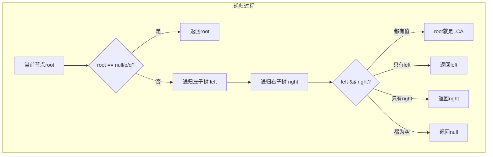
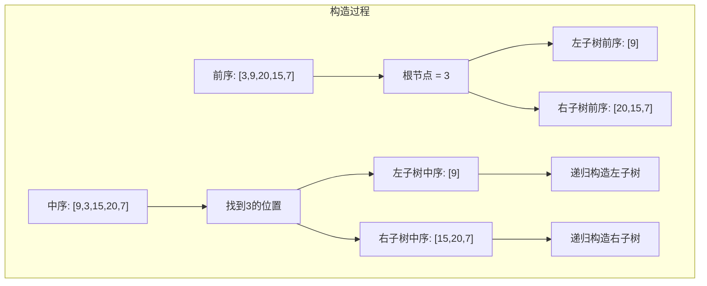

# Day 34：并发编程综合

> **学习定位**：本日把线程、锁、条件变量、future 和 atomic 放进同一张选择图，并通过树的综合题复盘递归。重点是同步边界和失效场景，不是追求“无锁一定更快”。

> **共性入口**：LCA 与重建树的手算见 [形象化指南的 Day 34](../树与并发专题形象化题解指南.md#day34-visual)；并发 API 的完整主讲见 [C++ 并发编程教程](../../tutorials/CPP并发编程教程.md)；Item 35–40 主讲见 [Effective Modern C++ 教程](../../tutorials/Effective_Modern_CPP教程.md)。本日只做选型、组合、关闭协议和验证证据的综合训练。

> **前后关系**：上一日 [Day 33](../day_33/README.md) 固定线程池的 reject-drain-join；下一日 [Day 35](../day_35/README.md) 用序列化、树形 DP、自测分层和项目契约完成阶段验收。

## 📅 学习目标

- [ ] 深入理解进程与线程的区别与联系
- [ ] 掌握线程安全的核心概念与实现方法
- [ ] 熟练运用同步机制（互斥锁、条件变量、原子操作）
- [ ] 复习C++11并发编程核心组件（thread/mutex/condition_variable/atomic）
- [ ] 掌握EMC++ Item 35-40 并发相关条款
- [ ] 完成LeetCode 236（二叉树最近公共祖先）和 105（从前序与中序遍历构造二叉树）

---

## 📖 知识点一：把并发组件放进同一张正确性地图

本日不再逐项重讲 API。线程创建、共享数据、条件变量、future、atomic 和线程池的完整机制统一阅读 [C++ 并发编程教程](../../tutorials/CPP并发编程教程.md)，Item 35–40 的动机、反例和边界统一阅读 [Effective Modern C++ 教程](../../tutorials/Effective_Modern_CPP教程.md)。这里的新增任务是：面对一个真实接口时，能选择同步边界、写出关闭协议，并说明测试为什么不依赖调度运气。

### 进程与线程：只保留本日需要的边界

进程通常是资源与故障隔离边界，线程是进程内的一条执行流；同一进程内的线程通常共享地址空间和打开的资源，但各自拥有执行状态。创建、切换和通信成本取决于平台与负载，C++ 标准不保证“线程一定比进程便宜”之类的固定比例。本周真正要解决的不是背操作系统定义，而是共享地址空间带来的四类责任：

| 责任 | 必须回答的问题 | 典型失败 |
|---|---|---|
| 所有权 | 线程、任务、参数、结果和共享对象由谁拥有，活到何时？ | 分离线程访问已经销毁的局部对象 |
| 冲突访问 | 哪些线程会读写同一内存位置，哪条同步边建立 happens-before？ | data race 导致未定义行为 |
| 业务不变量 | 哪些字段必须作为一个整体观察和更新？ | 每个字段都合法，但账户总额或队列状态已经破坏 |
| 完成协议 | 谁停止接受，已接受工作排空还是取消，谁唤醒并 join？ | 析构永久等待、任务丢失或 self-join |

精确定义 data race 时不能只说“两个线程同时写”：两个可能并发的冲突访问作用于同一内存位置、至少一个访问会修改、至少一个访问不是原子操作，并且两者之间没有 happens-before，程序行为就是未定义。互斥正确也不等于程序必然完成；死锁、活锁、饥饿和忘记唤醒属于活性问题，必须另写停止与等待协议。

### 同步机制选择矩阵

| 需求 | 首选入口 | 本日要验证的边界 |
|---|---|---|
| 一个作用域拥有一条执行线程 | <code>std::thread</code> + RAII join | 每条退出路径都 non-joinable，任务能有限完成或响应停止 |
| 一次计算返回值或异常 | 任务 + <code>future</code> | 保存并观察结果句柄；<code>async</code> 策略符合接口需要 |
| 多个字段组成一个不变量 | <code>mutex</code> + 具名 RAII 锁 | 所有相关读写使用同一协议，未知回调不在锁内执行 |
| 等待共享状态变化 | <code>condition_variable</code> + 受锁谓词 | 使用谓词重载，处理虚假唤醒和关闭 |
| 独立计数或经过证明的状态机 | <code>atomic</code> | 单对象原子性不冒充跨字段事务，内存序有证明 |
| 长寿命 worker、队列和背压 | 线程池或执行器 | 接受、拒绝、排空、停止、唤醒、join 全部显式 |

<code>recursive_mutex</code> 不是一般性的死锁修复，它常会掩盖重入设计；读写锁也只有在读多写少且测量证明受益时才值得增加复杂度。先选最容易证明正确的接口，再讨论性能。

### 三条常见 happens-before 证明链

1. **mutex 链**：线程 A 在同一把 mutex 保护下修改共享状态并解锁；线程 B 随后成功锁住该 mutex，再读取状态。解锁与后续加锁建立同步，A 在解锁前的写入 happens-before B 在加锁后的读取。
2. **条件变量链**：通知者先在 mutex 保护下改变谓词，再通知；等待者通过 <code>wait(lock, predicate)</code> 原子地释放锁并等待，返回前重新加锁并再次确认谓词。通知只是促使重查，状态可见性仍来自受锁状态和 mutex 同步。
3. **release/acquire 链**：发布者先写普通 payload，再对原子标志做 release store；消费者的 acquire load 必须实际读到该发布值，之后才能安全读取 payload。两端都改成 relaxed 会失去这条发布证明。

<code>future::get()</code>、成功等待已就绪共享状态和 <code>join()</code> 也能形成完成点，但它们解决的所有权与结果问题不同，不能只因为都“会阻塞”就混为同一种 API。

---

## 📖 知识点二：可关闭通道的完整协议

Day 31 已学习条件变量谓词，Day 33 已学习线程池。本日把两者合并到 <code>IntChannel</code>：通道内部的队列和 <code>closed</code> 状态由同一把 mutex 保护，外部只通过 send、receive 和 close 观察协议。

### 接口契约

| 操作 | Running 状态 | Closed 但队列非空 | Closed 且队列为空 |
|---|---|---|---|
| send(value) | 在锁内入队后返回成功 | 拒绝且不修改队列 | 拒绝且不修改队列 |
| receive() | 有值则取一个；无值则等待 | 继续排空已接受值 | 返回结束标记 |
| close() | 锁内关门，随后唤醒全部等待者 | 幂等，不丢弃已有值 | 幂等 |

send 与 close 使用同一把锁决定线性化顺序：send 先完成入队，该值就属于必须排空的已接受工作；close 先关门，send 就必须失败，不能处于“也许入队了一半”的状态。receive 的谓词是“已关闭或队列非空”，不能只等“队列非空”，否则最后一个生产者退出后消费者可能永久睡眠。

### 关闭顺序

1. **接受**：Running 时，提交在锁内进入队列才算成功。
2. **拒绝**：close 在锁内把状态改为不再接受；此后的 send 明确失败。
3. **排空**：消费者继续处理关闭前已成功入队的数据。
4. **停止与唤醒**：close 调用 <code>notify_all()</code>，所有等待者重新检查谓词。
5. **退出**：队列空且已关闭时，receive 返回结束标记，worker 离开循环。
6. **join**：通道或线程组的外部 owner 等待 worker；worker 不回收包含自身的线程组。

“立即取消待处理数据”也是可能的设计，但必须是另一份明确契约：被取消任务的 future 获得什么结果、资源怎样释放、调用者如何区分取消与执行失败。本日采用 drain，不能把取消悄悄混入实现。

### atomic 的适用边界

本日默认从 <code>memory_order_seq_cst</code> 开始，因为它最容易推理。独立统计计数可在不发布其他数据时考虑 relaxed；发布 payload 才讨论 release/acquire；多个字段需要一起验证时优先回到 mutex。标准不保证任意 <code>atomic&lt;T&gt;</code> lock-free，也不保证无锁比锁更快；<code>is_lock_free()</code> 只能描述当前实现性质，不能替代算法正确性证明。

---

## 📖 知识点三：EMC++ Item 35–40 的本日连接

下表只记录 Day 34 的综合判断，完整条款不在这里复制。

| Item | 主问题 | Day 34 的落点 |
|---|---|---|
| 35 | 任务还是线程 | 有返回值或异常的一次计算优先任务；长期 worker 和有界队列需要执行器协议 |
| 36 | 是否必须异步 | 若线程身份或并发执行是契约，显式选择 <code>std::launch::async</code>；默认策略允许 deferred |
| 37 | thread 如何离开作用域 | RAII 让每条正常/异常路径都 join；detach 需要独立寿命证明 |
| 38 | 句柄析构做什么 | joinable thread 析构终止；future 是否可能等待取决于共享状态来源 |
| 39 | 一次性事件怎样通知 | <code>promise&lt;void&gt;</code>/<code>future&lt;void&gt;</code> 记住就绪状态；重复事件仍用状态 + 条件变量 |
| 40 | atomic 与 volatile | atomic 用于并发同步；volatile 不建立 happens-before，只用于实现/平台定义的特殊访问 |

### 线程生命周期的统一检查

- <code>std::thread</code> 构造成功后即可开始执行，参数按值保存还是显式借用必须清楚。
- 句柄析构前若仍 joinable，程序调用 <code>std::terminate()</code>；线程函数已经返回并不会自动令句柄 non-joinable。
- <code>std::async</code> 默认策略允许 async 或 deferred；需要异步时显式指定策略并处理资源不足异常。
- 来自 async、promise、packaged_task 的 future 共享状态来源不同，不能把析构行为背成统一规则。
- 线程池析构前必须停止接受、排空、唤醒、退出并由外部 owner join；任务捕获的引用必须活到 future 就绪。

### 不依赖时序的验证方法

并发测试要证明协议，而不是“制造看起来像并发的输出”：

| 要验证的性质 | 稳定手段 | 不应使用 |
|---|---|---|
| 任务已经开始并停在指定阶段 | promise/future 或 mutex + 谓词门控 | 睡眠若干毫秒后猜测 |
| 已接受任务全部完成 | 保存 future 并 get，或 shutdown 返回后检查最终集合 | 日志行数或完成顺序 |
| close 后提交被拒绝 | 先通过同步门确认 close 线性化，再调用 send/submit | 两个线程同时启动后碰运气 |
| 没有丢失或重复 | 比较最终多重集合、计数和业务不变量 | 假定 FIFO 之外的调度顺序 |
| worker 已退出 | 外部 owner join | 轮询线程 ID 或固定超时 |

测试仍可设置有限超时作为“测试框架不能永久挂死”的保险丝，但超时不是正确性的主要证据；主要证据必须来自协议事件和最终不变量。

## 🎯 LeetCode 刷题

### 讲解题：LC 236. 二叉树的最近公共祖先

#### 题目链接

[LeetCode 236](https://leetcode.cn/problems/lowest-common-ancestor-of-a-binary-tree/)

#### 题目描述

给定一个二叉树, 找到该树中两个指定节点的最近公共祖先。最近公共祖先的定义为："对于有根树 T 的两个节点 p、q，最近公共祖先表示为一个节点 x，满足 x 是 p、q 的祖先且 x 的深度尽可能大（一个节点也可以是它自己的祖先）。"

#### 形象化理解

想象一个"家族族谱"：
- 你和你的堂兄弟的最近公共祖先是你们的祖父
- 你和你的兄弟姐妹的最近公共祖先是你们的父亲
- 你和自己的"最近公共祖先"就是你自己

```
        3
       / \
      5   1
     / \ / \
    6  2 0  8
      / \
     7   4

节点5和节点1的最近公共祖先是节点3
节点5和节点4的最近公共祖先是节点5（5是4的祖先）
节点6和节点4的最近公共祖先是节点5
```

#### 📚 理论介绍

**公共祖先（Common Ancestor）**：在树中，如果节点A在节点B到根节点的路径上，则称A是B的祖先。如果A同时是两个节点P和Q的祖先，则A是P和Q的公共祖先。

**最近公共祖先（LCA, Lowest Common Ancestor）**：在所有公共祖先中，离P和Q最近的那一个。LCA是树论中的经典问题，广泛应用于计算生物学、地理信息系统等领域。

**LCA问题的特点**：
1. **唯一性**：当两个目标都属于同一棵有根树时，LCA存在且唯一
2. **包含性**：节点可以是自己的祖先
3. **传递性**：LCA(P, Q)必在P到根和Q到根的路径交点上

**常见求解方法**：
| 方法 | 时间复杂度 | 空间复杂度 | 特点 |
|------|-----------|-----------|------|
| 递归DFS | O(n) | O(h) | 简洁直观 |
| 存储路径 | O(n) | O(n) | 思路简单 |
| Tarjan 离线算法 | O((n+q) α(n)) | O(n+q) | 一次处理 q 个已知查询，复杂度近线性 |
| 倍增法 | O(nlogn)预处理，O(logn)查询 | O(nlogn) | 在线查询高效 |

这里 `n` 是节点数、`q` 是查询数、`α(n)` 是反 Ackermann 函数。单次查询时递归 DFS 已是 O(n)；Tarjan 的优势在于批量离线查询，不应脱离 `q` 直接写成“O(n) 最优”。

#### 解题思路

递归DFS是解决LCA问题的经典方法，核心思想是：

1. **递归终止条件**：如果当前节点为空、等于p或等于q，直接返回当前节点
2. **递归左右子树**：分别在左右子树中查找p和q
3. **根据左右子树结果判断**：
   - 如果左右子树都找到了节点，说明当前节点就是LCA
   - 如果只有一边找到了，说明LCA在那一侧
   - 如果都没找到，返回空


```mermaid
graph TB
    subgraph "递归过程"
        A["当前节点root"] --> B{"root == null/p/q?"}
        B -->|"是"| C["返回root"]
        B -->|"否"| D["递归左子树 left"]
        D --> E["递归右子树 right"]
        E --> F{"left && right?"}
        F -->|"都有值"| G["root就是LCA"]
        F -->|"只有left"| H["返回left"]
        F -->|"只有right"| I["返回right"]
        F -->|"都为空"| J["返回null"]
    end
```

**关键洞察**：
- 如果p和q分别在root的左右子树，root就是LCA
- 如果p和q都在同一子树，LCA就在那个子树中
- 如果p或q就是root，root就是LCA

#### 代码实现

```cpp
#include <memory>

struct TreeNode {
    int value;
    std::unique_ptr<TreeNode> left;
    std::unique_ptr<TreeNode> right;
};

const TreeNode* lca_unchecked(
    const TreeNode* root,
    const TreeNode* p,
    const TreeNode* q) {
    if (root == nullptr || root == p || root == q) {
        return root;
    }

    const TreeNode* left = lca_unchecked(root->left.get(), p, q);
    const TreeNode* right = lca_unchecked(root->right.get(), p, q);
    if (left != nullptr && right != nullptr) {
        return root;
    }
    return left != nullptr ? left : right;
}
```

仓库实现由 `unique_ptr` 表达树的独占所有权，算法参数和返回值是只观察节点的裸指针，不负责释放。LeetCode 原题保证 `p` 和 `q` 在树中；通用接口不能偷偷依赖这个前提，因此外层先验证两个观察者都属于 `root`，缺失或空指针返回 `nullptr`。这会多做常数次 O(n) 遍历，但换来了清晰、可测试的接口契约；需要大量查询时应改用预处理方案，而不是反复扫描。

#### 复杂度分析

- 时间复杂度：O(n)，最坏情况下需要遍历所有节点
- 空间复杂度：O(h)，h为树高，递归栈深度

---

### 实战题：LC 105. 从前序与中序遍历序列构造二叉树

#### 题目链接

[LeetCode 105](https://leetcode.cn/problems/construct-binary-tree-from-preorder-and-inorder-traversal/)

#### 题目描述

给定两个整数数组 `preorder` 和 `inorder`，其中 `preorder` 是二叉树的先序遍历，`inorder` 是同一棵树的中序遍历，请构造二叉树并返回其根节点。

#### 形象化理解

想象你在还原一个"被打乱的拼图"：
- 前序遍历告诉你：每个子树的"老大"（根节点）是谁
- 中序遍历告诉你：这个"老大"的"左翼"和"右翼"分别是谁

```
前序遍历: [3, 9, 20, 15, 7]  -> 根节点在前面
中序遍历: [9, 3, 15, 20, 7]  -> 根节点分割左右

第一步：前序第一个是3 -> 根节点
第二步：中序找3，左边[9]是左子树，右边[15,20,7]是右子树
第三步：递归处理左右子树

        3
       / \
      9  20
        /  \
       15   7
```

#### 📚 理论介绍

**前序遍历（Preorder）**：根 → 左 → 右，第一个元素总是当前子树的根节点。

**中序遍历（Inorder）**：左 → 根 → 右，根节点将序列分为左子树和右子树两部分。

本题实现以“节点值唯一”为输入契约；若存在重复值，单凭值无法在中序序列中唯一定位根，需要额外身份信息或不同编码。两个序列还必须长度相等、包含相同节点身份，并且每次递归切分都落在合法范围内。

**为什么这两种遍历可以确定一棵树？**
1. 前序遍历确定了根节点的位置（第一个元素）
2. 中序遍历确定了左右子树的范围（根节点左侧是左子树，右侧是右子树）
3. 递归应用以上规则即可还原整棵树

**构造过程可视化**：
```
前序: [根, [左子树前序], [右子树前序]]
中序: [[左子树中序], 根, [右子树中序]]

步骤：
1. 前序首元素 -> 根节点
2. 在中序中找到根节点位置 -> 确定左右子树大小
3. 根据子树大小，分割前序序列
4. 递归构造左右子树
```

**边界情况**：
- 空数组：返回空树
- 单元素：叶子节点
- 前序和中序长度必须相等
- 两个序列包含不同值或子树范围矛盾时抛出 `std::invalid_argument`

#### 解题思路

递归构造的核心步骤：

1. **确定根节点**：前序遍历的第一个元素
2. **分割中序数组**：找到根节点在中序中的位置，左边是左子树，右边是右子树
3. **分割前序数组**：根据中序分割结果，确定前序中左右子树的范围
4. **递归构造**：对左右子树重复以上步骤


```mermaid
graph TB
    subgraph "构造过程"
        A["前序: [3,9,20,15,7]"] --> B["根节点 = 3"]
        C["中序: [9,3,15,20,7]"] --> D["找到3的位置"]
        D --> E["左子树中序: [9]"]
        D --> F["右子树中序: [15,20,7]"]
        B --> G["左子树前序: [9]"]
        B --> H["右子树前序: [20,15,7]"]
        E --> I["递归构造左子树"]
        F --> J["递归构造右子树"]
    end
```

**优化技巧**：使用哈希表存储中序值到索引的映射，避免重复查找。`unordered_map` 的查找是平均 O(1)，不是最坏情况承诺。

#### 代码实现

下块是与实际四区间算法一致的局部核心，**不可单独编译**；省略 `<cstddef>`、`<memory>`、`<vector>`，`TreeNode` 的其余工程接口，以及使用预建 `unordered_map` 且验证根落在 `[in_begin, in_end)` 内的 `checked_inorder_position`。

```cpp
struct TreeNode {
    explicit TreeNode(int node_value) : value{node_value} {}

    int value;
    std::unique_ptr<TreeNode> left;
    std::unique_ptr<TreeNode> right;
};

std::unique_ptr<TreeNode> build_range(
    const std::vector<int>& preorder,
    std::size_t pre_begin, std::size_t pre_end,
    std::size_t in_begin, std::size_t in_end) {
    // 半开区间 [begin, end) 避免空数组上的 size() - 1 下溢
    if (pre_begin == pre_end) {
        return nullptr;
    }

    const int root_value = preorder[pre_begin];
    const std::size_t root_pos = checked_inorder_position(root_value, in_begin, in_end);
    const std::size_t left_size = root_pos - in_begin;
    auto root = std::make_unique<TreeNode>(root_value);
    root->left = build_range(
        preorder, pre_begin + 1, pre_begin + 1 + left_size, in_begin, root_pos);
    root->right = build_range(
        preorder, pre_begin + 1 + left_size, pre_end, root_pos + 1, in_end);
    return root;
}
```

完整版本见 `code/leetcode/0105_construct_tree/solution.h`：它使用 `size_t` 半开区间避免空序列下溢，用 `unique_ptr` 保证递归中途抛异常时已经创建的节点仍会自动释放，并通过重复值、长度和值域测试固定输入契约。构造后测试会重新生成前序和中序序列与输入比较，而不是只断言根值，因为错误的子树切分也可能得到同一个根。

#### 复杂度分析

- 平均时间复杂度：O(n)，前提是 `unordered_map` 操作平均 O(1)；哈希退化时最坏可到 O(n²)
- 空间复杂度：O(n) 索引表 + O(h) 递归栈，总计 O(n)

---

## 🚀 运行代码

```bash
# 在仓库根目录执行；脚本会删除本日旧 build，再以 Release + 严格警告构建并运行全部 CTest
cd week_05/day_34
./build_and_run.sh

# 或在本日目录下用独立的全新构建目录手动验证
cmake -E remove_directory build-manual
cmake -S . -B build-manual -DCMAKE_BUILD_TYPE=Release \
  -DCMAKE_CXX_FLAGS="-Wall -Wextra -Wpedantic -Wconversion -Wsign-conversion -Wshadow -Werror"
cmake --build build-manual --parallel
ctest --test-dir build-manual --output-on-failure
```

### 今日工程动作：固定一个可关闭通道的接口契约

运行 `ctest -R day34_project_action --test-dir build-manual --output-on-failure`，再阅读 `code/main.cpp`。请给 `IntChannel` 增加 `size()` 时先写出契约：它只是某一瞬间的观察值，不能作为“随后 pop 一定成功”的依据；然后添加测试证明 `close()` 后已接收数据会排空、新数据会被拒绝、消费者不会永久等待。不要用 `sleep_for` 猜测线程已经运行到某处，完成关系必须来自 `join`、条件变量谓词或 future。

---

## 📚 相关术语汇总

| 术语 | 英文 | 定义 |
|------|------|------|
| 进程 | Process | 常见的资源与故障隔离边界，具体模型由操作系统决定 |
| 线程 | Thread | 进程内的一条执行流，通常由操作系统调度 |
| 线程安全 | Thread Safety | 在接口允许的并发调用方式下仍满足契约与不变量 |
| 互斥锁 | Mutex | 保护临界区的同步原语 |
| 条件变量 | Condition Variable | 线程间通知机制的同步原语 |
| 原子操作 | Atomic Operation | 按标准规定原子地参与对象修改顺序的操作 |
| 死锁 | Deadlock | 多线程互相等待导致无限阻塞 |
| 竞态条件 | Race Condition | 执行结果依赖线程执行顺序 |
| 内存序 | Memory Order | 原子操作的可见性约束 |
| 公共祖先 | Common Ancestor | 同时是两个节点祖先的节点 |
| 最近公共祖先 | LCA | 离两个节点最近的公共祖先 |
| 前序遍历 | Preorder Traversal | 根-左-右的遍历顺序 |
| 中序遍历 | Inorder Traversal | 左-根-右的遍历顺序 |

---

## 💡 学习提示

1. **并发编程学习建议**：理解进程线程模型是并发编程的基础。建议通过调试工具观察多线程程序的执行过程，体会竞态条件和同步机制的作用。动手实现一个线程安全的队列或计数器，加深对mutex和condition_variable的理解。

2. **同步机制选择指南**：
   - 独立计数器或经过证明的单对象状态机：考虑 `std::atomic`
   - 保护复杂数据结构：使用`std::mutex`配合`std::lock_guard`
   - 线程间等待/通知：使用`std::condition_variable`
   - 一次性事件：使用`std::promise/std::future`

3. **LCA问题学习建议**：递归解法简洁但需要深入理解递归过程。建议在纸上画出递归调用树，跟踪每个递归调用的返回值。思考为什么这个算法能正确工作——关键在于理解"找到p或q就返回"的含义。

4. **树的构造问题建议**：前序+中序构造树是理解遍历本质的好题目。关键在于理解两种遍历如何互相补充：前序确定根，中序确定边界。建议画出分割过程图，理解索引计算。

5. **常见错误提醒**：
   - 使用互斥锁时忘记解锁，或在异常路径下未解锁
   - 条件变量等待时使用`if`而非`while`（应防止虚假唤醒）
   - 在`std::thread`析构前未调用`join()`或`detach()`
   - 混淆`std::atomic`和`volatile`的用途

---

## 🔗 参考资料

1. [C++ working draft：并发支持库](https://eel.is/c++draft/thread)
2. [cppreference：Thread support library](https://en.cppreference.com/w/cpp/thread.html)
3. [cppreference：C++ memory model](https://en.cppreference.com/w/cpp/language/multithread.html)
4. [C++ Core Guidelines：Concurrency](https://isocpp.github.io/CppCoreGuidelines/CppCoreGuidelines#S-concurrency)
5. [LeetCode 236 - 二叉树的最近公共祖先](https://leetcode.cn/problems/lowest-common-ancestor-of-a-binary-tree/)
6. [LeetCode 105 - 从前序与中序遍历序列构造二叉树](https://leetcode.cn/problems/construct-binary-tree-from-preorder-and-inorder-traversal/)
7. Anthony Williams, *C++ Concurrency in Action*（共享数据、同步操作、内存模型和线程池）
8. Scott Meyers, *Effective Modern C++*, Item 35–40
9. [仓库并发编程教程](../../tutorials/CPP并发编程教程.md)
10. [仓库 Effective Modern C++ 教程](../../tutorials/Effective_Modern_CPP教程.md)

---

## 五句复盘（恰好五句）

1. 线程共享地址空间带来低成本通信，也把数据竞争、对象寿命和停止顺序交给接口设计者负责。
2. mutex 保护跨字段不变量，condition_variable 等待受锁保护的谓词，atomic 只解决其规定操作的原子性与内存序。
3. task、thread 和 future 的选择取决于结果、异常、调度与生命周期契约，而不是某个 API 看起来更短。
4. LCA 与重建树都必须声明输入前提和所有权，不能把在线评测保证悄悄当成通用库契约。
5. 并发测试应断言最终状态和同步关系，不应断言线程输出顺序或依靠睡眠碰运气。
